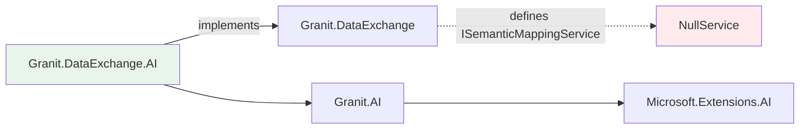

import { Tabs, TabItem } from "@astrojs/starlight/components";

Granit integrates AI as an **optional, provider-agnostic layer** that enriches
existing modules without modifying them. Every AI feature follows the same principle:
existing modules define extension points with null-object defaults; AI packages
provide smart implementations that activate via DI composition.

## What you can do with Granit.AI

| Capability | Module | What it does |
|------------|--------|-------------|
| **Chat & generation** | [Granit.AI](/dotnet/ai/setup/) | Workspace-managed access to `IChatClient` (OpenAI, Azure, Claude, Ollama) |
| **Import mapping** | [DataExchange.AI](/dotnet/ai/import-mapping/) | Automatically map messy CSV/Excel columns to your entity properties |
| **Document extraction** | [AI.Extraction](/dotnet/ai/document-extraction/) | Turn a PDF invoice into a typed `InvoiceData` C# record |
| **Natural language query** | [Querying.AI](/dotnet/ai/natural-language-query/) | Users type "unpaid invoices from last week" → structured filters |
| **Semantic search** | [AI.VectorData](/dotnet/ai/semantic-search/) | Find documents by meaning, build RAG knowledge bases |
| **Blob classification** | [BlobStorage.AI](/dotnet/ai/blob-storage-ai/) | Tag uploaded files by category, detect PII in filenames |
| **PII detection** | [Privacy.AI](/dotnet/ai/privacy-ai/) | Scan free-text fields for personal data (GDPR compliance) |
| **Content moderation** | [Validation.AI](/dotnet/ai/validation-ai/) | Detect toxic content, harassment, prompt injection in user input |

## Core design principles

### 1. Provider-agnostic

Your application code depends on `IChatClient` (from Microsoft.Extensions.AI), not on
OpenAI or Anthropic. Swap providers per environment:

| Environment | Provider | Why |
|-------------|----------|-----|
| Development | Ollama | Free, local, no API key |
| Staging | OpenAI | Fast iteration, latest models |
| Production | Azure OpenAI | EU data residency, Managed Identity, DPA |

### 2. Soft dependency — zero coupling

AI packages reference existing modules, never the reverse:



Without the AI package installed, the module works normally. With it, AI activates.

### 3. GDPR & ISO 27001 by design

| Principle | How Granit.AI implements it |
|-----------|---------------------------|
| **Data minimization** | AI modules send only metadata to the LLM (column names, schema), never business data |
| **Audit trail** | Every AI interaction is logged (tenant, user, workspace, model, tokens, timestamp) |
| **Right to erasure** | Workspace and usage records support soft delete; vector embeddings are deletable |
| **Data residency** | Azure OpenAI for EU-only; Ollama for on-premise (data never leaves your server) |
| **Opt-in for sensitive data** | Preview rows in import mapping require explicit `IncludePreviewRows: true` |

### 4. Async-first (Wolverine)

AI calls are slow (200ms to 15s). Granit uses Wolverine for async execution:

| Use case | Execution | Why |
|----------|-----------|-----|
| Natural language query | Synchronous (~200ms) | User is waiting for search results |
| Import mapping | Synchronous (5-10s) | User is in the wizard, waiting for suggestions |
| Content moderation | Synchronous (2s, fail-open) | Must validate before persistence; timeout never blocks |
| Document extraction | **Async** (Wolverine handler) | 5-15s, client gets 202 Accepted + push notification |
| Blob classification | **Async** (Wolverine handler) | Upload should not wait for classification |
| PII detection (batch) | **Async** (Wolverine handler) | Scanning existing records at scale |
| Vector indexing | **Async** (Wolverine handler) | Batch operation, no user waiting |

## Quick start

The minimal setup to get AI working in your Granit application:

```csharp
// Program.cs
builder.AddGranitAI();
builder.AddGranitAIOllama();  // zero config for local dev
```

```bash
# Terminal: start Ollama
ollama pull llama3.1
ollama serve
```

Then inject `IAIChatClientFactory` in any service:

```csharp
public class MyService(IAIChatClientFactory chatFactory)
{
    public async Task<string> AskAsync(string question, CancellationToken ct)
    {
        IChatClient client = await chatFactory
            .CreateAsync(cancellationToken: ct)
            .ConfigureAwait(false);

        ChatResponse response = await client
            .GetResponseAsync(question, cancellationToken: ct)
            .ConfigureAwait(false);

        return response.Text;
    }
}
```

## Pages in this section

- [Natural Language Query](/dotnet/ai/natural-language-query/) — search with plain language
- [Semantic Search & RAG](/dotnet/ai/semantic-search/) — vector-based similarity search and knowledge bases
- [PII Detection](/dotnet/ai/privacy-ai/) — scan text for personal data
- [Import Mapping](/dotnet/ai/import-mapping/) — AI-powered column mapping for CSV/Excel imports
- [Document Extraction](/dotnet/ai/document-extraction/) — structured data extraction from PDFs
- [Blob Storage Intelligence](/dotnet/ai/blob-storage-ai/) — automatic file classification and PII detection in filenames
- [Content Moderation](/dotnet/ai/validation-ai/) — detect toxic content and prompt injection

For the core module reference (providers, workspaces, configuration), see
[Granit.AI module reference](/dotnet/ai/setup/).
