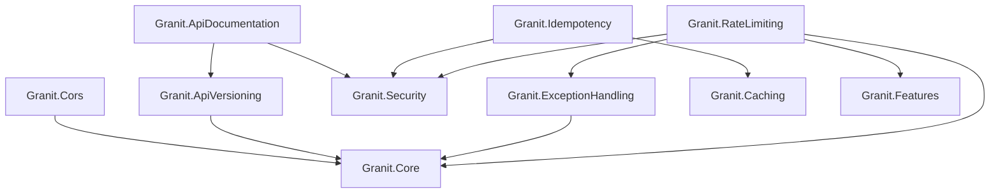
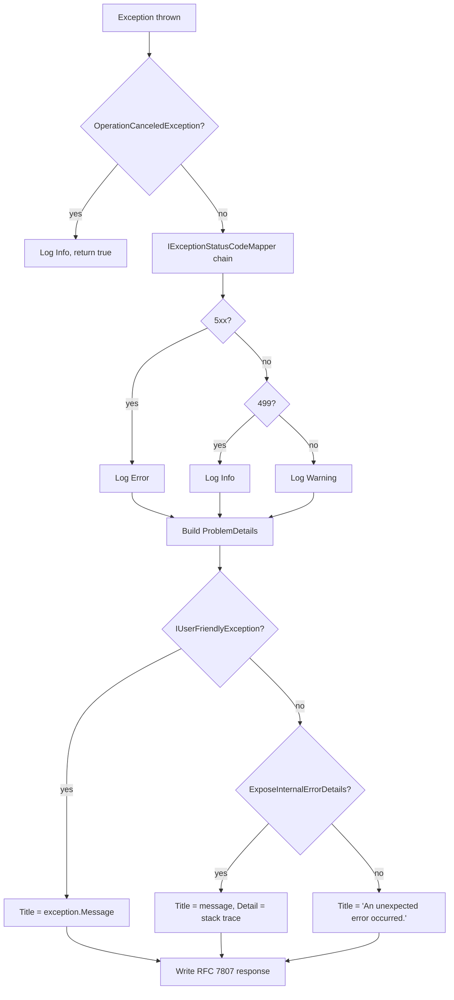
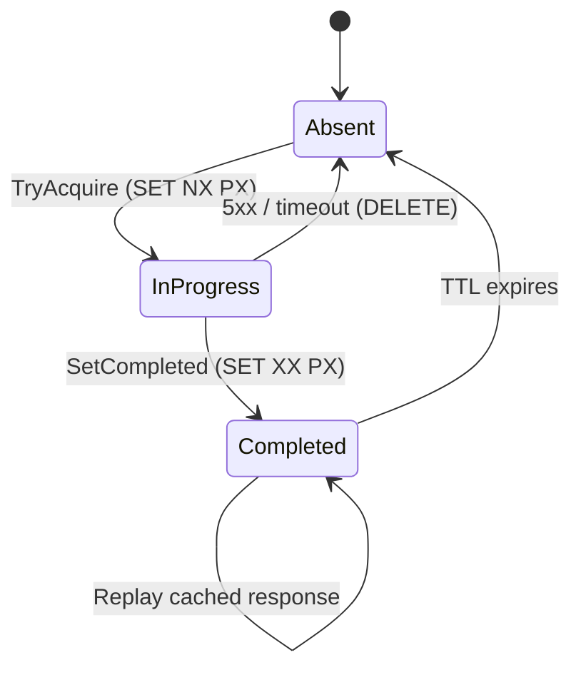

import { Tabs, TabItem, FileTree, Badge } from "@astrojs/starlight/components";

Six packages that form the HTTP infrastructure layer of a Granit application.
CORS policy enforcement (ISO 27001-compliant wildcard rejection), URL-based API
versioning with deprecation headers, Scalar OpenAPI documentation with OAuth2/PKCE,
RFC 7807 Problem Details exception handling, Stripe-style idempotency middleware
with Redis state machine, and per-tenant rate limiting with four algorithms.

## Package structure

| Package | Role | Depends on |
|---------|------|------------|
| `Granit.Cors` | CORS default policy, ISO 27001 wildcard rejection | `Granit.Core` |
| `Granit.ApiVersioning` | Asp.Versioning, URL segment + query string | `Granit.Core` |
| `Granit.ApiDocumentation` | Scalar OpenAPI, OAuth2/PKCE, multi-version docs | `Granit.ApiVersioning`, `Granit.Security` |
| `Granit.ExceptionHandling` | RFC 7807 Problem Details, `IExceptionStatusCodeMapper` chain | `Granit.Core` |
| `Granit.Idempotency` | `Idempotency-Key` middleware, Redis state machine | `Granit.Caching`, `Granit.Security` |
| `Granit.RateLimiting` | Per-tenant rate limiting, 4 algorithms, Wolverine middleware | `Granit.Core`, `Granit.ExceptionHandling`, `Granit.Features`, `Granit.Security` |

## Dependency graph



---

## Granit.Cors

Standardized CORS configuration driven by `appsettings.json`. Wildcard origins
are rejected at startup in non-development environments (ISO 27001 compliance).

### Setup

```csharp
[DependsOn(typeof(GranitCorsModule))]
public class AppModule : GranitModule { }
```

```json
{
  "Cors": {
    "AllowedOrigins": ["https://app.example.com", "https://admin.example.com"],
    "AllowCredentials": false
  }
}
```

In `Program.cs`:

```csharp
app.UseCors(); // Uses the default policy configured by the module
```

### Validation rules

| Rule | Enforced at | Environment |
|------|-------------|-------------|
| At least one origin required | Startup | All |
| Wildcard `*` forbidden | Startup | Non-development |
| `AllowCredentials` + wildcard rejected | Startup | All (CORS specification) |

### Configuration reference

| Property | Default | Description |
|----------|---------|-------------|
| `AllowedOrigins` | `[]` | Allowed CORS origins (required, minimum 1) |
| `AllowCredentials` | `false` | Include `Access-Control-Allow-Credentials: true` |

The default policy applies `AllowAnyHeader()` and `AllowAnyMethod()`, which is
standard for REST APIs. Origins are restricted to the configured list.

---

## Granit.ApiVersioning

URL-based API versioning using [Asp.Versioning](https://github.com/dotnet/aspnet-api-versioning).
Primary reader: URL segment (`/api/v{version:apiVersion}/resource`).
Fallback reader: query string (`?api-version=1.0`).

### Setup

```csharp
[DependsOn(typeof(GranitApiVersioningModule))]
public class AppModule : GranitModule { }
```

```json
{
  "ApiVersioning": {
    "DefaultMajorVersion": 1,
    "ReportApiVersions": true
  }
}
```

### Usage

```csharp
var v1 = app.NewVersionedApi("Appointments").MapGroup("/api/v{version:apiVersion}");

var v1Group = v1.MapGroup("/appointments").HasApiVersion(1);
v1Group.MapGet("/", GetAppointments);
v1Group.MapPost("/", CreateAppointment);

var v2Group = v1.MapGroup("/appointments").HasApiVersion(2);
v2Group.MapGet("/", GetAppointmentsV2);
```

### Deprecation headers (RFC 8594)

Mark endpoints as deprecated with automatic `Deprecation`, `Sunset`, and `Link`
response headers:

```csharp
v1Group.MapGet("/legacy-patients", GetLegacyPatients)
    .Deprecated(sunsetDate: "2026-06-01", link: "https://docs.example.com/migration/v2");
```

**Response headers:**

```http
Deprecation: true
Sunset: Sun, 01 Jun 2026 00:00:00 GMT
Link: <https://docs.example.com/migration/v2>; rel="deprecation"
```

Each call to a deprecated endpoint is logged at Warning level.

### Configuration reference

| Property | Default | Description |
|----------|---------|-------------|
| `DefaultMajorVersion` | `1` | Default API version when client does not specify one |
| `ReportApiVersions` | `true` | Include `api-supported-versions` and `api-deprecated-versions` headers |

---

## Granit.ApiDocumentation

OpenAPI document generation and [Scalar](https://scalar.com) interactive UI.
Generates one OpenAPI document per declared API major version. Supports JWT Bearer
and OAuth2 Authorization Code with PKCE for interactive authentication.

### Setup

<Tabs>
<TabItem label="JWT Bearer (default)">

```csharp
[DependsOn(typeof(GranitApiDocumentationModule))]
public class AppModule : GranitModule { }
```

```json
{
  "ApiDocumentation": {
    "Title": "Clinic API",
    "MajorVersions": [1, 2],
    "Description": "Patient and appointment management API"
  }
}
```

</TabItem>
<TabItem label="OAuth2 / Keycloak">

```json
{
  "ApiDocumentation": {
    "Title": "Clinic API",
    "MajorVersions": [1],
    "OAuth2": {
      "AuthorizationUrl": "https://keycloak.example.com/realms/clinic/protocol/openid-connect/auth",
      "TokenUrl": "https://keycloak.example.com/realms/clinic/protocol/openid-connect/token",
      "ClientId": "clinic-scalar",
      "EnablePkce": true,
      "Scopes": ["openid", "profile"]
    }
  }
}
```

When `OAuth2` is fully configured, the Bearer scheme is replaced with an OAuth2
Authorization Code flow in the OpenAPI document, and Scalar enables interactive
PKCE-based authentication.

</TabItem>
</Tabs>

In `Program.cs`:

```csharp
app.UseGranitApiDocumentation(); // Maps /openapi/v1.json, /openapi/v2.json, /scalar
```

### Schema examples

Provide realistic example values for request DTOs without coupling to OpenAPI:

```csharp
public class AppointmentSchemaExamples : ISchemaExampleProvider
{
    public IReadOnlyDictionary<Type, JsonNode> GetExamples() => new Dictionary<Type, JsonNode>
    {
        [typeof(CreateAppointmentRequest)] = new JsonObject
        {
            ["patientId"] = "d4e5f6a7-1234-5678-9abc-def012345678",
            ["doctorId"] = "a1b2c3d4-5678-9abc-def0-123456789abc",
            ["scheduledAt"] = "2026-04-15T09:30:00Z",
            ["durationMinutes"] = 30
        }
    };
}
```

Implementations of `ISchemaExampleProvider` are auto-discovered at startup.

### Internal API exclusion

Exclude inter-service endpoints from public documentation:

```csharp
app.MapPost("/webhooks/keycloak", HandleKeycloakWebhook)
    .WithMetadata(new InternalApiAttribute());
```

### Document transformers

The module registers these OpenAPI transformers automatically:

| Transformer | Purpose |
|-------------|---------|
| `JwtBearerSecuritySchemeTransformer` | Adds Bearer security scheme when JWT is configured |
| `OAuth2SecuritySchemeTransformer` | Replaces Bearer with OAuth2 Authorization Code when configured |
| `SecurityRequirementOperationTransformer` | Anonymous endpoints override global security |
| `ProblemDetailsSchemaDocumentTransformer` | Adds RFC 7807 ProblemDetails schema |
| `ProblemDetailsResponseOperationTransformer` | Documents 4xx/5xx Problem Details responses |
| `TenantHeaderOperationTransformer` | Documents `X-Tenant-Id` header when enabled |
| `InternalApiDocumentTransformer` | Removes `[InternalApi]` endpoints |
| `WolverineOpenApiOperationTransformer` | Enhances Wolverine HTTP endpoint documentation |
| `SchemaExampleSchemaTransformer` | Applies `ISchemaExampleProvider` examples |

### Configuration reference

| Property | Default | Description |
|----------|---------|-------------|
| `Title` | `"API"` | OpenAPI document and Scalar UI title |
| `MajorVersions` | `[1]` | Major version numbers to document |
| `Description` | `null` | OpenAPI description (Markdown supported) |
| `ContactEmail` | `null` | Contact email in OpenAPI info |
| `LogoUrl` | `null` | Logo URL for Scalar sidebar |
| `FaviconUrl` | `null` | Favicon for Scalar page |
| `EnableInProduction` | `false` | Expose docs in Production |
| `EnableTenantHeader` | `false` | Document required tenant header |
| `TenantHeaderName` | `"X-Tenant-Id"` | Tenant header name |
| `AuthorizationPolicy` | `null` | Policy for doc endpoints (`null` = inherit, `""` = anonymous) |
| `OAuth2.AuthorizationUrl` | `null` | OAuth2 authorization endpoint |
| `OAuth2.TokenUrl` | `null` | OAuth2 token endpoint |
| `OAuth2.ClientId` | `null` | Public OAuth2 client ID (PKCE-capable) |
| `OAuth2.EnablePkce` | `true` | Enable PKCE with S256 |
| `OAuth2.Scopes` | `["openid"]` | OAuth2 scopes to request |

---

## Granit.ExceptionHandling

Centralized exception-to-HTTP-response pipeline implementing RFC 7807 Problem Details.
All exceptions are caught, mapped to status codes via a chain of responsibility,
logged at the appropriate level, and serialized as `application/problem+json`.

### Setup

```csharp
[DependsOn(typeof(GranitExceptionHandlingModule))]
public class AppModule : GranitModule { }
```

In `Program.cs` (**must be the first middleware**):

```csharp
app.UseGranitExceptionHandling(); // Before routing, authentication, authorization
app.UseRouting();
app.UseAuthentication();
app.UseAuthorization();
```

### Exception handling pipeline



### IExceptionStatusCodeMapper

Chain of responsibility pattern. Mappers are evaluated in registration order;
the first non-null result wins. The `DefaultExceptionStatusCodeMapper` is registered
last as a catch-all.

**Default mappings:**

| Exception | Status code |
|-----------|-------------|
| `EntityNotFoundException` | 404 |
| `NotFoundException` | 404 |
| `ForbiddenException` | 403 |
| `UnauthorizedAccessException` | 403 |
| `ValidationException` | 422 |
| `IHasValidationErrors` | 422 |
| `ConflictException` | 409 |
| `BusinessRuleViolationException` | 422 |
| `BusinessException` | 400 |
| `IHasErrorCode` | 400 |
| `NotImplementedException` | 501 |
| `OperationCanceledException` | 499 |
| `TimeoutException` | 408 |
| *(any other)* | 500 |

### Custom mapper

Other Granit modules register their own mappers to extend the chain:

```csharp
internal sealed class InvoiceConcurrencyMapper : IExceptionStatusCodeMapper
{
    public int? TryGetStatusCode(Exception exception) => exception switch
    {
        InvoiceLockedException => StatusCodes.Status423Locked,
        _ => null
    };
}

// In module ConfigureServices:
services.AddSingleton<IExceptionStatusCodeMapper, InvoiceConcurrencyMapper>();
```

### ProblemDetails extensions

The response body includes standard RFC 7807 fields plus Granit-specific extensions:

```json
{
  "status": 422,
  "title": "Invoice amount must be positive.",
  "detail": null,
  "traceId": "abcd1234ef567890",
  "errorCode": "Invoices:InvalidAmount",
  "errors": {
    "Amount": ["Granit:Validation:GreaterThanValidator"]
  }
}
```

| Extension | Source | Present when |
|-----------|--------|--------------|
| `traceId` | `Activity.Current?.TraceId` or `HttpContext.TraceIdentifier` | Always |
| `errorCode` | `IHasErrorCode.ErrorCode` | Exception implements `IHasErrorCode` |
| `errors` | `IHasValidationErrors.ValidationErrors` | Exception implements `IHasValidationErrors` |

:::danger
Never set `ExposeInternalErrorDetails: true` in production. Internal error messages
may contain PHI, SQL fragments, or internal paths (ISO 27001 violation).
:::

---

## Granit.Idempotency

Stripe-style HTTP idempotency middleware backed by Redis. Ensures that retried
POST/PUT/PATCH requests produce the same response without re-executing side effects.
Uses SHA-256 composite keys and AES-256-CBC encrypted entries.

### Setup

```csharp
[DependsOn(typeof(GranitIdempotencyModule))]
public class AppModule : GranitModule { }
```

```json
{
  "Idempotency": {
    "HeaderName": "Idempotency-Key",
    "KeyPrefix": "idp",
    "CompletedTtl": "24:00:00",
    "InProgressTtl": "00:00:30",
    "ExecutionTimeout": "00:00:25",
    "MaxBodySizeBytes": 1048576
  }
}
```

In `Program.cs` (after authentication/authorization):

```csharp
app.UseAuthentication();
app.UseAuthorization();
app.UseGranitIdempotency(); // After auth so ICurrentUserService is populated
```

### Marking endpoints as idempotent

```csharp
app.MapPost("/api/v1/invoices", CreateInvoice)
    .WithMetadata(new IdempotentAttribute { Required = true });

// Optional key — middleware is bypassed when header is absent
app.MapPut("/api/v1/invoices/{id}", UpdateInvoice)
    .WithMetadata(new IdempotentAttribute { Required = false });

// Custom TTL (2 hours instead of default 24h)
app.MapPost("/api/v1/payments", ProcessPayment)
    .WithMetadata(new IdempotentAttribute { CompletedTtlSeconds = 7200 });
```

### State machine



### Composite key structure

The Redis key is partitioned by tenant, user, HTTP method, and route to prevent
cross-user key collisions:

```
{prefix}:{tenantId|global}:{userId|anon}:{method}:{routePattern}:{sha256(idempotencyKeyValue)}
```

**Example:** `idp:global:d4e5f6a7:POST:/api/v1/invoices:a1b2c3d4e5f6...`

### Payload hash verification

The middleware computes a SHA-256 digest of the composite input (method + route +
idempotency key value + request body). On replay, if the payload hash does not match
the stored entry, the request is rejected with 422 to prevent key reuse with a
different body.

### Response caching rules

| Status code | Cached? | Rationale |
|-------------|---------|-----------|
| 2xx | Yes | Successful responses are replayed |
| 400, 404, 409, 410, 422 | Yes | Deterministic client errors |
| 401, 403 | No | Authentication state may change |
| 5xx | No | Lock is released for retry |
| 499 (client disconnect) | No | Response may be truncated |

### Error responses

| Scenario | Status | Title |
|----------|--------|-------|
| Missing header (required) | 422 | Missing Idempotency-Key |
| Multipart request | 422 | Unsupported Content-Type |
| Key in progress (another pod) | 409 | Request In Progress |
| Payload hash mismatch | 422 | Idempotency Key Conflict |
| Execution timeout | 503 | Execution Timeout |

Replayed responses include an `X-Idempotency-Replayed: true` header.

### Configuration reference

| Property | Default | Description |
|----------|---------|-------------|
| `HeaderName` | `"Idempotency-Key"` | HTTP header name |
| `KeyPrefix` | `"idp"` | Redis key prefix |
| `CompletedTtl` | `24:00:00` | TTL for completed entries |
| `InProgressTtl` | `00:00:30` | Lock TTL (must be > `ExecutionTimeout`) |
| `ExecutionTimeout` | `00:00:25` | Max handler execution time |
| `MaxBodySizeBytes` | `1048576` | Max request body size to hash (1 MiB) |

---

## Granit.RateLimiting

Per-tenant rate limiting with four algorithms, configurable policies, Redis-backed
counters (with in-memory fallback), and Wolverine message handler support.
Integrates with `Granit.Features` for plan-based dynamic quotas.

### Setup

```csharp
[DependsOn(typeof(GranitRateLimitingModule))]
public class AppModule : GranitModule { }
```

```json
{
  "RateLimiting": {
    "Enabled": true,
    "KeyPrefix": "rl",
    "BypassRoles": ["admin"],
    "FallbackOnCounterStoreFailure": "Allow",
    "Policies": {
      "api-default": {
        "Algorithm": "SlidingWindow",
        "PermitLimit": 1000,
        "Window": "00:01:00",
        "SegmentsPerWindow": 6
      },
      "api-sensitive": {
        "Algorithm": "TokenBucket",
        "TokenLimit": 50,
        "TokensPerPeriod": 10,
        "ReplenishmentPeriod": "00:00:10"
      }
    }
  }
}
```

### Applying to endpoints

```csharp
app.MapGet("/api/v1/appointments", GetAppointments)
    .RequireGranitRateLimiting("api-default");

app.MapPost("/api/v1/payments", ProcessPayment)
    .RequireGranitRateLimiting("api-sensitive");
```

### Wolverine message handler support

Decorate message types with `[RateLimited]` and register the Wolverine middleware:

```csharp
[RateLimited("api-default")]
public record SyncPatientCommand(Guid PatientId);
```

```csharp
// In Wolverine configuration
opts.Policies.AddMiddleware<RateLimitMiddleware>(
    chain => chain.MessageType.GetCustomAttributes(typeof(RateLimitedAttribute), true).Length > 0);
```

When the rate limit is exceeded, `RateLimitExceededException` is thrown and handled
by Wolverine's retry policy.

### Algorithms

| Algorithm | Use case | Key parameters |
|-----------|----------|----------------|
| `SlidingWindow` | General API rate limiting (default) | `PermitLimit`, `Window`, `SegmentsPerWindow` |
| `FixedWindow` | Simple counter, lowest memory | `PermitLimit`, `Window` |
| `TokenBucket` | Controlled burst allowance | `TokenLimit`, `TokensPerPeriod`, `ReplenishmentPeriod` |
| `Concurrency` | Limit simultaneous in-flight requests | `PermitLimit` |

### Tenant partitioning

Rate limit counters are partitioned by tenant. The Redis key uses hash tags to
ensure all keys for a tenant hash to the same Redis Cluster slot:

```
{prefix}:{{tenantId|global}}:{policyName}
```

### Failure behavior

When Redis is unavailable, the `FallbackOnCounterStoreFailure` setting controls behavior:

| Value | Behavior | Use case |
|-------|----------|----------|
| `Allow` | Let the request through, log warning | Prefer availability over quota enforcement |
| `Deny` | Reject with 429 | Conservative — prefer safety over availability |

### 429 response format

```json
{
  "status": 429,
  "title": "Too Many Requests",
  "detail": "Rate limit exceeded for policy 'api-default'. Retry after 10s.",
  "policy": "api-default",
  "limit": 1000,
  "remaining": 0,
  "retryAfter": 10
}
```

The `Retry-After` header is also set on the response.

### Dynamic quotas with Granit.Features

When `UseFeatureBasedQuotas` is enabled, the permit limit is resolved dynamically
from `Granit.Features` (e.g., per-plan quotas). The convention-based feature name
is `RateLimit.{PolicyName}`, overridable via `RateLimitPolicyOptions.FeatureName`.

### Configuration reference

| Property | Default | Description |
|----------|---------|-------------|
| `Enabled` | `true` | Enable/disable rate limiting globally |
| `KeyPrefix` | `"rl"` | Redis key prefix |
| `FallbackOnCounterStoreFailure` | `Allow` | Behavior when Redis is down |
| `BypassRoles` | `[]` | Roles that skip rate limiting |
| `UseFeatureBasedQuotas` | `false` | Use `Granit.Features` for dynamic quotas |
| `Policies.*` | — | Named rate limiting policies (see below) |

**Policy options:**

| Property | Default | Description |
|----------|---------|-------------|
| `Algorithm` | `SlidingWindow` | Rate limiting algorithm |
| `PermitLimit` | `1000` | Max permits per window |
| `Window` | `00:01:00` | Window duration |
| `SegmentsPerWindow` | `6` | Sliding window segments (accuracy vs. memory) |
| `TokenLimit` | `50` | Max tokens (TokenBucket only) |
| `TokensPerPeriod` | `10` | Tokens added per replenishment (TokenBucket only) |
| `ReplenishmentPeriod` | `00:00:10` | Replenishment interval (TokenBucket only) |
| `FeatureName` | `null` | Override feature name for dynamic quotas |

---

## Public API summary

| Category | Key types | Package |
|----------|-----------|---------|
| Modules | `GranitCorsModule`, `GranitApiVersioningModule`, `GranitApiDocumentationModule`, `GranitExceptionHandlingModule`, `GranitIdempotencyModule`, `GranitRateLimitingModule` | — |
| CORS | `GranitCorsOptions` | `Granit.Cors` |
| Versioning | `GranitApiVersioningOptions`, `DeprecatedAttribute`, `.Deprecated()` | `Granit.ApiVersioning` |
| Documentation | `ApiDocumentationOptions`, `OAuth2Options`, `ISchemaExampleProvider`, `InternalApiAttribute` | `Granit.ApiDocumentation` |
| Exception handling | `IExceptionStatusCodeMapper`, `ExceptionHandlingOptions`, `GranitExceptionHandler` | `Granit.ExceptionHandling` |
| Idempotency | `IIdempotencyStore`, `IIdempotencyMetadata`, `IdempotentAttribute`, `IdempotencyOptions`, `IdempotencyEntry`, `IdempotencyState` | `Granit.Idempotency` |
| Rate limiting | `IRateLimitCounterStore`, `IRateLimitQuotaProvider`, `RateLimitResult`, `RateLimitedAttribute`, `RateLimitExceededException`, `GranitRateLimitingOptions`, `RateLimitPolicyOptions` | `Granit.RateLimiting` |
| Extensions | `AddGranitCors()`, `AddGranitApiVersioning()`, `AddGranitApiDocumentation()`, `UseGranitApiDocumentation()`, `AddGranitExceptionHandling()`, `UseGranitExceptionHandling()`, `AddGranitIdempotency()`, `UseGranitIdempotency()`, `AddGranitRateLimiting()`, `.RequireGranitRateLimiting()` | — |

## See also

- [Security module](./security/) — JWT Bearer authentication, authorization
- [Caching module](./caching/) — `ICacheValueEncryptor` used by idempotency store
- [Core module](./core/) — Exception hierarchy (`BusinessException`, `IHasErrorCode`)
- [Wolverine module](./wolverine/) — Wolverine messaging pipeline, rate limit middleware
- [Utilities module](./utilities/) — Validation, timing, GUID generation
- [API Reference](/api/Granit.Cors.html) (auto-generated from XML docs)
