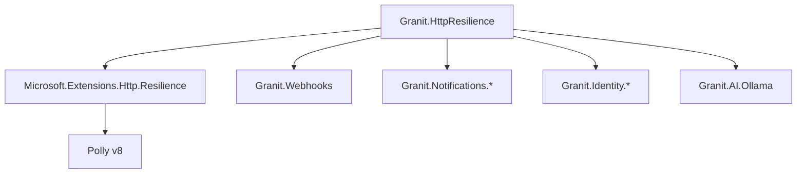

import { Aside, Code } from '@astrojs/starlight/components';

## Overview

`Granit.HttpResilience` wraps [`Microsoft.Extensions.Http.Resilience`](https://learn.microsoft.com/en-us/dotnet/core/resilience/http-resilience)
(built on Polly v8) and exposes a single `AddGranitHttpClient()` extension that replaces
bare `AddHttpClient()` calls across all Granit modules. Every outbound HTTP call
automatically benefits from retry with exponential back-off, circuit breaking, and
per-request timeouts.

## Default pipeline

| Stage | Default |
|-------|---------|
| Total timeout | 30 s |
| Retry | 3 attempts, exponential back-off (2 s base) |
| Circuit breaker | Opens after 10 failures in 30 s, stays open for 1 min |
| Per-attempt timeout | 10 s |

These defaults come from `AddStandardResilienceHandler()` and apply to every client
registered via `AddGranitHttpClient()`.

## Registration

```csharp
// Drop-in replacement for AddHttpClient()
services.AddGranitHttpClient("granit-webhooks", (sp, client) =>
{
    client.BaseAddress = new Uri("https://webhook-receiver.example.com/");
    client.Timeout = TimeSpan.FromSeconds(10);
});
```

The returned `IHttpClientBuilder` can be chained for further customization.

## Per-client configuration

Override pipeline settings per named client in `appsettings.json` without redeploying:

```json
{
  "HttpResilience": {
    "granit-webhooks": {
      "Retry": { "MaxRetryAttempts": 5 },
      "CircuitBreaker": {
        "SamplingDuration": "00:01:00",
        "MinimumThroughput": 20
      }
    },
    "KeycloakAdmin": {
      "Retry": { "MaxRetryAttempts": 1 }
    }
  }
}
```

Settings from `HttpResilience:{clientName}` are applied on top of the defaults at
runtime via `IPostConfigureOptions<HttpStandardResilienceOptions>`.

## Affected modules

All Granit modules that register outbound `HttpClient` instances declare
`[DependsOn(typeof(GranitHttpResilienceModule))]` and call `AddGranitHttpClient()`:

| Module | Client name | Notes |
|--------|-------------|-------|
| `Granit.Webhooks` | `granit-webhook-delivery` | Webhook delivery |
| `Granit.Notifications.Twilio` | `Twilio` | SMS + WhatsApp |
| `Granit.Notifications.Brevo` | `Brevo` | Email + SMS + WhatsApp |
| `Granit.Notifications.Zulip` | `Zulip` | Chat |
| `Granit.Notifications.Email.SendGrid` | `SendGrid` | Email |
| `Granit.Notifications.Email.Scaleway` | `Scaleway` | Email |
| `Granit.Notifications.MobilePush.GoogleFcm` | `GoogleFcmPush` | Mobile push |
| `Granit.Identity.Keycloak` | `KeycloakAdmin` | Admin API |
| `Granit.Identity.EntraId` | `MicrosoftGraph` | Graph API |
| `Granit.AI.Ollama` | `GranitAIOllamaHealthCheck` | Health check |

<Aside type="tip">
For identity providers (Keycloak, Entra ID), lower the retry count to avoid amplifying load
on an already-struggling auth server:

```json
"HttpResilience": {
  "KeycloakAdmin": { "Retry": { "MaxRetryAttempts": 1 } },
  "MicrosoftGraph": { "Retry": { "MaxRetryAttempts": 1 } }
}
```
</Aside>

## Architecture



## Compliance

- **ISO 27001 A.17.1** — service continuity: circuit breaking prevents cascade failures
  when a downstream dependency is unavailable
- **GDPR Article 32** — availability: resilience policies reduce data-processing downtime
  caused by transient network or API errors

## Further reading

- [Webhooks](/dotnet/api/webhooks/) — uses `granit-webhook-delivery` client
- [Notifications](/dotnet/api/notifications/) — notification provider clients
- [Microsoft.Extensions.Http.Resilience docs](https://learn.microsoft.com/en-us/dotnet/core/resilience/http-resilience)
