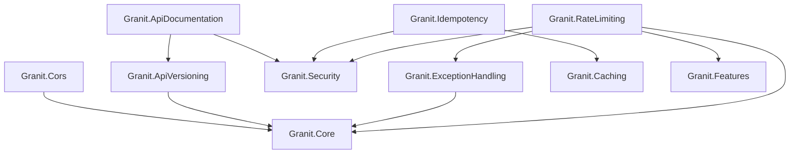

Eight packages that form the HTTP infrastructure layer of a Granit application.

| Package | Purpose |
| ------- | ------- |
| [CORS](/dotnet/api/cors/) | Default policy, ISO 27001 wildcard rejection |
| [API Versioning](/dotnet/api/api-versioning/) | URL segment versioning, RFC 8594 deprecation headers |
| [API Documentation](/dotnet/api/api-documentation/) | Scalar OpenAPI UI, OAuth2/PKCE, multi-version docs |
| [Exception Handling](/dotnet/api/exception-handling/) | RFC 7807 Problem Details, chain of responsibility mapper |
| [Idempotency](/dotnet/api/idempotency/) | Stripe-style middleware, Redis state machine, AES-256 entries |
| [Rate Limiting](/dotnet/api/rate-limiting/) | SlidingWindow, FixedWindow, TokenBucket, Concurrency algorithms |
| [Webhooks](/dotnet/api/webhooks/) | HMAC-signed outbound webhooks, retry, subscription management |
| [Bulkhead](/dotnet/api/bulkhead/) | Per-tenant concurrency isolation, feature-based quotas, Wolverine middleware |

## Package dependencies

## See also

- [Architecture: HTTP Conventions](/dotnet/architecture/http-conventions/) -- Status codes, Problem Details, DTO naming
- [Security module](/dotnet/security/authentication/) -- JWT Bearer, authorization
