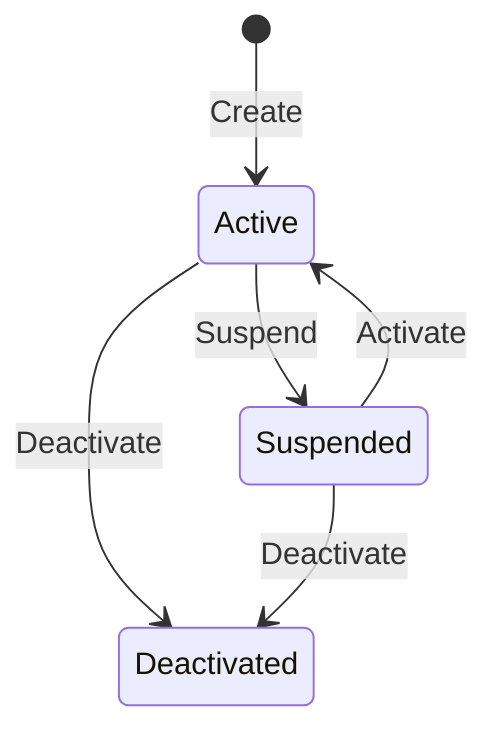

import { FileTree } from "@astrojs/starlight/components";

## Overview

`Granit.Webhooks.Endpoints` exposes a Minimal API for managing webhook subscriptions:
create and update subscriptions, transition through lifecycle states (active, suspended,
deactivated), rotate signing secrets, send test pings, and monitor delivery statistics.
All endpoints are protected by the `Webhooks.Admin` authorization policy with configurable
role requirements.

## Package structure

<FileTree>

- Granit.Webhooks.Endpoints/ Minimal API route groups + DTOs + validators
  - Granit.Webhooks Core abstractions (IWebhookSubscriptionReader/Writer)
  - Granit.Webhooks.EntityFrameworkCore EF Core persistence + IWebhookQueryableProvider

</FileTree>

## Installation

```csharp
// In your application startup
app.MapWebhooksEndpoints();

// With custom options:
app.MapWebhooksEndpoints(opts =>
{
    opts.RoutePrefix = "admin/webhooks";
    opts.RequiredRole = "platform-admin";
    opts.TagName = "Webhook Administration";
});
```

## Configuration

| Option | Default | Description |
| ------ | ------- | ----------- |
| `RoutePrefix` | `"webhooks"` | Route prefix for all webhook endpoints |
| `RequiredRole` | `"granit-webhooks-admin"` | Role required for the authorization policy |
| `TagName` | `"Webhooks"` | OpenAPI tag name for endpoint grouping |

Configuration section: `WebhooksEndpoints`.

## Endpoints

### Read

| Method | Route | Description |
| ------ | ----- | ----------- |
| `GET` | `/subscriptions/{id}` | Get a webhook subscription by ID |

### Write

| Method | Route | Description |
| ------ | ----- | ----------- |
| `POST` | `/subscriptions` | Create a new subscription (returns signing secret once) |
| `PUT` | `/subscriptions/{id}` | Update a subscription's target URL |
| `DELETE` | `/subscriptions/{id}` | Hard-delete a subscription |

### Lifecycle

| Method | Route | Description |
| ------ | ----- | ----------- |
| `POST` | `/subscriptions/{id}/activate` | Reactivate a suspended subscription |
| `POST` | `/subscriptions/{id}/suspend` | Suspend an active subscription |
| `POST` | `/subscriptions/{id}/deactivate` | Permanently deactivate a subscription |



### Operations

| Method | Route | Description |
| ------ | ----- | ----------- |
| `POST` | `/subscriptions/{id}/rotate-secret` | Rotate the HMAC signing secret |
| `POST` | `/subscriptions/{id}/test-ping` | Send a Stripe-style test ping to the target URL |
| `GET` | `/stats` | Get aggregate delivery statistics (last 24h) |

### Query

When `Granit.Webhooks.EntityFrameworkCore` is registered, query endpoints are available:

| Method | Route | Description |
| ------ | ----- | ----------- |
| `POST` | `/subscriptions/query` | Filter, sort, and paginate subscriptions |
| `POST` | `/deliveries/query` | Filter, sort, and paginate delivery attempts |

## DTOs

| DTO | Direction | Used by |
| --- | --------- | ------- |
| `WebhookSubscriptionCreateRequest` | Input | POST subscriptions |
| `WebhookSubscriptionCreatedResponse` | Output | POST subscriptions (includes signing secret) |
| `WebhookSubscriptionUpdateRequest` | Input | PUT subscriptions |
| `WebhookSubscriptionDeactivateRequest` | Input | POST deactivate |
| `WebhookSubscriptionResponse` | Output | GET, PUT, lifecycle endpoints |
| `WebhookSubscriptionRotateSecretResponse` | Output | POST rotate-secret |
| `WebhookSubscriptionTestPingResponse` | Output | POST test-ping |
| `WebhookSubscriptionStatsResponse` | Output | GET stats |

## Permissions

All endpoints require the `Webhooks.Admin` authorization policy. Granular permissions
are defined in `WebhooksPermissions`:

| Permission | Description |
| ---------- | ----------- |
| `Webhooks.Subscriptions.View` | View subscription details |
| `Webhooks.Subscriptions.Create` | Create subscriptions |
| `Webhooks.Subscriptions.Update` | Update target URL, lifecycle transitions |
| `Webhooks.Subscriptions.Delete` | Delete subscriptions |
| `Webhooks.Subscriptions.Manage` | Rotate secrets, test pings, view stats |

## Validation

All request DTOs are automatically validated via `FluentValidation` through
`MapGranitGroup()`. Key rules:

- **Target URL**: HTTPS only, absolute URI, max 2048 chars
- **SSRF protection**: blocks private IP ranges (10.0.0.0/8, 172.16.0.0/12, 192.168.0.0/16, 169.254.0.0/16), localhost, link-local IPv6, and blocked TLDs (.local, .internal, .onion)
- **Event type**: non-empty, max 200 chars
- **Deactivation reason**: non-empty, max 1000 chars

:::caution
The signing secret is returned **only once** during subscription creation and secret
rotation. Store it immediately — there is no endpoint to retrieve it later. The framework
stores only the protected (HMAC) value.
:::

## See also

- [Webhooks](/dotnet/api/webhooks/) — core module documentation (publisher, delivery engine, retry)
