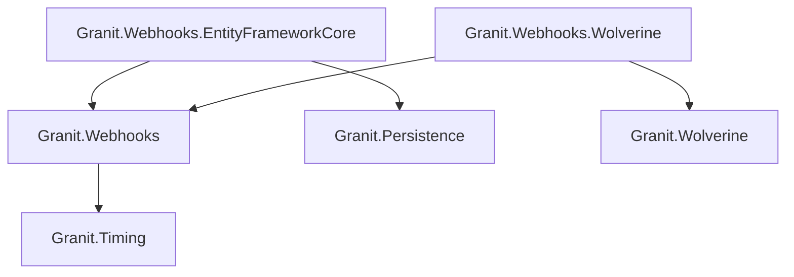

import { Tabs, TabItem, FileTree } from "@astrojs/starlight/components";

Granit.Webhooks provides outbound webhook dispatch with HMAC-SHA256 signed deliveries,
retry policies, and ISO 27001-compliant audit trails.

## Package structure

<FileTree>
- Granit.Webhooks/ Core publisher, HMAC signatures, in-memory default
  - Granit.Webhooks.EntityFrameworkCore Durable subscriptions + delivery audit
  - Granit.Webhooks.Wolverine Durable outbox dispatch via Wolverine
</FileTree>

| Package | Role | Depends on |
|---------|------|------------|
| `Granit.Webhooks` | `IWebhookPublisher`, HMAC delivery, domain events | `Granit.Timing` |
| `Granit.Webhooks.EntityFrameworkCore` | Isolated DbContext for subscriptions + deliveries | `Granit.Webhooks`, `Granit.Persistence` |
| `Granit.Webhooks.Wolverine` | Durable outbox dispatch, retry policies | `Granit.Webhooks`, `Granit.Wolverine` |

## Dependency graph



---

## Setup

<Tabs>
<TabItem label="Development (in-memory)">

```csharp
[DependsOn(typeof(GranitWebhooksModule))]
public class AppModule : GranitModule { }
```

Uses in-memory subscription store and Channel-based in-process dispatch.
Suitable for development and integration tests.

</TabItem>
<TabItem label="Production (Wolverine + EF Core)">

```csharp
[DependsOn(
    typeof(GranitWebhooksWolverineModule),
    typeof(GranitWebhooksEntityFrameworkCoreModule))]
public class AppModule : GranitModule { }
```

```csharp
builder.AddGranitWebhooksEntityFrameworkCore(
    opts => opts.UseNpgsql(connectionString));
```

Wolverine provides durable outbox dispatch with exponential backoff retries.
EF Core persists subscriptions and delivery attempts for ISO 27001 audit.

</TabItem>
</Tabs>

## Publishing a webhook

Inject `IWebhookPublisher` and call `PublishAsync` with a logical event type and payload:

```csharp
public class DocumentUploadedHandler(IWebhookPublisher webhookPublisher)
{
    public async Task HandleAsync(
        DocumentUploaded evt, CancellationToken cancellationToken)
    {
        await webhookPublisher.PublishAsync(
            "document.uploaded",
            new { evt.DocumentId, evt.FileName, evt.UploadedBy },
            cancellationToken).ConfigureAwait(false);
    }
}
```

The publisher serializes the payload into a `WebhookEnvelope`, captures the ambient
tenant context, and dispatches a `WebhookTrigger` to the outbox. The fanout handler
resolves matching subscriptions and enqueues one `SendWebhookCommand` per subscriber.

## Webhook envelope

Every HTTP POST to a subscriber endpoint carries a standardized JSON envelope:

```json
{
  "eventId": "a1b2c3d4-...",
  "eventType": "document.uploaded",
  "tenantId": "d4e5f6a7-...",
  "timestamp": "2026-03-13T10:30:00Z",
  "apiVersion": "1.0",
  "data": {
    "documentId": "f8e9d0c1-...",
    "fileName": "report.pdf",
    "uploadedBy": "user-42"
  }
}
```

The `eventId` is stable across retry attempts, allowing subscribers to deduplicate.

## HMAC signature

Each delivery is signed with the subscription's secret using HMAC-SHA256 in Stripe format:

```
x-granit-signature: t=1710323400,v1=5d3b2a1c...
```

The signed payload is `{unix_timestamp}.{body_json}`. Subscribers should:

1. Extract the timestamp and signature from the header
2. Recompute the HMAC using the shared secret
3. Constant-time compare the signatures
4. Reject requests older than 5 minutes (replay protection)

## Retry and suspension

<Tabs>
<TabItem label="Wolverine (production)">

Exponential backoff: 30s, 2m, 10m, 30m, 2h, 12h. After 6 retries (~14h30 total),
the message moves to the Dead-Letter Queue and the subscription is suspended.

</TabItem>
<TabItem label="Channel (development)">

Channel-based dispatch retries 3 times with linear backoff. No persistence —
failed deliveries are lost on restart.

</TabItem>
</Tabs>

When consecutive failures exceed the threshold, the subscription transitions:

| Failures | Status | Domain event |
|----------|--------|-------------|
| 0 | `Active` | — |
| Threshold reached | `Suspended` | `WebhookSubscriptionSuspended` |
| Non-retriable (4xx) | `Deactivated` | `WebhookSubscriptionDeactivated` |

Suspension records `SuspendedAt` and `SuspendedBy` for ISO 27001 audit compliance.

## Delivery audit trail

`WebhookDeliveryAttempt` is an INSERT-only entity (no soft-delete) that records every
delivery attempt: HTTP status, duration, payload hash (SHA-256), and optional full
payload when `StorePayload` is enabled.

:::caution
Enabling `StorePayload` persists the full JSON body in clear text. Ensure encryption
at rest is configured on the database and that your DPO has validated this setting
against GDPR data-minimization requirements.
:::

## Configuration reference

```json
{
  "Webhooks": {
    "HttpTimeoutSeconds": 10,
    "MaxParallelDeliveries": 20,
    "StorePayload": false
  }
}
```

| Property | Default | Description |
|----------|---------|-------------|
| `HttpTimeoutSeconds` | `10` | HTTP request timeout (5–120 seconds) |
| `MaxParallelDeliveries` | `20` | Max parallel `SendWebhookCommand` on the delivery queue (1–100) |
| `StorePayload` | `false` | Persist full JSON body alongside delivery attempts |

## Public API summary

| Category | Key types | Package |
|----------|-----------|---------|
| Modules | `GranitWebhooksModule`, `GranitWebhooksEntityFrameworkCoreModule`, `GranitWebhooksWolverineModule` | Webhooks |
| Publisher | `IWebhookPublisher` (`PublishAsync<TPayload>`) | `Granit.Webhooks` |
| Subscriptions | `IWebhookSubscriptionReader`, `IWebhookSubscriptionWriter`, `WebhookSubscription` | `Granit.Webhooks` |
| Delivery | `WebhookDeliveryAttempt`, `WebhookEnvelope`, `IWebhookDeliveryReader`, `IWebhookDeliveryWriter` | `Granit.Webhooks` |
| Events | `WebhookSubscriptionSuspended`, `WebhookSubscriptionDeactivated` | `Granit.Webhooks` |
| Options | `WebhooksOptions` | `Granit.Webhooks` |
| Extensions | `AddGranitWebhooks()`, `AddGranitWebhooksEntityFrameworkCore()` | — |

## See also

- [API & Web module](./api-web/) — Exception handling, versioning, idempotency
- [Persistence module](./persistence/) — EF Core interceptors, query filters
- [Wolverine module](./wolverine/) — Messaging, transactional outbox
