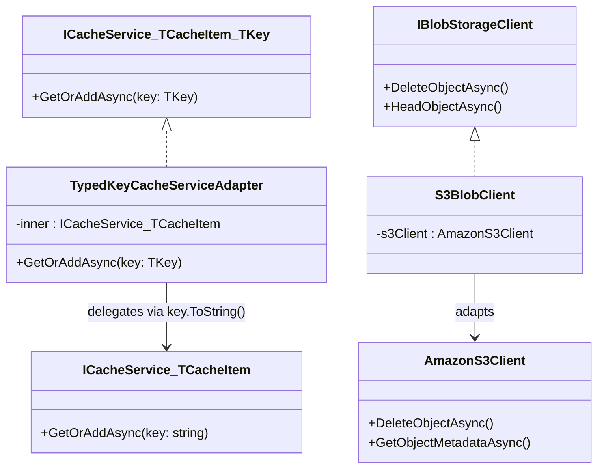

## Definition

The Adapter pattern converts the interface of an existing class into the
interface expected by the client, allowing incompatible components to
collaborate. The adapter wraps the existing class and translates calls.

## Diagram



## Implementation in Granit

| Adapter | File | Target interface | Adapted class |
|---------|------|------------------|---------------|
| `TypedKeyCacheServiceAdapter<TCacheItem, TKey>` | `src/Granit.Caching/TypedKeyCacheServiceAdapter.cs` | `ICacheService<TCacheItem, TKey>` | `ICacheService<TCacheItem>` (string keys) |
| `S3BlobClient` | `src/Granit.BlobStorage.S3/Internal/S3BlobClient.cs` | `IBlobStorageClient` | `AmazonS3Client` (AWS SDK) |
| `MailKitSmtpTransport` | `src/Granit.Notifications.Email.Smtp/MailKitSmtpTransport.cs` | `ISmtpTransport` | `SmtpClient` (MailKit, sealed) |

## Rationale

`TypedKeyCacheServiceAdapter` enables strongly-typed keys (Guid, int,
composite) while delegating to the existing string-key-based cache service.
`S3BlobClient` isolates the framework from the AWS SDK, allowing provider
changes (European hosting, MinIO) without touching the core.

## Usage example

```csharp
// Application uses typed keys -- the adapter converts to string
ICacheService<PatientDto, Guid> cache = serviceProvider
    .GetRequiredService<ICacheService<PatientDto, Guid>>();

PatientDto patient = await cache.GetOrAddAsync(
    patientId, // Guid -- converted to string by the adapter
    async ct => await db.Patients.FindAsync([patientId], ct),
    cancellationToken);
```

## Further reading

- [Adapter -- refactoring.guru](https://refactoring.guru/design-patterns/adapter)
