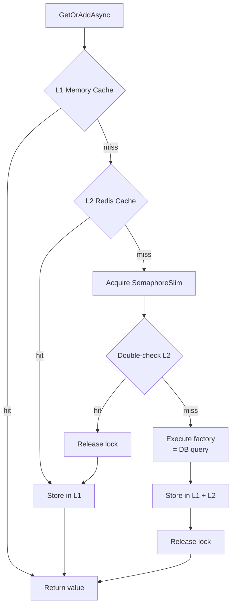

## Definition

The Cache-Aside pattern loads data into the cache on demand: on a miss, data is
retrieved from the source (DB), stored in cache, then returned. Subsequent
accesses are served from the cache.

Granit uses a **HybridCache** (L1 in-process + L2 Redis) with anti-stampede
protection via double-check locking.

## Diagram



## Implementation in Granit

| Component | File | Role |
| --------- | ---- | ---- |
| `DistributedCacheService` | `src/Granit.Caching/DistributedCacheService.cs` | Cache-aside with double-check locking and optional encryption |
| `FeatureChecker` | `src/Granit.Features/Checker/FeatureChecker.cs` | HybridCache for feature resolution |
| `CachedLocalizationOverrideStore` | `src/Granit.Localization/CachedLocalizationOverrideStore.cs` | In-memory cache for localization overrides |

### Anti-stampede

The `SemaphoreSlim` in `DistributedCacheService` prevents the "thundering herd"
problem: when 100 simultaneous requests have a cache miss, only one executes the
factory. The other 99 wait for the lock then find the value in cache
(double-check).

### Per-tenant keys

In `FeatureChecker`, cache keys include the tenant:
`t:{tenantId}:{featureName}`. Invalidation targets only the affected tenant.

## Rationale

| Problem | Solution |
| ------- | -------- |
| Feature resolution too slow (DB query on every request) | L1 cache (nanoseconds) + L2 Redis (microseconds) |
| Stampede on cache miss (100 requests = 100 DB queries) | SemaphoreSlim + double-check locking |
| Sensitive data in Redis cache | Conditional AES-256 encryption via `[CacheEncrypted]` |

## Usage example

```csharp
// Cache-aside is transparent to the caller
ICacheService<PatientDto> cache = serviceProvider
    .GetRequiredService<ICacheService<PatientDto>>();

PatientDto patient = await cache.GetOrAddAsync(
    $"patient:{patientId}",
    async ct => await LoadPatientFromDbAsync(patientId, ct),
    cancellationToken);
// 1st call -> DB + stores in cache
// 2nd call -> returned from cache (L1 or L2)
```

## Further reading

- [Cache-Aside pattern -- Microsoft Cloud Design Patterns](https://learn.microsoft.com/en-us/azure/dotnet/architecture/patterns/cache-aside)
