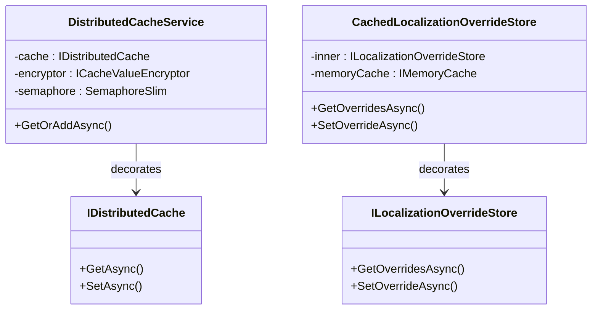

## Definition

The Decorator pattern dynamically adds responsibilities to an object without
modifying its class. Each decorator wraps the original object and enriches
its behavior (serialization, encryption, caching, anti-stampede protection).

## Diagram



## Implementation in Granit

| Decorator | File | Target | Added responsibilities |
|-----------|------|--------|-----------------------|
| `DistributedCacheService` | `src/Granit.Caching/DistributedCacheService.cs` | `IDistributedCache` | JSON serialization, `ICacheValueEncryptor` encryption, double-check locking anti-stampede |
| `CachedLocalizationOverrideStore` | `src/Granit.Localization/CachedLocalizationOverrideStore.cs` | `ILocalizationOverrideStore` | In-memory cache with per-tenant invalidation |

**Custom variant -- Conditional encryption**: `DistributedCacheService`
applies AES-256-CBC encryption only if the target type carries the
`[CacheEncrypted]` attribute or if the configuration requires it.

## Rationale

Separating concerns (serialization, encryption, anti-stampede) from cache
logic allows testing and configuring them independently. The localization
decorator avoids hitting the database on every translation resolution.

## Usage example

```csharp
// The consumer uses ICacheService<T> -- the decorator is transparent
ICacheService<PatientDto> cache = serviceProvider
    .GetRequiredService<ICacheService<PatientDto>>();

PatientDto patient = await cache.GetOrAddAsync(
    $"patient:{patientId}",
    async ct => await db.Patients.FindAsync([patientId], ct),
    cancellationToken);

// Behind the scenes:
// 1. Check IDistributedCache (Redis)
// 2. If miss -> SemaphoreSlim (anti-stampede)
// 3. Double-check after lock
// 4. Execute the factory
// 5. Serialize to JSON -> encrypt (if [CacheEncrypted]) -> store in Redis
```

## Further reading

- [Decorator -- refactoring.guru](https://refactoring.guru/design-patterns/decorator)
