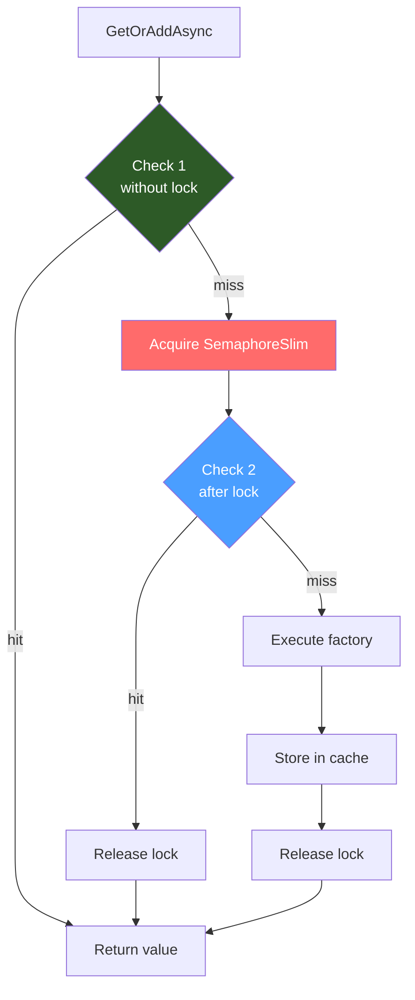

## Definition

The Double-Check Locking pattern optimizes concurrent access to a shared
resource by checking the condition **before** and **after** acquiring a lock.
The first check (without lock) serves as a fast-path for the nominal case
(cache hit). The second check (after lock) protects against races.

## Diagram



## Implementation in Granit

| Component | File | Lines |
|-----------|------|-------|
| `DistributedCacheService.GetOrAddAsync()` | `src/Granit.Caching/DistributedCacheService.cs` | 74-92 |

### Flow

1. **Check 1** (line 74): cache read without lock -- fast-path
2. **Acquire** (line 78): `SemaphoreSlim.WaitAsync(cancellationToken)`
3. **Check 2** (line 82): re-read cache after lock
4. **Factory** (line 86): execute factory if still a miss
5. **Set** (line 89): store in cache
6. **Release** (line 92): `SemaphoreSlim.Release()` in a `finally`

### Anti-stampede

If 100 simultaneous requests have a cache miss:

- All 100 pass Check 1 (miss)
- 1 acquires the lock, 99 wait
- The first executes the factory and populates the cache
- The 99 pass Check 2 -- cache hit, no factory call

Result: **1 single DB query** instead of 100.

## Rationale

Double-check locking is essential for feature resolution in a high-concurrency
environment. Without protection, a simultaneous cache miss (cache expiration,
restart) could overwhelm the database.

## Usage example

```csharp
// Double-check locking is internal -- the API is simple
ICacheService<PatientDto> cache = provider.GetRequiredService<ICacheService<PatientDto>>();

// 100 simultaneous calls with the same cache key:
// -> 1 DB query (the first one)
// -> 99 responses from cache (after the lock)
PatientDto patient = await cache.GetOrAddAsync(
    $"patient:{patientId}",
    async ct => await db.Patients.FindAsync([patientId], ct),
    cancellationToken);
```
