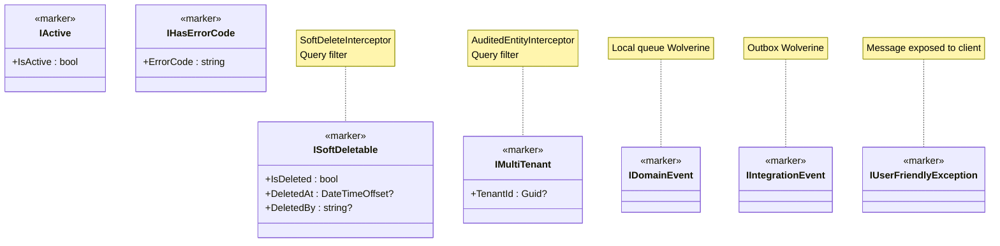

## Definition

A Marker Interface is an interface with no methods (or minimal properties) that
signals that a type possesses a specific behavior or characteristic. Framework
components detect these interfaces via reflection and apply the associated
behavior.

## Diagram



## Implementation in Granit

### Entity markers

| Interface | File | Detected by |
| --------- | ---- | ----------- |
| `ISoftDeletable` | `src/Granit.Core/Domain/ISoftDeletable.cs` | `SoftDeleteInterceptor`, `ApplyGranitConventions()` |
| `IMultiTenant` | `src/Granit.Core/Domain/IMultiTenant.cs` | `AuditedEntityInterceptor`, `ApplyGranitConventions()` |
| `IActive` | `src/Granit.Core/Domain/IActive.cs` | `ApplyGranitConventions()` |

### Event markers

| Interface | File | Detected by |
| --------- | ---- | ----------- |
| `IDomainEvent` | `src/Granit.Core/Events/IDomainEvent.cs` | Wolverine routing -- local queue |
| `IIntegrationEvent` | `src/Granit.Core/Events/IIntegrationEvent.cs` | Wolverine routing -- transport/Outbox |

### Exception markers

| Interface | File | Detected by |
| --------- | ---- | ----------- |
| `IUserFriendlyException` | `src/Granit.Core/Exceptions/IUserFriendlyException.cs` | `GranitExceptionHandler` -- message exposed to client |
| `IHasErrorCode` | `src/Granit.Core/Exceptions/IHasErrorCode.cs` | `GranitExceptionHandler` -- error code in ProblemDetails |
| `IHasValidationErrors` | `src/Granit.Core/Exceptions/IHasValidationErrors.cs` | `GranitExceptionHandler` -- field errors in extensions |

### Idempotency markers

| Interface | File | Detected by |
| --------- | ---- | ----------- |
| `IIdempotencyMetadata` | `src/Granit.Http.Idempotency/Abstractions/IIdempotencyMetadata.cs` | `IdempotencyMiddleware` -- enables idempotency on the endpoint |

## Rationale

Markers allow applying cross-cutting behaviors (audit, filtering, routing)
declaratively, without coupling entities to infrastructure frameworks. An entity
implementing `ISoftDeletable` automatically gets soft delete and the query
filter -- no additional code required.

## Usage example

```csharp
// The entity declares its characteristics via markers
public sealed class MedicalRecord : FullAuditedEntity, IMultiTenant, IActive
{
    public Guid? TenantId { get; set; }       // <- IMultiTenant
    public bool IsActive { get; set; } = true; // <- IActive
    // ISoftDeletable is inherited from FullAuditedEntity

    public string Diagnosis { get; set; } = string.Empty;
}

// The framework detects markers and automatically applies:
// - Query filter: WHERE IsDeleted=false AND IsActive=true AND TenantId=@tid
// - Audit interceptor: CreatedAt/By, ModifiedAt/By, TenantId
// - Soft delete interceptor: DELETE -> UPDATE IsDeleted=true
```
