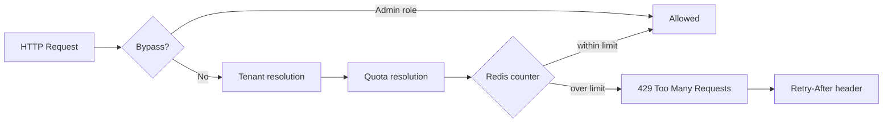
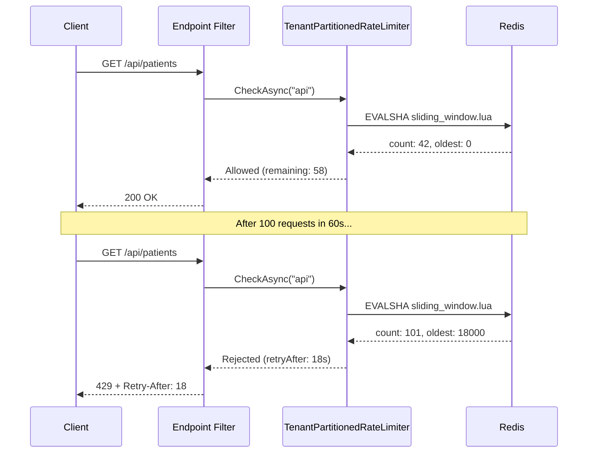

## Definition

**Rate Limiting** controls the number of requests a client can send within a
given time window. In a multi-tenant SaaS context, it protects against the
**noisy neighbor** problem -- a greedy tenant degrading performance for
everyone else. Granit implements this pattern via `Granit.RateLimiting` with
per-tenant partitioning, atomic Redis counters (Lua scripts), and dynamic
quotas linked to pricing plans via `Granit.Features`.

## Diagram





## Implementation in Granit

### Package

| Package | Role |
| --- | --- |
| `Granit.RateLimiting` | Complete module: counters, middleware, options, metrics |

### Three algorithms via Lua scripts

Each algorithm is implemented as a Lua script executed atomically by Redis
(`EVALSHA`). Timestamps are taken server-side (`redis.call('TIME')`) to avoid
clock drift issues between pods.

| Algorithm | Redis structure | Use case |
| --- | --- | --- |
| **Sliding Window** | Sorted set (`ZADD` + `ZREMRANGEBYSCORE`) | Public APIs -- maximum precision |
| **Fixed Window** | Counter (`INCR` + `PEXPIRE`) | Low-volume endpoints -- simplicity |
| **Token Bucket** | Hash (`HMGET`/`HSET` + refill) | Export jobs -- controlled bursts |

### Per-tenant partitioning

The Redis key is structured with a **hash tag** to guarantee co-location in
Redis Cluster:

```text
{prefix}:{tenantId}:{policyName}
  rl   :{a1b2c3d4}:  api
```

Without multi-tenancy, the `global` segment is used. Each tenant has its own
counters -- a tenant can never consume another's quota.

### Dynamic quotas by plan

When `UseFeatureBasedQuotas` is enabled, the `PermitLimit` is resolved
dynamically from `Granit.Features` instead of static configuration:

```csharp
// Convention: Numeric feature named "RateLimit.{policyName}"
context.Add(
    new FeatureDefinition("RateLimit.api", FeatureValueType.Numeric(100, 10, 10000))
);
```

The Features resolution chain (Default > Plan > Tenant) enables differentiated
quotas:

| Plan | RateLimit.api | RateLimit.export |
| --- | --- | --- |
| Free | 60/min | 5/h |
| Pro | 500/min | 50/h |
| Enterprise | 5000/min | Unlimited |

### Dual integration: HTTP + Messaging

```csharp
// --- ASP.NET Core: endpoint filter ---
app.MapGet("/api/v1/patients", GetPatientsAsync)
   .RequireGranitRateLimiting("api");

// --- Wolverine: attribute on the message ---
[RateLimited("export")]
public sealed record GeneratePatientExportCommand(Guid PatientId);
```

The HTTP filter returns `429 Too Many Requests` (RFC 7807) with a
`Retry-After` header. The Wolverine middleware throws `RateLimitExceededException`,
usable with `RetryWithCooldown`.

### Graceful degradation

When Redis is unavailable, the behavior is configurable:

| Mode | Behavior | When to use |
| --- | --- | --- |
| `Allow` (default) | Request allowed + warning | Availability > quota protection |
| `Deny` | Systematic 429 | Critical endpoints (payment, auth) |

### Reference files

| File | Role |
| --- | --- |
| `src/Granit.RateLimiting/Internal/LuaScripts.cs` | 3 atomic Lua scripts |
| `src/Granit.RateLimiting/Internal/TenantPartitionedRateLimiter.cs` | Core logic (tenant, bypass, quota, metrics) |
| `src/Granit.RateLimiting/Internal/RedisRateLimitCounterStore.cs` | Redis execution with fallback |
| `src/Granit.RateLimiting/Internal/FeatureBasedRateLimitQuotaProvider.cs` | Quota resolution via Granit.Features |
| `src/Granit.RateLimiting/AspNetCore/RateLimitEndpointExtensions.cs` | Endpoint filter 429 + Retry-After |
| `src/Granit.RateLimiting/Wolverine/RateLimitMiddleware.cs` | Wolverine BeforeAsync middleware |

## Rationale

| Problem | Solution |
| --- | --- |
| Greedy tenant saturates the API for everyone (noisy neighbor) | Counters partitioned by tenant, independent quotas |
| Identical quota limits for all plans | `Granit.Features` Numeric resolves dynamically by plan |
| Redis failure = blocked service | Configurable graceful degradation (Allow/Deny) |
| Clock drift between pods = inconsistent counters | `redis.call('TIME')` in Lua scripts |
| Rate limiting HTTP but not messaging | Dual integration endpoint filter + Wolverine middleware |
| Admin blocked by their own rate limiting | Configurable `BypassRoles` |

## Usage example

```csharp
// --- appsettings.json ---
// {
//   "RateLimiting": {
//     "BypassRoles": ["Admin"],
//     "UseFeatureBasedQuotas": true,
//     "Policies": {
//       "api": { "Algorithm": "SlidingWindow", "PermitLimit": 100, "Window": "00:01:00" },
//       "auth": { "Algorithm": "FixedWindow", "PermitLimit": 5, "Window": "00:15:00" }
//     }
//   }
// }

// --- Module registration ---
[DependsOn(typeof(GranitRateLimitingModule))]
public sealed class AppModule : GranitModule { }

// --- Applying policies ---
app.MapGet("/api/v1/appointments", ListAppointmentsAsync)
   .RequireGranitRateLimiting("api");

app.MapPost("/api/v1/auth/login", LoginAsync)
   .RequireGranitRateLimiting("auth");  // 5 attempts / 15 min
```

## Further reading

- [Rate Limiting pattern -- Microsoft Cloud Design Patterns](https://learn.microsoft.com/en-us/azure/architecture/patterns/rate-limiting-pattern)
- [Throttling pattern -- Microsoft Cloud Design Patterns](https://learn.microsoft.com/en-us/azure/architecture/patterns/throttling)
