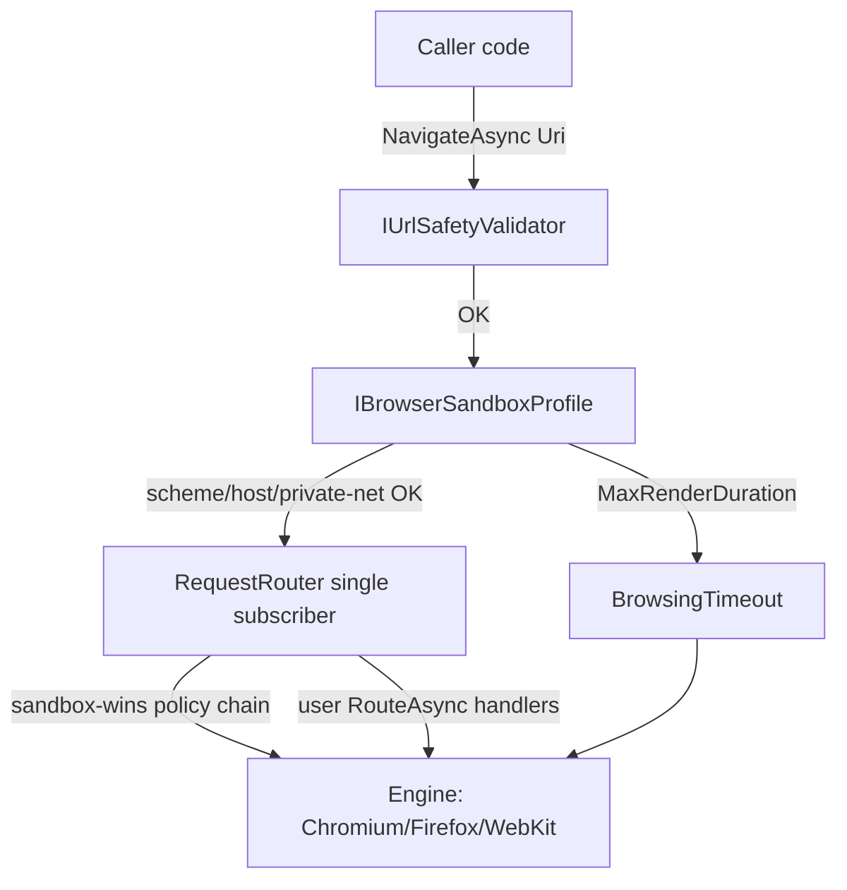

`Granit.Browsing` runs a real Chromium / Firefox / WebKit process inside your
service. That process has your service's network identity, your service's
filesystem mounts, and (depending on configuration) your service's outbound
credentials. Anything the rendered page can convince it to do, the attacker
gets for free. The hardening pass shipped a deny-by-default sandbox so that
the safe path is also the easy path.

## Threat model

Browser-driven workloads expose three universal attack surfaces:

1. **The URL.** A caller passing an attacker-controlled URL into
   `NavigateAsync` reaches whatever the network reaches: cloud metadata
   endpoints, internal Redis, the Kubernetes API server. This is SSRF dressed
   up as PDF generation.
2. **The HTML.** Server-rendered HTML containing user-supplied fragments lets
   the attacker steer the navigation, inject sub-resource loads, drop a
   `<meta http-equiv="refresh">`, or trigger an OS file pickup via `file://`.
3. **The JavaScript injection points.** `AddScriptTagAsync`,
   `EvaluateAsync`, `AddStyleTagAsync` all execute arbitrary code with the
   page's privileges. String-interpolated payloads with user data are
   indistinguishable from `eval(user_input)`.

Each surface gets a named layer in the architecture below.

## Defense layers



| Layer | Responsibility |
| --- | --- |
| `IUrlSafetyValidator` | Scheme/host/private-net/TLD/length pre-flight; resolves DNS. See [URL safety](/dotnet/http/security/url-safety/). |
| `IBrowserSandboxProfile` | Per-host policy: allowed schemes/hosts, CSP forcing, console redaction, render cap. |
| `RequestRouter` | Single subscriber on the engine's network event; runs the sandbox + user handlers in fixed order ("sandbox wins"). |
| `BrowsingTimeout` | Hard wall-clock cap on a single render — defaults 30 s, cancellable. |
| `TenantAwareHeadlessBrowser` | Decorator that fences pages by tenant id and rejects cross-tenant `AcquirePageAsync`. |
| `HeadlessBrowserDrainCoordinator` | Graceful-shutdown coordination — pages in flight get `MaxRenderDuration` before forced close. |
| `PrivilegedFlagGuard` | Refuses `--no-sandbox` unless the host has explicitly opted in. |

## The sandbox profile

`IBrowserSandboxProfile` is deny-by-default. The shipped `DefaultSandboxProfile`
is registered automatically by `GranitBrowsingModule`:

```csharp
public sealed record SandboxProfile : IBrowserSandboxProfile
{
    public IReadOnlySet<string> AllowedSchemes { get; init; } = new HashSet<string> { "https" };
    public bool AllowPrivateNetworks { get; init; } = false;
    public bool AllowLoopback { get; init; } = false;
    public IReadOnlyList<string> AllowedHostPatterns { get; init; } = [];
    public IReadOnlyList<string> DeniedHostPatterns { get; init; } = [];
    public bool ForceCsp { get; init; } = true;
    public string ForcedCsp { get; init; } =
        "default-src 'self'; script-src 'self'; object-src 'none'; frame-ancestors 'none'";
    public bool RedactConsoleMessages { get; init; } = true;
    public TimeSpan MaxRenderDuration { get; init; } = TimeSpan.FromSeconds(30);
    public string? AllowedExecutablePathPrefix { get; init; } = null;
}
```

### Cookbook — restrictive

```csharp
services.AddSingleton<IBrowserSandboxProfile>(new SandboxProfile
{
    AllowedSchemes = new HashSet<string> { "https" },
    AllowedHostPatterns = [ "*.partner.com", "cdn.example.com" ],
    DeniedHostPatterns = [ "*.tracker.example" ],
    ForceCsp = true,
    RedactConsoleMessages = true,
    MaxRenderDuration = TimeSpan.FromSeconds(15),
});
```

### Cookbook — trusted internal (rare)

```csharp
services.AddSingleton<IBrowserSandboxProfile>(new SandboxProfile
{
    AllowedSchemes = new HashSet<string> { "https", "http" },
    AllowPrivateNetworks = true,         // requires the rendering host to be in a private VPC
    AllowedHostPatterns = [ "internal.corp.example" ],
    ForceCsp = false,                    // caller still needs Granit.Browsing.Pages.BypassCsp
});
```

> **`ForceCsp = false` is not enough.** Setting `ForceCsp = false` only
> unlatches the sandbox. The caller's identity still needs the
> `Granit.Browsing.Pages.BypassCsp` permission. Both gates must open for
> CSP to be skipped.

## URL flow

`NavigateAsync(Uri)` now takes a `Uri`, never a `string`. The journey of a
URL through the framework:

```text
caller → page.NavigateAsync(uri)
       → IUrlSafetyValidator.ValidateAsync(uri)      // scheme/host/private-net/TLD/length
       → SandboxProfile match                        // AllowedSchemes / AllowedHostPatterns
       → RequestRouter pre-check                     // sandbox handlers fire first
       → engine.Goto(uri)                            // socket opens; ConnectCallback re-checks
       → (per sub-resource) RequestRouter            // DNS-rebinding closes here
```

Two checks at request entry and one check per sub-resource defeat
single-flip DNS rebinding.

## `RequestRouter` — single subscriber

The engines (PuppeteerSharp's `Request` event, Playwright's `IRoute`) only
allow a *single* network subscriber per page. Pre-hardening, the framework
and user handlers raced for that slot. The new `RequestRouter`:

- Owns the single subscription per page.
- Runs sandbox handlers first; their `RouteDecision` is authoritative
  (sandbox wins).
- Runs user-registered handlers in registration order, short-circuiting on
  the first non-`Continue` decision.
- Surfaces the new typed API:

```csharp
await page.RouteAsync(
    RoutePattern.Parse("**/api/**"),
    async (req, ct) =>
    {
        if (req.Headers.TryGetValue("X-Forbidden", out _))
            return RouteDecision.Abort("forbidden header");

        return RouteDecision.Fulfill(
            status: 200,
            contentType: "application/json",
            body: """{"stubbed":true}"""u8.ToArray());
    });
```

`RouteDecision` is a discriminated record with `Continue()`, `Abort(reason)`
and `Fulfill(status, contentType, body, headers?)` factories.

### Migration from the old `(string, RouteHandler)` API

See [Migration: Browsing Pre-1.0 Hardening](/dotnet/browsing/migration-pre-1-0-hardening/).

## PDF viewer flow (`IPdfViewerCapability`)

The PDF viewer renders an existing PDF by handing Chromium a `file://` URL.
The hardened flow:

1. Acquire an `ITempFile` via `ITempFileFactory.CreateAsync("pdf-viewer", ".pdf")`.
2. Write the PDF bytes to `ITempFile.Stream`.
3. Navigate to `new Uri($"file://{tempFile.Path}")`.
4. Caller needs `Granit.Browsing.Pages.UseFileScheme` (granted to the
   framework-internal capability impl; *not* exposed to host callers).
5. Page count read via PdfPig before navigation — never trust the HTML
   viewer for the page count.

The `file://` scheme is denied by default for callers. The capability
implementation is the only path that can use it; it bypasses the sandbox
scheme check via the permission grant, not by skipping the check.

## HAR / trace files (Playwright)

Same factory, same path. Categories: `har`, `trace`. Both files contain raw
request/response headers — including `Authorization`, `Cookie`, and any
session bearer that flows during the render. Treat them as sensitive:

- Persist only when the host explicitly requests it (capability surface).
- Never ship them to a multi-tenant blob bucket without per-tenant prefix +
  short retention.
- Forward to compliance storage with the same care as a database backup.

## Audit events

Three `IDomainEvent`s are raised during the page lifecycle. All three are
`[SensitiveData]`-annotated so the audit subsystem hashes the URL/script
when persisting to the audit log.

| Event | When | Payload (sensitive in **bold**) |
| --- | --- | --- |
| `BrowserPageAcquiredEvent` | After `AcquirePageAsync` succeeds. | `TenantId`, `PageId`, `Engine`, `CapabilityFlags`. |
| `BrowserUrlNavigatedEvent` | After `NavigateAsync` completes (success or sandbox-block). | `PageId`, **`Url`**, `Outcome` (`Allowed` / `BlockedBySandbox` / `EngineError`). |
| `BrowserScriptInjectedEvent` | On `EvaluateAsync` / `AddScriptTagAsync` / `AddStyleTagAsync`. | `PageId`, **`ScriptHash`** (SHA-256 of source), `InjectionKind`. |

Hashing uses the same `Granit.Audit` `[SensitiveData]` machinery — the
in-memory event carries the plaintext for in-process subscribers; the
persisted audit row stores the hash.

## Permissions matrix

| Permission | Granted to | Gates |
| --- | --- | --- |
| `Granit.Browsing.Pages.Acquire` | Every caller. | `IHeadlessBrowser.AcquirePageAsync`. |
| `Granit.Browsing.Pages.Navigate` | Callers that issue `NavigateAsync`. | `IBrowserPage.NavigateAsync(Uri)`. |
| `Granit.Browsing.Pages.InjectScript` | Callers using `EvaluateAsync` / `AddScriptTagAsync` / `AddStyleTagAsync`. | All three injection methods. |
| `Granit.Browsing.Pages.BypassCsp` | Rare — only when `SandboxProfile.ForceCsp = false`. | Per-page CSP suppression. Both gates required. |
| `Granit.Browsing.Pages.UseFileScheme` | Framework-internal — capability impls only. | `NavigateAsync(file://…)`. |

ISO 27001 A.9.4 — least privilege. Hosts seed roles with `Acquire + Navigate`
for read-only renderers; only PDF/screenshot capabilities under framework
control hold `UseFileScheme`.

## `PrivilegedFlagGuard` — `--no-sandbox`

Running Chromium with `--no-sandbox` drops the OS sandbox (seccomp, user
namespace, capability set). Some container environments require it (the
container has no `CAP_SYS_ADMIN`, no user namespace). The guard:

| Container? | Non-root uid? | Env `GRANIT_BROWSING_ALLOW_NO_SANDBOX=1`? | Outcome |
| --- | --- | --- | --- |
| Yes | Yes | — | `--no-sandbox` permitted. |
| Yes | No (root) | Yes | Permitted with `Warning` log. |
| Yes | No (root) | No | **Refused** — boot fails fast. |
| No | — | — | **Refused** — never on bare metal. |

The Dockerfile pattern is `USER 1000` plus the bundled Chromium. The env
opt-in is the audit-trail-friendly escape hatch.

## Console redaction

`ConsoleRedactor` runs on every `console.*` message before it reaches your
logger when `SandboxProfile.RedactConsoleMessages = true` (the default). Each
pattern is replaced with `***REDACTED:{kind}***`:

| Kind | Regex source |
| --- | --- |
| Bearer | `Bearer\s+[A-Za-z0-9\-._~+/]+=*` |
| JWT | `eyJ[A-Za-z0-9_-]+\.eyJ[A-Za-z0-9_-]+\.[A-Za-z0-9_-]+` |
| AwsAccessKey | `AKIA[0-9A-Z]{16}` |
| AwsSecretKey | `(?i)aws_secret_access_key[\"'=\s:]+[A-Za-z0-9/+=]{40}` |
| SetCookie | `(?i)set-cookie:\s*[^;]+` |
| BasicAuthUrl | `https?://[^:/\s]+:[^@/\s]+@` |

Disable per-host only when the rendered content is fully trusted and you
need verbatim console output for debugging.

## `GRBROWSING001` analyzer

The analyzer (in `Granit.Analyzers` — *not* a separate Browsing.Analyzers
package) flags string interpolation passed to `IBrowserPage.EvaluateAsync`,
`AddScriptTagAsync`, and `AddStyleTagAsync`. Background:

- VULN-203 audit finding: interpolated user input inside `EvaluateAsync` is
  template injection identical to `eval(user_input)`.
- The analyzer fires at compile time, not runtime — no perf cost.
- Severity: `Warning` by default; promote to `Error` in `.editorconfig` for
  framework consumers.

### Failing example

```csharp
// GRBROWSING001 — fails the analyzer.
await page.EvaluateAsync($"document.title = '{userTitle}';");
```

### Passing example

```csharp
// Parameterised — analyzer is happy.
await page.EvaluateAsync(
    "title => { document.title = title; }",
    userTitle);
```

### Suppression

For genuinely trusted internal flows:

```csharp
#pragma warning disable GRBROWSING001 // trusted: title is a Guid.ToString()
await page.EvaluateAsync($"document.title = '{tenantId}';");
#pragma warning restore GRBROWSING001
```

Always include a `// trusted: …` justification; reviewers reject naked
suppressions.

## `TenantAwareHeadlessBrowser`

A decorator over `IHeadlessBrowser` that:

- Stamps every page with the acquiring tenant id.
- Refuses `AcquirePageAsync` when `ICurrentTenant` has changed mid-flow
  (the canonical "tenant id leaked across an `await`" bug).
- Emits `BrowserPageAcquiredEvent` with the correct tenant.

Automatically registered. Decoration order is enforced by
`GranitBrowsingModule`.

## `HeadlessBrowserDrainCoordinator`

A hosted service that cooperates with the .NET host lifecycle:

1. `IHostApplicationLifetime.ApplicationStopping` fires.
2. Coordinator stops accepting new `AcquirePageAsync` calls (they get a
   `BrowserDrainingException`).
3. In-flight pages get `MaxRenderDuration` to complete; after that, the
   browser is force-closed.
4. Logged at `Information` per stage.

In a Kubernetes graceful-shutdown scenario, the pod `terminationGracePeriod`
should be `MaxRenderDuration + 10s` headroom.

## Kubernetes deployment quick reference

The temp-file root carries everything in this page that touches disk —
PDF viewer staging, HAR, trace. Cross-link:

- Use `emptyDir { medium: Memory }` on the temp root.
- Size: `MaxBrowsers × MaxPagesPerBrowser × MaxSizeBytes × 1.5`.
- Never `ReadWriteMany` PVC on the temp root.
- Full guidance: [Secure Temp Files — Kubernetes deployment](/dotnet/io/temp-files/#kubernetes-deployment).

For URL safety, the in-process layer is sufficient; if your network policy
allows pods to reach `169.254.169.254`, *also* add a `NetworkPolicy` egress
deny — defense in depth.

## Related

- [Migration: Browsing Pre-1.0 Hardening](/dotnet/browsing/migration-pre-1-0-hardening/) — old → new API.
- [URL Safety](/dotnet/http/security/url-safety/) — the shared SSRF primitive.
- [Secure Temp Files](/dotnet/io/temp-files/) — `file://` PDF viewer, HAR, trace.
- [ADR-055 — Extract URL safety and temp-file primitives](/dotnet/architecture/adr/055-extract-url-safety-and-temp-files/).
- [Browsing overview](/dotnet/infrastructure/browsing/) — capabilities, pool tuning.
