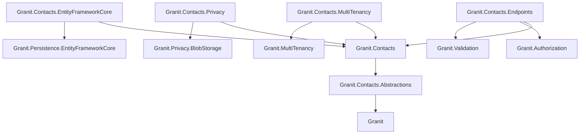

import { Tabs, TabItem, FileTree } from "@astrojs/starlight/components";

`Granit.Contacts` is the central party-management aggregate for the framework,
modelled after Odoo's `res.partner`. A **Contact** represents any natural person,
legal entity, or organisational unit the platform interacts with — customers,
suppliers, employees, leads — and can carry several roles simultaneously via the
`[Flags]` `ContactRoles` enum. It powers Invoicing, Subscriptions, Payments, Tax,
and CustomerBalance today, and is designed to absorb future Procurement / HR /
CRM modules without schema churn.

## Why this module exists

Before `Granit.Contacts`, billing identity was duplicated across Invoicing,
Subscriptions, Payments, and CustomerBalance. Each module carried its own subset
of name / address / VAT number / external-provider identifiers, and downstream
consumers had to reconcile them. `Granit.Contacts` consolidates the party
abstraction in one aggregate so:

- Tax / billing / payment data is captured once, referenced everywhere by `ContactId`.
- External provider identifiers (Stripe, Mollie, Odoo, Sage, NetSuite) live on the
  contact rather than scattered across module-specific mapping tables.
- A single GDPR Article 17 erasure pseudonymises the contact and lets
  downstream modules retain the row for accounting integrity.

## Package structure

<FileTree>
- Granit.Contacts.Abstractions/ Value objects, enums, integration events (lightweight)
- Granit.Contacts/ Aggregate root, domain events, query / export definitions
  - Granit.Contacts.EntityFrameworkCore EF Core persistence — ContactsDbContext, EfContactStore
  - Granit.Contacts.Endpoints Admin REST API — CRUD, lifecycle, addresses / emails / phones, tax status
  - Granit.Contacts.MultiTenancy Wolverine handler that seeds a host-scoped Contact per tenant
  - Granit.Contacts.Privacy GDPR Article 15/17 export + erasure (pseudonymisation)
</FileTree>

| Package | Role | Depends on |
|---------|------|------------|
| `Granit.Contacts.Abstractions` | `ContactId`, `Address`, `BillingAddress`, enums, ETOs | `Granit` |
| `Granit.Contacts` | `Contact` aggregate, `IContactReader`/`IContactWriter`, query + export definitions | `Granit.Contacts.Abstractions`, `Granit.QueryEngine.Abstractions`, `Granit.DataExchange.Abstractions` |
| `Granit.Contacts.EntityFrameworkCore` | Isolated DbContext + child-graph reconciliation writer | `Granit.Contacts`, `Granit.Persistence.EntityFrameworkCore` |
| `Granit.Contacts.Endpoints` | Admin API (host + tenant scope) | `Granit.Contacts`, `Granit.Authorization`, `Granit.Validation` |
| `Granit.Contacts.MultiTenancy` | Tenant-creation seeder (creates host-scoped Contact per tenant) | `Granit.Contacts`, `Granit.MultiTenancy` |
| `Granit.Contacts.Privacy` | Privacy export provider + Article 17 pseudonymisation handler | `Granit.Contacts`, `Granit.Privacy.BlobStorage` |

## Dependency graph



---

## Core concepts

### Dual-use scope

`Contact` is `IMultiTenant`. The multi-tenant filter is **always** active, even in
host scope:

- `TenantId == null` → **host-scoped** contacts (the SaaS host's tenants-as-customers, vendors, internal staff).
- `TenantId == <tenant>` → **tenant-scoped** (a tenant's e-commerce / CRM / procurement contacts).

Cross-scope reads must explicitly bypass the filter via
`IDataFilter.Disable<IMultiTenant>()` — leaking a tenant's contacts into a host
admin browser would be a privacy regression.

### Multi-role flags

A single contact may simultaneously hold any combination of `ContactRoles`:

```csharp
[Flags]
public enum ContactRoles
{
    None     = 0,
    Customer = 1 << 0,  // Invoicing, Subscriptions, Payments, Tax, CustomerBalance
    Supplier = 1 << 1,  // future Granit.Procurement
    Employee = 1 << 2,  // future Granit.Hr
    Lead     = 1 << 3,  // future Granit.Crm
}
```

Roles are added/removed individually via `Contact.AddRole(...)` /
`Contact.RemoveRole(...)`. Downstream modules typically push role flags via event
handlers (e.g., Invoicing adds `Customer` on first invoice).

### External mappings

Polyglot identity — at most one mapping per provider, enforced by a unique
`(ContactId, ProviderName)` index and defensively at the aggregate:

```csharp
contact.AddExternalMapping(id, ContactExternalProviderNames.Stripe, "cus_NffrFeUfNV2Hib");
contact.AddExternalMapping(id, ContactExternalProviderNames.Odoo,   "12345");

string? stripeId = contact.FindExternalId(ContactExternalProviderNames.Stripe);
```

The reserved `"tenant"` provider name is used by `Granit.Contacts.MultiTenancy` to
link a host-scoped contact back to its tenant.

### Lifecycle

`Active` ⇄ `Suspended`; either may transition to terminal `Archived`. Archived
contacts are immutable. Pseudonymisation (GDPR Article 17) bypasses the
mutability guard so erasure succeeds even on archived rows.

### Customer-specific tax classification

`TaxStatus` is an owned value object capturing whether the customer is VAT-exempt
(NGO, public body), under B2B intra-EU reverse charge, or standard. Read by
`Granit.Tax.ITaxRateProvider` when a `contactId` is supplied — exempt /
reverse-charge customers yield a 0% rate regardless of country defaults.

---

## Setup

<Tabs>
<TabItem label="Tenant-aware app">

```csharp
[DependsOn(
    typeof(GranitContactsModule),
    typeof(GranitContactsEndpointsModule),
    typeof(GranitContactsMultiTenancyModule))]
public class AppModule : GranitModule { }
```

```csharp
builder.AddGranitContactsEntityFrameworkCore(o =>
    o.UseNpgsql(builder.Configuration.GetConnectionString("Default")));
```

```csharp
app.MapGranitContacts();
```

</TabItem>
<TabItem label="With privacy stack">

```csharp
[DependsOn(
    typeof(GranitContactsModule),
    typeof(GranitContactsEndpointsModule),
    typeof(GranitContactsPrivacyModule))]
public class AppModule : GranitModule { }
```

```csharp
builder.Services.AddGranitPrivacy(p => p.AddGranitContactsPrivacyProvider());
```

</TabItem>
</Tabs>

---

## API surface

`MapGranitContacts()` exposes 19 endpoints under `/contacts` (configurable via
`Contacts:Endpoints:RoutePrefix`). All endpoints require either
`Contacts.Contacts.Read` or `Contacts.Contacts.Manage`.

| Method | Path | Permission |
|--------|------|-----------|
| `GET` | `/contacts` | `Read` |
| `GET` | `/contacts/{id}` | `Read` |
| `POST` | `/contacts` | `Manage` |
| `PATCH` | `/contacts/{id}` | `Manage` |
| `POST` | `/contacts/{id}/{suspend\|activate\|archive}` | `Manage` |
| `POST` / `DELETE` | `/contacts/{id}/addresses[/{addressId}]` | `Manage` |
| `POST` / `DELETE` | `/contacts/{id}/emails[/{emailId}]` | `Manage` |
| `POST` / `DELETE` | `/contacts/{id}/phones[/{phoneId}]` | `Manage` |
| `POST` / `DELETE` | `/contacts/{id}/external-mappings[/{provider}]` | `Manage` |
| `POST` / `DELETE` | `/contacts/{id}/roles[/{role}]` | `Manage` |
| `PUT` / `DELETE` | `/contacts/{id}/tax-status` | `Manage` |

---

## Integration events

Published via the Wolverine outbox to `Granit.Contacts.Abstractions`:

| Event | When |
|-------|------|
| `ContactCreatedEto` | Contact aggregate created |
| `ContactUpdatedEto` | Identity / address / contact-info changed |
| `ContactSuspendedEto` | Lifecycle → Suspended |
| `ContactActivatedEto` | Lifecycle → Active |
| `ContactArchivedEto` | Lifecycle → Archived (terminal) |
| `ContactExternalMappingAddedEto` | External provider id registered |
| `ContactPersonalDataPseudonymizedEto` | GDPR Article 17 erasure ran |

---

## See also

- [Contacts — external mappings guide](/dotnet/guides/contacts-external-mappings/)
- [Contacts — tenant seeding guide](/dotnet/guides/contacts-tenant-seeding/)
- [Contacts — role handler guide](/dotnet/guides/contacts-role-handler/)
- [Privacy — data export and erasure](/dotnet/compliance/privacy/)
- [Multi-tenancy](/dotnet/concepts/multi-tenancy/)
