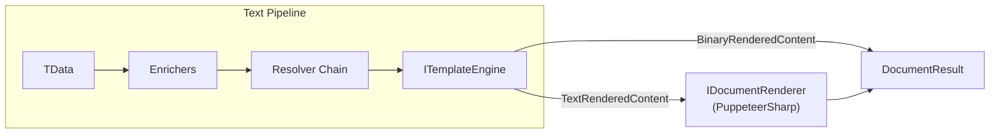

import { FileTree } from "@astrojs/starlight/components";

## Why a document generation pipeline?

Every business application eventually needs to produce documents — invoices, contracts,
reports, export files. The common approach is to build PDF generation as a one-off
utility using a low-level library, resulting in duplicated layout code, inconsistent
branding, and no easy way for non-developers to update templates.

Granit.DocumentGeneration solves this with a two-stage pipeline: first, render a
Scriban text template (HTML or data), then convert the output to a binary format (PDF
or Excel). Templates are managed through the [Templating](/dotnet/business/templating/)
system with full lifecycle and approval workflow, so business users control the content
while developers control the rendering. PDF/A-3b support is built in for long-term
archival and electronic invoicing (Factur-X / ZUGFeRD EN 16931) — a legal requirement
in several EU countries.

> **Architecture decisions:** see [ADR-012: PuppeteerSharp](/dotnet/architecture/adr/012-puppeteersharp-pdf-rendering/) for the PDF engine choice and [ADR-011: ClosedXML](/dotnet/architecture/adr/011-closedxml-excel-generation/) for Excel generation.

## Package structure

<FileTree>
- Granit.DocumentGeneration/ IDocumentGenerator facade, 2-stage pipeline (text render + binary conversion)
  - Granit.DocumentGeneration.Pdf PuppeteerSharp headless Chromium, PdfRenderOptions, PDF/A-3b
  - Granit.DocumentGeneration.Excel ClosedXML engine, Base64-encoded XLSX templates
</FileTree>

| Package | Role | Depends on |
| ------- | ---- | ---------- |
| `Granit.DocumentGeneration` | `IDocumentGenerator` facade, `IDocumentRenderer` abstraction | `Granit.Templating` |
| `Granit.DocumentGeneration.Pdf` | PuppeteerSharp PDF renderer, `IPdfAConverter` | `Granit.DocumentGeneration` |
| `Granit.DocumentGeneration.Excel` | ClosedXML `ITemplateEngine` (direct binary output) | `Granit.Templating` |

## Setup

```csharp
[DependsOn(
    typeof(GranitDocumentGenerationPdfModule),
    typeof(GranitDocumentGenerationExcelModule),
    typeof(GranitTemplatingScribanModule))]
public class AppModule : GranitModule { }
```

## Document generation pipeline

`IDocumentGenerator` extends the text pipeline with a binary conversion step:



Two paths through the pipeline:

| Path | Engine output | Next step | Example |
| ---- | ------------- | --------- | ------- |
| HTML-based | `TextRenderedContent` | `IDocumentRenderer` converts HTML to binary | Invoice PDF (Scriban HTML → Chromium PDF) |
| Native binary | `BinaryRenderedContent` | Direct output, no renderer needed | Excel report (ClosedXML XLSX) |

## Declaring a document template type

```csharp
public sealed class InvoiceTemplateType
    : DocumentTemplateType<InvoiceDocumentData>
{
    public override string Name => "Billing.Invoice";
    public override DocumentFormat DefaultFormat => DocumentFormat.Pdf;
}

public sealed record InvoiceDocumentData(
    string InvoiceNumber,
    DateTimeOffset InvoiceDate,
    string CustomerName,
    string CustomerAddress,
    IReadOnlyList<InvoiceLineItem> Lines,
    decimal TotalExclVat,
    decimal VatAmount,
    decimal TotalInclVat,
    string PaymentUrl,
    string? PaymentQrCodeSvg = null);
```

## Generating a PDF document

```csharp
public sealed class InvoiceService(IDocumentGenerator generator)
{
    public async Task<DocumentResult> GenerateInvoicePdfAsync(
        InvoiceDocumentData data,
        CancellationToken cancellationToken)
    {
        DocumentResult result = await generator
            .GenerateAsync(new InvoiceTemplateType(), data, cancellationToken: cancellationToken)
            .ConfigureAwait(false);

        // result.Content contains PDF bytes
        // result.Format == DocumentFormat.Pdf
        return result;
    }
}
```

## Generating an Excel document

Excel templates use Base64-encoded XLSX workbooks stored as template content.
Placeholders (`{{model.property}}`) in string cells are replaced with data values.
Nested objects use dot notation (`{{model.address.city}}`), arrays use bracket notation
(`{{model.lines[0].amount}}`).

```csharp
public sealed class MonthlyReportTemplateType
    : DocumentTemplateType<MonthlyReportData>
{
    public override string Name => "Reporting.MonthlyReport";
    public override DocumentFormat DefaultFormat => DocumentFormat.Excel;
}
```

The `ClosedXmlTemplateEngine` returns `BinaryRenderedContent` directly -- no
`IDocumentRenderer` is needed for Excel output.

## PDF/A-3b conversion

For long-term archival and electronic invoicing (Factur-X / ZUGFeRD EN 16931),
use `IPdfAConverter` to convert standard PDFs to PDF/A-3b:

```csharp
public async Task<DocumentResult> GenerateArchivalInvoiceAsync(
    InvoiceDocumentData data,
    IPdfAConverter pdfAConverter,
    IDocumentGenerator generator,
    CancellationToken cancellationToken)
{
    DocumentResult pdf = await generator
        .GenerateAsync(new InvoiceTemplateType(), data, cancellationToken: cancellationToken)
        .ConfigureAwait(false);

    return await pdfAConverter
        .ConvertToPdfAAsync(pdf, new PdfAConversionOptions(), cancellationToken)
        .ConfigureAwait(false);
}
```

## Configuration reference

Bound from configuration section `DocumentGeneration:Pdf`:

```json
{
  "DocumentGeneration": {
    "Pdf": {
      "PaperFormat": "A4",
      "Landscape": false,
      "MarginTop": "10mm",
      "MarginBottom": "10mm",
      "MarginLeft": "10mm",
      "MarginRight": "10mm",
      "HeaderTemplate": null,
      "FooterTemplate": "<div style='font-size:9px;text-align:center;width:100%'><span class='pageNumber'></span>/<span class='totalPages'></span></div>",
      "PrintBackground": true,
      "ChromiumExecutablePath": null,
      "MaxConcurrentPages": 4
    }
  }
}
```

| Property | Default | Description |
| -------- | ------- | ----------- |
| `PaperFormat` | `"A4"` | Paper size (`"A4"`, `"A5"`, `"Letter"`) |
| `Landscape` | `false` | Landscape orientation |
| `MarginTop` / `Bottom` / `Left` / `Right` | `"10mm"` | Margins in CSS units |
| `HeaderTemplate` | `null` | HTML header (supports `pageNumber`, `totalPages` classes) |
| `FooterTemplate` | `null` | HTML footer (same classes as header) |
| `PrintBackground` | `true` | Print background graphics |
| `ChromiumExecutablePath` | `null` | Custom Chromium path (auto-download if null) |
| `MaxConcurrentPages` | `4` | Max parallel Chromium tabs (1--32) |

## Public API summary

| Category | Key types | Package |
| -------- | --------- | ------- |
| Module | `GranitDocumentGenerationModule`, `GranitDocumentGenerationPdfModule`, `GranitDocumentGenerationExcelModule` | -- |
| Keys | `DocumentTemplateType<TData>`, `DocumentFormat` | `Granit.DocumentGeneration` |
| Generator | `IDocumentGenerator`, `IDocumentRenderer`, `DocumentResult` | `Granit.DocumentGeneration` |
| PDF | `PdfRenderOptions`, `IPdfAConverter`, `PdfAConversionOptions` | `Granit.DocumentGeneration.Pdf` |
| Extensions | `AddGranitDocumentGeneration()`, `AddGranitDocumentGenerationPdf()`, `AddGranitDocumentGenerationExcel()` | -- |

## See also

- [Templating module](/dotnet/business/templating/) -- Scriban pipeline, enrichers, resolvers, template lifecycle
- [Background Jobs module](/dotnet/infrastructure/background-jobs/) -- Schedule document generation as background jobs
- [Wolverine module](/dotnet/infrastructure/wolverine/) -- Durable messaging for async document generation
