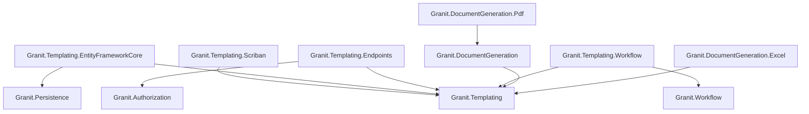
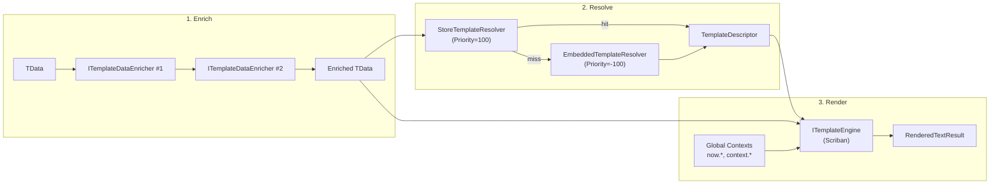
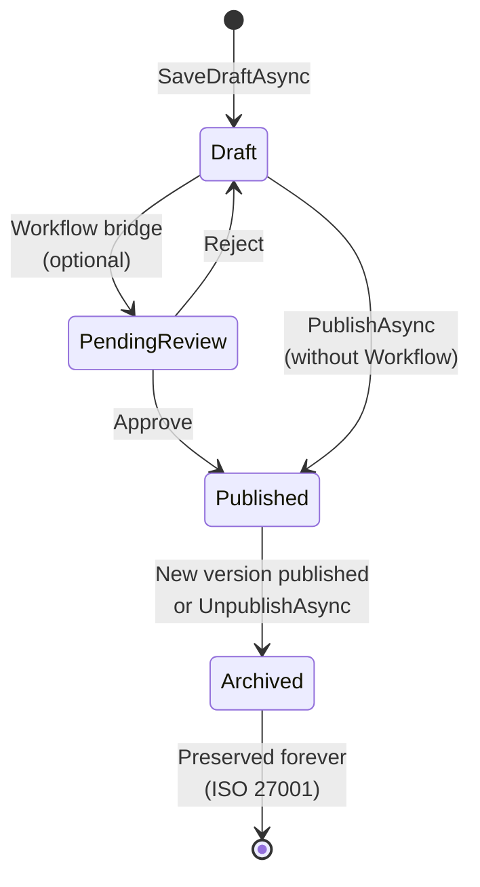

import { Tabs, TabItem, FileTree, Badge } from "@astrojs/starlight/components";

## Why a template engine?

Most applications start with hardcoded strings in email services — `$"Dear {name}, your
order {id} has shipped"`. This works until the business wants to change the wording
without a deployment, support multiple languages, or require approval before a customer
communication goes live. Suddenly you need a template store, a rendering engine, variable
injection, culture fallback, and an audit trail — all built in-house under pressure.

Granit.Templating provides this entire stack out of the box. Templates are versioned
entities with a full ISO 27001 lifecycle (Draft, PendingReview, Published, Archived) —
so business users can edit and preview templates while compliance teams approve changes
before they reach customers. The Scriban engine runs in a sandbox (no I/O, no reflection),
making it safe even with user-authored templates. Culture fallback, global context
injection, and CQRS store access are built into the pipeline, not bolted on after the
fact.

For binary document output (PDF, Excel), see
[Document Generation](/dotnet/business/document-generation/).

## Package structure

<FileTree>
- Granit.Templating/ Core pipeline: ITextTemplateRenderer, resolvers, engines, enrichers, global contexts, template store CQRS
  - Granit.Templating.Scriban Scriban engine (sandboxed, no I/O or reflection), template caching, built-in global contexts
  - Granit.Templating.EntityFrameworkCore EF Core persistence (TemplatingDbContext), HybridCache-backed store, StoreTemplateResolver
  - Granit.Templating.Endpoints 16 admin endpoints (CRUD, preview, publish, categories, history, variables)
  - Granit.Templating.Workflow Bridge to Granit.Workflow: FSM validation, approval routing, unified audit trail
</FileTree>

| Package | Role | Depends on |
| ------- | ---- | ---------- |
| `Granit.Templating` | Core pipeline: rendering, resolution, enrichment, store interfaces | -- |
| `Granit.Templating.Scriban` | Scriban template engine (sandboxed), `now.*` and `context.*` globals | `Granit.Templating` |
| `Granit.Templating.EntityFrameworkCore` | EF Core store, `StoreTemplateResolver` (Priority=100), HybridCache | `Granit.Templating`, `Granit.Persistence` |
| `Granit.Templating.Endpoints` | 16 admin Minimal API endpoints, `Templates.Manage` permission | `Granit.Templating`, `Granit.Authorization` |
| `Granit.Templating.Workflow` | Workflow bridge: FSM validation, `IWorkflowTransitionRecorder` | `Granit.Templating`, `Granit.Workflow` |

## Dependency graph



## Setup

<Tabs>
<TabItem label="Full stack (production)">

```csharp
[DependsOn(
    typeof(GranitTemplatingEndpointsModule),
    typeof(GranitTemplatingEntityFrameworkCoreModule),
    typeof(GranitTemplatingScribanModule))]
public class AppModule : GranitModule
{
    public override void ConfigureServices(ServiceConfigurationContext context)
    {
        context.Services.AddGranitTemplatingEntityFrameworkCore(options =>
            options.UseNpgsql(context.Configuration.GetConnectionString("Templating")));
    }
}
```

Map the admin endpoints in `Program.cs`:

```csharp
app.MapGranitTemplatingAdmin(options =>
{
    options.RoutePrefix = "api/v1/templates";
    options.TagName = "Template Administration";
});
```

</TabItem>
<TabItem label="Minimal (embedded templates only)">

```csharp
[DependsOn(typeof(GranitTemplatingScribanModule))]
public class AppModule : GranitModule
{
    public override void ConfigureServices(ServiceConfigurationContext context)
    {
        // Register embedded HTML templates from the assembly
        context.Services.AddEmbeddedTemplates(typeof(AcmeTemplates).Assembly);
    }
}
```

No database, no admin UI. Templates are compiled into the assembly as embedded resources.

</TabItem>
<TabItem label="With Workflow approval">

```csharp
[DependsOn(
    typeof(GranitTemplatingScribanModule),
    typeof(GranitTemplatingEntityFrameworkCoreModule),
    typeof(GranitTemplatingWorkflowModule))]
public class AppModule : GranitModule { }
```

The Workflow bridge replaces `NullTemplateTransitionHook` with `WorkflowTemplateTransitionHook`,
enabling FSM-validated transitions and unified audit trail via `IWorkflowTransitionRecorder`.

</TabItem>
</Tabs>

## Template rendering pipeline

The text rendering pipeline executes three stages in sequence:



**Stage 1 -- Enrichment.** `ITemplateDataEnricher<TData>` instances run in ascending `Order`.
Each enricher returns a new immutable copy (record `with` expression) -- the original data
is never mutated. Use enrichers to inject computed values (QR codes, aggregated totals,
remote blob URLs) without coupling that logic to the domain layer.

**Stage 2 -- Resolution.** `ITemplateResolver` implementations are tried by descending `Priority`.
The resolver chain applies culture fallback: first `(Name, "fr-BE")`, then `(Name, null)`.
Tenant scoping is the resolver's responsibility.

| Resolver | Priority | Source |
|----------|----------|--------|
| `StoreTemplateResolver` | 100 | EF Core database (published revisions, HybridCache) |
| `EmbeddedTemplateResolver` | -100 | Assembly embedded resources (code-level fallback) |

**Stage 3 -- Engine rendering.** `ITemplateEngine` selects itself via `CanRender(descriptor)`
based on MIME type. Scriban handles `text/html` and `text/plain`. Global contexts are injected
under their `ContextName` namespace.

### Declaring template types

```csharp
// Text template (email, SMS, push)
public static class AcmeTemplates
{
    public static readonly TextTemplateType<AppointmentReminderData> AppointmentReminder =
        new AppointmentReminderTemplateType();

    private sealed class AppointmentReminderTemplateType
        : TextTemplateType<AppointmentReminderData>
    {
        public override string Name => "Acme.AppointmentReminder";
    }
}

public sealed record AppointmentReminderData(
    string PatientName,
    DateTimeOffset AppointmentDate,
    string DoctorName,
    string ClinicAddress);
```

### Rendering a text template

```csharp
public sealed class AppointmentReminderService(
    ITextTemplateRenderer renderer,
    IEmailSender emailSender)
{
    public async Task SendReminderAsync(
        Patient patient,
        Appointment appointment,
        CancellationToken cancellationToken)
    {
        var data = new AppointmentReminderData(
            PatientName: patient.FullName,
            AppointmentDate: appointment.ScheduledAt,
            DoctorName: appointment.Doctor.FullName,
            ClinicAddress: appointment.Location.Address);

        RenderedTextResult result = await renderer
            .RenderAsync(AcmeTemplates.AppointmentReminder, data, cancellationToken)
            .ConfigureAwait(false);

        await emailSender
            .SendAsync(patient.Email, subject: "Appointment reminder", html: result.Html, cancellationToken)
            .ConfigureAwait(false);
    }
}
```

### Data enrichment

```csharp
public sealed class PaymentQrCodeEnricher
    : ITemplateDataEnricher<InvoiceDocumentData>
{
    public int Order => 10;

    public Task<InvoiceDocumentData> EnrichAsync(
        InvoiceDocumentData data,
        CancellationToken cancellationToken = default)
    {
        using QRCodeGenerator generator = new();
        QRCodeData qrData = generator.CreateQrCode(
            data.PaymentUrl, QRCodeGenerator.ECCLevel.M);
        SvgQRCode svg = new(qrData);

        return Task.FromResult(data with { PaymentQrCodeSvg = svg.GetGraphic(5) });
    }
}
```

Register enrichers in the DI container:

```csharp
services.AddTransient<ITemplateDataEnricher<InvoiceDocumentData>,
    PaymentQrCodeEnricher>();
```

## Global contexts

Global contexts inject ambient data into every template under a named variable.
Two are registered by default when using `Granit.Templating.Scriban`:

| Namespace | Variable | Example output |
|-----------|----------|----------------|
| `now` | `{{ now.date }}` | `27/02/2026` |
| `now` | `{{ now.datetime }}` | `27/02/2026 14:35` |
| `now` | `{{ now.iso }}` | `2026-02-27T14:35:00+00:00` |
| `now` | `{{ now.year }}` | `2026` |
| `now` | `{{ now.month }}` | `02` |
| `now` | `{{ now.time }}` | `14:35` |
| `context` | `{{ context.culture }}` | `fr-BE` |
| `context` | `{{ context.culture_name }}` | `fran\u00e7ais (Belgique)` |
| `context` | `{{ context.tenant_id }}` | `3fa85f64-...` or empty |
| `context` | `{{ context.tenant_name }}` | `Acme Corp` or empty |

:::caution
User identity is intentionally **not** exposed in global contexts. Avoid injecting PII
into `ITemplateGlobalContext` implementations -- pass PII through `TData` instead.
:::

### Custom global context

```csharp
public sealed class AcmeBrandingContext : ITemplateGlobalContext
{
    public string ContextName => "brand";

    public object Resolve() => new
    {
        logo_url = "https://cdn.acme.com/logo.svg",
        primary_color = "#1A73E8",
    };
}

// Registration
services.AddSingleton<ITemplateGlobalContext, AcmeBrandingContext>();
```

Template usage: `{{ brand.logo_url }}`, `{{ brand.primary_color }}`.

## Scriban sandboxing

The Scriban engine runs in strict sandboxed mode:

- **`EnableRelaxedMemberAccess = false`** -- no access to .NET internals
- **No I/O, reflection, or network access** from templates
- **Snake_case property mapping** -- `PatientName` becomes `{{ model.patient_name }}`
- **Template caching** -- parsed `Template` objects are cached by `RevisionId` (thread-safe)
- **CancellationToken propagation** -- long-running templates can be cancelled

## Template lifecycle

Templates stored in the EF Core store follow a strict lifecycle:



| Status | Description | Deletable? |
|--------|-------------|------------|
| `Draft` | Being edited. Not visible to the rendering pipeline. Only one draft per key. | Yes |
| `PendingReview` | Submitted for approval. Only with `Granit.Templating.Workflow`. | No |
| `Published` | Active version. Exactly one per `TemplateKey`. Resolved by `StoreTemplateResolver`. | No |
| `Archived` | Superseded by a newer publication. Preserved indefinitely for ISO 27001 audit trail. | No |

### Lifecycle operations

| Operation | Method | Effect |
|-----------|--------|--------|
| Save draft | `IDocumentTemplateStoreWriter.SaveDraftAsync` | Creates or replaces the draft for a key |
| Publish | `IDocumentTemplateStoreWriter.PublishAsync` | Promotes draft to Published, archives previous |
| Unpublish | `IDocumentTemplateStoreWriter.UnpublishAsync` | Archives the published revision |
| Delete draft | `IDocumentTemplateStoreWriter.DeleteDraftAsync` | Physically deletes the draft (drafts only) |

:::note[ISO 27001]
Published and archived revisions are **never** physically deleted. The `RevisionId`
is propagated through the entire rendering pipeline into the final document output
for full traceability.
:::

### Workflow bridge

Without the `Granit.Templating.Workflow` package, transitions are direct
(Draft → Published → Archived) via `NullTemplateTransitionHook`. Installing the
Workflow bridge replaces this with `WorkflowTemplateTransitionHook`, which:

1. **Validates transitions** via `IWorkflowManager<WorkflowLifecycleStatus>` FSM
2. **Records transitions** via `IWorkflowTransitionRecorder` for unified ISO 27001 audit trail
3. **Supports approval routing** (Draft → PendingReview → Published)

## Resolver chain

Templates are resolved by trying resolvers in descending priority order:

| Priority | Resolver | Source | Package |
|----------|----------|--------|---------|
| 100 | `StoreTemplateResolver` | EF Core database (published revisions only) | `Granit.Templating.EntityFrameworkCore` |
| -100 | `EmbeddedTemplateResolver` | Assembly embedded resources | `Granit.Templating` |

**Culture fallback strategy** (per resolver):
1. `(Name, Culture)` -- e.g. `("Acme.Invoice", "fr-BE")`
2. `(Name, null)` -- culture-neutral fallback

**Tenant scoping** is handled inside each resolver. The store-backed resolver looks for
a tenant-scoped template first, then falls back to the host-level one.

### Embedded template resource naming

| Culture | Resource name |
|---------|---------------|
| Specific (`"fr"`) | `{AssemblyName}.Templates.{TemplateName}.fr.html` |
| Neutral (fallback) | `{AssemblyName}.Templates.{TemplateName}.html` |

Register embedded templates:

```csharp
services.AddEmbeddedTemplates(typeof(AcmeTemplates).Assembly);
```

## Admin endpoints

16 endpoints are registered via `MapGranitTemplatingAdmin()`. All require the
`Templates.Manage` permission.

### Template endpoints

| Method | Route | Name | Description |
|--------|-------|------|-------------|
| `GET` | `/` | `ListTemplates` | Paginated list with filters (status, culture, category, search) |
| `GET` | `/{name}` | `GetTemplateDetail` | Draft + published detail for a template |
| `POST` | `/` | `CreateTemplateDraft` | Create a new template draft |
| `PUT` | `/{name}` | `UpdateTemplateDraft` | Update an existing draft |
| `DELETE` | `/{name}/draft` | `DeleteTemplateDraft` | Delete draft only (published/archived preserved) |
| `POST` | `/{name}/publish` | `PublishTemplate` | Publish the current draft |
| `POST` | `/{name}/unpublish` | `UnpublishTemplate` | Archive the published revision |
| `GET` | `/{name}/lifecycle` | `GetTemplateLifecycle` | Lifecycle status + available transitions |
| `POST` | `/{name}/preview` | `PreviewTemplate` | Render draft with test data, returns HTML |
| `GET` | `/{name}/variables` | `GetTemplateVariables` | Available variables for autocompletion |
| `GET` | `/{name}/history` | `GetTemplateHistory` | Paginated revision history (summaries) |
| `GET` | `/{name}/history/{revisionId}` | `GetTemplateRevisionDetail` | Full detail of a specific revision |

### Category endpoints

| Method | Route | Name | Description |
|--------|-------|------|-------------|
| `GET` | `/categories` | `ListTemplateCategories` | All categories ordered by sort order |
| `POST` | `/categories` | `CreateTemplateCategory` | Create a new category |
| `PUT` | `/categories/{id}` | `UpdateTemplateCategory` | Update a category |
| `DELETE` | `/categories/{id}` | `DeleteTemplateCategory` | Delete a category (409 if templates associated) |

:::tip
If `IDocumentTemplateStoreReader`/`IDocumentTemplateStoreWriter` is not registered
(no EF Core module loaded), all endpoints return `501 Not Implemented`.
:::

## Configuration reference

### Endpoints

```csharp
app.MapGranitTemplatingAdmin(options =>
{
    options.RoutePrefix = "api/v1/templates";  // default: "templates"
    options.TagName = "Template Administration"; // default: "Templates"
});
```

## Scriban template example

A discharge letter template stored in the EF Core store or as an embedded resource:

```html
<h1>Discharge Summary</h1>
<p>Date: {{ now.date }}</p>
<p>Dear {{ model.patient_name }},</p>
<p>
  You were admitted on {{ model.admission_date }} and discharged on
  {{ model.discharge_date }} from the {{ model.ward_name }} ward.
</p>
<h2>Diagnosis</h2>
<p>{{ model.primary_diagnosis }}</p>
<h2>Follow-up Instructions</h2>
<ul>
  {{ for instruction in model.follow_up_instructions }}
  <li>{{ instruction }}</li>
  {{ end }}
</ul>
<p style="font-size: 0.8em; color: #666;">
  Culture: {{ context.culture }} | Generated: {{ now.datetime }}
</p>
```

## Public API summary

| Category | Key types | Package |
| -------- | --------- | ------- |
| Module | `GranitTemplatingModule`, `GranitTemplatingScribanModule`, `GranitTemplatingEntityFrameworkCoreModule`, `GranitTemplatingEndpointsModule`, `GranitTemplatingWorkflowModule` | -- |
| Pipeline | `ITextTemplateRenderer`, `ITemplateResolver`, `ITemplateEngine` | `Granit.Templating` |
| Pipeline | `TemplateDescriptor`, `RenderedContent`, `TextRenderedContent`, `BinaryRenderedContent`, `RenderedTextResult` | `Granit.Templating` |
| Keys | `TemplateType<TData>`, `TextTemplateType<TData>`, `TemplateKey`, `DocumentFormat` | `Granit.Templating` |
| Enrichment | `ITemplateDataEnricher<TData>` | `Granit.Templating` |
| Global context | `ITemplateGlobalContext` | `Granit.Templating` |
| Store (read) | `IDocumentTemplateStoreReader`, `ITemplateCategoryStoreReader` | `Granit.Templating` |
| Store (write) | `IDocumentTemplateStoreWriter`, `ITemplateCategoryStoreWriter` | `Granit.Templating` |
| Lifecycle | `TemplateLifecycleStatus`, `ITemplateTransitionHook`, `TemplateRevision` | `Granit.Templating` |
| Permissions | `TemplatingPermissions.Manage` (`"Templates.Manage"`) | `Granit.Templating.Endpoints` |
| Extensions | `AddGranitTemplating()`, `AddGranitTemplatingWithScriban()`, `AddEmbeddedTemplates()` | -- |
| Extensions | `MapGranitTemplatingAdmin()` | `Granit.Templating.Endpoints` |

## When to use — and when not to

Use Granit.Templating when:

- **Non-developers need to edit** email/SMS/notification content without code changes
- Templates require **approval workflows** before reaching customers (ISO 27001, regulated industries)
- You need **multi-language templates** with culture fallback and variable injection
- Template rendering must be **sandboxed** (user-authored content, no risk of code execution)

Skip it when:

- You generate **static, developer-controlled** text (e.g., internal log messages) — string interpolation is simpler
- You need **binary-first** output (PDF from scratch, not from HTML) — go directly to [Document Generation](/dotnet/business/document-generation/)
- Templates are **single-use** and never change — the lifecycle overhead (Draft → Published) is unnecessary

## Common pitfalls

:::caution[Scriban sandbox restrictions]
The Scriban engine runs in a restricted sandbox: no file I/O, no reflection, no
`System` namespace access. If a template uses `{{ import }}` or tries to call .NET
methods directly, it will fail silently (returns empty string). Use `ITemplateGlobalContext`
to expose safe data instead.
:::

:::caution[Template not resolving]
`ITextTemplateRenderer` tries resolvers in priority order (Store = 100, Embedded = 0).
If a template is in the database but has `LifecycleStatus = Draft`, the `StoreTemplateResolver`
skips it. Only `Published` templates are resolved in production. For development, use
embedded templates as fallback.
:::

:::caution[Missing culture fallback]
If a template exists in `fr` but not `fr-CA`, the renderer falls back to `fr`. But if
no fallback chain is configured, a request for `de` with no German template returns an
error. Always register templates for your default culture at minimum.
:::

## See also

- [ADR-010: Scriban](/dotnet/architecture/adr/010-scriban-template-engine/) -- Why Scriban was chosen as the template engine
- [Document Generation module](/dotnet/business/document-generation/) -- HTML→PDF (Chromium), Excel (ClosedXML), PDF/A-3b
- [Core module](/dotnet/core/module-system/) -- Module system, domain base types
- [Persistence module](/dotnet/data/persistence/) -- `AuditedEntityInterceptor`, `ApplyGranitConventions`
- [Notifications module](/dotnet/infrastructure/notifications/) -- Email, SMS, push channels that consume rendered templates
