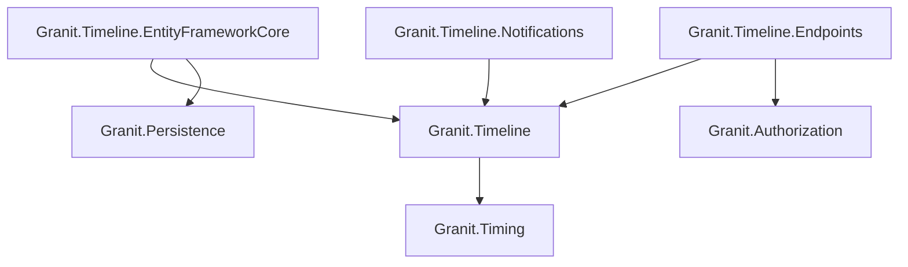
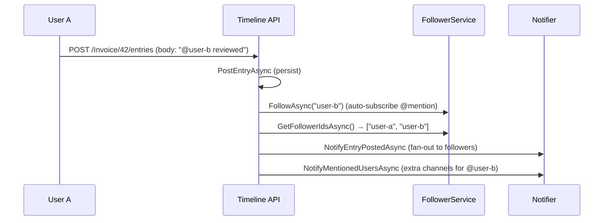

import { Tabs, TabItem, FileTree } from "@astrojs/starlight/components";

Granit.Timeline adds a unified activity stream (Odoo-style chatter) to any entity —
comments, internal notes, system logs, threaded replies, file attachments, and a
follow/notify pattern.

## Package structure

<FileTree>
- Granit.Timeline/ Core stream engine, in-memory default
  - Granit.Timeline.EntityFrameworkCore Durable persistence (PostgreSQL)
  - Granit.Timeline.Endpoints Minimal API routes, permissions
  - Granit.Timeline.Notifications Follow/notify via Granit.Notifications
</FileTree>

| Package | Role | Depends on |
|---------|------|------------|
| `Granit.Timeline` | `ITimelined`, `ITimelineReader/Writer`, stream DTOs | `Granit.Timing` |
| `Granit.Timeline.EntityFrameworkCore` | Durable persistence for entries + attachments | `Granit.Timeline`, `Granit.Persistence` |
| `Granit.Timeline.Endpoints` | REST API, permission policies | `Granit.Timeline`, `Granit.Authorization` |
| `Granit.Timeline.Notifications` | Notification-backed follower/notifier bridge | `Granit.Timeline` |

## Dependency graph



---

## Setup

<Tabs>
<TabItem label="Development (in-memory)">

```csharp
[DependsOn(typeof(GranitTimelineModule))]
public class AppModule : GranitModule { }
```

In-memory stores for entries and followers. No database required.

</TabItem>
<TabItem label="Production (EF Core + Endpoints + Notifications)">

```csharp
[DependsOn(
    typeof(GranitTimelineEntityFrameworkCoreModule),
    typeof(GranitTimelineEndpointsModule),
    typeof(GranitTimelineNotificationsModule))]
public class AppModule : GranitModule { }
```

```csharp
builder.AddGranitTimelineEntityFrameworkCore(
    opts => opts.UseNpgsql(connectionString));

// Map endpoints in the app pipeline
app.MapTimelineEndpoints();
```

</TabItem>
</Tabs>

## Marking entities as timelined

Add the `ITimelined` marker interface to any entity that should have an activity stream:

```csharp
public class Invoice : FullAuditedEntity, ITimelined
{
    public string InvoiceNumber { get; set; } = string.Empty;
    public decimal Amount { get; set; }
    public InvoiceStatus Status { get; set; }
}
```

The entity type name is derived from the CLR type name by convention (`"Invoice"`),
or can be overridden with `[Timelined("custom-name")]`.

## Posting entries

```csharp
public class InvoiceApprovalHandler(ITimelineWriter timeline)
{
    public async Task HandleAsync(
        InvoiceApproved evt, CancellationToken cancellationToken)
    {
        // System log — immutable, cannot be deleted (ISO 27001)
        await timeline.PostEntryAsync(
            "Invoice",
            evt.InvoiceId.ToString(),
            TimelineEntryType.SystemLog,
            $"Invoice approved by **{evt.ApprovedBy}** for amount {evt.Amount:C}.",
            cancellationToken: cancellationToken).ConfigureAwait(false);
    }
}
```

Entry bodies support Markdown formatting. The `@mention` syntax (`@userId`) triggers
automatic follower subscription and mention notifications when the Endpoints module
processes the entry.

## TimelineStreamEntry (DTO)

```csharp
public sealed record TimelineStreamEntry
{
    public required Guid Id { get; init; }
    public required DateTimeOffset OccurredAt { get; init; }
    public required TimelineStreamEntryType EntryType { get; init; }
    public string? AuthorId { get; init; }
    public string? AuthorName { get; init; }
    public string Body { get; init; } = string.Empty;
    public IReadOnlyList<TimelineAttachmentInfo> Attachments { get; init; } = [];
    public Guid? ParentEntryId { get; init; }
}
```

| Entry type | Description | Deletable |
|-----------|-------------|-----------|
| `Comment` | Human-authored comment visible to all users | Yes (soft-delete, GDPR) |
| `InternalNote` | Staff-only internal note | Yes (soft-delete, GDPR) |
| `SystemLog` | Auto-generated audit entry | No (immutable, ISO 27001) |

## REST API endpoints

All endpoints are prefixed with `/api/granit/timeline`.

| Method | Path | Description | Permission |
|--------|------|-------------|------------|
| `GET` | `/{entityType}/{entityId}` | Paginated activity stream (newest first) | `Timeline.Entries.Read` |
| `POST` | `/{entityType}/{entityId}/entries` | Post a comment, note, or system log | `Timeline.Entries.Create` |
| `DELETE` | `/{entityType}/{entityId}/entries/{entryId}` | Soft-delete an entry (GDPR) | `Timeline.Entries.Create` |
| `POST` | `/{entityType}/{entityId}/follow` | Subscribe current user as follower | `Timeline.Entries.Create` |
| `DELETE` | `/{entityType}/{entityId}/follow` | Unsubscribe current user | `Timeline.Entries.Create` |
| `GET` | `/{entityType}/{entityId}/followers` | List follower user IDs | `Timeline.Entries.Read` |

## Follow/notify pattern



Without `Granit.Timeline.Notifications`, the follower service uses an in-memory store
and the notifier is a no-op (`NullTimelineNotifier`). Installing the Notifications
package replaces both with notification-backed implementations that leverage
`Granit.Notifications` for multi-channel delivery (email, push, SignalR).

## Attachments

Timeline entries support file attachments via `ITimelineWriter.AddAttachmentAsync()`,
referencing blob IDs managed by `Granit.BlobStorage`:

```csharp
await timeline.AddAttachmentAsync(
    entryId,
    blobId: uploadResult.BlobId,
    fileName: "scan.pdf",
    contentType: "application/pdf",
    sizeBytes: 245_000,
    cancellationToken).ConfigureAwait(false);
```

## Public API summary

| Category | Key types | Package |
|----------|-----------|---------|
| Modules | `GranitTimelineModule`, `GranitTimelineEntityFrameworkCoreModule`, `GranitTimelineEndpointsModule`, `GranitTimelineNotificationsModule` | Timeline |
| Timeline core | `ITimelined`, `ITimelineReader`, `ITimelineWriter`, `ITimelineFollowerService`, `ITimelineNotifier` | `Granit.Timeline` |
| DTOs | `TimelineStreamEntry`, `TimelineStreamEntryType`, `TimelineAttachmentInfo`, `PostTimelineEntryRequest` | `Granit.Timeline` |
| Permissions | `TimelinePermissions.Entries.Read`, `TimelinePermissions.Entries.Create` | `Granit.Timeline.Endpoints` |
| Extensions | `AddGranitTimeline()`, `AddGranitTimelineEntityFrameworkCore()`, `MapTimelineEndpoints()` | — |

## See also

- [Notifications module](./notifications/) — Multi-channel notification engine used by Timeline.Notifications
- [Persistence module](./persistence/) — EF Core interceptors, query filters
- [Blob Storage module](./blob-storage/) — File storage for timeline attachments
- [Observability module](./observability/) — Audit logging
