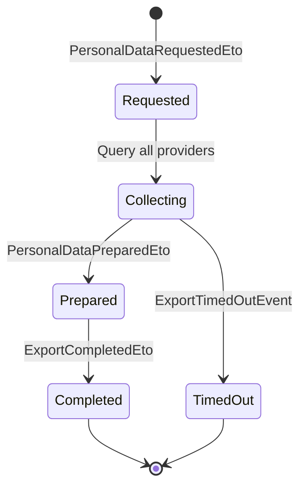
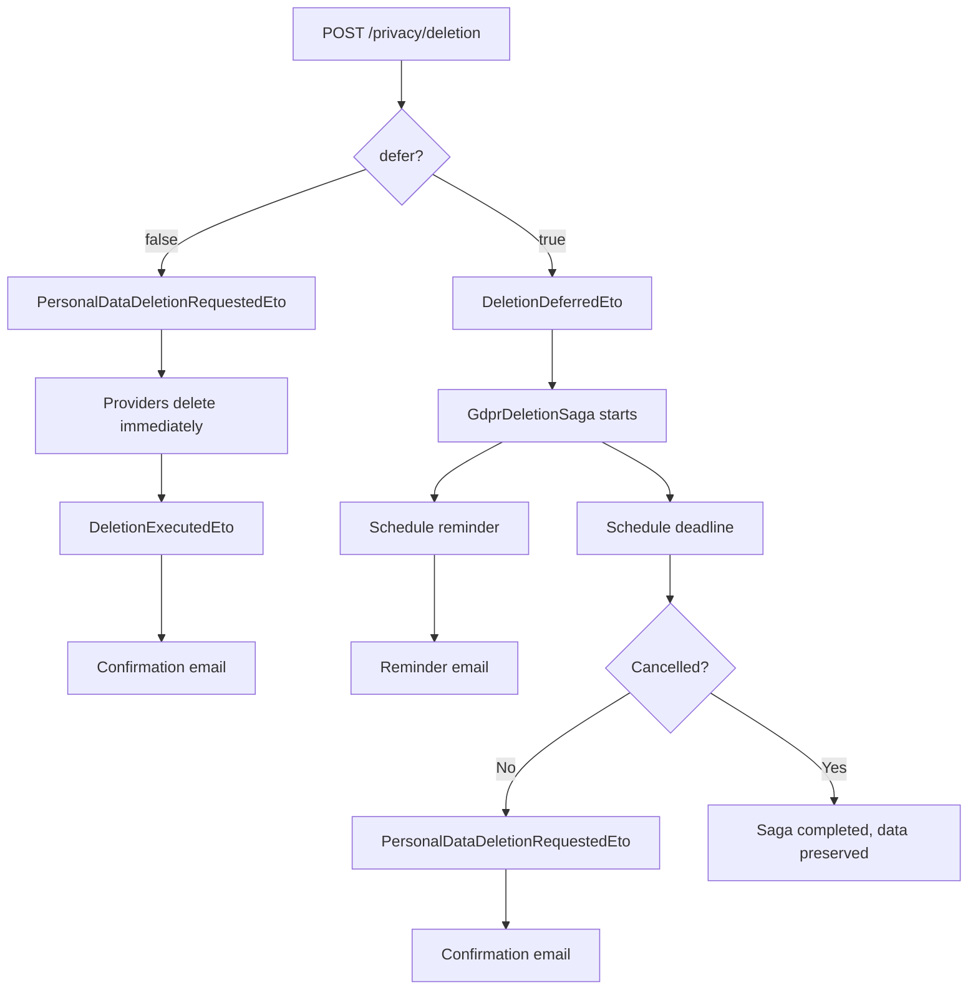

import { Aside, Badge, FileTree } from "@astrojs/starlight/components";

## Why a privacy module?

GDPR gives every user the right to request a full export of their personal data
(Art. 15) and the right to be forgotten (Art. 17). In a modular application, personal
data is scattered across multiple modules — patient records, uploaded documents,
notification logs, audit trails. Implementing these rights manually means every module
needs custom export/deletion logic, and missing one module means a compliance violation
with fines up to 4% of annual turnover.

Granit.Privacy turns this into a framework concern: modules register as data providers,
and a saga orchestrates collection or deletion across all of them. The saga handles
timeouts, partial failures, and cascading notifications automatically. Legal agreement
tracking (privacy policy versions, consent records) is built in, so you can prove
compliance during an audit without building a custom consent system.

## Package structure

<FileTree>
- Granit.Privacy GDPR data export saga, deletion with cooling-off, legal agreements
  - Granit.Privacy.Endpoints Minimal API endpoints for export, deletion, consent
  - Granit.Privacy.Notifications Deletion reminder and confirmation emails
  - Granit.Privacy.AI AI-powered PII detection in free-text fields
</FileTree>

| Package | Role | Depends on |
| ------- | ---- | ---------- |
| `Granit.Privacy` | GDPR data export/deletion orchestration, legal agreements | `Granit`, `Granit.BackgroundJobs` |
| `Granit.Privacy.Endpoints` | HTTP endpoints for GDPR Art. 7/15/17/20 | `Granit.Privacy`, `Granit.Authorization`, `Granit.Validation` |
| `Granit.Privacy.Notifications` | Deletion reminder and confirmation notification bridge | `Granit.Privacy`, `Granit.Notifications` |
| `Granit.Privacy.AI` | LLM-powered PII detection (`IAIPiiDetector`) | `Granit.Privacy`, `Granit.AI` |

## Setup

```csharp
[DependsOn(typeof(GranitPrivacyModule))]
public class AppModule : GranitModule
{
    public override void ConfigureServices(ServiceConfigurationContext context)
    {
        context.Services.AddGranitPrivacy(privacy =>
        {
            privacy.RegisterDataProvider("PatientModule");
            privacy.RegisterDataProvider("BlobStorageModule");
            privacy.RegisterDocument(
                "privacy-policy", "2.1", "Privacy Policy");
            privacy.RegisterDocument(
                "terms-of-service", "1.0", "Terms of Service");
        });
    }
}
```

## Data provider registry

Modules register themselves as data providers to participate in GDPR data export
and deletion workflows:

```csharp
privacy.RegisterDataProvider("PatientModule");
```

When a data subject requests export or deletion, the saga queries all registered
providers and waits for each to complete.

## GDPR data export saga



The export saga orchestrates data collection across all registered data providers.
Each provider prepares its data independently, and the saga assembles the final
export package.

## GDPR deletion

Two modes are supported — **immediate** (default) and **deferred** with an opt-in
cooling-off period:



### Cooling-off period

When the user sets `defer: true`, the deletion is postponed for a configurable
grace period. During this period the user can cancel via
`POST /privacy/deletion/{requestId}/cancel`. A reminder email is sent a few days
before the deadline. A daily safety-net job (`DeletionDeadlineEnforcerJob`) catches
any requests that the saga might have missed.

Configuration in `appsettings.json`:

```json
{
  "Privacy": {
    "DefaultGracePeriodDays": 30,
    "MaxGracePeriodDays": 90,
    "ReminderDaysBefore": 3
  }
}
```

Applications must provide a tracker implementation for deferred deletion state:

```csharp
privacy.UseDeletionRequestTracker<EfCoreDeletionRequestTracker>();
```

## Legal agreements

Track consent to legal documents (privacy policy, terms of service):

```csharp
privacy.RegisterDocument("privacy-policy", "2.1", "Privacy Policy");
```

Provide a store implementation to persist agreement records:

```csharp
privacy.UseLegalAgreementStore<EfCoreLegalAgreementStore>();
```

`ILegalAgreementChecker` verifies if a user has signed the current version of a
document — useful for middleware that blocks access until consent is renewed after
a policy update.

## Endpoints

`Granit.Privacy.Endpoints` exposes GDPR operations as a Minimal API surface.
Mount the endpoints via `MapGranitPrivacy()`:

```csharp
RouteGroupBuilder api = app.MapGroup("api/v{version:apiVersion}");
api.MapGranitPrivacy(); // → /api/v1/privacy/...
```

### Data export (Art. 15/20)

| Method | Route | Operation | Permission |
| ------ | ----- | --------- | ---------- |
| <Badge text="POST" variant="success" /> | `/export` | RequestPrivacyExport | `Privacy.Export.Execute` |
| <Badge text="GET" variant="note" /> | `/export/{requestId}` | GetPrivacyExportStatus | *(owner only)* |
| <Badge text="GET" variant="note" /> | `/export` | ListPrivacyExports | *(owner only)* |

The POST endpoint triggers the scatter-gather saga. Each registered data provider
prepares its fragment asynchronously. Poll the status endpoint or wire a
`Granit.Notifications` handler on `ExportCompletedEto` to notify the user.

When the export is ready, `ArchiveBlobReferenceId` in the response references the
archive blob. Use the BlobStorage download endpoint to obtain a pre-signed URL.

<Aside type="tip">
The application must provide an `IExportRequestTrackerReader` / `IExportRequestTrackerWriter`
implementation via `builder.UseExportRequestTracker<T>()`. This read model decouples
the HTTP surface from the internal Wolverine saga state.
</Aside>

### Data deletion (Art. 17)

| Method | Route | Operation | Permission |
| ------ | ----- | --------- | ---------- |
| <Badge text="POST" variant="success" /> | `/deletion` | RequestPrivacyDeletion | `Privacy.Deletion.Execute` |
| <Badge text="POST" variant="success" /> | `/deletion/{requestId}/cancel` | CancelPrivacyDeletion | `Privacy.Deletion.Execute` |
| <Badge text="GET" variant="note" /> | `/deletion/{requestId}` | GetPrivacyDeletionStatus | *(owner only)* |
| <Badge text="GET" variant="note" /> | `/deletion` | ListPrivacyDeletions | *(owner only)* |

When `defer` is false (default), publishes `PersonalDataDeletionRequestedEto`
immediately. When `defer` is true, starts the `GdprDeletionSaga` with a cooling-off
period. Each module handles its own data: physical delete, soft delete,
anonymization, or retention with legal justification. A confirmation email is sent
in both cases via `DeletionExecutedEto`.

### Legal agreements (Art. 7)

| Method | Route | Operation | Permission |
| ------ | ----- | --------- | ---------- |
| <Badge text="GET" variant="note" /> | `/agreements/documents` | ListPrivacyLegalDocuments | `Privacy.Agreements.Read` |
| <Badge text="GET" variant="note" /> | `/agreements/status` | GetPrivacyConsentStatus | `Privacy.Agreements.Read` |
| <Badge text="GET" variant="note" /> | `/agreements/history` | ListPrivacyAgreementHistory | `Privacy.Agreements.Read` |
| <Badge text="POST" variant="success" /> | `/agreements/accept` | AcceptPrivacyAgreement | `Privacy.Agreements.Create` |

The accept endpoint validates that the submitted version matches the current version
(rejects stale consent with 422), checks for duplicate acceptance (409), captures and
pseudonymizes the client IP for the GDPR Art. 7 audit trail.

<Aside type="caution">
The consent endpoint reads `RemoteIpAddress` from `HttpContext.Connection`. When
running behind a reverse proxy (Aspire, Docker, Nginx), enable
`ForwardedHeadersMiddleware` to capture the real client IP.
</Aside>

### Permissions summary

| Permission | Scope |
| ---------- | ----- |
| `Privacy.Export.Execute` | Request personal data export |
| `Privacy.Deletion.Execute` | Request and cancel personal data deletion |
| `Privacy.Agreements.Read` | View legal documents and consent status |
| `Privacy.Agreements.Create` | Accept a legal agreement |

## Configuration reference

```json
{
  "Privacy": {
    "ExportTimeoutMinutes": 5,
    "ExportMaxSizeMb": 100
  }
}
```

## Public API summary

| Category | Key types | Package |
| -------- | --------- | ------- |
| Module | `GranitPrivacyModule`, `GranitPrivacyEndpointsModule` | -- |
| Registry | `IDataProviderRegistry`, `ILegalDocumentRegistry`, `ILegalAgreementChecker` | `Granit.Privacy` |
| Builder | `GranitPrivacyBuilder`, `GranitPrivacyOptions` | `Granit.Privacy` |
| Export tracker | `IExportRequestTrackerReader`, `IExportRequestTrackerWriter`, `ExportRequestStatus` | `Granit.Privacy` |
| Events | `PersonalDataRequestedEto`, `PersonalDataDeletionRequestedEto`, `ExportCompletedEto`, `ExportTimedOutEvent` | `Granit.Privacy` |
| Endpoints | `MapGranitPrivacy()`, `PrivacyEndpointsOptions`, `PrivacyPermissions` | `Granit.Privacy.Endpoints` |
| Extensions | `AddGranitPrivacy()` | `Granit.Privacy` |

## See also

- [Cookies module](/dotnet/compliance/cookies/) -- GDPR cookie categories, consent management, Klaro CMP
- [Authentication module](/dotnet/security/authentication/) -- Authentication, authorization
- [Identity module](/dotnet/security/identity/) -- GDPR erasure and pseudonymization on user cache
- [Core module](/dotnet/core/module-system/) -- `ISoftDeletable`, data filter interfaces
