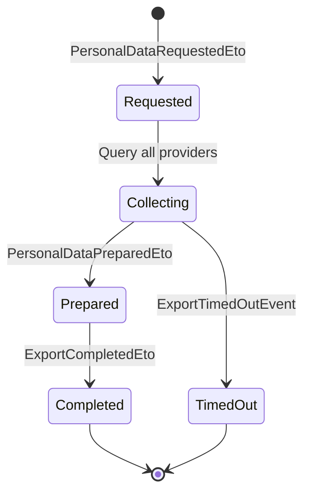
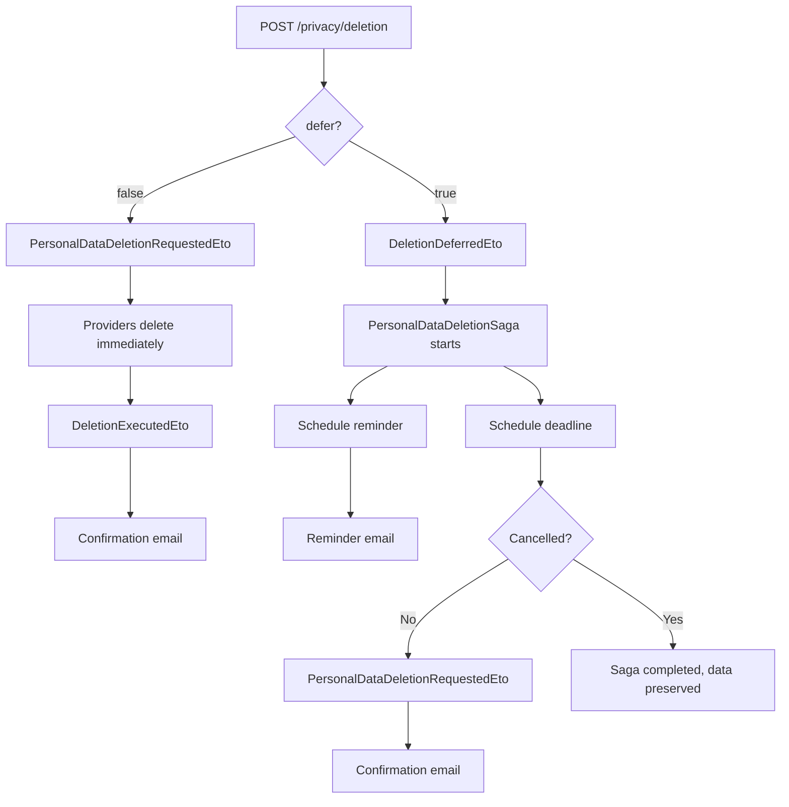

import { Aside, Badge, FileTree } from "@astrojs/starlight/components";

## Why a privacy module?

Privacy regulations give every user the right to request a full export of their
personal data and the right to be forgotten. In a modular application, personal
data is scattered across multiple modules — patient records, uploaded documents,
notification logs, audit trails. Implementing these rights manually means every
module needs custom export/deletion logic, and missing one module means a
compliance violation.

Granit.Privacy turns this into a framework concern: modules register as data
providers, and a saga orchestrates collection or deletion across all of them.
Legal agreement tracking (privacy policy versions, consent records) is built in.

With `Granit.Privacy.Regulations`, the module supports **14 jurisdictions
out of the box** — from EU GDPR to Brazil LGPD, USA CCPA, China PIPL, and more.
Each tenant can operate under a different regulation, resolved at runtime.

## Package structure

<FileTree>
- Granit.Privacy Data export saga, deletion with cooling-off, legal agreements
  - Granit.Privacy.Regulations Regulation registry, 14 built-in profiles, per-tenant resolver
  - Granit.Privacy.Endpoints Minimal API endpoints for export, deletion, consent, regulation
  - Granit.Privacy.BackgroundJobs Deletion deadline enforcer job
  - Granit.Privacy.Notifications Deletion reminder and confirmation emails
  - Granit.Privacy.AI AI-powered PII detection in free-text fields
</FileTree>

| Package | Role | Depends on |
| ------- | ---- | ---------- |
| `Granit.Privacy` | Data export/deletion orchestration, legal agreements | `Granit` |
| `Granit.Privacy.Regulations` | Regulation registry, 14 built-in profiles, per-tenant resolver | `Granit` |
| `Granit.Privacy.Endpoints` | HTTP endpoints for data subject rights + regulation profile | `Granit.Privacy`, `Granit.Privacy.Regulations`, `Granit.Authorization`, `Granit.Validation` |
| `Granit.Privacy.BackgroundJobs` | Deletion deadline enforcer (`DeletionDeadlineEnforcerJob`) | `Granit.Privacy`, `Granit.BackgroundJobs` |
| `Granit.Privacy.Notifications` | Deletion reminder and confirmation notification bridge | `Granit.Privacy`, `Granit.Notifications` |
| `Granit.Privacy.AI` | LLM-powered PII detection (`IAIPiiDetector`) | `Granit.Privacy`, `Granit.AI` |

## Setup

```csharp
[DependsOn(typeof(GranitPrivacyModule))]
public class AppModule : GranitModule
{
    public override void ConfigureServices(ServiceConfigurationContext context)
    {
        context.Services.AddGranitPrivacy(privacy =>
        {
            privacy.RegisterDataProvider("PatientModule");
            privacy.RegisterDataProvider("BlobStorageModule");
            privacy.RegisterDocument(
                "privacy-policy", "2.1", "Privacy Policy");
            privacy.RegisterDocument(
                "terms-of-service", "1.0", "Terms of Service");
        });

        // Register the multi-regulation engine
        context.Services.AddGranitPrivacyRegulations(
            context.Configuration);
    }
}
```

## Multi-regulation engine

`Granit.Privacy.Regulations` provides a regulation registry with **14 built-in
profiles** across two tiers:

| Tier | Regulations |
| ---- | ----------- |
| **Tier 1** (fully supported) | EU GDPR, UK GDPR, Brazil LGPD, USA CCPA/CPRA, Canada PIPEDA, Quebec Law 25, Switzerland nFADP |
| **Tier 2** (configurable) | China PIPL, India DPDPA, Japan APPI, South Korea PIPA, Australia Privacy Act, South Africa POPIA, Thailand PDPA |
| **Tier 3** (extensible) | Any custom regulation via `IRegulationProfileProvider` |

### Per-tenant regulation resolution

Each tenant can operate under a different regulation. The resolver checks:

1. Per-tenant override in `appsettings.json`
2. Default regulation

```json
{
  "Privacy": {
    "Regulations": {
      "DefaultRegulation": "EU_GDPR",
      "TenantRegulations": {
        "tenant-brazil": "BR_LGPD",
        "tenant-california": "US_CCPA",
        "tenant-china": "CN_PIPL"
      }
    }
  }
}
```

### Regulation profile

Each profile is an immutable `PrivacyRegulationProfile` record containing:

- **Consent model** — `OptIn` (GDPR, LGPD), `OptOut` (CCPA), `Hybrid`, `None`
- **Legal bases** — 6 for GDPR, 10 for LGPD (adds credit protection, health, research, life protection)
- **Response timelines** — SAR deadline (30d GDPR, 15d LGPD, 45d CCPA), extensions, deletion, rectification
- **Deletion grace period** — default and maximum days for deferred deletion
- **Breach notification** — hours to notify authority (72h GDPR, 24h PIPL) and individuals
- **Age verification** — minimum consent age (16 GDPR, 18 LGPD/DPDPA, 13 UK GDPR)
- **Cookie consent** — opt-in (EU), opt-out (CCPA), GPC signal support
- **Cross-border transfers** — required assessment, mechanisms (SCC, BCR, Adequacy, CAC)
- **Data localization** — required for China PIPL (critical infrastructure)
- **DPO requirements** — whether a DPO or local representative is needed

### Custom regulations (Tier 3)

```csharp
public class SaudiPdplProfileProvider : IRegulationProfileProvider
{
    public void Define(IRegulationProfileContext context) =>
        context.Register(new PrivacyRegulationProfile
        {
            Regulation = PrivacyRegulation.Create("SA_PDPL"),
            DisplayName = "Saudi Arabia Personal Data Protection Law",
            JurisdictionCode = "SA",
            ConsentModel = ConsentModel.OptIn,
            // ... all fields explicitly set
        });
}

// Register at startup:
services.AddGranitPrivacyRegulations(configuration, regulations =>
{
    regulations.AddProvider<SaudiPdplProfileProvider>();
});
```

### Composite profiles for multi-regulation tenants

When a tenant operates under multiple regulations simultaneously (e.g., EU SaaS
serving California users), create an explicit composite profile rather than relying
on automatic merging:

```csharp
public class EuGdprUsCcpaCompositeProvider : IRegulationProfileProvider
{
    public void Define(IRegulationProfileContext context) =>
        context.Register(new PrivacyRegulationProfile
        {
            Regulation = PrivacyRegulation.Create("EU_GDPR+US_CCPA"),
            DisplayName = "EU GDPR + US CCPA Composite",
            JurisdictionCode = "EU",
            ConsentModel = ConsentModel.OptIn,  // GDPR wins
            HonorGlobalPrivacyControl = true,   // CCPA requirement added
            // ... all fields set by deliberate business decision
        });
}
```

## Data provider registry

Modules register themselves as data providers to participate in data export and
deletion workflows:

```csharp
privacy.RegisterDataProvider("PatientModule");
```

When a data subject requests export or deletion, the saga queries all registered
providers and waits for each to complete.

## Personal data export saga



The `PersonalDataExportSaga` orchestrates data collection across all registered
data providers using a scatter-gather pattern. Each provider prepares its data
independently, and the saga assembles the final export package. The saga carries
the `Regulation` and `TenantId` from the starting event for per-tenant metrics.

## Personal data deletion

Two modes are supported — **immediate** (default) and **deferred** with an opt-in
cooling-off period:



### Cooling-off period

When the user sets `defer: true`, the deletion is postponed for a configurable
grace period (default from the regulation profile). During this period the user
can cancel via `POST /privacy/deletion/{requestId}/cancel`. A reminder email is
sent a few days before the deadline. A daily safety-net job
(`DeletionDeadlineEnforcerJob`) catches any requests that the saga might have
missed.

Configuration in `appsettings.json` (global defaults, overridable per regulation):

```json
{
  "Privacy": {
    "ExportTimeoutMinutes": 5,
    "ExportMaxSizeMb": 100,
    "DefaultGracePeriodDays": 30,
    "MaxGracePeriodDays": 90,
    "ReminderDaysBefore": 3,
    "RegulationOverrides": {
      "BR_LGPD": { "DefaultGracePeriodDays": 15 },
      "US_CCPA": { "DefaultGracePeriodDays": 45, "MaxGracePeriodDays": 90 }
    }
  }
}
```

Applications must provide a tracker implementation for deferred deletion state:

```csharp
privacy.UseDeletionRequestTracker<EfCoreDeletionRequestTracker>();
```

## Legal agreements

Track consent to legal documents (privacy policy, terms of service):

```csharp
privacy.RegisterDocument("privacy-policy", "2.1", "Privacy Policy");
```

Provide a store implementation to persist agreement records:

```csharp
privacy.UseLegalAgreementStore<EfCoreLegalAgreementStore>();
```

`ILegalAgreementChecker` verifies if a user has signed the current version of a
document — useful for middleware that blocks access until consent is renewed after
a policy update.

## Endpoints

`Granit.Privacy.Endpoints` exposes privacy operations as a Minimal API surface.
Mount the endpoints via `MapGranitPrivacy()`:

```csharp
RouteGroupBuilder api = app.MapGroup("api/v{version:apiVersion}");
api.MapGranitPrivacy(); // → /api/v1/privacy/...
```

### Regulation

| Method | Route | Operation | Permission |
| ------ | ----- | --------- | ---------- |
| <Badge text="GET" variant="note" /> | `/regulation` | GetApplicableRegulation | *(authenticated)* |

Returns the full `PrivacyRegulationProfile` for the current tenant — consent model,
response timelines, breach notification deadlines, age thresholds, cookie consent
rules, cross-border transfer requirements, and more.

### Data export

| Method | Route | Operation | Permission |
| ------ | ----- | --------- | ---------- |
| <Badge text="POST" variant="success" /> | `/export` | RequestPrivacyExport | `Privacy.Export.Execute` |
| <Badge text="GET" variant="note" /> | `/export/{requestId}` | GetPrivacyExportStatus | *(owner only)* |
| <Badge text="GET" variant="note" /> | `/export` | ListPrivacyExports | *(owner only)* |

The POST endpoint triggers the scatter-gather saga. Each registered data provider
prepares its fragment asynchronously. Poll the status endpoint or wire a
`Granit.Notifications` handler on `ExportCompletedEto` to notify the user.

When the export is ready, `ArchiveBlobReferenceId` in the response references the
archive blob. Use the BlobStorage download endpoint to obtain a pre-signed URL.

<Aside type="tip">
The application must provide an `IExportRequestTrackerReader` / `IExportRequestTrackerWriter`
implementation via `builder.UseExportRequestTracker<T>()`. This read model decouples
the HTTP surface from the internal Wolverine saga state.
</Aside>

### Data deletion

| Method | Route | Operation | Permission |
| ------ | ----- | --------- | ---------- |
| <Badge text="POST" variant="success" /> | `/deletion` | RequestPrivacyDeletion | `Privacy.Deletion.Execute` |
| <Badge text="POST" variant="success" /> | `/deletion/{requestId}/cancel` | CancelPrivacyDeletion | `Privacy.Deletion.Execute` |
| <Badge text="GET" variant="note" /> | `/deletion/{requestId}` | GetPrivacyDeletionStatus | *(owner only)* |
| <Badge text="GET" variant="note" /> | `/deletion` | ListPrivacyDeletions | *(owner only)* |

When `defer` is false (default), publishes `PersonalDataDeletionRequestedEto`
immediately. When `defer` is true, starts the `PersonalDataDeletionSaga` with a
cooling-off period. Each module handles its own data: physical delete, soft delete,
anonymization, or retention with legal justification. A confirmation email is sent
in both cases via `DeletionExecutedEto`.

### Legal agreements

| Method | Route | Operation | Permission |
| ------ | ----- | --------- | ---------- |
| <Badge text="GET" variant="note" /> | `/agreements/documents` | ListPrivacyLegalDocuments | `Privacy.Agreements.Read` |
| <Badge text="GET" variant="note" /> | `/agreements/status` | GetPrivacyConsentStatus | `Privacy.Agreements.Read` |
| <Badge text="GET" variant="note" /> | `/agreements/history` | ListPrivacyAgreementHistory | `Privacy.Agreements.Read` |
| <Badge text="POST" variant="success" /> | `/agreements/accept` | AcceptPrivacyAgreement | `Privacy.Agreements.Create` |

The accept endpoint validates that the submitted version matches the current version
(rejects stale consent with 422), checks for duplicate acceptance (409), captures and
pseudonymizes the client IP for the audit trail.

<Aside type="caution">
The consent endpoint reads `RemoteIpAddress` from `HttpContext.Connection`. When
running behind a reverse proxy (Aspire, Docker, Nginx), enable
`ForwardedHeadersMiddleware` to capture the real client IP.
</Aside>

### Permissions summary

| Permission | Scope |
| ---------- | ----- |
| `Privacy.Export.Execute` | Request personal data export |
| `Privacy.Deletion.Execute` | Request and cancel personal data deletion |
| `Privacy.Agreements.Read` | View legal documents and consent status |
| `Privacy.Agreements.Create` | Accept a legal agreement |

## Regulation comparison

| Feature | EU GDPR | Brazil LGPD | USA CCPA | China PIPL | India DPDPA |
| ------- | ------- | ----------- | -------- | ---------- | ----------- |
| Consent model | Opt-in | Opt-in | Opt-out | Opt-in | Opt-in |
| Legal bases | 6 | 10 | N/A | 7 | 4 |
| SAR deadline | 30 days | 15 days | 45 days | 30 days | 30 days |
| Breach notify | 72h | Prompt | Unreasonable delay | 24h | TBD |
| Min. consent age | 16 | 18 | 16 | 14 | 18 |
| GPC required | No | No | Yes | No | No |
| Data localization | No | No | No | Conditional | No |

## Public API summary

| Category | Key types | Package |
| -------- | --------- | ------- |
| Module | `GranitPrivacyModule`, `GranitPrivacyRegulationsModule`, `GranitPrivacyEndpointsModule` | -- |
| Regulation | `PrivacyRegulation`, `LegalBasis`, `ConsentModel`, `PrivacyRegulationProfile` | `Granit.Privacy.Regulations` |
| Resolution | `IPrivacyRegulationResolver`, `IRegulationProfileProvider`, `IRegulationProfileRegistry` | `Granit.Privacy.Regulations` |
| Registry | `IDataProviderRegistry`, `ILegalDocumentRegistry`, `ILegalAgreementChecker` | `Granit.Privacy` |
| Builder | `GranitPrivacyBuilder`, `GranitPrivacyOptions`, `PrivacyRegulationOverrides` | `Granit.Privacy` |
| Export tracker | `IExportRequestTrackerReader`, `IExportRequestTrackerWriter`, `ExportRequestStatus` | `Granit.Privacy` |
| Deletion tracker | `IDeletionRequestTrackerReader`, `IDeletionRequestTrackerWriter`, `DeletionRequestStatus` | `Granit.Privacy` |
| Events | `PersonalDataRequestedEto`, `PersonalDataDeletionRequestedEto`, `DeletionDeferredEto`, `ExportCompletedEto` | `Granit.Privacy` |
| Endpoints | `MapGranitPrivacy()`, `PrivacyEndpointsOptions`, `PrivacyPermissions` | `Granit.Privacy.Endpoints` |
| DTOs | `PrivacyRegulationProfileResponse`, `PrivacyExportRequestResponse`, `PrivacyDeletionStatusResponse` | `Granit.Privacy.Endpoints` |

## See also

- [Crypto-shredding](/dotnet/compliance/crypto-shredding/) -- GDPR erasure without deleting a single row
- [Cookies module](/dotnet/compliance/cookies/) -- GDPR cookie categories, consent management, Klaro CMP
- [Authentication module](/dotnet/security/authentication/) -- Authentication, authorization
- [Identity module](/dotnet/security/identity/) -- GDPR erasure and pseudonymization on user cache
- [Core module](/dotnet/core/module-system/) -- `ISoftDeletable`, data filter interfaces
