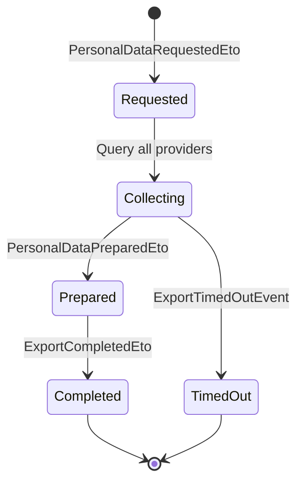

import { Aside, Badge } from "@astrojs/starlight/components";

## Export saga



The `PersonalDataExportSaga` orchestrates data collection across all registered
data providers using a scatter-gather pattern. Each provider prepares its data
independently, and the saga assembles the final export package. The saga carries
the `Regulation` and `TenantId` from the starting event for per-tenant metrics.

## Endpoints

| Method | Route | Operation | Permission |
| ------ | ----- | --------- | ---------- |
| <Badge text="POST" variant="success" /> | `/export` | RequestPrivacyExport | `Privacy.Export.Execute` |
| <Badge text="GET" variant="note" /> | `/export/{requestId}` | GetPrivacyExportStatus | *(owner only)* |
| <Badge text="GET" variant="note" /> | `/export` | ListPrivacyExports | *(owner only)* |

The POST endpoint triggers the scatter-gather saga. Each registered data provider
prepares its fragment asynchronously. Poll the status endpoint or wire a
`Granit.Notifications` handler on `ExportCompletedEto` to notify the user.

When the export is ready, `ArchiveBlobReferenceId` in the response references the
archive blob. Use the BlobStorage download endpoint to obtain a pre-signed URL.

<Aside type="tip">
The application must provide an `IExportRequestTrackerReader` / `IExportRequestTrackerWriter`
implementation via `builder.UseExportRequestTracker<T>()`. This read model decouples
the HTTP surface from the internal Wolverine saga state.
</Aside>

## Configuration

```json
{
  "Privacy": {
    "ExportTimeoutMinutes": 5,
    "ExportMaxSizeMb": 100,
    "RegulationOverrides": {
      "BR_LGPD": { "ExportTimeoutMinutes": 3 }
    }
  }
}
```
