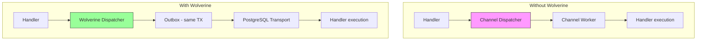

import { Tabs, TabItem } from "@astrojs/starlight/components";

## The problem

Not every project needs a full message bus. A small internal API serving a single team has no use for a PostgreSQL-backed transactional outbox, durable delivery, or distributed transport. But that same API might still need background jobs, webhook delivery, or notification dispatch.

Forcing Wolverine on every project would mean unnecessary infrastructure (PostgreSQL transport tables, outbox polling, dead-letter queues) for applications that will never need durability guarantees. On the other hand, baking in-memory-only dispatch into the framework would leave production systems without crash recovery.

Granit's answer: make Wolverine optional everywhere, with a `Channel<T>` fallback that works out of the box.

## The Channel fallback pattern

Four modules ship with both a Wolverine integration package and a built-in `Channel<T>` dispatcher:

| Module | Channel dispatcher | Wolverine package |
|--------|-------------------|-------------------|
| `Granit.BackgroundJobs` | `ChannelBackgroundJobDispatcher` | `Granit.BackgroundJobs.Wolverine` |
| `Granit.Notifications` | `ChannelNotificationPublisher` | `Granit.Notifications.Wolverine` |
| `Granit.Webhooks` | `ChannelWebhookCommandDispatcher` | `Granit.Webhooks.Wolverine` |
| `Granit.DataExchange` | `ChannelImportCommandDispatcher` / `ChannelExportCommandDispatcher` | `Granit.DataExchange.Wolverine` |

Each base module registers its `Channel<T>` dispatcher by default. When the corresponding Wolverine package is added and its module is declared in `[DependsOn]`, it **replaces** the Channel dispatcher with a durable outbox-backed implementation. No code changes in your handlers.

### How Channel dispatch works

The pattern is the same across all four modules. Taking background jobs as an example:

```csharp
// ChannelBackgroundJobDispatcher (simplified)
internal sealed class ChannelBackgroundJobDispatcher(
    Channel<BackgroundJobEnvelope> channel,
    TimeProvider timeProvider) : IBackgroundJobDispatcher
{
    public async Task PublishAsync(
        object message,
        IDictionary<string, string>? headers = null,
        CancellationToken cancellationToken = default) =>
        await channel.Writer.WriteAsync(
            new BackgroundJobEnvelope(message, headers), cancellationToken)
            .ConfigureAwait(false);
}
```

A `BackgroundJobWorker` (hosted service) reads from the channel and executes handlers in-process. The same pattern applies to `NotificationDispatchWorker`, `WebhookDispatchWorker`, and the DataExchange workers.

:::note[Good to know]
The Channel fallback handles roughly 10,000 messages per second in-process. You probably do not need Wolverine until you need durability guarantees or multi-instance deployment.
:::

## When you need what

| Requirement | Without Wolverine | With Wolverine |
|-------------|-------------------|----------------|
| Fire-and-forget jobs | Channel (in-memory) | Durable outbox |
| Scheduled/recurring jobs | `Task.Delay` (lost on crash) | Cron + outbox (crash-safe) |
| At-least-once delivery | No | Yes |
| Transactional outbox | No | Yes |
| Distributed tracing across async handlers | No | Yes (context propagation) |
| Horizontal scaling (multiple instances) | No (in-process only) | Yes (PostgreSQL transport) |
| Dead-letter queue inspection | No | Yes (admin endpoints) |

### When Channel dispatch is enough

- Internal tools and small APIs with a single instance
- Development and testing environments
- Applications where losing a few in-flight messages on crash is acceptable
- Prototyping -- get the feature working first, add durability later

### When you need Wolverine

- Production systems that require at-least-once delivery (webhook delivery, payment notifications)
- Multi-instance deployments where only one instance should run a recurring job
- ISO 27001 environments that mandate audit trail completeness through crash recovery
- Applications that need the transactional outbox to avoid dual-write problems

:::caution[Channel dispatch is not durable]
Messages in the `Channel<T>` pipeline live in process memory. If the application crashes or restarts, in-flight messages are lost. There is no retry, no dead-letter queue, no persistence. For anything that must not be lost, use the Wolverine package.
:::

## Adding Wolverine later

The migration path is deliberately simple. No handler code changes, no interface changes -- just add packages and update `[DependsOn]`.

<Tabs>
<TabItem label="Before (Channel only)">

```csharp
[DependsOn(typeof(GranitBackgroundJobsModule))]
[DependsOn(typeof(GranitNotificationsModule))]
public class AppModule : GranitModule { }
```

</TabItem>
<TabItem label="After (Wolverine durable)">

```csharp
[DependsOn(typeof(GranitBackgroundJobsWolverineModule))]
[DependsOn(typeof(GranitNotificationsWolverineModule))]
[DependsOn(typeof(GranitWolverinePostgresqlModule))]
public class AppModule : GranitModule { }
```

</TabItem>
</Tabs>

The Wolverine modules transitively depend on their base modules, so `GranitBackgroundJobsWolverineModule` pulls in `GranitBackgroundJobsModule` automatically. The Channel dispatcher is replaced by the Wolverine dispatcher at DI registration time.

Add the PostgreSQL transport connection string:

```json
{
  "WolverinePostgresql": {
    "TransportConnectionString": "Host=db;Database=myapp;Username=app;Password=..."
  }
}
```

That is the entire migration. Your handlers, your cron expressions, your notification templates -- everything else stays the same.

## Architecture



Both paths implement the same `IBackgroundJobDispatcher` / `INotificationPublisher` / `IWebhookPublisher` interfaces. Consumer code is identical.

## See also

- [Messaging](./messaging/) -- domain events, integration events, transactional outbox, context propagation
- [Wolverine reference](/reference/modules/wolverine/) -- full API surface, setup variants, handler conventions
- [BackgroundJobs reference](/reference/modules/background-jobs/) -- recurring job scheduling with cron expressions
