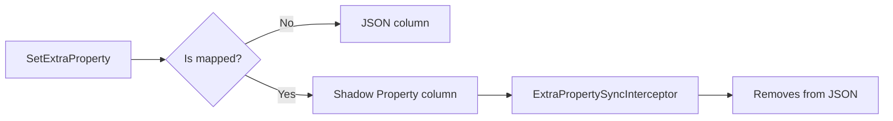

import { FileTree, Tabs, TabItem } from "@astrojs/starlight/components";

`IHasExtraProperties` is a domain interface that adds a JSON property bag to any
entity. Applications can attach arbitrary key-value pairs at runtime without
schema changes. For properties that need SQL indexes or query filtering, the
`MapProperty<T>()` API promotes them to real EF Core Shadow Properties — stored
in dedicated columns, automatically synchronized by the `ExtraPropertySyncInterceptor`.

## Where it lives

<FileTree>

- Granit/Domain/
  - IHasExtraProperties.cs interface
  - ExtraPropertyExtensions.cs Get/Set/Has helpers
- Granit.Persistence/ExtraProperties/
  - ExtraPropertyMappingOptions.cs MapProperty&lt;T&gt;() fluent API
  - ExtraPropertySyncInterceptor.cs SaveChanges interceptor
  - IExtraPropertyMappingRegistry.cs mapping resolution
  - ExtraPropertyModelBuilderExtensions.cs EF Core Shadow Properties

</FileTree>

## The interface

```csharp
public interface IHasExtraProperties
{
    string? ExtraPropertiesJson { get; set; }
}
```

Any entity implementing this interface gets a `jsonb` column (PostgreSQL) or
`nvarchar(max)` (SQL Server) storing a `Dictionary<string, string>` as JSON.

## Reading and writing properties

The `ExtraPropertyExtensions` class provides typed access without requiring
manual JSON serialization:

```csharp
// Set a property
invoice.SetExtraProperty("CostCenter", "CC-4200");
invoice.SetExtraProperty("Priority", "3");

// Get as string
string? costCenter = invoice.GetExtraProperty("CostCenter");

// Get with type parsing (uses IParsable<T>)
int? priority = invoice.GetExtraProperty<int>("Priority");
bool? isUrgent = invoice.GetExtraProperty<bool>("IsUrgent");

// Check existence
bool hasCostCenter = invoice.HasExtraProperty("CostCenter");

// Remove (pass null)
invoice.SetExtraProperty("CostCenter", null);

// Get all as dictionary
IReadOnlyDictionary<string, string> all = invoice.GetExtraProperties();
```

:::note
`GetExtraProperty<T>()` uses `IParsable<T>.TryParse()` — it works with `int`,
`bool`, `Guid`, `DateTimeOffset`, `decimal`, and any type implementing `IParsable<T>`.
Returns `default` when the property is missing or unparseable.
:::

## Which entities use it

| Entity | Package | Notes |
|--------|---------|-------|
| `GranitUser` | `Granit.OpenIddict` | Explicit implementation mapping to `CustomAttributesJson` |
| `ReferenceDataEntity` | `Granit.ReferenceData` | All reference data types inherit it |
| `UserCacheEntry` | `Granit.Identity.Federated.EntityFrameworkCore` | Federated identity cache |

You can implement `IHasExtraProperties` on any of your own entities:

```csharp
public sealed class Invoice : AuditedEntity, IHasExtraProperties
{
    public string InvoiceNumber { get; set; } = string.Empty;
    public decimal Amount { get; set; }

    // IHasExtraProperties
    public string? ExtraPropertiesJson { get; set; }
}
```

## Promoting properties to SQL columns

Properties stored in the JSON bag cannot be indexed or filtered at SQL level.
When you need query performance, promote them to real EF Core Shadow Properties:

```csharp
services.AddExtraPropertyMappings<Invoice>(opts =>
{
    opts.MapProperty<string>("CostCenter", maxLength: 20, isRequired: true);
    opts.MapProperty<int>("Priority");
    opts.MapProperty<bool>("IsUrgent", isFilterable: true);
});
```

This creates real SQL columns on the entity's table. The `ExtraPropertySyncInterceptor`
handles synchronization at save time:

1. **On save**: reads the JSON bag, moves mapped values to their Shadow Properties
2. **Removes mapped keys from JSON**: prevents data duplication
3. **SQL columns are the source of truth** for mapped properties



### EF Core configuration

Apply Shadow Property mappings in your `DbContext`:

```csharp
protected override void OnModelCreating(ModelBuilder modelBuilder)
{
    base.OnModelCreating(modelBuilder);

    // Apply Shadow Properties for Invoice extra properties
    modelBuilder.ApplyExtraPropertyMappings(invoiceExtensionOptions);

    modelBuilder.ApplyGranitConventions(currentTenant, dataFilter);
}
```

### QueryEngine Shadow Properties

Shadow Properties declared with `isFilterable: true` or `isSortable: true` integrate
with `Granit.QueryEngine` via the `ShadowColumn()` API on `QueryDefinitionBuilder`:

```csharp
// In a QueryDefinition
builder.ShadowColumn<string>("CostCenter", c => c.Filterable().Sortable());
builder.ShadowColumn<bool>("IsUrgent", c => c.Filterable());
```

This generates `EF.Property<T>(entity, "CostCenter")` expressions for SQL-level
filtering and sorting — transparently handled by `FilterExpressionBuilder` and
`QueryableSortExtensions`.

## DI registration

The ExtraProperties infrastructure is registered automatically when any module
calls `AddExtraPropertyInfrastructure()` or `AddExtraPropertyMappings<T>()`:

```csharp
// Register infrastructure (interceptor + registry) — idempotent
services.AddExtraPropertyInfrastructure();

// Register mappings for a specific entity type
services.AddExtraPropertyMappings<Invoice>(opts =>
{
    opts.MapProperty<string>("CostCenter", maxLength: 20);
});
```

:::tip
`Granit.ReferenceData.EntityFrameworkCore` and `Granit.OpenIddict.EntityFrameworkCore`
call `AddExtraPropertyInfrastructure()` automatically — you only need to call it
explicitly if you add `IHasExtraProperties` to your own entities.
:::

## Architecture

### Performance safeguards

The `ExtraPropertySyncInterceptor` is designed for minimal overhead:

- **Single instance**: one interceptor handles all `IHasExtraProperties` entity types
- **ConcurrentDictionary cache**: mapping lookup happens once per entity type per app lifetime
- **ChangeTracker filter**: only `Added`/`Modified` entries implementing `IHasExtraProperties` are inspected
- **Early exit**: when no mappings are registered for an entity type, zero work is done

### Registry

The `IExtraPropertyMappingRegistry` aggregates all mappings by entity type. It is
populated at startup by `ExtraPropertyMappingRegistryInitializer` (an `IHostedService`)
from all registered `IConfigureExtraPropertyRegistry` contributors.

## See also

- [Reference Data](/dotnet/business/reference-data/) -- uses ExtraProperties for dynamic reference data types
- [Persistence](/dotnet/data/persistence/) -- isolated DbContext pattern and EF Core conventions
- [Module System](/dotnet/core/module-system/) -- DependsOn and lifecycle hooks
