Granit.Guids generates sequential GUIDs optimized for clustered database indexes.
Random GUIDs fragment B-tree indexes because inserts land at random pages. Sequential
GUIDs place the timestamp at the front (or end, for SQL Server) so new rows are always
appended to the last page, eliminating page splits.

## Package

| Package | Role | Depends on |
| ------- | ---- | ---------- |
| `Granit.Guids` | `IGuidGenerator`, sequential GUIDs for clustered indexes | `Granit.Timing` |

## Setup

```csharp
[DependsOn(typeof(GranitGuidsModule))]
public class AppModule : GranitModule { }
```

## Usage

```csharp
public class PatientService(IGuidGenerator guidGenerator, AppDbContext db)
{
    public Patient Create(string firstName, string lastName)
    {
        return new Patient
        {
            Id = guidGenerator.Create(), // Sequential GUID
            FirstName = firstName,
            LastName = lastName,
        };
    }
}
```

## IGuidGenerator

```csharp
public interface IGuidGenerator
{
    Guid Create();
}
```

Two implementations:

| Implementation | Strategy | DI registration |
| -------------- | -------- | --------------- |
| `SequentialGuidGenerator` | Timestamp (6 bytes from `IClock`) + 10 cryptographic random bytes | Default (singleton) |
| `SimpleGuidGenerator` | Delegates to `Guid.NewGuid()` | Available via `SimpleGuidGenerator.Instance` for non-DI contexts |

## Sequential GUID types

The byte layout depends on the database engine:

| Type | Timestamp position | Database |
| ---- | ------------------ | -------- |
| `SequentialAsString` | Front (sorted by `Guid.ToString()`) | **PostgreSQL**, MySQL |
| `SequentialAsBinary` | Front (sorted by `Guid.ToByteArray()`) | Oracle |
| `SequentialAtEnd` | End (Data4 block) | SQL Server |

**Default:** `SequentialAsString` (optimized for PostgreSQL).

```mermaid
block-beta
    columns 16
    block:asstring["SequentialAsString (PostgreSQL)"]
        columns 16
        t1["T"] t2["T"] t3["T"] t4["T"] t5["T"] t6["T"]
        r1["R"] r2["R"] r3["R"] r4["R"] r5["R"] r6["R"] r7["R"] r8["R"] r9["R"] r10["R"]
    end

    block:atend["SequentialAtEnd (SQL Server)"]
        columns 16
        s1["R"] s2["R"] s3["R"] s4["R"] s5["R"] s6["R"] s7["R"] s8["R"] s9["R"] s10["R"]
        s11["T"] s12["T"] s13["T"] s14["T"] s15["T"] s16["T"]
    end

    style t1 fill:#4a9eff
    style t2 fill:#4a9eff
    style t3 fill:#4a9eff
    style t4 fill:#4a9eff
    style t5 fill:#4a9eff
    style t6 fill:#4a9eff
    style s11 fill:#4a9eff
    style s12 fill:#4a9eff
    style s13 fill:#4a9eff
    style s14 fill:#4a9eff
    style s15 fill:#4a9eff
    style s16 fill:#4a9eff
```



**T** = timestamp bytes (6 bytes, millisecond precision from `IClock`), **R** = cryptographically random bytes (10 bytes).

## Configuration

```csharp
services.AddGranitGuids(options =>
{
    options.DefaultSequentialGuidType = SequentialGuidType.SequentialAtEnd; // SQL Server
});
```

| Property | Default | Description |
| -------- | ------- | ----------- |
| `DefaultSequentialGuidType` | `SequentialAsString` | Sequential GUID byte layout |

## Public API summary

| Category | Key types | Package |
| -------- | --------- | ------- |
| Module | `GranitGuidsModule` | -- |
| Generator | `IGuidGenerator`, `SequentialGuidGenerator`, `SimpleGuidGenerator` | `Granit.Guids` |
| Options | `SequentialGuidType`, `GuidGeneratorOptions` | `Granit.Guids` |
| Extensions | `AddGranitGuids()` | `Granit.Guids` |

## See also

- [Timing module](/dotnet/core/timing/) -- `IClock` used for timestamp generation
- [Persistence module](/dotnet/data/persistence/) -- Sequential GUIDs for EF Core primary keys
