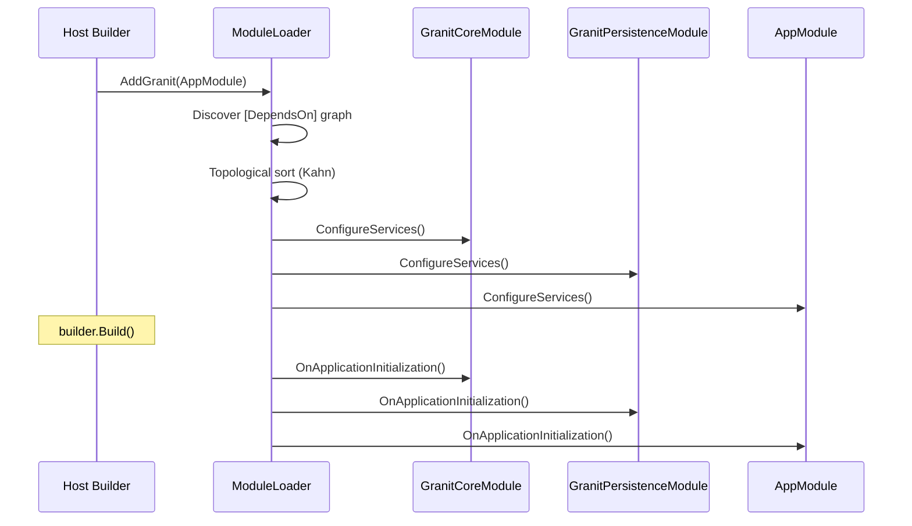

import { Tabs, TabItem, FileTree, Badge } from "@astrojs/starlight/components";

Granit.Core is the foundation of the entire framework. Every Granit module depends on it.
It provides the module system (topological loading, DI orchestration), shared domain-driven
design base types, GDPR/ISO 27001 data filtering, domain events, and a structured exception
hierarchy.

**Package:** `Granit.Core`
**Dependencies:** None (only `Microsoft.AspNetCore.App` framework reference)
**Dependents:** 24 packages (all other Granit modules)

## Package structure

Granit.Core is a single package — no providers, no EF Core sub-package. It defines
abstractions that other modules implement.

<FileTree>

- src/Granit.Core/
  - Modularity/
    - GranitModule.cs
    - GranitBuilder.cs
    - DependsOnAttribute.cs
    - ModuleLoader.cs
  - Domain/
    - Entity.cs
    - ValueObject.cs
    - AggregateRoot.cs
    - ISoftDeletable.cs
    - IMultiTenant.cs
    - IActive.cs
    - IPublishable.cs
    - IProcessingRestrictable.cs
  - DataFiltering/
    - IDataFilter.cs
    - DataFilter.cs
  - MultiTenancy/
    - ICurrentTenant.cs
    - NullTenantContext.cs
  - Events/
    - IDomainEvent.cs
    - IIntegrationEvent.cs
    - IDomainEventDispatcher.cs
  - Exceptions/
    - BusinessException.cs
    - ValidationException.cs
    - EntityNotFoundException.cs
  - Endpoints/
    - ModuleConfigEndpointExtensions.cs
    - BatchResult.cs
  - Extensions/
    - GranitHostBuilderExtensions.cs
    - GranitApplicationExtensions.cs
  - Localization/
    - LocalizableString.cs
    - LocalizationResourceNameAttribute.cs
  - Diagnostics/
    - GranitActivitySourceRegistry.cs
</FileTree>

## Setup

### Minimal setup

```csharp
var builder = WebApplication.CreateBuilder(args);

// Option 1: Single root module (recommended)
builder.AddGranit<AppModule>();

// Option 2: Fluent builder (multi-root)
builder.AddGranit(granit => granit
    .AddModule<GranitSecurityModule>()
    .AddModule<GranitPersistenceModule>()
    .AddModule<AppModule>());

var app = builder.Build();
app.UseGranit();
app.Run();
```

### Async variants

Both `AddGranit` and `UseGranit` have async counterparts for modules that need
async initialization (e.g., fetching secrets from Vault at startup):

```csharp
await builder.AddGranitAsync<AppModule>();
var app = builder.Build();
await app.UseGranitAsync();
```

## Module system

### GranitModule

Every module inherits from `GranitModule` and declares dependencies via `[DependsOn]`:

```csharp
[DependsOn(typeof(GranitPersistenceModule))]
[DependsOn(typeof(GranitSecurityModule))]
public class AppModule : GranitModule
{
    public override void ConfigureServices(ServiceConfigurationContext context)
    {
        context.Services.AddScoped<IAppointmentService, AppointmentService>();
    }

    public override void OnApplicationInitialization(ApplicationInitializationContext context)
    {
        var logger = context.ServiceProvider.GetRequiredService<ILogger<AppModule>>();
        logger.LogInformation("AppModule initialized");
    }
}
```

### Lifecycle

Modules execute in **topological order** (dependencies first), resolved via Kahn's algorithm.
Circular dependencies throw `InvalidOperationException` at startup.



Each lifecycle method has sync and async variants. Both are called — sync first, then async.

### ServiceConfigurationContext

Passed to `ConfigureServices` / `ConfigureServicesAsync`:

| Property | Type | Description |
|----------|------|-------------|
| `Services` | `IServiceCollection` | DI container |
| `Configuration` | `IConfiguration` | appsettings + environment |
| `Builder` | `IHostApplicationBuilder` | Full builder access |
| `ModuleAssemblies` | `IReadOnlyList<Assembly>` | All loaded module assemblies (topological order) |
| `Items` | `IDictionary<string, object?>` | Inter-module state sharing during configuration |

### Conditional modules

Override `IsEnabled` to conditionally skip a module:

```csharp
public class GranitNotificationsEmailSmtpModule : GranitModule
{
    public override bool IsEnabled(ServiceConfigurationContext context)
    {
        return context.Configuration.GetValue<bool>("Granit:Notifications:Email:Smtp:Enabled");
    }
}
```

### GranitBuilder (fluent API)

Alternative to `[DependsOn]` for composing modules in `Program.cs`:

```csharp
builder.AddGranit(granit => granit
    .AddModule<GranitCoreModule>()
    .AddModule<GranitPersistenceModule>()
    .AddModule<GranitObservabilityModule>());
```

Modules are deduplicated — adding the same module twice is safe.

## Domain base types

### Entity hierarchy

Choose the right base class based on your audit requirements:

<Tabs>
<TabItem label="Entity">
Simplest — just an `Id`. Use for lookup tables and value-like records.

```csharp
public class Country : Entity
{
    public string Code { get; set; } = string.Empty;
    public string Name { get; set; } = string.Empty;
}
```
</TabItem>
<TabItem label="CreationAuditedEntity">
Tracks who created the record and when.

```csharp
public class Appointment : CreationAuditedEntity
{
    public Guid PatientId { get; set; }
    public Guid DoctorId { get; set; }
    public DateTimeOffset ScheduledAt { get; set; }
}
// Adds: CreatedAt, CreatedBy
```
</TabItem>
<TabItem label="AuditedEntity">
Tracks creation and last modification.

```csharp
public class Invoice : AuditedEntity
{
    public string Number { get; set; } = string.Empty;
    public decimal Amount { get; set; }
}
// Adds: CreatedAt, CreatedBy, ModifiedAt, ModifiedBy
```
</TabItem>
<TabItem label="FullAuditedEntity">
Full audit trail with soft delete. Implements `ISoftDeletable`.

```csharp
public class Patient : FullAuditedEntity
{
    public string FirstName { get; set; } = string.Empty;
    public string LastName { get; set; } = string.Empty;
    public DateOnly DateOfBirth { get; set; }
}
// Adds: CreatedAt, CreatedBy, ModifiedAt, ModifiedBy,
//        IsDeleted, DeletedAt, DeletedBy
```
</TabItem>
</Tabs>

### Aggregate root hierarchy

Aggregate roots mirror the entity hierarchy but add domain event support via
`IDomainEventSource`:

| Base class | Audit level | Domain events |
|------------|-------------|---------------|
| `AggregateRoot` | None (just `Id`) | Yes |
| `CreationAuditedAggregateRoot` | Creation | Yes |
| `AuditedAggregateRoot` | Creation + modification | Yes |
| `FullAuditedAggregateRoot` | Full + soft delete | Yes |

```csharp
public class LegalAgreement : FullAuditedAggregateRoot
{
    public string Title { get; set; } = string.Empty;
    public int Version { get; set; }

    public void Sign(string signedBy)
    {
        // Business logic...
        AddDomainEvent(new AgreementSignedEvent(Id, signedBy));
    }
}
```

### ValueObject

Equality by value, not by reference. Override `GetEqualityComponents()`:

```csharp
public class Address : ValueObject
{
    public string Street { get; init; } = string.Empty;
    public string City { get; init; } = string.Empty;
    public string PostalCode { get; init; } = string.Empty;
    public string Country { get; init; } = string.Empty;

    protected override IEnumerable<object?> GetEqualityComponents()
    {
        yield return Street;
        yield return City;
        yield return PostalCode;
        yield return Country;
    }
}
```

## Data filtering

Five marker interfaces enable automatic EF Core global query filters. Entities
implementing these interfaces are filtered transparently — no manual `WHERE`
clauses needed.

| Interface | Filter behavior | GDPR/ISO relevance |
|-----------|----------------|-------------------|
| `ISoftDeletable` | Hides `IsDeleted = true` | Right to erasure (Art. 17) |
| `IMultiTenant` | Scopes to current `TenantId` | Tenant isolation |
| `IActive` | Hides `IsActive = false` | Data minimization |
| `IPublishable` | Hides `IsPublished = false` | Draft/published lifecycle |
| `IProcessingRestrictable` | Hides `IsProcessingRestricted = true` | Right to restriction (Art. 18) |

### IDataFilter

Selectively disable filters at runtime using `IDataFilter`:

```csharp
public class PatientPurgeService(
    IDataFilter dataFilter,
    AppDbContext dbContext)
{
    public async Task PurgeSoftDeletedAsync(CancellationToken cancellationToken)
    {
        using (dataFilter.Disable<ISoftDeletable>())
        {
            var deleted = await dbContext.Patients
                .Where(p => p.IsDeleted && p.DeletedAt < DateTimeOffset.UtcNow.AddYears(-3))
                .ToListAsync(cancellationToken)
                .ConfigureAwait(false);

            dbContext.Patients.RemoveRange(deleted);
            await dbContext.SaveChangesAsync(cancellationToken).ConfigureAwait(false);
        }
        // Filter automatically re-enabled here
    }
}
```

`DataFilter` is registered as Singleton. It uses `AsyncLocal<ImmutableDictionary<Type, bool>>`
internally — thread-safe, supports nested scopes with automatic restoration.

:::caution
Disabling `IMultiTenant` exposes data from ALL tenants. Only do this in
background jobs or admin operations with explicit authorization checks.
:::

### Additional domain interfaces

| Interface | Properties | Purpose |
|-----------|-----------|---------|
| `IVersioned` | `BusinessId`, `Version` | Versioned audit history (stable ID across versions) |
| `ITranslatable<T>` | `Translations` collection | Multi-language entity content |
| `ITranslation` | `ParentId`, `Culture` | Translation record (with `Translation<T>` and `AuditedTranslation<T>` base classes) |

Translation resolution chain (`GetTranslation()` extension):
exact culture → parent culture (`fr-BE` → `fr`) → default culture (`en`) → first available.

## Multi-tenancy abstraction

`ICurrentTenant` lives in `Granit.Core.MultiTenancy` — available in every module
without referencing `Granit.MultiTenancy`.

```csharp
public interface ICurrentTenant
{
    bool IsAvailable { get; }
    Guid? Id { get; }
    string? Name { get; }
    IDisposable Change(Guid? id, string? name = null);
}
```

By default, `NullTenantContext` is registered (`IsAvailable = false`). When
`Granit.MultiTenancy` is installed, it replaces the registration with a real
implementation.

:::note
Always check `IsAvailable` before using `Id`. The null object is the normal
state when multi-tenancy is not installed.
:::

## Domain events

| Type | Interface | Convention | Delivery |
|------|-----------|-----------|----------|
| Domain event | `IDomainEvent` | `XxxOccurred` (e.g., `PatientDischargedOccurred`) | In-process, transactional |
| Integration event | `IIntegrationEvent` | `XxxEvent` (e.g., `BedReleasedEvent`) | Cross-module, durable |

Domain events are collected on aggregate roots via `AddDomainEvent()` and dispatched
by `IDomainEventDispatcher`. The default implementation is `NullDomainEventDispatcher`
(no-op). `Granit.Wolverine` replaces it with a real dispatcher that routes events
through the Wolverine message bus.

:::tip
Integration events must be flat, serializable DTOs. Never include entities or
internal domain objects — they cross module boundaries.
:::

## Exception hierarchy

All exceptions map to specific HTTP status codes via `Granit.ExceptionHandling`
(RFC 7807 Problem Details):

| Exception | Status | Interfaces | Use case |
|-----------|--------|-----------|----------|
| `BusinessException` | 400 | `IHasErrorCode`, `IUserFriendlyException` | Business rule violation |
| `BusinessRuleViolationException` | 422 | (inherits from `BusinessException`) | Semantic validation failure |
| `ValidationException` | 422 | `IHasValidationErrors`, `IUserFriendlyException` | FluentValidation errors |
| `EntityNotFoundException` | 404 | `IUserFriendlyException` | Entity lookup miss |
| `NotFoundException` | 404 | `IUserFriendlyException` | General "not found" |
| `ConflictException` | 409 | `IHasErrorCode`, `IUserFriendlyException` | Concurrency/duplicate conflict |
| `ForbiddenException` | 403 | `IUserFriendlyException` | Authorization denial |

Only exceptions implementing `IUserFriendlyException` expose their message to
clients. All others return a generic error message (ISO 27001 — no internal
details leak).

```csharp
// Business rule with error code
throw new BusinessException("Appointment:PastDate", "Cannot schedule in the past");

// Entity not found (generic message to client, details in logs)
throw new EntityNotFoundException(typeof(Patient), patientId);

// Validation errors (from FluentValidation)
throw new ValidationException(new Dictionary<string, string[]>
{
    ["Email"] = ["Email address is required"],
    ["DateOfBirth"] = ["Must be in the past"]
});
```

## Module configuration endpoint

Expose read-only module configuration to frontend clients:

```csharp
// 1. Define the response DTO
public record NotificationConfigResponse(bool EmailEnabled, bool SmsEnabled, int MaxRetries);

// 2. Implement the provider
public class NotificationConfigProvider(IOptions<NotificationOptions> options)
    : IModuleConfigProvider<NotificationConfigResponse>
{
    public NotificationConfigResponse GetConfig() => new(
        options.Value.EmailEnabled,
        options.Value.SmsEnabled,
        options.Value.MaxRetries);
}

// 3. Map the endpoint (in your module's OnApplicationInitialization)
app.MapGranitModuleConfig<NotificationConfigProvider, NotificationConfigResponse>(
    routePrefix: "api/notifications",
    endpointName: "GetNotificationConfig",
    tag: "Notifications");
```

This maps `GET /api/notifications/config` → 200 OK with the response DTO.

## Batch operations

`BatchResult<T>` and `BatchResultHelper` standardize partial-success responses:

```csharp
var results = new List<BatchItemResult<Patient>>();

foreach (var command in commands)
{
    try
    {
        var patient = await CreatePatientAsync(command, cancellationToken).ConfigureAwait(false);
        results.Add(BatchResultHelper.Success(patient));
    }
    catch (ValidationException ex)
    {
        results.Add(BatchResultHelper.Failure<Patient>(ex.Message));
    }
}

var batch = BatchResultHelper.Create(results);
return batch.ToResult(); // 200 if all succeeded, 207 Multi-Status if any failed
```

## Diagnostics

`GranitActivitySourceRegistry` is a process-global registry for `System.Diagnostics.ActivitySource`
names. Modules call `Register("Granit.ModuleName")` during `ConfigureServices`, and
`Granit.Observability` auto-discovers all registered sources at startup for OpenTelemetry
tracing.

## Public API summary

| Category | Types | Count |
|----------|-------|-------|
| Module system | `GranitModule`, `GranitBuilder`, `DependsOnAttribute`, `ServiceConfigurationContext`, `ApplicationInitializationContext`, `GranitApplication`, `IModuleConfigProvider<T>`, `ModuleDescriptor` | 8 |
| Domain base classes | `Entity`, `ValueObject`, `AggregateRoot` + Creation/Audited/FullAudited variants | 10 |
| Filter interfaces | `ISoftDeletable`, `IMultiTenant`, `IActive`, `IPublishable`, `IProcessingRestrictable` | 5 |
| Data filtering | `IDataFilter`, `DataFilter` | 2 |
| Events | `IDomainEvent`, `IIntegrationEvent`, `IDomainEventSource`, `IDomainEventDispatcher` | 4 |
| Multi-tenancy | `ICurrentTenant`, `AllowAnonymousTenantAttribute` | 2 |
| Exceptions | `BusinessException`, `ValidationException`, `EntityNotFoundException`, `NotFoundException`, `ConflictException`, `ForbiddenException`, `BusinessRuleViolationException` | 7 |
| Exception interfaces | `IUserFriendlyException`, `IHasErrorCode`, `IHasValidationErrors` | 3 |
| Translation | `ITranslatable<T>`, `ITranslation`, `Translation<T>`, `AuditedTranslation<T>` | 4 |
| Other | `IVersioned`, `AuditLogEntry`, `LocalizableString`, `GranitActivitySourceRegistry`, `BatchResult<T>` | 5 |

## See also

- [Module system concept](../../concepts/module-system/)
- [Persistence](./persistence/) — EF Core interceptors that implement audit and soft delete
- [Security](./authentication/) — `ICurrentUserService` that populates `CreatedBy` / `ModifiedBy`
- [Multi-tenancy](./multi-tenancy/) — Full tenant isolation implementation
- [API Reference](/api/Granit.Core.html) (auto-generated from XML docs)
