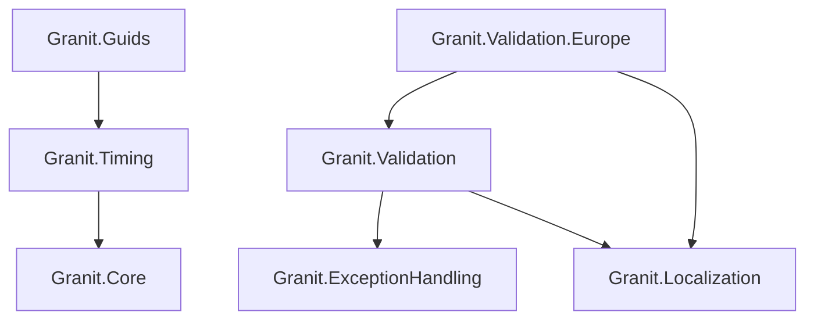

import { Tabs, TabItem, FileTree, Badge } from "@astrojs/starlight/components";

Four packages providing cross-cutting utility services. `Granit.Validation` wraps
FluentValidation with structured error codes and international validators (IBAN, BIC,
E.164, ISO 3166). `Granit.Validation.Europe` adds France/Belgium-specific regulatory
validators. `Granit.Timing` provides testable time abstractions with per-request
timezone support. `Granit.Guids` generates sequential GUIDs optimized for clustered
database indexes.

## Package structure

<FileTree>
- Granit.Timing/ IClock, ICurrentTimezoneProvider, TimeProvider bridge
  - Granit.Guids IGuidGenerator, sequential GUIDs
- Granit.Validation/ GranitValidator, international validators, endpoint filter
  - Granit.Validation.Europe France/Belgium regulatory validators
</FileTree>

| Package | Role | Depends on |
|---------|------|------------|
| `Granit.Timing` | `IClock`, `ICurrentTimezoneProvider`, `TimeProvider` | `Granit.Core` |
| `Granit.Guids` | `IGuidGenerator`, sequential GUIDs for clustered indexes | `Granit.Timing` |
| `Granit.Validation` | `GranitValidator<T>`, international validators, endpoint filter | `Granit.ExceptionHandling`, `Granit.Localization` |
| `Granit.Validation.Europe` | France/Belgium-specific validators (NISS, NIR, SIREN, VAT) | `Granit.Validation`, `Granit.Localization` |

## Dependency graph



---

## Granit.Validation

FluentValidation integration with structured error codes. All validators inherit
from `GranitValidator<T>` which enforces `CascadeMode.Continue` (all errors returned
in a single response). Error messages are replaced with structured codes
(`Granit:Validation:*`) that the SPA resolves from its localization dictionary.

### Setup

```csharp
[DependsOn(typeof(GranitValidationModule))]
public class AppModule : GranitModule { }
```

The module auto-discovers all `IValidator<T>` implementations from loaded module
assemblies. Manual registration is only needed for modules without the Wolverine
handler attribute:

```csharp
services.AddGranitValidatorsFromAssemblyContaining<CreatePatientRequestValidator>();
```

### Writing validators

```csharp
public record CreatePatientRequest(
    string FirstName,
    string LastName,
    string Email,
    string Phone,
    string CountryCode,
    string Iban);

public class CreatePatientRequestValidator : GranitValidator<CreatePatientRequest>
{
    public CreatePatientRequestValidator()
    {
        RuleFor(x => x.FirstName).NotEmpty().MaximumLength(100);
        RuleFor(x => x.LastName).NotEmpty().MaximumLength(100);
        RuleFor(x => x.Email).Email();
        RuleFor(x => x.Phone).E164Phone();
        RuleFor(x => x.CountryCode).Iso3166Alpha2CountryCode();
        RuleFor(x => x.Iban).Iban();
    }
}
```

### Minimal API endpoint filter

Apply validation to Minimal API endpoints with `.ValidateBody<T>()`:

```csharp
app.MapPost("/api/v1/patients", CreatePatient)
    .ValidateBody<CreatePatientRequest>();
```

When validation fails, the filter returns `422 Unprocessable Entity` with a
`HttpValidationProblemDetails` body:

```json
{
  "status": 422,
  "errors": {
    "Email": ["Granit:Validation:InvalidEmail"],
    "Phone": ["Granit:Validation:InvalidE164Phone"],
    "Iban": ["Granit:Validation:InvalidIban"]
  }
}
```

:::tip
If no `IValidator<T>` is registered, the filter passes through silently. This
allows gradual adoption: add validators incrementally without breaking endpoints.
:::

### International validators

Extension methods on `IRuleBuilder<T, string?>` for common international formats:

| Category | Validator | Format | Error code |
|----------|-----------|--------|------------|
| Contact | `.Email()` | RFC 5321 practical subset | `InvalidEmail` |
| Contact | `.E164Phone()` | `+` followed by 7-15 digits | `InvalidE164Phone` |
| Payment | `.Iban()` | ISO 13616 (MOD-97 check) | `InvalidIban` |
| Payment | `.BicSwift()` | ISO 9362 (8 or 11 chars) | `InvalidBicSwift` |
| Payment | `.SepaCreditorIdentifier()` | EPC262-08 (MOD 97-10) | `InvalidSepaCreditorIdentifier` |
| Locale | `.Iso3166Alpha2CountryCode()` | 2 uppercase letters | `InvalidIso3166Alpha2` |
| Locale | `.Bcp47LanguageTag()` | `fr`, `fr-BE`, `zh-Hans-CN` | `InvalidBcp47LanguageTag` |

All error codes are prefixed with `Granit:Validation:` (omitted in the table for brevity).

### Custom error codes

Use `.WithErrorCodeAndMessage()` to set both error code and message to the same value,
preventing them from silently diverging:

```csharp
RuleFor(x => x.AppointmentDate)
    .GreaterThan(DateTimeOffset.UtcNow)
    .WithErrorCodeAndMessage("Appointments:DateMustBeFuture");
```

---

## Granit.Validation.Europe

EU-specific regulatory validators for France and Belgium. Separate package to avoid
pulling regulatory dependencies into applications that do not need them.

### Setup

```csharp
[DependsOn(typeof(GranitValidationEuropeModule))]
public class AppModule : GranitModule { }
```

### Usage

```csharp
public class RegisterDoctorRequestValidator : GranitValidator<RegisterDoctorRequest>
{
    public RegisterDoctorRequestValidator()
    {
        RuleFor(x => x.Niss).BelgianNiss();
        RuleFor(x => x.InamiNumber).BelgianInami();
        RuleFor(x => x.Vat).EuropeanVat();
        RuleFor(x => x.PostalCode).BelgianPostalCode();
    }
}

public class RegisterClinicRequestValidator : GranitValidator<RegisterClinicRequest>
{
    public RegisterClinicRequestValidator()
    {
        RuleFor(x => x.Siret).FrenchSiret();
        RuleFor(x => x.Vat).FrenchVat();
        RuleFor(x => x.Finess).FrenchFiness();
        RuleFor(x => x.PostalCode).FrenchPostalCode();
    }
}
```

### Validator reference

**Personal identifiers:**

| Validator | Country | Format | Check algorithm |
|-----------|---------|--------|-----------------|
| `.BelgianNiss()` | BE | 11 digits (NISS/INSZ/SSIN) | MOD 97 (pre-2000 and post-2000) |
| `.FrenchNir()` | FR | 15 chars (NIR / Securite Sociale) | MOD 97, Corse support (2A/2B) |
| `.BelgianEid()` | BE | 12 digits (eID card number) | MOD 97 check pair |

**Company identifiers:**

| Validator | Country | Format | Check algorithm |
|-----------|---------|--------|-----------------|
| `.FrenchSiren()` | FR | 9 digits | Luhn |
| `.FrenchSiret()` | FR | 14 digits (SIREN + NIC) | Luhn over all 14 digits |
| `.BelgianBce()` | BE | 10 digits (BCE/KBO) | MOD 97 check pair |
| `.FrenchNafCode()` | FR | 4 digits + 1 letter (NAF/APE) | Format only |

**Tax identifiers:**

| Validator | Country | Format | Check algorithm |
|-----------|---------|--------|-----------------|
| `.BelgianVat()` | BE | `BE` + 10 digits | BCE algorithm |
| `.FrenchVat()` | FR | `FR` + 2-digit key + 9-digit SIREN | Key = `(12 + 3 * (SIREN % 97)) % 97` |
| `.EuropeanVat()` | EU | Country prefix + national format | Dispatches per country (algorithmic for FR/BE, format for others) |

**Payment identifiers:**

| Validator | Country | Format | Check algorithm |
|-----------|---------|--------|-----------------|
| `.FrenchRib()` | FR | 23 chars (bank + branch + account + key) | `97 - (89*bank + 15*branch + 3*account) % 97` |
| `.BelgianAccountNumber()` | BE | `NNN-NNNNNNN-NN` (legacy pre-IBAN) | `first 10 digits % 97` |

**Professional registries (healthcare):**

| Validator | Country | Format | Check algorithm |
|-----------|---------|--------|-----------------|
| `.FrenchRpps()` | FR | 11 digits (RPPS) | Luhn |
| `.FrenchAdeli()` | FR | 9 digits (ADELI) | Format + length |
| `.FrenchFiness()` | FR | 9 digits (FINESS) | Luhn |
| `.BelgianInami()` | BE | 11 digits (INAMI/RIZIV) | MOD 97 check pair |

**Postal addresses:**

| Validator | Country | Format | Notes |
|-----------|---------|--------|-------|
| `.FrenchPostalCode()` | FR | 5 digits (01000-99999) | Includes Corse (20xxx) and DOM-TOM (97xxx, 98xxx) |
| `.BelgianPostalCode()` | BE | 4 digits (1000-9999) | — |
| `.FrenchInseeCode()` | FR | 5 chars (dept + commune) | Supports 2A/2B (Corse), DOM 971-976 |

---

## Granit.Timing

Testable time abstraction for the entire framework. Replaces all calls to
`DateTime.Now` / `DateTime.UtcNow` with injectable services. Uses `AsyncLocal`
for per-request timezone propagation.

### Setup

```csharp
[DependsOn(typeof(GranitTimingModule))]
public class AppModule : GranitModule { }
```

### IClock

The primary abstraction for accessing the current time and performing timezone
conversions:

```csharp
public interface IClock
{
    DateTimeOffset Now { get; }
    bool SupportsMultipleTimezone { get; }
    DateTimeOffset Normalize(DateTimeOffset dateTime);
    DateTimeOffset ConvertToUserTime(DateTimeOffset utcDateTime);
    DateTimeOffset ConvertToUtc(DateTimeOffset dateTime);
}
```

**Usage in a service:**

```csharp
public class AppointmentService(IClock clock, AppDbContext db)
{
    public async Task<bool> IsAvailableAsync(
        Guid doctorId, DateTimeOffset requestedTime, CancellationToken cancellationToken)
    {
        DateTimeOffset utcTime = clock.Normalize(requestedTime);

        return !await db.Appointments
            .AnyAsync(a => a.DoctorId == doctorId
                && a.ScheduledAt <= utcTime
                && a.EndAt > utcTime,
                cancellationToken)
            .ConfigureAwait(false);
    }

    public Appointment CreateAppointment(Guid doctorId, DateTimeOffset scheduledAt)
    {
        return new Appointment
        {
            DoctorId = doctorId,
            ScheduledAt = clock.Normalize(scheduledAt),
            CreatedAt = clock.Now, // Always UTC
        };
    }
}
```

### ICurrentTimezoneProvider

Per-request timezone context backed by `AsyncLocal<string?>`. Set it early in the
request pipeline (e.g., from a header, claim, or user preference):

```csharp
app.Use(async (context, next) =>
{
    var timezoneProvider = context.RequestServices.GetRequiredService<ICurrentTimezoneProvider>();
    timezoneProvider.Timezone = context.Request.Headers["X-Timezone"].FirstOrDefault()
                                ?? "Europe/Brussels";
    await next(context).ConfigureAwait(false);
});
```

Then `IClock.ConvertToUserTime()` converts UTC dates to the user's local time:

```csharp
public class AppointmentResponse
{
    public required DateTimeOffset ScheduledAtUtc { get; init; }
    public required DateTimeOffset ScheduledAtLocal { get; init; }
}

// In the handler:
var response = new AppointmentResponse
{
    ScheduledAtUtc = appointment.ScheduledAt,
    ScheduledAtLocal = clock.ConvertToUserTime(appointment.ScheduledAt),
};
```

### DisableDateTimeNormalizationAttribute

Opt out of automatic UTC normalization for properties that store user-local times
(e.g., birth dates where timezone is irrelevant):

```csharp
public class Patient
{
    [DisableDateTimeNormalization]
    public DateTimeOffset DateOfBirth { get; set; }
}
```

### Testing

Replace `TimeProvider` in tests to control time:

```csharp
var fakeTime = new FakeTimeProvider(new DateTimeOffset(2026, 3, 15, 10, 0, 0, TimeSpan.Zero));
services.AddSingleton<TimeProvider>(fakeTime);

// IClock.Now will return 2026-03-15T10:00:00Z
// Advance: fakeTime.Advance(TimeSpan.FromMinutes(30));
```

### Service lifetimes

| Service | Lifetime | Rationale |
|---------|----------|-----------|
| `TimeProvider` | Singleton | `TimeProvider.System` is stateless and thread-safe |
| `ICurrentTimezoneProvider` | Singleton | Backed by `AsyncLocal` — value is per-async-context |
| `IClock` | Singleton | Stateless — delegates to `TimeProvider` and `ICurrentTimezoneProvider` |

### Configuration reference

| Property | Default | Description |
|----------|---------|-------------|
| `DefaultTimezone` | `null` | Fallback timezone when none is set per-request (IANA or Windows ID) |

---

## Granit.Guids

Sequential GUID generator optimized for clustered database indexes. Random GUIDs
fragment B-tree indexes because inserts land at random pages. Sequential GUIDs
place the timestamp at the front (or end, for SQL Server) so new rows are always
appended to the last page, eliminating page splits.

### Setup

```csharp
[DependsOn(typeof(GranitGuidsModule))]
public class AppModule : GranitModule { }
```

### Usage

```csharp
public class PatientService(IGuidGenerator guidGenerator, AppDbContext db)
{
    public Patient Create(string firstName, string lastName)
    {
        return new Patient
        {
            Id = guidGenerator.Create(), // Sequential GUID
            FirstName = firstName,
            LastName = lastName,
        };
    }
}
```

### IGuidGenerator

```csharp
public interface IGuidGenerator
{
    Guid Create();
}
```

Two implementations:

| Implementation | Strategy | DI registration |
|----------------|----------|-----------------|
| `SequentialGuidGenerator` | Timestamp (6 bytes from `IClock`) + 10 cryptographic random bytes | Default (singleton) |
| `SimpleGuidGenerator` | Delegates to `Guid.NewGuid()` | Available via `SimpleGuidGenerator.Instance` for non-DI contexts |

### Sequential GUID types

The byte layout depends on the database engine:

| Type | Timestamp position | Database |
|------|-------------------|----------|
| `SequentialAsString` | Front (sorted by `Guid.ToString()`) | **PostgreSQL**, MySQL |
| `SequentialAsBinary` | Front (sorted by `Guid.ToByteArray()`) | Oracle |
| `SequentialAtEnd` | End (Data4 block) | SQL Server |

**Default:** `SequentialAsString` (optimized for PostgreSQL).

```mermaid
block-beta
    columns 16
    block:asstring["SequentialAsString (PostgreSQL)"]
        columns 16
        t1["T"] t2["T"] t3["T"] t4["T"] t5["T"] t6["T"]
        r1["R"] r2["R"] r3["R"] r4["R"] r5["R"] r6["R"] r7["R"] r8["R"] r9["R"] r10["R"]
    end

    block:atend["SequentialAtEnd (SQL Server)"]
        columns 16
        s1["R"] s2["R"] s3["R"] s4["R"] s5["R"] s6["R"] s7["R"] s8["R"] s9["R"] s10["R"]
        s11["T"] s12["T"] s13["T"] s14["T"] s15["T"] s16["T"]
    end

    style t1 fill:#4a9eff
    style t2 fill:#4a9eff
    style t3 fill:#4a9eff
    style t4 fill:#4a9eff
    style t5 fill:#4a9eff
    style t6 fill:#4a9eff
    style s11 fill:#4a9eff
    style s12 fill:#4a9eff
    style s13 fill:#4a9eff
    style s14 fill:#4a9eff
    style s15 fill:#4a9eff
    style s16 fill:#4a9eff
```



**T** = timestamp bytes (6 bytes, millisecond precision from `IClock`), **R** = cryptographically random bytes (10 bytes).

### Configuration

```csharp
services.AddGranitGuids(options =>
{
    options.DefaultSequentialGuidType = SequentialGuidType.SequentialAtEnd; // SQL Server
});
```

| Property | Default | Description |
|----------|---------|-------------|
| `DefaultSequentialGuidType` | `SequentialAsString` | Sequential GUID byte layout |

---

## Public API summary

| Category | Key types | Package |
|----------|-----------|---------|
| Modules | `GranitValidationModule`, `GranitValidationEuropeModule`, `GranitTimingModule`, `GranitGuidsModule` | — |
| Validation | `GranitValidator<T>`, `FluentValidationEndpointFilter<T>`, `.ValidateBody<T>()`, `.WithErrorCodeAndMessage()` | `Granit.Validation` |
| International validators | `.Email()`, `.E164Phone()`, `.Iban()`, `.BicSwift()`, `.SepaCreditorIdentifier()`, `.Iso3166Alpha2CountryCode()`, `.Bcp47LanguageTag()` | `Granit.Validation` |
| European validators | `.BelgianNiss()`, `.FrenchNir()`, `.BelgianEid()`, `.FrenchSiren()`, `.FrenchSiret()`, `.BelgianBce()`, `.FrenchNafCode()`, `.BelgianVat()`, `.FrenchVat()`, `.EuropeanVat()`, `.FrenchRib()`, `.BelgianAccountNumber()`, `.FrenchRpps()`, `.FrenchAdeli()`, `.FrenchFiness()`, `.BelgianInami()`, `.FrenchPostalCode()`, `.BelgianPostalCode()`, `.FrenchInseeCode()` | `Granit.Validation.Europe` |
| Timing | `IClock`, `ICurrentTimezoneProvider`, `CurrentTimezoneProvider`, `Clock`, `ClockOptions`, `DisableDateTimeNormalizationAttribute` | `Granit.Timing` |
| GUIDs | `IGuidGenerator`, `SequentialGuidGenerator`, `SimpleGuidGenerator`, `SequentialGuidType`, `GuidGeneratorOptions` | `Granit.Guids` |
| Extensions | `AddGranitValidation()`, `AddGranitValidatorsFromAssemblyContaining<T>()`, `AddGranitTiming()`, `AddGranitGuids()` | — |

## See also

- [Exception handling](./api-web.mdx#granitexceptionhandling) — `IExceptionStatusCodeMapper` for validation exceptions
- [Core module](../core/module-system/) — Exception hierarchy, `IHasValidationErrors`
- [Security module](./authentication/) — `ICurrentUserService` (often used alongside `IClock` for audit)
- [Persistence module](./persistence/) — `AuditedEntityInterceptor` uses `IClock` for timestamps
- [API Reference](/api/Granit.Validation.html) (auto-generated from XML docs)
