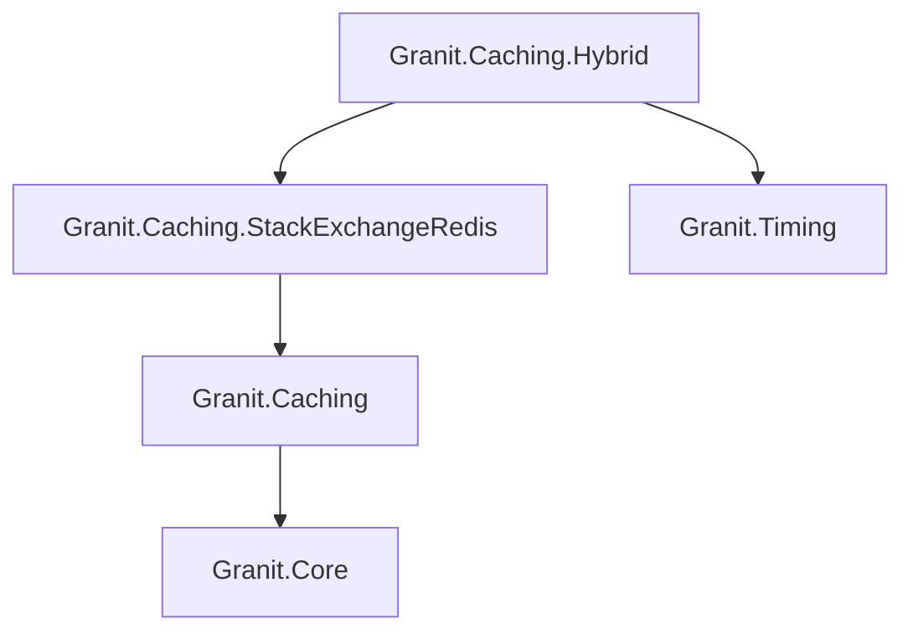
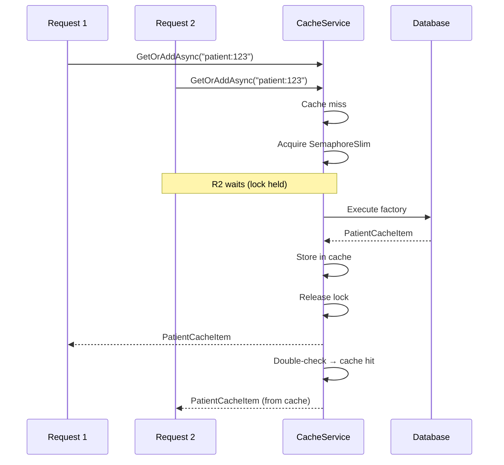

import { Tabs, TabItem, FileTree, Badge } from "@astrojs/starlight/components";

Granit.Caching provides a typed, provider-swappable cache layer. Same `ICacheService<T>`
interface whether you're using in-memory for dev, Redis for production, or HybridCache
(L1 memory + L2 Redis) for multi-pod Kubernetes deployments. Built-in stampede protection,
AES-256 encryption for GDPR-sensitive data, and convention-based key naming.

## Package structure

<FileTree>
- Granit.Caching/ Base abstractions, in-memory default, AES encryption
  - Granit.Caching.StackExchangeRedis/ Redis L2 provider, health checks
    - Granit.Caching.Hybrid HybridCache L1+L2 (memory + Redis)
</FileTree>

| Package | Role | Depends on |
|---------|------|------------|
| `Granit.Caching` | `ICacheService<T>`, stampede protection, encryption | `Granit.Core` |
| `Granit.Caching.StackExchangeRedis` | Redis provider, health check | `Granit.Caching` |
| `Granit.Caching.Hybrid` | HybridCache L1+L2 | `Granit.Caching.StackExchangeRedis`, `Granit.Timing` |

## Dependency graph



## Setup

<Tabs>
<TabItem label="Development (in-memory)">

```csharp
[DependsOn(typeof(GranitCachingModule))]
public class AppModule : GranitModule { }
```

No configuration needed. Uses `MemoryDistributedCache` internally.

</TabItem>
<TabItem label="Production (Redis)">

```csharp
[DependsOn(typeof(GranitCachingRedisModule))]
public class AppModule : GranitModule { }
```

```json
{
  "Cache": {
    "KeyPrefix": "myapp",
    "Redis": {
      "Configuration": "redis-service:6379",
      "InstanceName": "myapp:"
    }
  }
}
```

</TabItem>
<TabItem label="Kubernetes (HybridCache)">

```csharp
[DependsOn(typeof(GranitCachingHybridModule))]
public class AppModule : GranitModule { }
```

```json
{
  "Cache": {
    "KeyPrefix": "myapp",
    "EncryptValues": true,
    "Encryption": {
      "Key": "<base64-aes256-key-from-vault>"
    },
    "Redis": {
      "Configuration": "redis-service:6379",
      "InstanceName": "myapp:"
    },
    "Hybrid": {
      "LocalCacheExpiration": "00:00:30"
    }
  }
}
```

</TabItem>
</Tabs>

## ICacheService

The main abstraction — inject it with your cache item type:

```csharp
public class PatientCacheItem
{
    public Guid Id { get; set; }
    public string FullName { get; set; } = string.Empty;
    public DateOnly DateOfBirth { get; set; }
}

public class PatientService(
    ICacheService<PatientCacheItem, Guid> cache,
    AppDbContext db)
{
    public async Task<PatientCacheItem?> GetAsync(
        Guid id, CancellationToken cancellationToken)
    {
        return await cache.GetOrAddAsync(id, async ct =>
        {
            var patient = await db.Patients
                .Where(p => p.Id == id)
                .Select(p => new PatientCacheItem
                {
                    Id = p.Id,
                    FullName = $"{p.FirstName} {p.LastName}",
                    DateOfBirth = p.DateOfBirth
                })
                .FirstOrDefaultAsync(ct)
                .ConfigureAwait(false);

            return patient!;
        }, cancellationToken: cancellationToken)
        .ConfigureAwait(false);
    }
}
```

### Interface

```csharp
public interface ICacheService<TCacheItem>
{
    Task<TCacheItem?> GetAsync(string key, CancellationToken cancellationToken = default);
    Task<TCacheItem> GetOrAddAsync(string key,
        Func<CancellationToken, Task<TCacheItem>> factory,
        DistributedCacheEntryOptions? options = null,
        CancellationToken cancellationToken = default);
    Task SetAsync(string key, TCacheItem value,
        DistributedCacheEntryOptions? options = null,
        CancellationToken cancellationToken = default);
    Task RemoveAsync(string key, CancellationToken cancellationToken = default);
    Task RefreshAsync(string key, CancellationToken cancellationToken = default);
}
```

`ICacheService<TCacheItem, TKey>` adds overloads accepting `TKey` instead of `string`
(converted via `ToString()`).

## Key naming convention

Cache keys follow the pattern: `{KeyPrefix}:{CacheName}:{userKey}`

| Part | Source | Example |
|------|--------|---------|
| `KeyPrefix` | `CachingOptions.KeyPrefix` | `myapp` |
| `CacheName` | Type name (strips `CacheItem` suffix) or `[CacheName]` | `Patient` |
| `userKey` | Caller-provided | `d4e5f6a7-...` |

**Result:** `myapp:Patient:d4e5f6a7-...`

Override the convention with `[CacheName]`:

```csharp
[CacheName("PatientSummary")]
public class PatientSummaryCacheItem { /* ... */ }
// Key: myapp:PatientSummary:{userKey}
```

## Stampede protection

`GetOrAddAsync` guarantees **one factory execution** under concurrent requests:



SemaphoreSlim instances are stored in a dedicated `IMemoryCache` with `SizeLimit=10,000`
and auto-cleanup after 30 seconds.

:::note
HybridCache has native stampede protection built into .NET — the SemaphoreSlim
mechanism only applies to `DistributedCacheService`.
:::

## Encryption

AES-256-CBC encryption for GDPR-sensitive cached data. Each encryption operation
generates a random IV (16 bytes).

### Per-type control

```csharp
[CacheEncrypted]          // Always encrypt this type
public class PatientCacheItem { /* ... */ }

[CacheEncrypted(false)]   // Never encrypt (override global setting)
public class CountryCacheItem { /* ... */ }
```

**Priority:** `[CacheEncrypted]` attribute > `CachingOptions.EncryptValues` global flag.

:::caution
HybridCache does **not** support encryption — `HybridCache` manages L2 serialization
internally and provides no byte-level interception point. Use `DistributedCacheService`
(Redis without Hybrid) when encryption is required.
:::

## HybridCache (L1 + L2)

Two-tier cache for multi-pod Kubernetes deployments:

| Tier | Backend | Latency | Scope |
|------|---------|---------|-------|
| L1 | In-memory per pod | < 1 ms | Pod-local |
| L2 | Redis (shared) | ~ 2 ms | Cluster-wide |

```
Pod A: GetOrAddAsync("patient:123")
  L1 miss → L2 miss → DB query → store L1 (30s) + L2 (1h)

Pod B: GetOrAddAsync("patient:123")
  L1 miss → L2 hit → ~2ms

RemoveAsync on Pod A:
  Clears L2 + L1 on Pod A
  Pod B L1: expires within LocalCacheExpiration (30s)
```

The `LocalCacheExpiration` setting bounds the stale-data window between pods.

## Redis health check

```csharp
builder.Services.AddHealthChecks()
    .AddGranitRedisHealthCheck(degradedThreshold: TimeSpan.FromMilliseconds(100));
```

| Latency | Status | Effect |
|---------|--------|--------|
| < 100 ms | Healthy | Normal |
| >= 100 ms | Degraded | Pod stays in load balancer |
| Unreachable | Unhealthy | Pod removed from load balancer |

Tagged `["readiness"]` — integrates with Kubernetes readiness probes.

## Configuration reference

```json
{
  "Cache": {
    "KeyPrefix": "myapp",
    "DefaultAbsoluteExpirationRelativeToNow": "01:00:00",
    "DefaultSlidingExpiration": "00:20:00",
    "EncryptValues": false,
    "Encryption": {
      "Key": "<base64-aes256-key>"
    },
    "Redis": {
      "IsEnabled": true,
      "Configuration": "redis-service:6379",
      "InstanceName": "myapp:"
    },
    "Hybrid": {
      "LocalCacheExpiration": "00:00:30"
    }
  }
}
```

| Property | Default | Description |
|----------|---------|-------------|
| `KeyPrefix` | `"dd"` | Global key prefix |
| `DefaultAbsoluteExpirationRelativeToNow` | `01:00:00` | Default absolute TTL |
| `DefaultSlidingExpiration` | `00:20:00` | Default sliding TTL |
| `EncryptValues` | `false` | Global encryption flag |
| `Encryption.Key` | — | AES-256 key (base64, 32 bytes) |
| `Redis.IsEnabled` | `true` | Enable/disable Redis module |
| `Redis.Configuration` | `"localhost:6379"` | StackExchange.Redis connection string |
| `Redis.InstanceName` | `"dd:"` | Redis key prefix (app isolation) |
| `Hybrid.LocalCacheExpiration` | `00:00:30` | L1 memory TTL (stale-data window) |

## Public API summary

| Category | Key types | Package |
|----------|-----------|---------|
| Module | `GranitCachingModule`, `GranitCachingRedisModule`, `GranitCachingHybridModule` | — |
| Abstractions | `ICacheService<T>`, `ICacheService<T, TKey>`, `ICacheValueEncryptor` | `Granit.Caching` |
| Attributes | `[CacheName]`, `[CacheEncrypted]` | `Granit.Caching` |
| Options | `CachingOptions`, `CacheEncryptionOptions`, `RedisCachingOptions`, `HybridCachingOptions` | — |
| Extensions | `AddGranitCaching()`, `AddGranitCachingRedis()`, `AddGranitCachingHybrid()`, `AddGranitRedisHealthCheck()` | — |

## See also

- [Persistence module](/dotnet/data/persistence/) — EF Core interceptors, query filters
- [Security module](./authentication/) — Authorization permission cache uses `ICacheService`
- [API Reference](/api/Granit.Caching.html) (auto-generated from XML docs)
