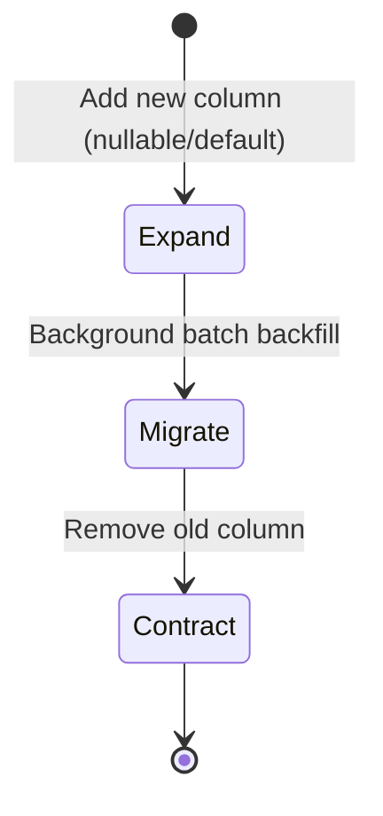

import { Tabs, TabItem } from "@astrojs/starlight/components";

Granit supports two migration strategies. Which one you need depends on a single
question: **can your application tolerate a brief downtime during deployment?**

| | Standard migrations | Expand & Contract |
|---|---|---|
| **When** | Single instance, maintenance window OK | Multiple replicas, zero downtime required |
| **How** | One migration, one deploy | Three phases across multiple deploys |
| **Complexity** | Low — standard EF Core workflow | Higher — requires batch backfill logic |
| **Package** | EF Core (built-in) | `Granit.Persistence.Migrations` |

Most applications start with standard migrations. Move to Expand & Contract only
when you need zero-downtime deployments with breaking schema changes.

## Standard migrations

This is the default EF Core migration workflow. One migration file per schema
change, applied at startup or via CI/CD.

### Creating a migration

```bash
dotnet ef migrations add AddPatientFullName \
    --project src/MyApp.Host \
    --context AppDbContext
```

EF Core compares the current model (from `OnModelCreating`) with the last snapshot
and generates the diff.

### Applying migrations

<Tabs>
<TabItem label="At startup (dev / staging)">

```csharp
// Program.cs — after builder.Build()
await using var scope = app.Services.CreateAsyncScope();
var factory = scope.ServiceProvider
    .GetRequiredService<IDbContextFactory<AppDbContext>>();
await using var db = await factory.CreateDbContextAsync();
await db.Database.MigrateAsync();
```

Simple, works with Testcontainers in integration tests, but blocks app startup
until migrations complete.

</TabItem>
<TabItem label="CI/CD (production)">

Generate an idempotent SQL script and apply it before deploying the new version:

```bash
dotnet ef migrations script --idempotent -o migrate.sql \
    --project src/MyApp.Host \
    --context AppDbContext
```

The `--idempotent` flag wraps each migration in an `IF NOT EXISTS` check — safe
to run multiple times.

</TabItem>
</Tabs>

### EF Core CLI reference

Common commands for working with migrations. When your solution has multiple
DbContexts, always specify `--context` to target the right one.

```bash
# Add a migration to a specific DbContext
dotnet ef migrations add AddSchedulingTables \
    --project src/MyApp.Host \
    --context AppDbContext \
    --output-dir Migrations/App

# Add a migration to a secondary DbContext
dotnet ef migrations add AddSecurityTables \
    --project src/MyApp.Host \
    --context SecurityDbContext \
    --output-dir Migrations/Security

# Apply pending migrations (specific context)
dotnet ef database update \
    --project src/MyApp.Host \
    --context AppDbContext

# Generate idempotent SQL script for CI/CD
dotnet ef migrations script --idempotent \
    --project src/MyApp.Host \
    --context AppDbContext \
    -o migrations/app.sql

# List pending migrations
dotnet ef migrations list \
    --project src/MyApp.Host \
    --context AppDbContext

# Remove the last unapplied migration
dotnet ef migrations remove \
    --project src/MyApp.Host \
    --context AppDbContext
```

:::tip[Multiple DbContexts]
Use `--output-dir` to keep migrations organized per DbContext. A typical
Granit application might have:

- `Migrations/App/` — business entities + Granit modules (Settings, Workflow, etc.)
- `Migrations/Security/` — Authorization, Identity, ApiKeys
:::

### When standard migrations are enough

Standard migrations handle most schema changes without issues:

- Adding a new table or column (nullable or with a default)
- Adding or removing an index
- Changing column constraints (max length, nullability)
- Dropping an unused column or table

These changes are **backwards-compatible** — the old application version can still
run against the new schema. A brief restart is all you need.

### When standard migrations break

Some changes require the old and new application versions to coexist during
deployment (rolling updates, blue/green, canary). Standard migrations fail here:

- **Renaming a column** — old code still references the old name
- **Changing a column type** — old code expects the old type
- **Splitting a column** — old code writes to the original, new code writes to the split
- **Backfilling computed data** — millions of rows cannot be updated in one transaction

These are the cases where Expand & Contract is necessary.

## Expand & Contract migrations

`Granit.Persistence.Migrations` implements the **Expand & Contract** pattern:
split a breaking change into three safe, backwards-compatible phases deployed
separately.

### Three phases



| Phase | What happens | Application behavior |
|-------|-------------|---------------------|
| **Expand** | `ALTER TABLE ADD COLUMN` (nullable) | Writes to both old and new columns |
| **Migrate** | Background batch backfill | Reads from new column with fallback to old |
| **Contract** | `ALTER TABLE DROP COLUMN` (old) | Reads/writes new column only |

Each phase is a separate EF Core migration, deployed independently. At no point
does the schema become incompatible with running application instances.

### Annotating migrations

```csharp
[MigrationCycle(MigrationPhase.Expand, "patient-fullname-v2")]
public partial class AddPatientFullName : Migration
{
    protected override void Up(MigrationBuilder migrationBuilder)
    {
        migrationBuilder.AddColumn<string>(
            "FullName", "Patients", nullable: true);
    }
}
```

### Batch processing

Register a batch delegate that backfills data in chunks:

```csharp
registry.Register<AppDbContext>(
    "patient-fullname-v2",
    async (context, batch, ct) =>
{
    var patients = await context.Set<Patient>()
        .Where(p => p.FullName == null)
        .OrderBy(p => p.Id)
        .Take(batch.Size)
        .ToListAsync(ct)
        .ConfigureAwait(false);

    foreach (var p in patients)
        p.FullName = $"{p.FirstName} {p.LastName}";

    await context.SaveChangesAsync(ct).ConfigureAwait(false);

    return new MigrationBatchResult(
        patients.Count,
        patients.Count < batch.Size
            ? null
            : patients[^1].Id.ToString());
});
```

Batch delegates must be **idempotent** — re-running over already-migrated rows
must have no side effects.

### Configuration

```json
{
  "GranitMigrations": {
    "DefaultBatchSize": 500,
    "BatchExecutionTimeout": "00:05:00"
  }
}
```

### Channel vs Wolverine dispatch

| | `Granit.Persistence.Migrations` | `+ .Wolverine` |
|---|---|---|
| Dispatch | In-memory `Channel<T>` | Durable outbox |
| Restart safety | Lost batches on crash | Survives restarts |
| Multi-instance | Single node only | Distributed |

Use `Granit.Persistence.Migrations.Wolverine` when batch processing must survive
application restarts or run across multiple nodes.

## See also

- [Persistence overview](./persistence/) — setup, isolated DbContext, host-owned migrations
- [Interceptors](./interceptors/) — audit, soft delete, concurrency, events
- [Query filters](./query-filters/) — named filters, runtime bypass, translations
