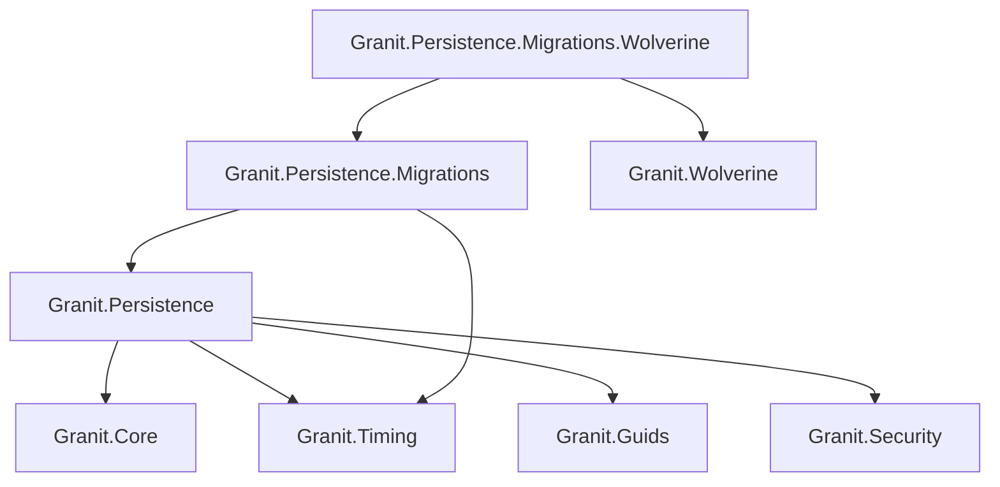
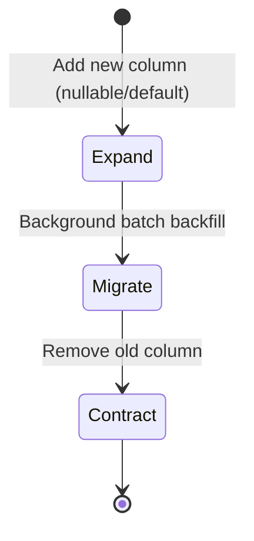

import { Tabs, TabItem, FileTree, Badge } from "@astrojs/starlight/components";

Granit.Persistence provides the data access layer for the framework. It automates
ISO 27001 audit trails, GDPR-compliant soft delete, domain event dispatching,
entity versioning, and multi-tenant query filtering — all through EF Core interceptors
and conventions. No manual `WHERE` clauses, no forgotten audit fields.

## Package structure

<FileTree>
- Granit.Persistence/ Base interceptors, conventions, data seeding
  - Granit.Persistence.Migrations Zero-downtime batch migrations (Expand & Contract)
  - Granit.Persistence.Migrations.Wolverine Durable outbox-backed migration dispatch
</FileTree>

| Package | Role | Depends on |
|---------|------|------------|
| `Granit.Persistence` | Interceptors, `ApplyGranitConventions`, data seeding | `Granit.Core`, `Granit.Timing`, `Granit.Guids`, `Granit.Security` |
| `Granit.Persistence.Migrations` | Expand & Contract migrations with batch processing | `Granit.Persistence`, `Granit.Timing` |
| `Granit.Persistence.Migrations.Wolverine` | Durable migration dispatch via Wolverine outbox | `Granit.Persistence.Migrations`, `Granit.Wolverine` |

## Dependency graph



## Setup

<Tabs>
<TabItem label="Base (interceptors only)">

```csharp
[DependsOn(typeof(GranitPersistenceModule))]
public class AppModule : GranitModule { }
```

Registers all four interceptors and `IDataFilter`.

</TabItem>
<TabItem label="With migrations">

```csharp
[DependsOn(typeof(GranitPersistenceMigrationsModule))]
public class AppModule : GranitModule
{
    public override void ConfigureServices(ServiceConfigurationContext context)
    {
        context.Services.AddGranitPersistenceMigrations(context.Builder, options =>
        {
            options.UseNpgsql(context.Configuration.GetConnectionString("Migrations"));
        });
    }
}
```

</TabItem>
<TabItem label="With Wolverine migrations">

```csharp
[DependsOn(typeof(GranitPersistenceMigrationsWolverineModule))]
public class AppModule : GranitModule { }
```

Replaces `Channel<T>` dispatcher with durable Wolverine outbox — no batch is lost on failure.

</TabItem>
</Tabs>

## Isolated DbContext pattern

Every `*.EntityFrameworkCore` package that owns a `DbContext` **must** follow this
checklist. No exceptions.

```csharp
public class AppointmentDbContext(
    DbContextOptions<AppointmentDbContext> options,
    ICurrentTenant? currentTenant = null,
    IDataFilter? dataFilter = null)
    : DbContext(options)
{
    public DbSet<Appointment> Appointments => Set<Appointment>();

    protected override void OnModelCreating(ModelBuilder modelBuilder)
    {
        base.OnModelCreating(modelBuilder);
        modelBuilder.ApplyConfigurationsFromAssembly(typeof(AppointmentDbContext).Assembly);

        // MANDATORY — applies all query filters (soft delete, multi-tenant, active, etc.)
        modelBuilder.ApplyGranitConventions(currentTenant, dataFilter);
    }
}
```

Registration in the module:

```csharp
public override void ConfigureServices(ServiceConfigurationContext context)
{
    context.Services.AddGranitDbContext<AppointmentDbContext>(options =>
    {
        options.UseNpgsql(context.Configuration.GetConnectionString("Default"));
    });
}
```

`AddGranitDbContext<T>` handles interceptor wiring automatically — it calls
`UseGranitInterceptors(sp)` internally with `ServiceLifetime.Scoped`.

:::danger
Never call `HasQueryFilter` manually in entity configurations.
`ApplyGranitConventions` handles all standard filters centrally.
Manual filters cause duplicates or conflicts.
:::

## Interceptors

Four interceptors execute on every `SaveChanges` call, in this order:

| Order | Interceptor | Behavior |
|-------|-------------|----------|
| 1 | `AuditedEntityInterceptor` | Populates `CreatedAt`, `CreatedBy`, `ModifiedAt`, `ModifiedBy`, auto-generates `Id`, injects `TenantId` |
| 2 | `VersioningInterceptor` | Sets `BusinessId` and `Version` on `IVersioned` entities |
| 3 | `DomainEventDispatcherInterceptor` | Collects domain events before save, dispatches after commit |
| 4 | `SoftDeleteInterceptor` | Converts `DELETE` to `UPDATE` for `ISoftDeletable` entities |

:::note
SoftDeleteInterceptor must be last — it changes `EntityState.Deleted` to
`EntityState.Modified`, which would prevent earlier interceptors from seeing
the original state.
:::

### AuditedEntityInterceptor

Resolves audit data from DI:
- **Who:** `ICurrentUserService.UserId` (falls back to `"system"`)
- **When:** `IClock.Now` (never `DateTime.UtcNow`)
- **Id:** `IGuidGenerator` (sequential GUIDs for clustered indexes)

| Entity state | Action |
|-------------|--------|
| `Added` | Sets `CreatedAt`, `CreatedBy`. Auto-generates `Id` if `Guid.Empty`. Injects `TenantId` if `IMultiTenant` and null. |
| `Modified` | Protects `CreatedAt`/`CreatedBy` from overwrite. Sets `ModifiedAt`, `ModifiedBy`. |

### SoftDeleteInterceptor

Converts physical DELETE to soft delete:

```
DELETE FROM Patients WHERE Id = @id
  ↓ intercepted ↓
UPDATE Patients SET IsDeleted = true, DeletedAt = @now, DeletedBy = @userId WHERE Id = @id
```

Only applies to entities implementing `ISoftDeletable`.

### DomainEventDispatcherInterceptor

Collects and dispatches domain events transactionally:

1. **SavingChanges** — scans change tracker for `IDomainEventSource` entities, collects events, clears event lists
2. **SavedChanges** — dispatches events after commit via `IDomainEventDispatcher`
3. **SaveChangesFailed** — discards events (transaction rolled back)

Uses `AsyncLocal<List<IDomainEvent>>` for thread safety across concurrent
`SaveChanges` calls in the same async flow.

Default dispatcher is `NullDomainEventDispatcher` (no-op). `Granit.Wolverine`
replaces it with real message bus dispatch.

### VersioningInterceptor

For `IVersioned` entities on `EntityState.Added`:
- Generates `BusinessId` if empty (first version of a new entity)
- Determines `Version` from change tracker (starting at 1)
- Modified entities are untouched — versioning is explicit (create a new entity with same `BusinessId`)

## Query filters

`ApplyGranitConventions` builds a **single combined** `HasQueryFilter` per entity
using expression trees. Five filter types, joined with `AND`:

| Interface | Filter expression | Default |
|-----------|------------------|---------|
| `ISoftDeletable` | `!e.IsDeleted` | Enabled |
| `IActive` | `e.IsActive` | Enabled |
| `IProcessingRestrictable` | `!e.IsProcessingRestricted` | Enabled |
| `IMultiTenant` | `e.TenantId == currentTenant.Id` | Enabled |
| `IPublishable` | `e.IsPublished` | Enabled |

Filters are re-evaluated per query via `DataFilter`'s `AsyncLocal` state — EF Core
extracts `FilterProxy` boolean properties as parameterized expressions.

### Runtime filter control

Use `IDataFilter` to selectively bypass filters:

```csharp
public class PatientAdminService(IDataFilter dataFilter, AppDbContext db)
{
    public async Task<List<Patient>> GetAllIncludingDeletedAsync(
        CancellationToken cancellationToken)
    {
        using (dataFilter.Disable<ISoftDeletable>())
        {
            return await db.Patients
                .ToListAsync(cancellationToken)
                .ConfigureAwait(false);
        }
        // Filter re-enabled automatically
    }
}
```

Scopes nest correctly — inner `Enable`/`Disable` calls restore the outer state
on disposal.

### Translation conventions

For entities implementing `ITranslatable<T>`, `ApplyGranitConventions` automatically
configures:
- Foreign key: `Translation.ParentId → Parent.Id` with cascade delete
- Unique index: `(ParentId, Culture)`
- Culture column: max length 20 (BCP 47)

Query extensions for translated entities:

```csharp
// Eager load translations for a culture
var patients = await db.Patients
    .IncludeTranslations<Patient, PatientTranslation>("fr")
    .ToListAsync(cancellationToken)
    .ConfigureAwait(false);

// Filter by translation property
var results = await db.Patients
    .WhereTranslation<Patient, PatientTranslation>("fr", t => t.DisplayName.Contains("Jean"))
    .ToListAsync(cancellationToken)
    .ConfigureAwait(false);
```

## Data seeding

Register seed contributors that run at application startup:

```csharp
public class CountryDataSeedContributor(AppDbContext db) : IDataSeedContributor
{
    public async Task SeedAsync(DataSeedContext context, CancellationToken cancellationToken)
    {
        if (await db.Countries.AnyAsync(cancellationToken).ConfigureAwait(false))
            return;

        db.Countries.AddRange(
            new Country { Code = "BE", Name = "Belgium" },
            new Country { Code = "FR", Name = "France" });

        await db.SaveChangesAsync(cancellationToken).ConfigureAwait(false);
    }
}
```

Register with `services.AddTransient<IDataSeedContributor, CountryDataSeedContributor>()`.

`DataSeedingHostedService` orchestrates all contributors at startup. Errors are logged
but do not block application start.

## Soft delete purging

Hard-delete soft-deleted records past retention (ISO 27001):

```csharp
await dbContext.PurgeSoftDeletedBeforeAsync<Patient>(
    cutoff: DateTimeOffset.UtcNow.AddYears(-3),
    batchSize: 1000,
    cancellationToken);
```

Uses `ExecuteDeleteAsync()` with `IgnoreQueryFilters()` — provider-agnostic,
bypasses interceptors.

## Multi-tenancy strategies

`Granit.Persistence` supports three tenant isolation topologies:

| Strategy | Isolation | Complexity | Use case |
|----------|----------|------------|----------|
| `SharedDatabase` | Query filter (`TenantId` column) | Low | Most applications |
| `SchemaPerTenant` | PostgreSQL schema per tenant | Medium | Stronger isolation, shared infra |
| `DatabasePerTenant` | Separate database per tenant | High | Maximum isolation, regulated data |

Configuration:

```json
{
  "TenantIsolation": {
    "Strategy": "SharedDatabase"
  },
  "TenantSchema": {
    "NamingConvention": "TenantId",
    "Prefix": "tenant_"
  }
}
```

Built-in schema activators: `PostgresqlTenantSchemaActivator`, `MySqlTenantSchemaActivator`,
`OracleTenantSchemaActivator`.

:::caution
Schema activators must execute on every connection open. Pooled connections
retain the previous tenant's schema — failing to reset is a data isolation
breach (ISO 27001).
:::

## Zero-downtime migrations

`Granit.Persistence.Migrations` implements the **Expand & Contract** pattern for
schema changes that would otherwise require downtime.

### Three phases



| Phase | EF Migration | Application |
|-------|-------------|-------------|
| **Expand** | `ALTER TABLE ADD COLUMN` (nullable) | Writes to both old and new columns |
| **Migrate** | Batch job backfills new column | Reads from new column with fallback |
| **Contract** | `ALTER TABLE DROP COLUMN` (old) | Reads/writes new column only |

### Annotating migrations

```csharp
[MigrationCycle(MigrationPhase.Expand, "patient-fullname-v2")]
public partial class AddPatientFullName : Migration
{
    protected override void Up(MigrationBuilder migrationBuilder)
    {
        migrationBuilder.AddColumn<string>("FullName", "Patients", nullable: true);
    }
}
```

### Batch processing

```csharp
registry.Register<AppDbContext>("patient-fullname-v2", async (context, batch, ct) =>
{
    var patients = await context.Set<Patient>()
        .Where(p => p.FullName == null)
        .OrderBy(p => p.Id)
        .Take(batch.Size)
        .ToListAsync(ct)
        .ConfigureAwait(false);

    foreach (var p in patients)
        p.FullName = $"{p.FirstName} {p.LastName}";

    await context.SaveChangesAsync(ct).ConfigureAwait(false);

    return new MigrationBatchResult(
        patients.Count,
        patients.Count < batch.Size ? null : patients[^1].Id.ToString());
});
```

Batch delegates must be **idempotent** — re-running over already-migrated rows
must have no side effects.

### Configuration

```json
{
  "GranitMigrations": {
    "DefaultBatchSize": 500,
    "BatchExecutionTimeout": "00:05:00"
  }
}
```

### Channel vs Wolverine dispatch

| | `Granit.Persistence.Migrations` | `+ .Wolverine` |
|---|---|---|
| Dispatch | In-memory `Channel<T>` | Durable outbox |
| Restart safety | Lost batches on crash | Survives restarts |
| Multi-instance | Single node only | Distributed |

With Wolverine, the handler returns `object[]` — empty to stop, or `[nextCommand]`
to cascade to the next batch via the durable outbox.

## Public API summary

| Category | Key types | Package |
|----------|-----------|---------|
| Module | `GranitPersistenceModule` | `Granit.Persistence` |
| Interceptors | `AuditedEntityInterceptor`, `SoftDeleteInterceptor`, `DomainEventDispatcherInterceptor`, `VersioningInterceptor` | `Granit.Persistence` |
| Extensions | `AddGranitPersistence()`, `AddGranitDbContext<T>()`, `UseGranitInterceptors()`, `ApplyGranitConventions()` | `Granit.Persistence` |
| Data seeding | `IDataSeeder`, `IDataSeedContributor`, `DataSeedContext` | `Granit.Persistence` |
| Purging | `ISoftDeletePurgeTarget`, `PurgeSoftDeletedBeforeAsync()` | `Granit.Persistence` |
| Query extensions | `IncludeTranslations()`, `WhereTranslation()`, `OrderByTranslation()` | `Granit.Persistence` |
| Multi-tenancy | `TenantIsolationStrategy`, `ITenantSchemaProvider`, `ITenantConnectionStringProvider`, `ITenantSchemaActivator` | `Granit.Persistence` |
| Migrations | `MigrationPhase`, `MigrationCycleAttribute`, `IMigrationCycleRegistry`, `BatchMigrationDelegate` | `Granit.Persistence.Migrations` |
| Migration dispatch | `IMigrationBatchDispatcher`, `RunMigrationBatchCommand` | `Granit.Persistence.Migrations` |
| Wolverine dispatch | `GranitPersistenceMigrationsWolverineModule` | `Granit.Persistence.Migrations.Wolverine` |

## See also

- [Core module](./core/) — domain base types, filter interfaces, `IDataFilter`
- [Multi-tenancy concept](../../concepts/multi-tenancy.md) — isolation strategies in depth
- [Security module](./security/) — `ICurrentUserService` that feeds audit fields
- [Wolverine module](./wolverine/) — domain event dispatch and durable messaging
- [API Reference](/api/Granit.Persistence.html) (auto-generated from XML docs)
