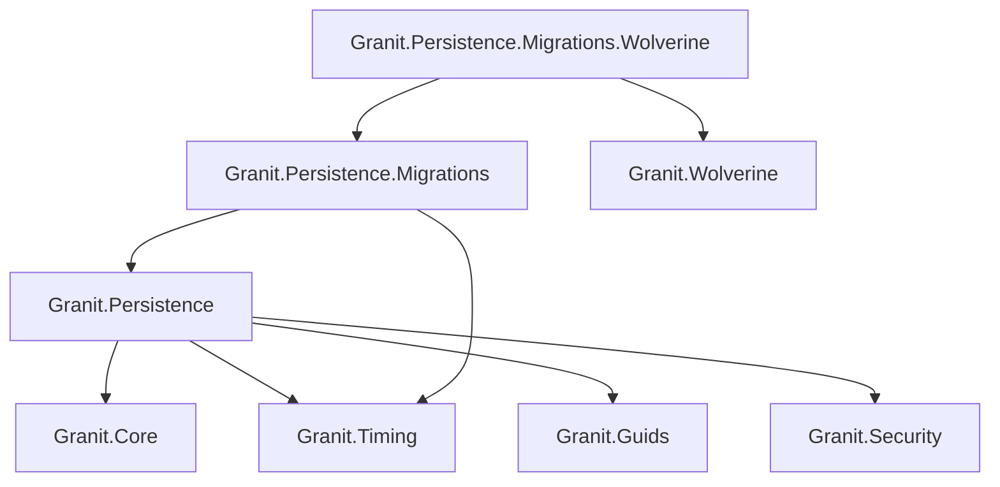
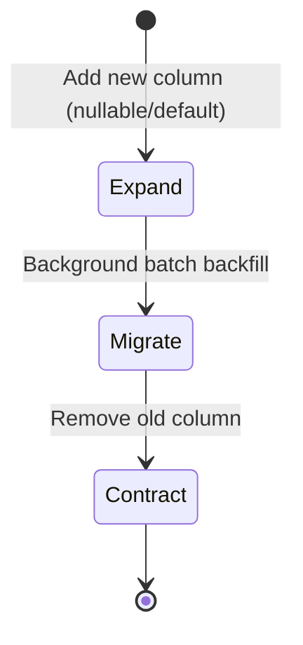

import { Tabs, TabItem, FileTree, Badge } from "@astrojs/starlight/components";

Granit.Persistence provides the data access layer for the framework. It automates
ISO 27001 audit trails, GDPR-compliant soft delete, optimistic concurrency control,
domain event dispatching, entity versioning, and multi-tenant query filtering — all
through EF Core interceptors and conventions. No manual `WHERE` clauses, no forgotten
audit fields, no silent data overwrites.

## Package structure

<FileTree>
- Granit.Persistence/ Base interceptors, conventions, data seeding
  - Granit.Persistence.Migrations Zero-downtime batch migrations (Expand & Contract)
  - Granit.Persistence.Migrations.Wolverine Durable outbox-backed migration dispatch
</FileTree>

| Package | Role | Depends on |
|---------|------|------------|
| `Granit.Persistence` | Interceptors, `ApplyGranitConventions`, data seeding | `Granit.Core`, `Granit.Timing`, `Granit.Guids`, `Granit.Security` |
| `Granit.Persistence.Migrations` | Expand & Contract migrations with batch processing | `Granit.Persistence`, `Granit.Timing` |
| `Granit.Persistence.Migrations.Wolverine` | Durable migration dispatch via Wolverine outbox | `Granit.Persistence.Migrations`, `Granit.Wolverine` |

## Dependency graph



## Setup

<Tabs>
<TabItem label="Base (interceptors only)">

```csharp
[DependsOn(typeof(GranitPersistenceModule))]
public class AppModule : GranitModule { }
```

Registers all five interceptors and `IDataFilter`.

</TabItem>
<TabItem label="With migrations">

```csharp
[DependsOn(typeof(GranitPersistenceMigrationsModule))]
public class AppModule : GranitModule
{
    public override void ConfigureServices(ServiceConfigurationContext context)
    {
        context.Services.AddGranitPersistenceMigrations(context.Builder, options =>
        {
            options.UseNpgsql(context.Configuration.GetConnectionString("Migrations"));
        });
    }
}
```

</TabItem>
<TabItem label="With Wolverine migrations">

```csharp
[DependsOn(typeof(GranitPersistenceMigrationsWolverineModule))]
public class AppModule : GranitModule { }
```

Replaces `Channel<T>` dispatcher with durable Wolverine outbox — no batch is lost on failure.

</TabItem>
</Tabs>

## Isolated DbContext pattern

Every `*.EntityFrameworkCore` package that owns a `DbContext` **must** follow this
checklist. No exceptions.

```csharp
public class AppointmentDbContext(
    DbContextOptions<AppointmentDbContext> options,
    ICurrentTenant? currentTenant = null,
    IDataFilter? dataFilter = null)
    : DbContext(options)
{
    public DbSet<Appointment> Appointments => Set<Appointment>();

    protected override void OnModelCreating(ModelBuilder modelBuilder)
    {
        base.OnModelCreating(modelBuilder);
        modelBuilder.ApplyConfigurationsFromAssembly(typeof(AppointmentDbContext).Assembly);

        // MANDATORY — applies all query filters (soft delete, multi-tenant, active, etc.)
        modelBuilder.ApplyGranitConventions(currentTenant, dataFilter);
    }
}
```

Registration in the module:

```csharp
public override void ConfigureServices(ServiceConfigurationContext context)
{
    context.Services.AddGranitDbContext<AppointmentDbContext>(options =>
    {
        options.UseNpgsql(context.Configuration.GetConnectionString("Default"));
    });
}
```

`AddGranitDbContext<T>` handles interceptor wiring automatically — it calls
`UseGranitInterceptors(sp)` internally with `ServiceLifetime.Scoped`.

:::danger
Never call `HasQueryFilter` manually in entity configurations.
`ApplyGranitConventions` handles all standard filters centrally.
Manual filters cause duplicates or conflicts.
:::

## Interceptors

Five interceptors execute on every `SaveChanges` call, in this order:

| Order | Interceptor | Behavior |
|-------|-------------|----------|
| 1 | `AuditedEntityInterceptor` | Populates `CreatedAt`, `CreatedBy`, `ModifiedAt`, `ModifiedBy`, auto-generates `Id`, injects `TenantId` |
| 2 | `VersioningInterceptor` | Sets `BusinessId` and `Version` on `IVersioned` entities |
| 3 | `ConcurrencyStampInterceptor` | Regenerates `ConcurrencyStamp` on `IConcurrencyAware` entities |
| 4 | `DomainEventDispatcherInterceptor` | Collects domain events before save, dispatches after commit |
| 5 | `SoftDeleteInterceptor` | Converts `DELETE` to `UPDATE` for `ISoftDeletable` entities |

:::note
SoftDeleteInterceptor must be last — it changes `EntityState.Deleted` to
`EntityState.Modified`, which would prevent earlier interceptors from seeing
the original state.
:::

### AuditedEntityInterceptor

Resolves audit data from DI:
- **Who:** `ICurrentUserService.UserId` (falls back to `"system"`)
- **When:** `IClock.Now` (never `DateTime.UtcNow`)
- **Id:** `IGuidGenerator` (sequential GUIDs for clustered indexes)

| Entity state | Action |
|-------------|--------|
| `Added` | Sets `CreatedAt`, `CreatedBy`. Auto-generates `Id` if `Guid.Empty`. Injects `TenantId` if `IMultiTenant` and null. |
| `Modified` | Protects `CreatedAt`/`CreatedBy` from overwrite. Sets `ModifiedAt`, `ModifiedBy`. |

:::caution[ExecuteUpdate bypasses this interceptor]
`ExecuteUpdate()` and `ExecuteUpdateAsync()` emit a raw SQL `UPDATE` and never
reach `AuditedEntityInterceptor`. Set `ModifiedAt`, `ModifiedBy`, and `TenantId`
explicitly in the `setPropertyCalls` expression, or use the change tracker.

```csharp
// ❌ Bypasses interceptor — audit fields not set
await db.Patients
    .Where(p => p.TenantId == tenantId)
    .ExecuteUpdateAsync(s => s.SetProperty(p => p.Status, status), ct);

// ✅ Correct — include audit fields explicitly
await db.Patients
    .Where(p => p.TenantId == tenantId)
    .ExecuteUpdateAsync(s => s
        .SetProperty(p => p.Status, status)
        .SetProperty(p => p.ModifiedAt, clock.Now)
        .SetProperty(p => p.ModifiedBy, currentUser.UserId), ct);
```
:::

### SoftDeleteInterceptor

Converts physical DELETE to soft delete:

```
DELETE FROM Patients WHERE Id = @id
  ↓ intercepted ↓
UPDATE Patients SET IsDeleted = true, DeletedAt = @now, DeletedBy = @userId WHERE Id = @id
```

Only applies to entities implementing `ISoftDeletable`.

:::caution[ExecuteDelete bypasses this interceptor]
`ExecuteDelete()` and `ExecuteDeleteAsync()` emit a raw SQL `DELETE` and never
reach `SoftDeleteInterceptor`. Use `ExecuteUpdate()` with explicit `IsDeleted`,
`DeletedAt`, and `DeletedBy` assignments instead, or load the entity and call
`DbContext.Remove()`.

```csharp
// ❌ Bypasses interceptor — performs a physical DELETE
await db.Patients.Where(p => p.Id == id).ExecuteDeleteAsync(ct);

// ✅ Correct — soft delete via interceptor
var patient = await db.Patients.FindAsync(id, ct);
db.Remove(patient!);
await db.SaveChangesAsync(ct);

// ✅ Also correct — explicit soft delete via ExecuteUpdate
await db.Patients
    .Where(p => p.Id == id)
    .ExecuteUpdateAsync(s => s
        .SetProperty(p => p.IsDeleted, true)
        .SetProperty(p => p.DeletedAt, clock.Now)
        .SetProperty(p => p.DeletedBy, currentUser.UserId), ct);
```
:::

### DomainEventDispatcherInterceptor

Collects and dispatches domain events transactionally:

1. **SavingChanges** — scans change tracker for `IDomainEventSource` entities, collects events, clears event lists
2. **SavedChanges** — dispatches events after commit via `IDomainEventDispatcher`
3. **SaveChangesFailed** — discards events (transaction rolled back)

Uses `AsyncLocal<List<IDomainEvent>>` for thread safety across concurrent
`SaveChanges` calls in the same async flow.

Default dispatcher is `NullDomainEventDispatcher` (no-op). `Granit.Wolverine`
replaces it with real message bus dispatch.

### VersioningInterceptor

For `IVersioned` entities on `EntityState.Added`:
- Generates `BusinessId` if empty (first version of a new entity)
- Determines `Version` from change tracker (starting at 1)
- Modified entities are untouched — versioning is explicit (create a new entity with same `BusinessId`)

### ConcurrencyStampInterceptor

Prevents silent data loss from concurrent writes. When two users load the same
entity and both save changes, the second write fails instead of overwriting the first.

Targets entities implementing `IConcurrencyAware`:

```csharp
public class Order : AuditedEntity, IConcurrencyAware
{
    public string Reference { get; set; } = string.Empty;
    public OrderStatus Status { get; set; }
    public string ConcurrencyStamp { get; set; } = string.Empty;
}
```

| Entity state | Action |
|-------------|--------|
| `Added` | Sets `ConcurrencyStamp` to a new GUID string |
| `Modified` | Regenerates `ConcurrencyStamp` with a new GUID string |

`ApplyGranitConventions` auto-discovers `IConcurrencyAware` entities and configures
`ConcurrencyStamp` as an EF Core concurrency token (`VARCHAR(36)`,
`.IsConcurrencyToken()`). No manual Fluent API configuration needed.

EF Core includes the stamp in the `WHERE` clause on update:

```sql
UPDATE Orders
SET Status = @newStatus, ConcurrencyStamp = @newStamp
WHERE Id = @id AND ConcurrencyStamp = @originalStamp
```

If the stamp in the database differs from the original value loaded by the entity,
EF Core throws `DbUpdateConcurrencyException` — mapped to **HTTP 409 Conflict**
by `EfCoreExceptionStatusCodeMapper`.

#### Connected vs disconnected updates

**Connected** — entity loaded from the same `DbContext`. EF Core tracks
`OriginalValue` automatically; nothing extra to do:

```csharp
var order = await db.Orders.FindAsync(orderId, ct);
order!.Status = OrderStatus.Confirmed;
await db.SaveChangesAsync(ct); // stamp checked automatically
```

**Disconnected** (CQRS command, new `DbContext`) — the frontend sends the stamp it
received in the GET response. You must set `OriginalValue` explicitly before saving:

```csharp
var order = await db.Orders.FindAsync(request.Id, ct);
order!.Status = request.NewStatus;

// Tell EF Core what the client believes the current stamp is
db.Entry(order).Property(e => e.ConcurrencyStamp).OriginalValue = request.ConcurrencyStamp;

await db.SaveChangesAsync(ct); // throws DbUpdateConcurrencyException on mismatch
```

Use `IConcurrencyStampRequest` as a DTO convention:

```csharp
public sealed record UpdateOrderStatusRequest(
    Guid Id,
    OrderStatus NewStatus,
    string ConcurrencyStamp) : IConcurrencyStampRequest;
```

:::caution[ExecuteUpdate bypasses this interceptor]
`ExecuteUpdateAsync()` emits raw SQL and never reaches `ConcurrencyStampInterceptor`.
The concurrency stamp is **not** regenerated and **not** checked. Use the change
tracker for entities that need optimistic concurrency protection.
:::

:::tip[When to use IConcurrencyAware]
Add `IConcurrencyAware` to entities where concurrent modifications are likely and
data loss is unacceptable: orders, payments, appointments, inventory, shared
configuration. For read-heavy entities that rarely conflict, the overhead is
negligible but unnecessary.
:::

## Query filters

`ApplyGranitConventions` registers one **named** `HasQueryFilter` per applicable
interface on each entity type (EF Core 10). Filters are independent — bypass one
without affecting the others.

| Interface | Filter key (`GranitFilterNames`) | Filter expression | Default |
|-----------|----------------------------------|------------------|---------|
| `ISoftDeletable` | `SoftDelete` | `!e.IsDeleted` | Enabled |
| `IActive` | `Active` | `e.IsActive` | Enabled |
| `IProcessingRestrictable` | `ProcessingRestrictable` | `!e.IsProcessingRestricted` | Enabled |
| `IMultiTenant` | `MultiTenant` | `e.TenantId == currentTenant.Id` | Enabled |
| `IPublishable` | `Publishable` | `e.IsPublished` | Enabled |

Filters are re-evaluated per query via `DataFilter`'s `AsyncLocal` state — EF Core
extracts `FilterProxy` boolean properties as parameterized expressions.

### Runtime filter control — service scope

Use `IDataFilter` to bypass a filter for all queries in the current async flow:

```csharp
public class PatientAdminService(IDataFilter dataFilter, AppDbContext db)
{
    public async Task<List<Patient>> GetAllIncludingDeletedAsync(
        CancellationToken cancellationToken)
    {
        using (dataFilter.Disable<ISoftDeletable>())
        {
            return await db.Patients
                .ToListAsync(cancellationToken)
                .ConfigureAwait(false);
        }
        // Filter re-enabled automatically
    }
}
```

Scopes nest correctly — inner `Enable`/`Disable` calls restore the outer state
on disposal.

### Per-query bypass (EF Core 10)

Use `IgnoreQueryFilters` with one or more filter keys to bypass specific filters
for a single query, without affecting other queries in the same flow:

```csharp
// Bypass only soft delete — multi-tenant and other filters still apply
var deletedPatients = await db.Patients
    .IgnoreQueryFilters([GranitFilterNames.SoftDelete])
    .Where(p => p.IsDeleted)
    .ToListAsync(cancellationToken)
    .ConfigureAwait(false);

// Bypass all named filters (equivalent to IgnoreQueryFilters() without args)
var allPatients = await db.Patients
    .IgnoreQueryFilters([
        GranitFilterNames.SoftDelete,
        GranitFilterNames.MultiTenant])
    .ToListAsync(cancellationToken)
    .ConfigureAwait(false);
```

### Translation conventions

For entities implementing `ITranslatable<T>`, `ApplyGranitConventions` automatically
configures:
- Foreign key: `Translation.ParentId → Parent.Id` with cascade delete
- Unique index: `(ParentId, Culture)`
- Culture column: max length 20 (BCP 47)

Query extensions for translated entities:

```csharp
// Eager load translations for a culture
var patients = await db.Patients
    .IncludeTranslations<Patient, PatientTranslation>("fr")
    .ToListAsync(cancellationToken)
    .ConfigureAwait(false);

// Filter by translation property
var results = await db.Patients
    .WhereTranslation<Patient, PatientTranslation>("fr", t => t.DisplayName.Contains("Jean"))
    .ToListAsync(cancellationToken)
    .ConfigureAwait(false);
```

## Data seeding

Register seed contributors that run at application startup:

```csharp
public class CountryDataSeedContributor(AppDbContext db) : IDataSeedContributor
{
    public async Task SeedAsync(DataSeedContext context, CancellationToken cancellationToken)
    {
        if (await db.Countries.AnyAsync(cancellationToken).ConfigureAwait(false))
            return;

        db.Countries.AddRange(
            new Country { Code = "BE", Name = "Belgium" },
            new Country { Code = "FR", Name = "France" });

        await db.SaveChangesAsync(cancellationToken).ConfigureAwait(false);
    }
}
```

Register with `services.AddTransient<IDataSeedContributor, CountryDataSeedContributor>()`.

`DataSeedingHostedService` orchestrates all contributors at startup. Errors are logged
but do not block application start.

## Soft delete purging

Hard-delete soft-deleted records past retention (ISO 27001):

```csharp
await dbContext.PurgeSoftDeletedBeforeAsync<Patient>(
    cutoff: DateTimeOffset.UtcNow.AddYears(-3),
    batchSize: 1000,
    cancellationToken);
```

Uses `ExecuteDeleteAsync()` with `IgnoreQueryFilters()` — provider-agnostic,
bypasses interceptors.

## Multi-tenancy strategies

`Granit.Persistence` supports three tenant isolation topologies:

| Strategy | Isolation | Complexity | Use case |
|----------|----------|------------|----------|
| `SharedDatabase` | Query filter (`TenantId` column) | Low | Most applications |
| `SchemaPerTenant` | PostgreSQL schema per tenant | Medium | Stronger isolation, shared infra |
| `DatabasePerTenant` | Separate database per tenant | High | Maximum isolation, regulated data |

Configuration:

```json
{
  "TenantIsolation": {
    "Strategy": "SharedDatabase"
  },
  "TenantSchema": {
    "NamingConvention": "TenantId",
    "Prefix": "tenant_"
  }
}
```

Built-in schema activators: `PostgresqlTenantSchemaActivator`, `MySqlTenantSchemaActivator`,
`OracleTenantSchemaActivator`.

:::caution
Schema activators must execute on every connection open. Pooled connections
retain the previous tenant's schema — failing to reset is a data isolation
breach (ISO 27001).
:::

## Zero-downtime migrations

`Granit.Persistence.Migrations` implements the **Expand & Contract** pattern for
schema changes that would otherwise require downtime.

### Three phases



| Phase | EF Migration | Application |
|-------|-------------|-------------|
| **Expand** | `ALTER TABLE ADD COLUMN` (nullable) | Writes to both old and new columns |
| **Migrate** | Batch job backfills new column | Reads from new column with fallback |
| **Contract** | `ALTER TABLE DROP COLUMN` (old) | Reads/writes new column only |

### Annotating migrations

```csharp
[MigrationCycle(MigrationPhase.Expand, "patient-fullname-v2")]
public partial class AddPatientFullName : Migration
{
    protected override void Up(MigrationBuilder migrationBuilder)
    {
        migrationBuilder.AddColumn<string>("FullName", "Patients", nullable: true);
    }
}
```

### Batch processing

```csharp
registry.Register<AppDbContext>("patient-fullname-v2", async (context, batch, ct) =>
{
    var patients = await context.Set<Patient>()
        .Where(p => p.FullName == null)
        .OrderBy(p => p.Id)
        .Take(batch.Size)
        .ToListAsync(ct)
        .ConfigureAwait(false);

    foreach (var p in patients)
        p.FullName = $"{p.FirstName} {p.LastName}";

    await context.SaveChangesAsync(ct).ConfigureAwait(false);

    return new MigrationBatchResult(
        patients.Count,
        patients.Count < batch.Size ? null : patients[^1].Id.ToString());
});
```

Batch delegates must be **idempotent** — re-running over already-migrated rows
must have no side effects.

### Configuration

```json
{
  "GranitMigrations": {
    "DefaultBatchSize": 500,
    "BatchExecutionTimeout": "00:05:00"
  }
}
```

### Channel vs Wolverine dispatch

| | `Granit.Persistence.Migrations` | `+ .Wolverine` |
|---|---|---|
| Dispatch | In-memory `Channel<T>` | Durable outbox |
| Restart safety | Lost batches on crash | Survives restarts |
| Multi-instance | Single node only | Distributed |

With Wolverine, the handler returns `object[]` — empty to stop, or `[nextCommand]`
to cascade to the next batch via the durable outbox.

## Public API summary

| Category | Key types | Package |
|----------|-----------|---------|
| Module | `GranitPersistenceModule` | `Granit.Persistence` |
| Interceptors | `AuditedEntityInterceptor`, `VersioningInterceptor`, `ConcurrencyStampInterceptor`, `DomainEventDispatcherInterceptor`, `SoftDeleteInterceptor` | `Granit.Persistence` |
| Extensions | `AddGranitPersistence()`, `AddGranitDbContext<T>()`, `UseGranitInterceptors()`, `ApplyGranitConventions()` | `Granit.Persistence` |
| Data seeding | `IDataSeeder`, `IDataSeedContributor`, `DataSeedContext` | `Granit.Persistence` |
| Purging | `ISoftDeletePurgeTarget`, `PurgeSoftDeletedBeforeAsync()` | `Granit.Persistence` |
| Query extensions | `IncludeTranslations()`, `WhereTranslation()`, `OrderByTranslation()` | `Granit.Persistence` |
| Multi-tenancy | `TenantIsolationStrategy`, `ITenantSchemaProvider`, `ITenantConnectionStringProvider`, `ITenantSchemaActivator` | `Granit.Persistence` |
| Migrations | `MigrationPhase`, `MigrationCycleAttribute`, `IMigrationCycleRegistry`, `BatchMigrationDelegate` | `Granit.Persistence.Migrations` |
| Migration dispatch | `IMigrationBatchDispatcher`, `RunMigrationBatchCommand` | `Granit.Persistence.Migrations` |
| Wolverine dispatch | `GranitPersistenceMigrationsWolverineModule` | `Granit.Persistence.Migrations.Wolverine` |

## Common pitfalls

:::caution[Forgetting `ApplyGranitConventions`]
If your `DbContext.OnModelCreating` does not call `modelBuilder.ApplyGranitConventions(...)`,
**no query filters** (soft delete, multi-tenancy, active, publishable) are applied.
Entities will appear unfiltered — including soft-deleted and other-tenant data. This is
the #1 cause of "I see deleted records" bugs.
:::

:::caution[`ExecuteUpdate` / `ExecuteDelete` bypass interceptors]
EF Core bulk operations (`ExecuteUpdateAsync`, `ExecuteDeleteAsync`) bypass
`SaveChangesInterceptor`. This means:
- `SoftDeleteInterceptor` is **not** called — records are **hard-deleted**
- `AuditedEntityInterceptor` is **not** called — `ModifiedAt`/`ModifiedBy` are not set
- Domain events are **not** dispatched

Use these operations only for data migrations or batch cleanup, never for business logic.
:::

:::caution[EF InMemory does not apply value converters]
`UseInMemoryDatabase()` ignores `HasConversion<>()` — this affects `[Encrypted]` fields,
enum-to-string conversions, and JSON columns. Always use SQLite or Testcontainers
(PostgreSQL) for tests that depend on converters or query filters.
:::

:::caution[Named vs unnamed query filters]
Never use `HasQueryFilter(expr)` (unnamed) — it silently **replaces** any existing
filter on the entity. Always use `HasQueryFilter(name, expr)` (EF Core 10 named
filters) so filters compose instead of overwriting. `ApplyGranitConventions` already
registers standard filters with names from `GranitFilterNames`.
:::

## Testing persistence

For unit tests that need query filters and interceptors, use SQLite in-memory:

```csharp
[Fact]
public async Task Soft_deleted_entities_are_filtered_out()
{
    // Arrange
    await using var context = CreateSqliteContext<PatientDbContext>();
    var patient = new Patient { Name = "Jane Doe" };
    context.Patients.Add(patient);
    await context.SaveChangesAsync();

    // Act — soft delete
    patient.IsDeleted = true;
    await context.SaveChangesAsync();

    // Assert — filtered by default
    var patients = await context.Patients.ToListAsync();
    patients.ShouldBeEmpty();

    // Assert — visible when filter is disabled
    var all = await context.Patients.IgnoreQueryFilters().ToListAsync();
    all.Count.ShouldBe(1);
}
```

For concurrency conflict tests, use SQLite (the InMemory provider does not enforce
concurrency tokens):

```csharp
[Fact]
public async Task Concurrent_modification_throws_DbUpdateConcurrencyException()
{
    // Arrange — create entity via context1
    await using var context1 = CreateSqliteContext<OrderDbContext>();
    var order = new Order { Reference = "ORD-001" };
    context1.Orders.Add(order);
    await context1.SaveChangesAsync();

    // Load the same entity in context2
    await using var context2 = CreateSqliteContext<OrderDbContext>(ensureCreated: false);
    var sameOrder = await context2.Orders.FindAsync(order.Id);

    // Modify and save via context1 — stamp changes in DB
    order.Status = OrderStatus.Confirmed;
    await context1.SaveChangesAsync();

    // Act — context2 still has the old stamp
    sameOrder!.Status = OrderStatus.Cancelled;
    await Should.ThrowAsync<DbUpdateConcurrencyException>(
        () => context2.SaveChangesAsync());
}
```

For integration tests with real PostgreSQL, use Testcontainers to get full fidelity
(JSON columns, concurrent transactions, schema isolation).

## See also

- [Adding Persistence guide](/dotnet/getting-started/adding-persistence/) — step-by-step tutorial for new projects
- [Core module](../core/module-system/) — domain base types, filter interfaces, `IDataFilter`
- [Multi-tenancy concept](../../concepts/multi-tenancy.md) — isolation strategies in depth
- [Security module](./authentication/) — `ICurrentUserService` that feeds audit fields
- [Wolverine module](/dotnet/infrastructure/wolverine/) — domain event dispatch and durable messaging
- [API Reference](/api/Granit.Persistence.html) (auto-generated from XML docs)
