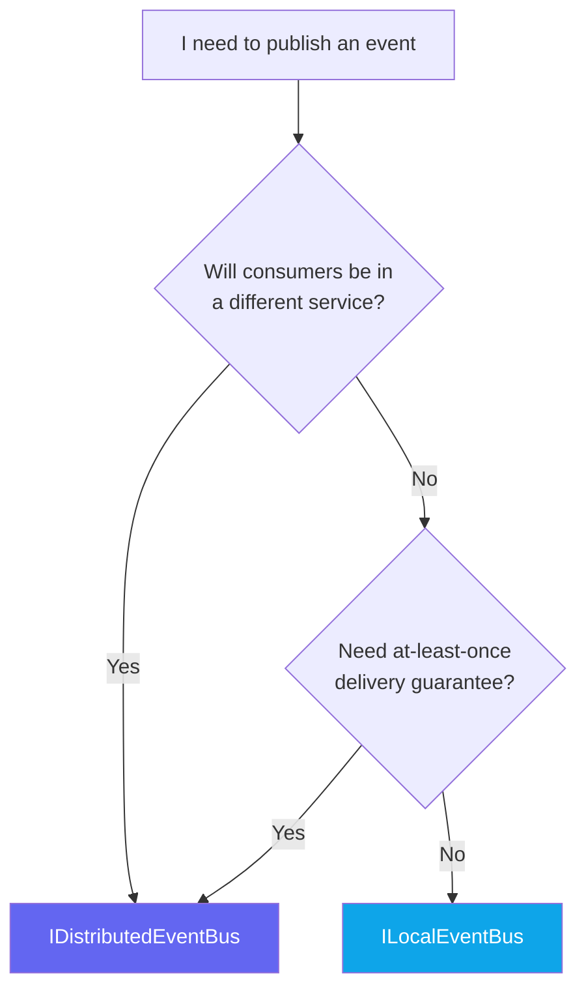
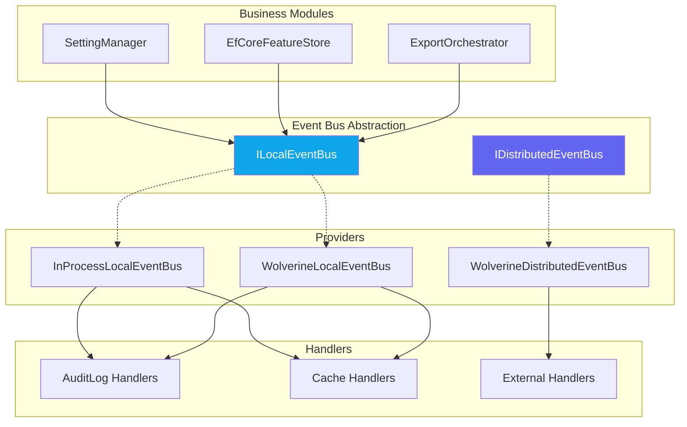

import { Tabs, TabItem, FileTree } from "@astrojs/starlight/components";

Granit provides a dual event bus inspired by
[ABP Framework](https://abp.io/docs/latest/framework/infrastructure/event-bus):
a **local bus** for in-process events and a **distributed bus** for cross-service
integration events. Both are provider-agnostic — swap transport without changing
business code.

## Package structure

<FileTree>
- Granit.Core/Events/ Abstractions (ILocalEventBus, IDistributedEventBus)
- Granit.EventBus/ Default in-process providers
  - Granit.EventBus.Wolverine/ Wolverine-backed providers (outbox, durable)
</FileTree>

| Package | Role | When to use |
| ------- | ---- | ----------- |
| `Granit.Core` | `ILocalEventBus`, `IDistributedEventBus` interfaces | Always available (no extra dep) |
| `Granit.EventBus` | `InProcessLocalEventBus`, `InProcessDistributedEventBus` | Monoliths, tests, dev |
| `Granit.EventBus.Wolverine` | `WolverineLocalEventBus`, `WolverineDistributedEventBus` | Production with outbox |

## Local vs Distributed — when to use which?



### Comparison table

| Aspect | `ILocalEventBus` | `IDistributedEventBus` |
| ------ | ----------------- | ---------------------- |
| **Scope** | Same process | Cross-process, cross-service |
| **TEvent constraint** | `class` (any) | `IIntegrationEvent` (serializable DTO) |
| **Delivery** | Synchronous, in-process | At-least-once via provider |
| **Ordering** | Guaranteed (sequential) | Not guaranteed |
| **Retry** | No (exception propagated) | Yes (provider-dependent) |
| **Serialization** | No (same CLR) | Yes (JSON) |
| **Survives crash** | No | Yes (outbox) |
| **Default provider** | `InProcessLocalEventBus` | `InProcessDistributedEventBus` (dev only) |
| **Wolverine provider** | `WolverineLocalEventBus` | `WolverineDistributedEventBus` |

### Typical use cases

| Use case | Bus | Why |
| -------- | --- | --- |
| Cache invalidation | Local | Same process, synchronous |
| Audit trail persistence | Local | Same bounded context |
| Setting/feature flag change logging | Local | In-process handler |
| Import/export job completion notification | Local | Same service (for now) |
| Cross-service workflow trigger | Distributed | Different service boundary |
| External system notification | Distributed | Needs durability |

## Events vs Commands

Events and commands are different concepts with different abstractions:

| Concept | Abstraction | Consumers | Delivery | Provider-swappable? |
| ------- | ----------- | --------- | -------- | ------------------- |
| **Event** (0+ consumers) | `ILocalEventBus` / `IDistributedEventBus` | Broadcast | Fire-and-forget | Yes |
| **Command** (1 consumer) | Module-specific dispatchers | Point-to-point | Must process, retry, DLQ | No (Wolverine) |

Command dispatchers stay Wolverine-specific because they use features a generic
event bus cannot abstract: retry policies, dead letter queues, local queues with
parallelism control, scheduling, cascading, and `SingularAgent`.

## Quick start

### 1. Publish a local event

```csharp
// In your service (e.g., SettingManager)
public class MyService(ILocalEventBus eventBus)
{
    public async Task DoWorkAsync(CancellationToken ct)
    {
        // ... business logic ...
        await eventBus.PublishAsync(new OrderPlacedEvent(orderId), ct);
    }
}
```

### 2. Handle the event

```csharp
public sealed class OrderAuditHandler : ILocalEventHandler<OrderPlacedEvent>
{
    public async Task HandleAsync(OrderPlacedEvent localEvent, CancellationToken ct)
    {
        // Persist audit entry, invalidate cache, send notification...
    }
}
```

### 3. Register the handler

```csharp
services.AddScoped<ILocalEventHandler<OrderPlacedEvent>, OrderAuditHandler>();
```

### 4. For distributed events

```csharp
// Event must implement IIntegrationEvent (serializable DTO)
public sealed record OrderShippedEvent(Guid OrderId, string TrackingNumber) : IIntegrationEvent;

// Publish
await distributedEventBus.PublishAsync(new OrderShippedEvent(orderId, tracking), ct);

// Handler
public sealed class ShippingNotificationHandler : IDistributedEventHandler<OrderShippedEvent>
{
    public async Task HandleAsync(OrderShippedEvent integrationEvent, CancellationToken ct)
    {
        // Notify external systems...
    }
}
```

## Provider configuration

<Tabs>
  <TabItem label="In-process (default)">
    Registered automatically by `AddGranitEventBus()`. No configuration needed.
    Suitable for monoliths, tests, and development.

    ```csharp
    // Already registered by Settings, Features, DataExchange modules
    // Or explicitly:
    services.AddGranitEventBus();
    ```
  </TabItem>
  <TabItem label="Wolverine">
    Replaces in-process defaults when `Granit.EventBus.Wolverine` is loaded.
    Requires `Granit.Wolverine` + a transport provider.

    ```csharp
    builder.AddGranitWolverine();
    builder.AddGranitWolverineWithPostgresql(); // Outbox provider
    // Granit.EventBus.Wolverine auto-replaces via module system
    ```
  </TabItem>
</Tabs>

## Architecture diagram



## See also

- [Audit Log](/dotnet/security/audit-log/) — audit trail for configuration changes
- [Settings](/dotnet/infrastructure/settings/) — setting change events
- [Features](/dotnet/infrastructure/features/) — feature flag change events
- [Wolverine](/dotnet/infrastructure/wolverine/) — message bus and outbox
