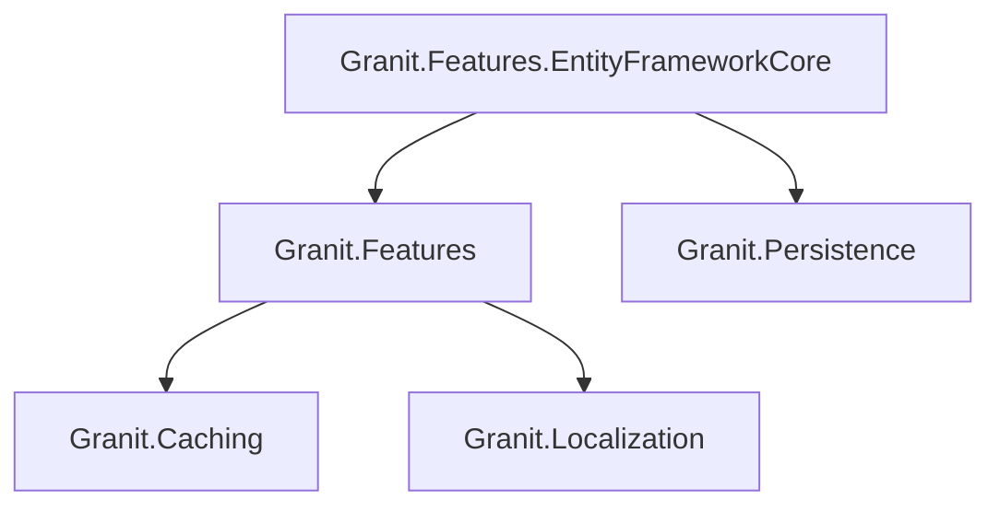

import { Tabs, TabItem, FileTree } from "@astrojs/starlight/components";

SaaS feature management with three value types — toggle (boolean), numeric (bounded),
and selection (enum). Features cascade through a Tenant → Plan → Default chain and
support gating via attributes, middleware, and imperative checks.

## Package structure

<FileTree>

- Granit.Features/ SaaS feature management (Toggle/Numeric/Selection)
  - Granit.Features.EntityFrameworkCore Isolated FeaturesDbContext

</FileTree>

| Package | Role | Depends on |
|---------|------|------------|
| `Granit.Features` | `IFeatureChecker`, `IFeatureLimitGuard`, plan-based cascade | `Granit.Caching`, `Granit.Localization` |
| `Granit.Features.EntityFrameworkCore` | `FeaturesDbContext` (isolated) | `Granit.Features`, `Granit.Persistence` |

## Dependency graph



## Setup

<Tabs>
<TabItem label="Core only">

```csharp
[DependsOn(typeof(GranitFeaturesModule))]
public class AppModule : GranitModule { }
```

Uses `InMemoryFeatureStore` by default (no persistence).

</TabItem>
<TabItem label="With EF Core">

```csharp
[DependsOn(
    typeof(GranitFeaturesModule),
    typeof(GranitFeaturesEntityFrameworkCoreModule))]
public class AppModule : GranitModule { }
```

```csharp
builder.AddGranitFeaturesEntityFrameworkCore(opt =>
    opt.UseNpgsql(connectionString));
```

</TabItem>
</Tabs>

## Defining features

Implement `IFeatureDefinitionProvider` to declare features. Features are grouped for
admin UI organization.

```csharp
public sealed class AcmeFeatureDefinitionProvider : FeatureDefinitionProvider
{
    public override void Define(IFeatureDefinitionContext context)
    {
        FeatureGroupDefinition group = context.AddGroup("Acme", "Acme Application");

        group.AddToggle("Acme.VideoConsultation",
            defaultValue: "false",
            displayName: "Video Consultation");

        group.AddNumeric("Acme.MaxUsersCount",
            defaultValue: "50",
            displayName: "Maximum Users",
            numericConstraint: new NumericConstraint(Min: 1, Max: 10_000));

        group.AddSelection("Acme.StorageTier",
            defaultValue: "standard",
            displayName: "Storage Tier",
            selectionValues: new SelectionValues("standard", "premium", "enterprise"));
    }
}
```

### FeatureDefinition properties

| Property | Description |
|----------|-------------|
| `Name` | Unique feature name (convention: `Module.FeatureName`) |
| `DefaultValue` | Fallback string value |
| `ValueType` | `Toggle`, `Numeric`, or `Selection` |
| `NumericConstraint` | Min/Max bounds for `Numeric` features |
| `SelectionValues` | Allowed values for `Selection` features |

## Value cascade

Features are resolved through a Tenant → Plan → Default cascade:

```
Tenant override → Plan value → Default (code)
```

The application must implement `IPlanIdProvider` and `IPlanFeatureStore` to activate
plan-level resolution. Without these, features fall back to their default values.

## IFeatureChecker

The main abstraction for querying feature state at runtime:

```csharp
public class ConsultationService(IFeatureChecker features)
{
    public async Task StartAsync(CancellationToken ct)
    {
        // Gate: throws FeatureNotEnabledException (HTTP 403) if disabled
        await features
            .RequireEnabledAsync("Acme.VideoConsultation", ct)
            .ConfigureAwait(false);

        // Conditional logic
        bool isEnabled = await features
            .IsEnabledAsync("Acme.VideoConsultation", ct)
            .ConfigureAwait(false);

        // Numeric value
        long maxUsers = await features
            .GetNumericAsync("Acme.MaxUsersCount", ct)
            .ConfigureAwait(false);
    }
}
```

## IFeatureLimitGuard

Enforces numeric feature limits before mutating operations. Throws
`FeatureLimitExceededException` (HTTP 403) when the limit is reached.

```csharp
public sealed class CreatePatientHandler(
    IFeatureLimitGuard limitGuard,
    IPatientRepository patients)
{
    public async Task HandleAsync(CreatePatientCommand cmd, CancellationToken ct)
    {
        long current = await patients.CountAsync(ct).ConfigureAwait(false);
        await limitGuard
            .CheckAsync("Acme.MaxUsersCount", current, ct)
            .ConfigureAwait(false);

        // ... proceed with creation
    }
}
```

## Feature gating

<Tabs>
<TabItem label="Minimal API">

```csharp
app.MapPost("/consultations", handler)
    .RequiresFeature("Acme.VideoConsultation");
```

</TabItem>
<TabItem label="Controllers">

```csharp
[RequiresFeature("Acme.VideoConsultation")]
public IActionResult StartConsultation() => Ok();
```

</TabItem>
<TabItem label="Wolverine">

```csharp
// Decorate the message class
[RequiresFeature("Acme.ExportPdf")]
public sealed class GenerateExportCommand { }
```

Register `RequiresFeatureMiddleware` in your Wolverine setup.

</TabItem>
</Tabs>

When the feature is disabled, `FeatureNotEnabledException` is thrown and mapped to
HTTP 403 with `errorCode: "Features:NotEnabled"`.

## Feature store abstractions

```csharp
public interface IFeatureStoreReader
{
    Task<string?> GetOrNullAsync(
        string featureName, string? tenantId,
        CancellationToken cancellationToken = default);
}

public interface IFeatureStoreWriter
{
    Task SetAsync(
        string featureName, string? tenantId, string value,
        CancellationToken cancellationToken = default);

    Task DeleteAsync(
        string featureName, string? tenantId,
        CancellationToken cancellationToken = default);
}
```

## Public API summary

| Category | Key types | Package |
|----------|-----------|---------|
| Modules | `GranitFeaturesModule`, `GranitFeaturesEntityFrameworkCoreModule` | -- |
| Abstractions | `IFeatureChecker`, `IFeatureLimitGuard`, `IFeatureStoreReader`, `IFeatureStoreWriter` | `Granit.Features` |
| Definitions | `FeatureDefinition`, `FeatureDefinitionProvider`, `FeatureValueType`, `NumericConstraint`, `SelectionValues` | `Granit.Features` |
| Gating | `[RequiresFeature]`, `.RequiresFeature()`, `RequiresFeatureMiddleware` | `Granit.Features` |

## See also

- [Settings](/dotnet/infrastructure/settings/) -- cascading key-value settings
- [Multi-tenancy](/dotnet/infrastructure/multi-tenancy/) -- tenant context for feature resolution
- [Caching](/dotnet/data/caching/) -- used for feature value caching
