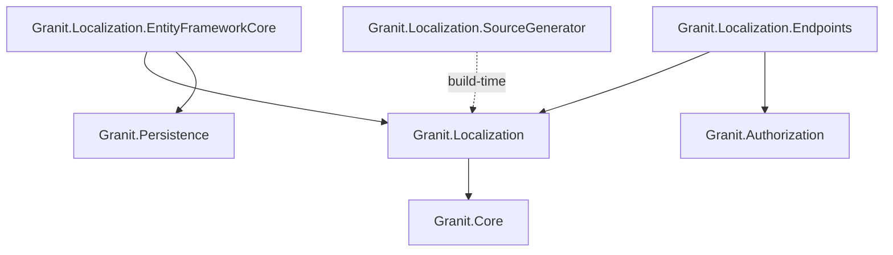
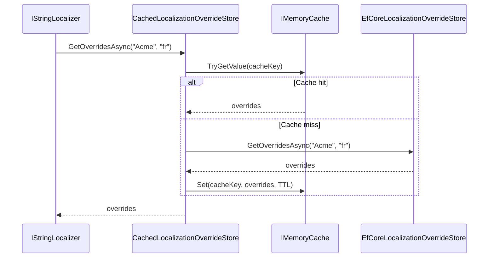

import { Tabs, TabItem, FileTree, Badge } from "@astrojs/starlight/components";

Granit.Localization provides a modular, JSON-based internationalization system for .NET
applications. Resources are embedded as JSON files, auto-discovered at startup, and served
via `IStringLocalizer<T>`. Translation overrides live in a database (EF Core) and are
cached in-memory with per-tenant isolation. A Roslyn source generator produces strongly-typed
key constants at build time, eliminating magic strings.

## Package structure

<FileTree>
- Granit.Localization/ Core abstractions, JSON resource loading, auto-discovery, override caching
  - Granit.Localization.EntityFrameworkCore EF Core persistence for translation overrides
  - Granit.Localization.Endpoints Minimal API (SPA bootstrapping + override CRUD)
  - Granit.Localization.SourceGenerator Roslyn incremental generator for type-safe keys
</FileTree>

| Package | Role | Depends on |
|---------|------|------------|
| `Granit.Localization` | `GranitLocalizationModule`, JSON localizer, override store abstractions | `Granit.Core` |
| `Granit.Localization.EntityFrameworkCore` | `GranitLocalizationOverridesDbContext`, `EfCoreLocalizationOverrideStore` | `Granit.Localization`, `Granit.Persistence` |
| `Granit.Localization.Endpoints` | Anonymous SPA endpoint, override CRUD endpoints | `Granit.Localization`, `Granit.Authorization` |
| `Granit.Localization.SourceGenerator` | Build-time `LocalizationKeys` class generation | _(analyzer, no runtime dependency)_ |

## Dependency graph



## Setup

<Tabs>
<TabItem label="Core only">

```csharp
[DependsOn(typeof(GranitLocalizationModule))]
public class AppModule : GranitModule
{
    public override void ConfigureServices(ServiceConfigurationContext context)
    {
        context.Services.Configure<GranitLocalizationOptions>(options =>
        {
            // Register your application resource
            options.Resources
                .Add<AcmeLocalizationResource>("fr")
                .AddJson(
                    typeof(AcmeLocalizationResource).Assembly,
                    "Acme.App.Localization.Acme");

            // Add supported languages
            options.Languages.Add(new LanguageInfo("nl", "Nederlands", "nl"));
            options.Languages.Add(new LanguageInfo("de", "Deutsch", "de"));
        });
    }
}
```

Default languages registered by the module: **fr**, **fr-CA**, **en** (default), **en-GB**.

</TabItem>
<TabItem label="With EF Core overrides">

```csharp
[DependsOn(
    typeof(GranitLocalizationModule),
    typeof(GranitLocalizationEntityFrameworkCoreModule))]
public class AppModule : GranitModule { }
```

```csharp
// Program.cs
builder.AddGranitLocalizationEntityFrameworkCore(opt =>
    opt.UseNpgsql(connectionString));
```

</TabItem>
<TabItem label="With endpoints">

```csharp
[DependsOn(
    typeof(GranitLocalizationModule),
    typeof(GranitLocalizationEntityFrameworkCoreModule),
    typeof(GranitLocalizationEndpointsModule))]
public class AppModule : GranitModule { }
```

```csharp
// Program.cs — map endpoints
app.MapGranitLocalization();          // GET /localization (anonymous)
app.MapGranitLocalizationOverrides(); // CRUD /localization/overrides (admin)
```

</TabItem>
</Tabs>

## Resource registration

Each module registers a **marker type** and its embedded JSON files via
`GranitLocalizationOptions.Resources`:

```csharp
options.Resources
    .Add<AcmeLocalizationResource>("fr")  // default culture = "fr"
    .AddJson(
        typeof(AcmeLocalizationResource).Assembly,
        "Acme.App.Localization.Acme")     // embedded resource prefix
    .AddBaseTypes(typeof(GranitLocalizationResource)); // inherit Granit keys
```

### LocalizationResourceStore

The `LocalizationResourceStore` holds all registered resources. Each entry is a
`LocalizationResourceInfo` with:

| Property | Description |
|----------|-------------|
| `ResourceType` | Marker type (empty class) |
| `DefaultCulture` | Fallback culture (e.g. `"fr"`) |
| `BaseTypes` | Parent resources for key inheritance |
| `JsonSources` | Embedded JSON file locations |

### Auto-discovery

When `EnableAutoDiscovery = true` (default), loaded module assemblies are scanned for
types decorated with `[LocalizationResourceName]`. Their embedded JSON files are
registered automatically without explicit `AddJson()` calls.

## JSON file format

Files follow the Granit convention: `{ "culture": "...", "texts": { ... } }`.
Nested keys are flattened with `.` separators.

```json title="Localization/Acme/en.json"
{
  "culture": "en",
  "texts": {
    "Patient": {
      "Created": "Patient {0} created successfully.",
      "NotFound": "Patient not found."
    },
    "Validation": {
      "NissRequired": "National identification number is required."
    }
  }
}
```

Usage in code:

```csharp
public class PatientHandler(IStringLocalizer<AcmeLocalizationResource> l)
{
    public string GetMessage(string name) =>
        l["Patient.Created", name];
}
```

## LanguageInfo

Available languages are declared via `GranitLocalizationOptions.Languages`:

```csharp
new LanguageInfo(
    cultureName: "fr-CA",
    displayName: "Francais (Canada)",
    flagIcon: "ca",
    isDefault: false)
```

| Property | Description |
|----------|-------------|
| `CultureName` | BCP 47 culture code (`"fr"`, `"en-GB"`) |
| `DisplayName` | UI-friendly name |
| `FlagIcon` | Optional icon identifier for the language selector |
| `IsDefault` | Pre-selected language in the UI |

The `Languages` list also drives `SupportedUICultures` for ASP.NET Core request
localization (`UseGranitRequestLocalization`).

## Translation overrides

Overrides allow administrators to customize translations at runtime without redeploying.
They are stored per resource, per culture, per tenant.

### Abstractions

```csharp
public interface ILocalizationOverrideStoreReader
{
    Task<IReadOnlyDictionary<string, string>> GetOverridesAsync(
        string resourceName, string culture,
        CancellationToken cancellationToken = default);
}

public interface ILocalizationOverrideStoreWriter
{
    Task SetOverrideAsync(
        string resourceName, string culture, string key, string value,
        CancellationToken cancellationToken = default);

    Task RemoveOverrideAsync(
        string resourceName, string culture, string key,
        CancellationToken cancellationToken = default);
}
```

### Caching layer

The `CachedLocalizationOverrideStore` wraps the EF Core store with an `IMemoryCache`
layer. Cache keys are tenant-scoped (`localization:{tenantId}:{resource}:{culture}`)
and invalidated on every write.



## Endpoints

### SPA bootstrapping

`GET /localization?cultureName=fr` returns all registered resources for the requested
culture, plus the list of available languages. This endpoint is **anonymous** and includes
cache headers (`Cache-Control: public, max-age=3600`, `Vary: Accept-Language`).

```json
{
  "currentCulture": "fr",
  "resources": {
    "Acme": {
      "Patient.Created": "Patient {0} cree avec succes.",
      "Patient.NotFound": "Patient introuvable."
    },
    "Granit": {
      "EntityNotFound": "Entite introuvable."
    }
  },
  "languages": [
    { "cultureName": "fr", "displayName": "Francais (France)", "flagIcon": "fr", "isDefault": false },
    { "cultureName": "en", "displayName": "English (United States)", "flagIcon": "us", "isDefault": true }
  ]
}
```

### Override management

All override endpoints require the `Localization.Overrides.Manage` permission.

| Method | Route | Description |
|--------|-------|-------------|
| `GET` | `/localization/overrides?resourceName=X&cultureName=fr` | List overrides for a resource/culture |
| `PUT` | `/localization/overrides/{resourceName}/{cultureName}/{key}` | Create or update an override |
| `DELETE` | `/localization/overrides/{resourceName}/{cultureName}/{key}` | Remove an override |

If no `ILocalizationOverrideStoreReader`/`Writer` is registered (EF Core package not
installed), all override endpoints return `501 Not Implemented`.

## Source generator

The `Granit.Localization.SourceGenerator` package provides a Roslyn incremental generator
that reads JSON localization files declared as `<AdditionalFiles>` and produces a
`LocalizationKeys` class with nested constant string fields.

### Setup

```xml title="Acme.App.csproj"
<ItemGroup>
  <ProjectReference Include="..\Granit.Localization.SourceGenerator\Granit.Localization.SourceGenerator.csproj"
                    OutputItemType="Analyzer"
                    ReferenceOutputAssembly="false" />
</ItemGroup>

<ItemGroup>
  <AdditionalFiles Include="Localization\Acme\en.json" />
</ItemGroup>
```

### Generated output

Given the JSON file from the example above, the generator produces:

```csharp title="LocalizationKeys.g.cs (auto-generated)"
public static class LocalizationKeys
{
    public static class Patient
    {
        public const string Created = "Patient.Created";
        public const string NotFound = "Patient.NotFound";
    }

    public static class Validation
    {
        public const string NissRequired = "Validation.NissRequired";
    }
}
```

Usage with `IStringLocalizer`:

```csharp
string message = localizer[LocalizationKeys.Patient.Created, patientName];
```

Keys with the `Resource:Key` convention (e.g., `"Granit:EntityNotFound"`) produce nested
classes matching the resource prefix.

## Public API summary

| Category | Key types | Package |
|----------|-----------|---------|
| Module | `GranitLocalizationModule`, `GranitLocalizationEntityFrameworkCoreModule`, `GranitLocalizationEndpointsModule` | -- |
| Core | `LocalizationResourceStore`, `LocalizationResourceInfo`, `LanguageInfo` | `Granit.Localization` |
| Options | `GranitLocalizationOptions` (`EnableAutoDiscovery`, `Resources`, `Languages`, `FormattingCultures`) | `Granit.Localization` |
| Abstractions | `ILocalizationOverrideStoreReader`, `ILocalizationOverrideStoreWriter` | `Granit.Localization` |
| Caching | `CachedLocalizationOverrideStore` _(internal)_ | `Granit.Localization` |
| EF Core | `GranitLocalizationOverridesDbContext`, `EfCoreLocalizationOverrideStore` _(internal)_ | `Granit.Localization.EntityFrameworkCore` |
| Endpoints | `MapGranitLocalization()`, `MapGranitLocalizationOverrides()` | `Granit.Localization.Endpoints` |
| Generator | `LocalizationKeysGenerator` | `Granit.Localization.SourceGenerator` |

## See also

- [Settings, Features & Reference Data](./settings/) -- uses localization for display names
- [Persistence module](./persistence/) -- EF Core interceptors used by the override store
- [Security module](./authentication/) -- permission-based access for override management
