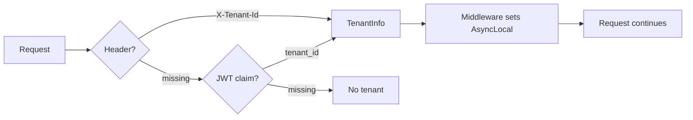

import { Tabs, TabItem, FileTree, Badge } from "@astrojs/starlight/components";

Granit.MultiTenancy adds HTTP-based tenant resolution to the framework. A pipeline of
pluggable resolvers extracts the tenant from headers or JWT claims, sets an `AsyncLocal`
context for the entire request, and EF Core query filters handle the rest. Three
isolation strategies available — from shared database to database-per-tenant.

## Package structure

Single package — isolation strategies are configured in `Granit.Persistence`.

| Package | Role | Depends on |
|---------|------|------------|
| `Granit.MultiTenancy` | Tenant resolution, `CurrentTenant`, middleware | `Granit.Core` |

:::note
`ICurrentTenant` lives in `Granit.Core.MultiTenancy` and is available in **every** module
without referencing `Granit.MultiTenancy`. A `NullTenantContext` (always `IsAvailable = false`)
is registered by default. `Granit.MultiTenancy` replaces it with the real implementation.
:::

## Setup

```csharp
[DependsOn(typeof(GranitMultiTenancyModule))]
public class AppModule : GranitModule { }
```

```json
{
  "MultiTenancy": {
    "IsEnabled": true,
    "TenantIdClaimType": "tenant_id",
    "TenantIdHeaderName": "X-Tenant-Id"
  }
}
```

**Pipeline order is critical:**

```csharp
app.UseAuthentication();
app.UseGranitMultiTenancy();   // After auth, before authorization
app.UseAuthorization();
```

## Tenant resolution pipeline

Resolvers execute in `Order` (ascending). First non-null result wins.



| Resolver | Order | Source |
|----------|-------|--------|
| `HeaderTenantResolver` | 100 | `X-Tenant-Id` HTTP header |
| `JwtClaimTenantResolver` | 200 | `tenant_id` JWT claim |

### Custom resolver

```csharp
public sealed class SubdomainTenantResolver(
    ITenantStore tenantStore) : ITenantResolver
{
    public int Order => 50; // Before header resolver

    public async Task<TenantInfo?> ResolveAsync(
        HttpContext context, CancellationToken cancellationToken = default)
    {
        string host = context.Request.Host.Host;
        string subdomain = host.Split('.')[0];

        var tenant = await tenantStore
            .FindBySubdomainAsync(subdomain, cancellationToken)
            .ConfigureAwait(false);

        return tenant is not null
            ? new TenantInfo(tenant.Id, tenant.Name)
            : null;
    }
}
```

Register it in DI — the pipeline auto-discovers all `ITenantResolver` implementations.

## CurrentTenant

The real implementation uses `AsyncLocal<TenantInfo?>` for thread-safe, per-async-flow
isolation:

```csharp
// In any service — constructor injection
public class PatientService(ICurrentTenant currentTenant, AppDbContext db)
{
    public async Task<List<Patient>> GetAllAsync(CancellationToken cancellationToken)
    {
        // EF Core query filter automatically applies WHERE TenantId = @tenantId
        return await db.Patients
            .ToListAsync(cancellationToken)
            .ConfigureAwait(false);
    }
}
```

### Temporary tenant override

Switch tenant context for background jobs or cross-tenant admin operations:

```csharp
public class TenantMigrationService(ICurrentTenant currentTenant)
{
    public async Task MigrateDataAsync(
        Guid sourceTenantId, Guid targetTenantId, CancellationToken cancellationToken)
    {
        using (currentTenant.Change(sourceTenantId))
        {
            var data = await LoadDataAsync(cancellationToken).ConfigureAwait(false);

            using (currentTenant.Change(targetTenantId))
            {
                await SaveDataAsync(data, cancellationToken).ConfigureAwait(false);
            }
            // Back to source tenant
        }
        // Back to original tenant (or no tenant)
    }
}
```

### AllowAnonymousTenant

Mark endpoints that don't require a tenant context:

```csharp
[AllowAnonymousTenant]
app.MapGet("/health", () => Results.Ok());
```

`Granit.ApiDocumentation` automatically excludes the `X-Tenant-Id` header from
OpenAPI docs for these endpoints.

## Isolation strategies

Three strategies configured in `Granit.Persistence`:

| Strategy | Isolation | Query filter | Connection |
|----------|----------|-------------|------------|
| `SharedDatabase` | `WHERE TenantId = @id` | Automatic via `ApplyGranitConventions` | Single connection string |
| `SchemaPerTenant` | PostgreSQL `SET search_path` | Per-schema tables | Single connection, per-request schema |
| `DatabasePerTenant` | Separate database | N/A (physical isolation) | Per-tenant connection from Vault |

<Tabs>
<TabItem label="Shared database">

Default strategy. All tenants share one database, isolated by EF Core query filters
on `IMultiTenant` entities.

```json
{
  "TenantIsolation": {
    "Strategy": "SharedDatabase"
  }
}
```

No additional setup — `ApplyGranitConventions` handles the `TenantId` filter.

</TabItem>
<TabItem label="Schema per tenant">

Each tenant gets a dedicated PostgreSQL schema. `TenantSchemaConnectionInterceptor`
executes `SET search_path` on every connection open.

```csharp
context.Services.AddTenantPerSchemaDbContext<AppDbContext>(
    options => options.UseNpgsql(
        context.Configuration.GetConnectionString("Default")));
```

```json
{
  "TenantIsolation": {
    "Strategy": "SchemaPerTenant"
  },
  "TenantSchema": {
    "NamingConvention": "TenantId",
    "Prefix": "tenant_"
  }
}
```

</TabItem>
<TabItem label="Database per tenant">

Maximum isolation — each tenant has its own database. Connection strings resolved
from Vault via `ITenantConnectionStringProvider`.

```csharp
context.Services.AddSingleton<ITenantConnectionStringProvider,
    VaultTenantConnectionStringProvider>();

context.Services.AddTenantPerDatabaseDbContext<AppDbContext>(
    static (options, connectionString) => options.UseNpgsql(connectionString));
```

```json
{
  "TenantIsolation": {
    "Strategy": "DatabasePerTenant"
  }
}
```

</TabItem>
</Tabs>

:::danger
Schema activators execute on every connection open. Pooled connections retain the
previous tenant's schema — failing to reset is a **data isolation breach** (ISO 27001).
Never cache or skip the `SET search_path` call.
:::

## Wolverine context propagation

When Wolverine dispatches messages, the `OutgoingContextMiddleware` injects `X-Tenant-Id`
into the message envelope. The `TenantContextBehavior` restores it on the receiving side:

```
HTTP Request (Tenant A) → Wolverine handler → background job
         X-Tenant-Id: A  ───────────────────→  ICurrentTenant.Id = A
```

This ensures tenant isolation across async message processing without manual propagation.

## Configuration reference

| Property | Default | Description |
|----------|---------|-------------|
| `IsEnabled` | `true` | Enable/disable tenant resolution |
| `TenantIdClaimType` | `"tenant_id"` | JWT claim name for tenant ID |
| `TenantIdHeaderName` | `"X-Tenant-Id"` | HTTP header name for tenant ID |

## Public API summary

| Category | Key types | Package |
|----------|-----------|---------|
| Module | `GranitMultiTenancyModule` | `Granit.MultiTenancy` |
| Core (in Granit.Core) | `ICurrentTenant`, `AllowAnonymousTenantAttribute` | `Granit.Core` |
| Implementation | `CurrentTenant`, `TenantInfo`, `ITenantInfo` | `Granit.MultiTenancy` |
| Resolution | `ITenantResolver`, `HeaderTenantResolver`, `JwtClaimTenantResolver`, `TenantResolverPipeline` | `Granit.MultiTenancy` |
| Middleware | `TenantResolutionMiddleware` | `Granit.MultiTenancy` |
| Options | `MultiTenancyOptions` | `Granit.MultiTenancy` |
| Extensions | `AddGranitMultiTenancy()`, `UseGranitMultiTenancy()` | `Granit.MultiTenancy` |

## See also

- [Core module](../core/module-system/) — `IMultiTenant` interface, data filter
- [Persistence module](./persistence/) — `ApplyGranitConventions`, isolation strategies
- [Wolverine module](./wolverine/) — Tenant context propagation in messages
- [API Reference](/api/Granit.MultiTenancy.html) (auto-generated from XML docs)
