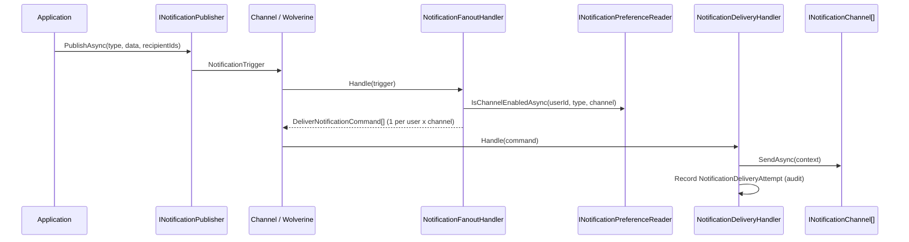
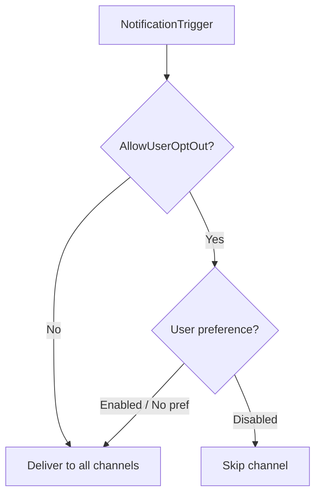

import { Tabs, TabItem, FileTree, Badge } from "@astrojs/starlight/components";

Granit.Notifications is a multi-channel notification engine built on a fan-out
pattern. A single `INotificationPublisher.PublishAsync()` call fans out to every
registered channel (InApp, Email, SMS, WhatsApp, Mobile Push, SignalR, SSE,
Web Push, Zulip) after filtering through user preferences. Delivery attempts are
recorded in an immutable audit trail (ISO 27001). By default, notifications
dispatch via an in-process `Channel<T>` -- add `Granit.Notifications.Wolverine`
for durable outbox-backed dispatch with exponential backoff retry.

## Package structure

<FileTree>
- Granit.Notifications/ Core: fan-out engine, InApp channel, definitions, entity tracking
  - Granit.Notifications.EntityFrameworkCore EF Core persistence (all stores)
  - Granit.Notifications.Endpoints Minimal API REST endpoints
  - Granit.Notifications.Wolverine Durable outbox dispatch via IMessageBus
  - Granit.Notifications.Email/ Email channel abstraction (Keyed Services)
    - Granit.Notifications.Email.Smtp MailKit SMTP provider
    - Granit.Notifications.Email.AzureCommunicationServices Azure Communication Services email
    - Granit.Notifications.Email.Scaleway Scaleway TEM email provider
    - Granit.Notifications.Email.SendGrid SendGrid email provider
  - Granit.Notifications.Sms SMS channel abstraction (Keyed Services)
    - Granit.Notifications.Sms.AzureCommunicationServices Azure Communication Services SMS
    - Granit.Notifications.Sms.AwsSns AWS SNS SMS provider
  - Granit.Notifications.WhatsApp WhatsApp Business API channel
  - Granit.Notifications.Brevo Unified Brevo provider (Email + SMS + WhatsApp)
  - Granit.Notifications.MobilePush/ Mobile push abstraction + token store
    - Granit.Notifications.MobilePush.GoogleFcm Firebase Cloud Messaging provider
    - Granit.Notifications.MobilePush.AzureNotificationHubs Azure Notification Hubs push
    - Granit.Notifications.MobilePush.AwsSns AWS SNS Platform Application push
  - Granit.Notifications.SignalR Real-time SignalR channel + Redis backplane
  - Granit.Notifications.WebPush W3C Web Push (VAPID, RFC 8030)
  - Granit.Notifications.Sse Server-Sent Events channel (.NET 10)
  - Granit.Notifications.Twilio Twilio SMS + WhatsApp provider
  - Granit.Notifications.Zulip Zulip chat integration
</FileTree>

| Package | Role | Depends on |
|---------|------|------------|
| `Granit.Notifications` | Fan-out engine, InApp channel, definitions, entity tracking | `Granit.Guids`, `Granit.Timing`, `Granit.Querying` |
| `Granit.Notifications.EntityFrameworkCore` | EF Core stores (all entities + mobile push tokens) | `Granit.Notifications`, `Granit.Notifications.MobilePush`, `Granit.Persistence` |
| `Granit.Notifications.Endpoints` | Minimal API endpoints (inbox, preferences, subscriptions, followers) | `Granit.Notifications`, `Granit.Notifications.MobilePush`, `Granit.Validation`, `Granit.Http.ApiDocumentation` |
| `Granit.Notifications.Wolverine` | Durable outbox-backed dispatch via `IMessageBus` | `Granit.Notifications`, `Granit.Wolverine` |
| `Granit.Notifications.Email` | Email channel abstraction, Keyed Services resolution | `Granit.Notifications` |
| `Granit.Notifications.Email.Smtp` | MailKit SMTP provider (Keyed Service `"Smtp"`) | `Granit.Notifications.Email` |
| `Granit.Notifications.Email.AzureCommunicationServices` | Azure Communication Services email provider (Keyed Service `"AzureCommunicationServices"`) | `Granit.Notifications.Email` |
| `Granit.Notifications.Email.Scaleway` | Scaleway TEM email provider (Keyed Service `"Scaleway"`) | `Granit.Notifications.Email` |
| `Granit.Notifications.Email.SendGrid` | SendGrid email provider (Keyed Service `"SendGrid"`) | `Granit.Notifications.Email` |
| `Granit.Notifications.Brevo` | Unified Brevo provider (Email + SMS + WhatsApp) | `Granit.Notifications.Email`, `Granit.Notifications.Sms`, `Granit.Notifications.WhatsApp` |
| `Granit.Notifications.Sms` | SMS channel abstraction, Keyed Services resolution | `Granit.Notifications` |
| `Granit.Notifications.Sms.AzureCommunicationServices` | Azure Communication Services SMS provider (Keyed Service `"AzureCommunicationServices"`) | `Granit.Notifications.Sms` |
| `Granit.Notifications.Sms.AwsSns` | AWS SNS SMS provider (Keyed Service `"AwsSns"`) | `Granit.Notifications.Sms` |
| `Granit.Notifications.WhatsApp` | WhatsApp Business API channel | `Granit.Notifications` |
| `Granit.Notifications.MobilePush` | Mobile push abstraction + device token store | `Granit.Notifications` |
| `Granit.Notifications.MobilePush.GoogleFcm` | Firebase Cloud Messaging (FCM HTTP v1 API) | `Granit.Notifications.MobilePush` |
| `Granit.Notifications.MobilePush.AzureNotificationHubs` | Azure Notification Hubs push provider (Keyed Service `"AzureNotificationHubs"`) | `Granit.Notifications.MobilePush` |
| `Granit.Notifications.MobilePush.AwsSns` | AWS SNS Platform Application push provider (Keyed Service `"AwsSns"`) | `Granit.Notifications.MobilePush` |
| `Granit.Notifications.SignalR` | Real-time SignalR channel + Redis backplane | `Granit.Notifications` |
| `Granit.Notifications.WebPush` | W3C Web Push (VAPID, RFC 8030/8291/8292) | `Granit.Notifications` |
| `Granit.Notifications.Sse` | Server-Sent Events channel (.NET 10 native SSE) | `Granit.Notifications` |
| `Granit.Notifications.Twilio` | Twilio SMS + WhatsApp provider (Keyed Service `"Twilio"`) | `Granit.Notifications.Sms`, `Granit.Notifications.WhatsApp` |
| `Granit.Notifications.Zulip` | Zulip Bot API chat integration | `Granit.Notifications` |

## Dependency graph

```mermaid
graph TD
    N[Granit.Notifications] --> G[Granit.Guids]
    N --> T[Granit.Timing]
    N --> Q[Granit.Querying]

    NEF[Granit.Notifications.EntityFrameworkCore] --> N
    NEF --> MP[Granit.Notifications.MobilePush]
    NEF --> P[Granit.Persistence]

    NE[Granit.Notifications.Endpoints] --> N
    NE --> MP
    NE --> V[Granit.Validation]
    NE --> AD[Granit.Http.ApiDocumentation]

    NW[Granit.Notifications.Wolverine] --> N
    NW --> W[Granit.Wolverine]

    EM[Granit.Notifications.Email] --> N
    SMTP[Granit.Notifications.Email.Smtp] --> EM
    ACSEM[Granit.Notifications.Email.AzureCommunicationServices] --> EM
    SCW[Granit.Notifications.Email.Scaleway] --> EM
    SG[Granit.Notifications.Email.SendGrid] --> EM
    BR[Granit.Notifications.Brevo] --> EM
    BR --> SMS[Granit.Notifications.Sms]
    BR --> WA[Granit.Notifications.WhatsApp]

    SMS --> N
    ACSSMS[Granit.Notifications.Sms.AzureCommunicationServices] --> SMS
    SNSSMS[Granit.Notifications.Sms.AwsSns] --> SMS
    TW[Granit.Notifications.Twilio] --> SMS
    TW --> WA
    WA --> N
    MP --> N
    FCM[Granit.Notifications.MobilePush.GoogleFcm] --> MP
    ANH[Granit.Notifications.MobilePush.AzureNotificationHubs] --> MP
    SNSMP[Granit.Notifications.MobilePush.AwsSns] --> MP
    SR[Granit.Notifications.SignalR] --> N
    WP[Granit.Notifications.WebPush] --> N
    SSE[Granit.Notifications.Sse] --> N
    ZU[Granit.Notifications.Zulip] --> N
```



## Setup

<Tabs>
<TabItem label="Production (Wolverine + EF Core)">

```csharp
[DependsOn(typeof(GranitNotificationsWolverineModule))]
[DependsOn(typeof(GranitNotificationsEntityFrameworkCoreModule))]
public class AppModule : GranitModule
{
    public override void ConfigureServices(ServiceConfigurationContext context)
    {
        // EF Core persistence (replaces in-memory defaults)
        context.Builder.AddGranitNotificationsEntityFrameworkCore(
            opts => opts.UseNpgsql(context.Configuration
                .GetConnectionString("Notifications")));

        // Email channel via SMTP
        context.Services.AddGranitNotificationsEmail(opts => opts.Provider = "Smtp");
        context.Services.AddGranitNotificationsEmailSmtp();

        // SignalR real-time channel with Redis backplane
        context.Services.AddGranitNotificationsSignalR(
            context.Configuration.GetConnectionString("Redis")!);

        // Notification endpoints
        context.Services.AddGranitNotificationsEndpoints();
    }

    public override void OnApplicationInitialization(ApplicationInitializationContext context)
    {
        context.App.MapGranitNotificationEndpoints();
        context.App.MapHub<NotificationHub>("/hubs/notifications");
    }
}
```

</TabItem>
<TabItem label="Development (in-memory)">

```csharp
[DependsOn(typeof(GranitNotificationsModule))]
public class AppModule : GranitModule { }
```

In-memory stores, in-process `Channel<T>` dispatch. No database, no outbox.
Notifications are lost on crash -- suitable for development only.

</TabItem>
<TabItem label="With Brevo (Email + SMS + WhatsApp)">

```csharp
// One provider for three channels
context.Services.AddGranitNotificationsBrevo();
context.Services.AddGranitNotificationsEmail(opts => opts.Provider = "Brevo");
context.Services.AddGranitNotificationsSms(opts => opts.Provider = "Brevo");
context.Services.AddGranitNotificationsWhatsApp(opts => opts.Provider = "Brevo");
```

```json
{
  "Notifications": {
    "Brevo": {
      "ApiKey": "vault:secret/data/brevo#api-key",
      "DefaultSenderEmail": "noreply@clinic.example.com",
      "DefaultSenderName": "Clinic Portal",
      "DefaultSmsSenderId": "CLINIC"
    }
  }
}
```

</TabItem>
</Tabs>

## Fan-out pattern

A single `PublishAsync()` call produces one `DeliverNotificationCommand` per
recipient per channel. The fan-out handler resolves recipients, loads user
preferences, and filters out opted-out channels before dispatching.



### NotificationTrigger

Published by `INotificationPublisher`. Contains the notification type name,
severity, serialized data, recipient list, and optional entity reference.

```csharp
public sealed record NotificationTrigger
{
    public Guid NotificationId { get; init; }
    public required string NotificationTypeName { get; init; }
    public required NotificationSeverity Severity { get; init; }
    public required JsonElement Data { get; init; }
    public IReadOnlyList<string> RecipientUserIds { get; init; } = [];
    public EntityReference? RelatedEntity { get; init; }
    public Guid? TenantId { get; init; }
    public required DateTimeOffset OccurredAt { get; init; }
    public string? Culture { get; init; }
}
```

### DeliverNotificationCommand

Produced by `NotificationFanoutHandler`. One per recipient per channel.
Consumed by `NotificationDeliveryHandler` which routes to the matching
`INotificationChannel`.

```csharp
public sealed record DeliverNotificationCommand
{
    public required Guid DeliveryId { get; init; }
    public required Guid NotificationId { get; init; }
    public required string NotificationTypeName { get; init; }
    public required NotificationSeverity Severity { get; init; }
    public required string RecipientUserId { get; init; }
    public required string ChannelName { get; init; }
    public required JsonElement Data { get; init; }
    public EntityReference? RelatedEntity { get; init; }
    public Guid? TenantId { get; init; }
    public required DateTimeOffset OccurredAt { get; init; }
    public string? Culture { get; init; }
}
```

## INotificationPublisher

The application-facing facade for publishing notifications. Four overloads cover
explicit recipients, topic subscribers, and entity followers (Odoo-style).

```csharp
public interface INotificationPublisher
{
    // Explicit recipients
    ValueTask PublishAsync<TData>(
        NotificationType<TData> notificationType, TData data,
        IReadOnlyList<string> recipientUserIds,
        CancellationToken cancellationToken = default) where TData : notnull;

    // Explicit recipients + entity reference
    ValueTask PublishAsync<TData>(
        NotificationType<TData> notificationType, TData data,
        IReadOnlyList<string> recipientUserIds,
        EntityReference? relatedEntity,
        CancellationToken cancellationToken = default) where TData : notnull;

    // All subscribers of the notification type
    ValueTask PublishToSubscribersAsync<TData>(
        NotificationType<TData> notificationType, TData data,
        CancellationToken cancellationToken = default) where TData : notnull;

    // All followers of the entity (Odoo-style chatter)
    ValueTask PublishToEntityFollowersAsync<TData>(
        NotificationType<TData> notificationType, TData data,
        EntityReference relatedEntity,
        CancellationToken cancellationToken = default) where TData : notnull;
}
```

### Usage

```csharp
// 1. Define a notification type
public sealed class AppointmentReminder
    : NotificationType<AppointmentReminderData>
{
    public override string Name => "Appointments.Reminder";
    public override IReadOnlyList<string> DefaultChannels =>
        [NotificationChannels.InApp, NotificationChannels.Email,
         NotificationChannels.MobilePush];
}

public sealed record AppointmentReminderData(
    Guid AppointmentId, string PatientName,
    DateTimeOffset ScheduledAt, string DoctorName);

// 2. Register in a definition provider
public class AppNotificationDefinitionProvider : INotificationDefinitionProvider
{
    public void Define(INotificationDefinitionContext context)
    {
        context.Add(new NotificationDefinition("Appointments.Reminder")
        {
            DefaultSeverity = NotificationSeverity.Info,
            DefaultChannels = [NotificationChannels.InApp,
                NotificationChannels.Email, NotificationChannels.MobilePush],
            DisplayName = "Appointment Reminder",
            GroupName = "Appointments",
            AllowUserOptOut = true,
        });
    }
}

// 3. Register in DI
services.AddNotificationDefinitions<AppNotificationDefinitionProvider>();

// 4. Publish from application code
public class AppointmentReminderService(INotificationPublisher publisher)
{
    private static readonly AppointmentReminder Type = new();

    public async Task SendReminderAsync(
        Appointment appointment, CancellationToken cancellationToken)
    {
        await publisher.PublishAsync(
            Type,
            new AppointmentReminderData(
                appointment.Id, appointment.PatientName,
                appointment.ScheduledAt, appointment.DoctorName),
            [appointment.PatientUserId],
            new EntityReference("Appointment", appointment.Id.ToString()),
            cancellationToken).ConfigureAwait(false);
    }
}
```

## Notification channels

### INotificationChannel

Every delivery channel implements this interface. The engine resolves all
registered `INotificationChannel` services and routes by `Name`:

```csharp
public interface INotificationChannel
{
    string Name { get; }
    Task SendAsync(NotificationDeliveryContext context,
        CancellationToken cancellationToken = default);
}
```

Channels not registered are silently skipped with a warning log
(graceful degradation pattern).

### Well-known channels

```csharp
public static class NotificationChannels
{
    public const string InApp = "InApp";
    public const string SignalR = "SignalR";
    public const string Email = "Email";
    public const string Sms = "Sms";
    public const string WhatsApp = "WhatsApp";
    public const string Push = "Push";        // W3C Web Push
    public const string MobilePush = "MobilePush";
    public const string Sse = "Sse";
    public const string Zulip = "Zulip";
}
```

### Channel registration

| Channel | Registration | Provider resolution |
|---------|-------------|---------------------|
| InApp | Built-in (auto-registered) | N/A |
| Email | `AddGranitNotificationsEmail()` | Keyed Service: `"Smtp"`, `"Brevo"`, `"AzureCommunicationServices"`, `"Scaleway"`, `"SendGrid"` |
| SMS | `AddGranitNotificationsSms()` | Keyed Service: `"Brevo"`, `"AzureCommunicationServices"`, `"AwsSns"`, `"Twilio"` |
| WhatsApp | `AddGranitNotificationsWhatsApp()` | Keyed Service: `"Brevo"`, `"Twilio"` |
| Mobile Push | `AddGranitNotificationsMobilePush()` | Keyed Service: `"GoogleFcm"`, `"AzureNotificationHubs"`, `"AwsSns"` |
| SignalR | `AddGranitNotificationsSignalR()` | Direct (`NotificationHub`) |
| Web Push | `AddGranitNotificationsPush()` | VAPID (Lib.Net.Http.WebPush) |
| SSE | `AddGranitNotificationsSse()` | Native .NET 10 SSE |
| Zulip | `AddGranitNotificationsZulip()` | Zulip Bot API |

### Implementing a custom channel

```csharp
public class TeamsNotificationChannel(IRecipientResolver resolver)
    : INotificationChannel
{
    public string Name => "Teams";

    public async Task SendAsync(
        NotificationDeliveryContext context,
        CancellationToken cancellationToken = default)
    {
        RecipientInfo? recipient = await resolver
            .ResolveAsync(context.RecipientUserId, cancellationToken)
            .ConfigureAwait(false);
        if (recipient is null) return;

        // Send via Microsoft Graph API...
    }
}

// Register
services.AddSingleton<INotificationChannel, TeamsNotificationChannel>();
```

### IRecipientResolver

The application must implement this interface to resolve contact information
from user identifiers. It is **not** provided by Granit -- each application
knows its own user model.

```csharp
public interface IRecipientResolver
{
    Task<RecipientInfo?> ResolveAsync(
        string userId, CancellationToken cancellationToken = default);
}
```

```csharp
public sealed record RecipientInfo
{
    public required string UserId { get; init; }
    public string? Email { get; init; }
    public string? PhoneNumber { get; init; }     // E.164 format
    public string? PreferredCulture { get; init; } // BCP 47
    public string? DisplayName { get; init; }
}
```

## Entity model

### UserNotification

In-app notification stored in the user's inbox. The database is the source of
truth; email/SMS/push copies are fire-and-forget.

```csharp
public sealed class UserNotification : Entity, IMultiTenant
{
    public Guid NotificationId { get; set; }
    public string NotificationTypeName { get; set; }
    public NotificationSeverity Severity { get; set; }
    public string RecipientUserId { get; set; }
    public JsonElement Data { get; set; }
    public UserNotificationState State { get; set; } // Unread, Read
    public DateTimeOffset CreatedAt { get; set; }
    public DateTimeOffset? ReadAt { get; set; }
    public Guid? TenantId { get; set; }
    public string? RelatedEntityType { get; set; }
    public string? RelatedEntityId { get; set; }
}
```

### NotificationDeliveryAttempt

INSERT-only audit record for ISO 27001 compliance. Never modified or deleted
during the retention period.

```csharp
public sealed class NotificationDeliveryAttempt : Entity
{
    public Guid DeliveryId { get; set; }
    public Guid NotificationId { get; set; }
    public string NotificationTypeName { get; set; }
    public string ChannelName { get; set; }
    public string RecipientUserId { get; set; }
    public Guid? TenantId { get; set; }
    public DateTimeOffset OccurredAt { get; set; }
    public long DurationMs { get; set; }
    public string? ErrorMessage { get; set; }
    public bool IsSuccess { get; set; }
}
```

### NotificationPreference

User opt-in/opt-out per notification type and channel. When no preference exists,
the default comes from `NotificationDefinition.DefaultChannels`.

```csharp
public sealed class NotificationPreference : AuditedEntity, IMultiTenant
{
    public string UserId { get; set; }
    public string NotificationTypeName { get; set; }
    public string ChannelName { get; set; }
    public bool IsEnabled { get; set; } = true;
    public Guid? TenantId { get; set; }
}
```

### NotificationSubscription

Topic subscription or entity follower (Odoo-style). When `EntityType` and
`EntityId` are set, the subscription is an entity follower.

```csharp
public sealed class NotificationSubscription : CreationAuditedEntity, IMultiTenant
{
    public string UserId { get; set; }
    public string NotificationTypeName { get; set; }
    public Guid? TenantId { get; set; }
    public string? EntityType { get; set; }  // null = topic subscription
    public string? EntityId { get; set; }    // null = topic subscription
}
```

## CQRS reader/writer pairs

All persistence follows the CQRS pattern with separate reader and writer
interfaces. The core package registers in-memory defaults;
`Granit.Notifications.EntityFrameworkCore` replaces them with EF Core
implementations.

| Reader | Writer | Store |
|--------|--------|-------|
| `IUserNotificationReader` | `IUserNotificationWriter` | Inbox (UserNotification) |
| `INotificationPreferenceReader` | `INotificationPreferenceWriter` | Preferences |
| `INotificationSubscriptionReader` | `INotificationSubscriptionWriter` | Subscriptions + entity followers |
| `IMobilePushTokenReader` | `IMobilePushTokenWriter` | Device tokens |
| -- | `INotificationDeliveryWriter` | Delivery audit trail (write-only) |

```csharp
// Read interfaces — inject only what you need (ISP)
public interface IUserNotificationReader
{
    Task<UserNotification?> GetAsync(Guid id, CancellationToken ct = default);
    Task<PagedResult<UserNotification>> GetListAsync(
        string recipientUserId, Guid? tenantId,
        int page = 1, int pageSize = 20, CancellationToken ct = default);
    Task<int> GetUnreadCountAsync(
        string recipientUserId, Guid? tenantId, CancellationToken ct = default);
    Task<PagedResult<UserNotification>> GetByEntityAsync(
        string entityType, string entityId, Guid? tenantId,
        int page = 1, int pageSize = 20, CancellationToken ct = default);
}

public interface IUserNotificationWriter
{
    Task InsertAsync(UserNotification notification, CancellationToken ct = default);
    Task MarkAsReadAsync(Guid id, DateTimeOffset readAt, CancellationToken ct = default);
    Task MarkAllAsReadAsync(
        string recipientUserId, Guid? tenantId,
        DateTimeOffset readAt, CancellationToken ct = default);
}
```

## Notification definitions

Notification types are declared at startup via `INotificationDefinitionProvider`
and stored in `INotificationDefinitionStore` (singleton). The fan-out handler
uses definitions to determine default channels and whether user opt-out is
allowed.

```csharp
public sealed class NotificationDefinition
{
    public string Name { get; }
    public NotificationSeverity DefaultSeverity { get; init; } = NotificationSeverity.Info;
    public IReadOnlyList<string> DefaultChannels { get; init; } = [];
    public string? DisplayName { get; init; }
    public string? Description { get; init; }
    public string? GroupName { get; init; }
    public bool AllowUserOptOut { get; init; } = true;
}
```

:::caution
When `AllowUserOptOut` is `false`, the notification is **always** delivered
regardless of user preferences. Use this for security alerts, GDPR breach
notifications, and regulatory communications only.
:::

## Notification preferences

Users can opt in/out per notification type per channel. The fan-out handler
checks `INotificationPreferenceReader.IsChannelEnabledAsync()` before producing
delivery commands.



The `GET /notifications/preferences` endpoint returns all preferences, and
`PUT /notifications/preferences` creates or updates a preference.
The `GET /notifications/types` endpoint lists all registered notification
definitions, enabling UIs to build a preference matrix.

## Entity tracking (Odoo-style chatter)

Entities implementing `ITrackedEntity` automatically generate notifications
to followers when tracked properties change. The `EntityTrackingInterceptor`
(in `Granit.Notifications.EntityFrameworkCore`) detects changes during
`SaveChanges`.

```csharp
public interface ITrackedEntity
{
    static abstract string EntityTypeName { get; }
    string GetEntityId();
    static abstract IReadOnlyDictionary<string, TrackedPropertyConfig>
        TrackedProperties { get; }
}

public sealed record TrackedPropertyConfig
{
    public required string NotificationTypeName { get; init; }
    public NotificationSeverity Severity { get; init; } = NotificationSeverity.Info;
}
```

```csharp
public class Patient : AuditedAggregateRoot, ITrackedEntity
{
    public static string EntityTypeName => "Patient";
    public string GetEntityId() => Id.ToString();

    public static IReadOnlyDictionary<string, TrackedPropertyConfig>
        TrackedProperties { get; } = new Dictionary<string, TrackedPropertyConfig>
    {
        ["Status"] = new() { NotificationTypeName = "Patient.StatusChanged" },
        ["AssignedDoctorId"] = new()
        {
            NotificationTypeName = "Patient.DoctorReassigned",
            Severity = NotificationSeverity.Warning,
        },
    };

    public string Status { get; set; } = string.Empty;
    public Guid? AssignedDoctorId { get; set; }
}
```

When `Patient.Status` changes, the interceptor publishes an
`EntityStateChangedData` notification to all followers of that patient.

## Endpoints

`Granit.Notifications.Endpoints` maps all endpoints under the
`/notifications` prefix (configurable via `NotificationEndpointsOptions.RoutePrefix`).
All endpoints require authentication.

### Inbox

| Method | Route | Description |
|--------|-------|-------------|
| GET | `/notifications` | User's notification inbox (paged, newest first) |
| GET | `/notifications/unread/count` | Unread notification count |
| POST | `/notifications/{id}/read` | Mark a single notification as read |
| POST | `/notifications/read-all` | Mark all notifications as read |

### Activity feed

| Method | Route | Description |
|--------|-------|-------------|
| GET | `/notifications/entity/{entityType}/{entityId}` | Activity feed for a specific entity |

### Preferences

| Method | Route | Description |
|--------|-------|-------------|
| GET | `/notifications/preferences` | User's delivery preferences |
| PUT | `/notifications/preferences` | Create or update a preference |
| GET | `/notifications/types` | List all registered notification type definitions |

### Subscriptions

| Method | Route | Description |
|--------|-------|-------------|
| GET | `/notifications/subscriptions` | User's topic subscriptions |
| POST | `/notifications/subscriptions/{typeName}` | Subscribe to a notification type |
| DELETE | `/notifications/subscriptions/{typeName}` | Unsubscribe from a notification type |

### Entity followers

| Method | Route | Description |
|--------|-------|-------------|
| POST | `/notifications/entity/{entityType}/{entityId}/follow` | Follow an entity |
| DELETE | `/notifications/entity/{entityType}/{entityId}/follow` | Unfollow an entity |
| GET | `/notifications/entity/{entityType}/{entityId}/followers` | List entity followers |

### Mobile push tokens

Mapped separately via `MapMobilePushTokenEndpoints()` under
`api/notifications/mobile-push/tokens`:

| Method | Route | Description |
|--------|-------|-------------|
| POST | `/api/notifications/mobile-push/tokens` | Register a device token |
| DELETE | `/api/notifications/mobile-push/tokens/{deviceToken}` | Remove a device token |
| GET | `/api/notifications/mobile-push/tokens` | List current user's device tokens |

## Wolverine integration

`Granit.Notifications.Wolverine` replaces the default in-process `Channel<T>`
publisher with a durable `IMessageBus`-backed implementation. Notifications
are persisted in the Wolverine outbox and survive application crashes.

```csharp
[DependsOn(typeof(GranitNotificationsWolverineModule))]
public class AppModule : GranitModule { }
```

The module configures two local queues:

| Queue | Message | Behavior |
|-------|---------|----------|
| `notification-fanout` | `NotificationTrigger` | Default parallelism |
| `notification-delivery` | `DeliverNotificationCommand` | `MaxParallelDeliveries` (default 8) |

Retry policy on `NotificationDeliveryException`:

| Attempt | Delay |
|---------|-------|
| 1 | 10 seconds |
| 2 | 1 minute |
| 3 | 5 minutes |
| 4 | 30 minutes |
| 5 | 2 hours |

:::tip
Without the Wolverine package, the engine uses an in-process `Channel<T>` with a
`BackgroundService` consumer. Messages are lost on crash. This is suitable for
development and testing only.
:::

## Configuration reference

### Core

```json
{
  "Notifications": {
    "MaxParallelDeliveries": 8
  }
}
```

| Property | Default | Description |
|----------|---------|-------------|
| `MaxParallelDeliveries` | `8` | Max concurrent delivery messages (Wolverine queue parallelism) |

### Email

```json
{
  "Notifications": {
    "Email": {
      "Provider": "Smtp",
      "SenderAddress": "noreply@clinic.example.com",
      "SenderName": "Clinic Portal"
    }
  }
}
```

### SMTP

```json
{
  "Notifications": {
    "Smtp": {
      "Host": "smtp.example.com",
      "Port": 587,
      "UseSsl": true,
      "Username": "user",
      "Password": "vault:secret/data/smtp#password",
      "TimeoutSeconds": 30
    }
  }
}
```

### Brevo

```json
{
  "Notifications": {
    "Brevo": {
      "ApiKey": "vault:secret/data/brevo#api-key",
      "DefaultSenderEmail": "noreply@clinic.example.com",
      "DefaultSenderName": "Clinic Portal",
      "DefaultSmsSenderId": "CLINIC",
      "BaseUrl": "https://api.brevo.com/v3",
      "TimeoutSeconds": 30
    }
  }
}
```

### SendGrid

```json
{
  "Notifications": {
    "Email": {
      "SendGrid": {
        "ApiKey": "vault:secret/data/sendgrid#api-key",
        "DefaultSenderEmail": "noreply@clinic.example.com",
        "DefaultSenderName": "Clinic Portal",
        "SandboxMode": false,
        "TimeoutSeconds": 30
      }
    }
  }
}
```

### Twilio

```json
{
  "Notifications": {
    "Twilio": {
      "AccountSid": "ACxxxxxxxxxxxxxxxxxxxxxxxxxxxxxxxx",
      "AuthToken": "vault:secret/data/twilio#auth-token",
      "DefaultSmsFrom": "+15551234567",
      "DefaultWhatsAppFrom": "whatsapp:+14155238886",
      "MessagingServiceSid": null,
      "TimeoutSeconds": 30
    }
  }
}
```

### SMS

```json
{
  "Notifications": {
    "Sms": {
      "Provider": "Brevo",
      "SenderId": "CLINIC"
    }
  }
}
```

### Mobile Push (FCM)

```json
{
  "Notifications": {
    "MobilePush": {
      "Provider": "GoogleFcm",
      "GoogleFcm": {
        "ProjectId": "my-firebase-project",
        "ServiceAccountJson": "vault:secret/data/fcm#service-account",
        "BaseAddress": "https://fcm.googleapis.com/",
        "TimeoutSeconds": 30
      }
    }
  }
}
```

:::caution
FCM push data payloads must NOT contain PII or health data. The push serves
as a wake-up signal only -- the app fetches details from the API after
receiving the push (ISO 27001 compliance).
:::

### Azure Communication Services — Email

```json
{
  "AzureCommunicationServices": {
    "Email": {
      "ConnectionString": "endpoint=...;accesskey=...",
      "SenderAddress": "noreply@mydomain.com",
      "TimeoutSeconds": 120
    }
  }
}
```

:::note
`ConnectionString` or `Endpoint` must be provided. When using `Endpoint`, authentication
uses `DefaultAzureCredential` (Managed Identity in production).
:::

### Azure Communication Services — SMS

```json
{
  "AzureCommunicationServices": {
    "Sms": {
      "ConnectionString": "endpoint=...;accesskey=...",
      "FromPhoneNumber": "+15551234567",
      "TimeoutSeconds": 30
    }
  }
}
```

### AWS SNS — SMS

```json
{
  "Notifications": {
    "Sms": {
      "AwsSns": {
        "Region": "eu-west-1",
        "SenderId": "MYAPP",
        "SmsType": "Transactional",
        "TimeoutSeconds": 30
      }
    }
  }
}
```

| Property | Default | Description |
|----------|---------|-------------|
| `Region` | — | AWS region (required) |
| `SenderId` | `null` | Alphanumeric sender ID (1-11 chars, region-dependent) |
| `SmsType` | `"Transactional"` | `"Transactional"` or `"Promotional"` |
| `OriginationNumber` | `null` | E.164 originating number |
| `AccessKeyId` | `null` | AWS access key (uses default credential chain when null) |
| `SecretAccessKey` | `null` | AWS secret key (required if AccessKeyId set) |

### AWS SNS — Mobile Push

```json
{
  "Notifications": {
    "MobilePush": {
      "AwsSns": {
        "Region": "eu-west-1",
        "PlatformApplicationArn": "arn:aws:sns:eu-west-1:123456789:app/GCM/my-app",
        "TimeoutSeconds": 30
      }
    }
  }
}
```

| Property | Default | Description |
|----------|---------|-------------|
| `Region` | — | AWS region (required) |
| `PlatformApplicationArn` | — | SNS Platform Application ARN (required) |
| `AccessKeyId` | `null` | AWS access key (uses default credential chain when null) |
| `SecretAccessKey` | `null` | AWS secret key (required if AccessKeyId set) |

:::caution
Like FCM, push data payloads via AWS SNS must NOT contain PII or
health data. The push serves as a wake-up signal only (ISO 27001 compliance).
:::

### Azure Notification Hubs — Mobile Push

```json
{
  "Notifications": {
    "AzureNotificationHubs": {
      "ConnectionString": "Endpoint=sb://...",
      "HubName": "my-notification-hub",
      "TimeoutSeconds": 30
    }
  }
}
```

:::caution
Like FCM, push data payloads via Azure Notification Hubs must NOT contain PII or
health data. The push serves as a wake-up signal only (ISO 27001 compliance).
:::

### SignalR

```json
{
  "Notifications": {
    "SignalR": {
      "RedisConnectionString": "redis:6379"
    }
  }
}
```

### Web Push (VAPID)

```json
{
  "Notifications": {
    "Push": {
      "VapidSubject": "mailto:admin@clinic.example.com",
      "VapidPublicKey": "BFx...",
      "VapidPrivateKey": "vault:secret/data/webpush#private-key"
    }
  }
}
```

:::note
Web Push uses W3C standards (RFC 8030/8291/8292) with VAPID authentication.
No dependency on FCM or US cloud providers -- European sovereignty by design.
:::

### SSE

```json
{
  "Notifications": {
    "Sse": {
      "HeartbeatIntervalSeconds": 30
    }
  }
}
```

### Zulip

```json
{
  "Notifications": {
    "Zulip": {
      "DefaultStream": "alerts",
      "DefaultTopic": "system",
      "Bot": {
        "BaseUrl": "https://zulip.example.com",
        "BotEmail": "notification-bot@zulip.example.com",
        "ApiKey": "vault:secret/data/zulip#api-key",
        "TimeoutSeconds": 30
      }
    }
  }
}
```

## Health checks

Notification channel providers register opt-in health checks:

```csharp
builder.Services.AddHealthChecks()
    .AddGranitSmtpHealthCheck()
    .AddGranitAwsSesHealthCheck()
    .AddGranitBrevoHealthCheck()
    .AddGranitAcsEmailHealthCheck()
    .AddGranitAcsSmsHealthCheck()
    .AddGranitAzureNotificationHubsHealthCheck()
    .AddGranitAwsSnsSmsHealthCheck()
    .AddGranitAwsSnsMobilePushHealthCheck()
    .AddGranitScalewayEmailHealthCheck()
    .AddGranitSendGridHealthCheck()
    .AddGranitTwilioHealthCheck()
    .AddGranitZulipHealthCheck();
```

| Provider | Extension | Probe | Tags |
|----------|-----------|-------|------|
| SMTP | `AddGranitSmtpHealthCheck()` | EHLO handshake via MailKit | readiness |
| SES | `AddGranitAwsSesHealthCheck()` | `GetAccount()` — Degraded if sending paused | readiness, startup |
| Brevo | `AddGranitBrevoHealthCheck()` | `GET /account` | readiness |
| ACS Email | `AddGranitAcsEmailHealthCheck()` | `SendAsync` probe | readiness |
| ACS SMS | `AddGranitAcsSmsHealthCheck()` | `SendAsync` probe | readiness |
| Azure Notification Hubs | `AddGranitAzureNotificationHubsHealthCheck()` | Hub description retrieval | readiness |
| SNS SMS | `AddGranitAwsSnsSmsHealthCheck()` | SNS API connectivity check | readiness, startup |
| SNS Mobile Push | `AddGranitAwsSnsMobilePushHealthCheck()` | SNS Platform Application check | readiness, startup |
| Scaleway TEM | `AddGranitScalewayEmailHealthCheck()` | GET /emails?page_size=1 | readiness, startup |
| SendGrid | `AddGranitSendGridHealthCheck()` | `GET /scopes` | readiness, startup |
| Twilio | `AddGranitTwilioHealthCheck()` | `GET /Accounts/{sid}.json` | readiness, startup |
| Zulip | `AddGranitZulipHealthCheck()` | `GET /api/v1/users/me` (Bot auth) | readiness |

All checks sanitize error messages — credentials, hostnames, and API keys are never
exposed in the health check response. Every check enforces a 10-second defensive timeout
via `.WaitAsync()` to prevent blocking Kubernetes probe cycles.

## OpenTelemetry

All fan-out and delivery operations are traced via `ActivitySource`:

| Activity name | Description |
|---------------|-------------|
| `notifications.fanout` | Fan-out of a `NotificationTrigger` into delivery commands |
| `notifications.deliver` | Delivery of a single `DeliverNotificationCommand` via a channel |

Tags: `notifications.type`, `notifications.channel`, `notifications.delivery_id`,
`notifications.notification_id`, `notifications.recipient_count`,
`notifications.delivery_count`, `notifications.success`.

## Public API summary

| Category | Key types | Package |
|----------|-----------|---------|
| Module | `GranitNotificationsModule`, `GranitNotificationsEntityFrameworkCoreModule`, `GranitNotificationsWolverineModule` | -- |
| Publisher | `INotificationPublisher`, `NotificationType<TData>` | `Granit.Notifications` |
| Channels | `INotificationChannel`, `NotificationChannels`, `NotificationDeliveryContext` | `Granit.Notifications` |
| Definitions | `NotificationDefinition`, `INotificationDefinitionProvider`, `INotificationDefinitionContext`, `INotificationDefinitionStore` | `Granit.Notifications` |
| Entities | `UserNotification`, `NotificationDeliveryAttempt`, `NotificationPreference`, `NotificationSubscription`, `UserNotificationState` | `Granit.Notifications` |
| CQRS | `IUserNotificationReader`, `IUserNotificationWriter`, `INotificationPreferenceReader`, `INotificationPreferenceWriter`, `INotificationSubscriptionReader`, `INotificationSubscriptionWriter`, `INotificationDeliveryWriter` | `Granit.Notifications` |
| Recipient | `IRecipientResolver`, `RecipientInfo` | `Granit.Notifications` |
| Entity tracking | `ITrackedEntity`, `TrackedPropertyConfig`, `EntityStateChangedData`, `EntityReference` | `Granit.Notifications` |
| Messages | `NotificationTrigger`, `DeliverNotificationCommand` | `Granit.Notifications` |
| Handlers | `NotificationFanoutHandler`, `NotificationDeliveryHandler` | `Granit.Notifications` |
| Options | `NotificationsOptions`, `EmailChannelOptions`, `SmtpOptions`, `BrevoOptions`, `ScalewayEmailOptions`, `SendGridEmailOptions`, `AcsEmailOptions`, `SmsChannelOptions`, `AcsSmsOptions`, `AwsSnsSmsOptions`, `TwilioOptions`, `MobilePushChannelOptions`, `GoogleFcmOptions`, `AzureNotificationHubsOptions`, `AwsSnsMobilePushOptions`, `SignalRChannelOptions`, `PushChannelOptions`, `SseChannelOptions`, `ZulipChannelOptions`, `ZulipBotOptions` | various |
| Email | `IEmailSender`, `EmailMessage` | `Granit.Notifications.Email`, `Granit.Notifications.Email.AzureCommunicationServices`, `Granit.Notifications.Email.Scaleway`, `Granit.Notifications.Email.SendGrid` |
| SMS | `ISmsSender`, `SmsMessage` | `Granit.Notifications.Sms`, `Granit.Notifications.Sms.AwsSns`, `Granit.Notifications.Twilio` |
| WhatsApp | `IWhatsAppSender`, `WhatsAppMessage` | `Granit.Notifications.WhatsApp`, `Granit.Notifications.Twilio` |
| Mobile Push | `IMobilePushSender`, `MobilePushMessage`, `IMobilePushTokenReader`, `IMobilePushTokenWriter`, `MobilePushTokenInfo`, `MobilePlatform` | `Granit.Notifications.MobilePush`, `Granit.Notifications.MobilePush.AwsSns` |
| SignalR | `NotificationHub`, `SignalRNotificationMessage` | `Granit.Notifications.SignalR` |
| Web Push | `IPushSubscriptionReader`, `IPushSubscriptionWriter`, `PushSubscriptionInfo` | `Granit.Notifications.WebPush` |
| SSE | `ISseConnectionManager`, `SseConnection`, `SseNotificationMessage` | `Granit.Notifications.Sse` |
| Zulip | `IZulipSender`, `ZulipMessage` | `Granit.Notifications.Zulip` |
| Exceptions | `NotificationDeliveryException` | `Granit.Notifications` |
| Endpoints | `NotificationEndpointsOptions`, `MobilePushTokenEndpoints` | `Granit.Notifications.Endpoints` |
| Extensions | `AddGranitNotifications()`, `AddGranitNotificationsEntityFrameworkCore()`, `AddGranitNotificationsEmail()`, `AddGranitNotificationsEmailSmtp()`, `AddGranitNotificationsEmailAcs()`, `AddGranitNotificationsEmailScaleway()`, `AddGranitNotificationsEmailSendGrid()`, `AddGranitNotificationsBrevo()`, `AddGranitNotificationsSms()`, `AddGranitNotificationsSmsAcs()`, `AddGranitNotificationsSmsAwsSns()`, `AddGranitNotificationsTwilio()`, `AddGranitNotificationsWhatsApp()`, `AddGranitNotificationsMobilePush()`, `AddGranitNotificationsMobilePushGoogleFcm()`, `AddGranitNotificationsMobilePushAzureNotificationHubs()`, `AddGranitNotificationsMobilePushAwsSns()`, `AddGranitNotificationsSignalR()`, `AddGranitNotificationsPush()`, `AddGranitNotificationsSse()`, `AddGranitNotificationsZulip()`, `AddNotificationDefinitions<T>()`, `MapGranitNotificationEndpoints()`, `MapMobilePushTokenEndpoints()` | various |

## Cross-module recipes

### Workflow + Notifications: notify on state transition

When an entity transitions in a workflow, publish a notification automatically.
The `WorkflowStateChangedEvent` is published by Wolverine — handle it in a
notification handler:

```csharp
public static class InvoiceApprovalNotificationHandler
{
    public static async Task Handle(
        WorkflowStateChangedEvent @event,
        INotificationPublisher publisher,
        CancellationToken ct)
    {
        if (@event.NewState != nameof(InvoiceStatus.PendingApproval))
            return;

        await publisher.PublishAsync(new NotificationRequest(
            Type: "InvoiceApprovalRequired",
            EntityType: "Invoice",
            EntityId: @event.EntityId,
            Recipients: [@event.Properties["ApproverId"]],
            Data: new { InvoiceNumber = @event.Properties["Number"] }), ct)
            .ConfigureAwait(false);
    }
}
```

### Authorization + Notifications: permission-gated channels

Use `IPermissionChecker` to restrict notification channels based on the sender's
permissions (e.g., only managers can trigger SMS notifications):

```csharp
public class SmsPermissionFilter(IPermissionChecker permissionChecker)
    : INotificationChannelFilter
{
    public async Task<bool> ShouldSendAsync(
        NotificationContext context, CancellationToken ct)
    {
        return await permissionChecker
            .IsGrantedAsync("Notifications.Sms.Send")
            .ConfigureAwait(false);
    }
}
```

### Encryption + Notifications: protect PII in notification payloads

When notification data contains PII (patient names, account numbers), encrypt the
`Data` dictionary before persisting. The `InApp` channel stores the notification
in the database — combine with `IStringEncryptionService`:

```csharp
public class EncryptedNotificationEnricher(IStringEncryptionService encryption)
    : INotificationDataEnricher
{
    public Task EnrichAsync(NotificationContext context, CancellationToken ct)
    {
        if (context.Data.TryGetValue("PatientName", out var name))
            context.Data["PatientName"] = encryption.Encrypt(name?.ToString() ?? "");
        return Task.CompletedTask;
    }
}
```

## See also

- [Set up notifications guide](/dotnet/guides/set-up-notifications/) — step-by-step configuration walkthrough
- [Wolverine module](/dotnet/infrastructure/wolverine/) -- Durable messaging, transactional outbox
- [Persistence module](/dotnet/data/persistence/) -- `AuditedEntity`, `Entity`, interceptors
- [Identity module](/dotnet/security/identity/) -- User lookup for `IRecipientResolver` implementation
- [Templating module](./templating/) -- Scriban templates for email/SMS content
- [Workflow module](/dotnet/business/workflow/) -- FSM engine with transition events
- [Core module](../core/module-system/) -- `Entity`, `AuditedEntity`, `IMultiTenant`
- [API Reference](/api/Granit.Notifications.html) (auto-generated from XML docs)
