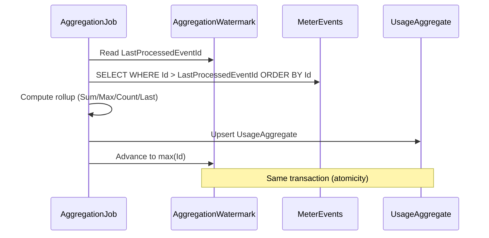

import { FileTree } from "@astrojs/starlight/components";

Granit.Metering records usage events as **append-only time-series data**, aggregates
them into rollups via a **watermark-based cursor** (guaranteed no double-counting),
and enforces quotas with threshold alerts. The module is **agnostic** — it works for
API call metering, IoT telemetry, storage tracking, or any usage-based scenario.

## Package structure

<FileTree>
- Granit.Metering/ Domain: MeterDefinition, MeterEvent, UsageAggregate, AggregationWatermark
  - Granit.Metering.EntityFrameworkCore EF Core store, insert-first dedup, watermark tracking
  - Granit.Metering.Endpoints Usage reporting, quota status, meter admin with RBAC
  - Granit.Metering.BackgroundJobs Hourly aggregation (watermark), quota threshold checks
  - Granit.Metering.Wolverine Event handlers (minimal — grows with integration)
</FileTree>

## Domain model

### MeterDefinition (AggregateRoot)

Defines what to measure and how to aggregate:

```csharp
var meter = MeterDefinition.Create(
    Guid.NewGuid(), "API Calls", "requests",
    AggregationType.Sum, "HTTP API request counter");

meter.Deactivate();  // Stops accepting new events
meter.Activate();    // Re-enables event recording
```

| Aggregation type | Description |
|-----------------|-------------|
| `Sum` | Sum of all event quantities in the period |
| `Max` | Maximum event quantity in the period |
| `Count` | Count of events (ignores quantity) |
| `Last` | Last recorded value (gauge-style) |

### MeterEvent (Entity — append-only)

MeterEvents are **time-series data** — no state transitions, no EF Core change
tracking overhead. Designed for high-throughput bulk inserts:

```csharp
var evt = MeterEvent.Create(
    Guid.NewGuid(),
    meterDefinitionId,
    idempotencyKey: $"req-{requestId}",
    quantity: 1m,
    timestamp: clock.Now,
    metadata: """{"endpoint":"/api/users","method":"GET"}""");
```

Deduplication is handled at the persistence layer via a **unique index** on
`(TenantId, IdempotencyKey)`. Duplicates are silently ignored (insert-first pattern).

### UsageAggregate (Entity)

Pre-computed rollup for fast queries:

```csharp
// Automatically computed by MeteringAggregationJob
UsageAggregate
├── MeterDefinitionId
├── Period: Hourly | Daily | BillingPeriod
├── PeriodStart / PeriodEnd
├── AggregatedValue: 15,234
└── EventCount: 15,234
```

## CQRS interfaces

| Interface | Side | Methods |
|-----------|------|---------|
| `IMeterDefinitionReader` | Query | `GetByIdAsync`, `GetByNameAsync`, `GetActiveAsync` |
| `IMeterDefinitionWriter` | Command | `AddAsync`, `UpdateAsync` |
| `IMeterEventRecorder` | Command | `RecordAsync`, `RecordBatchAsync` (dedup) |
| `IUsageReader` | Query | `GetForPeriodAsync`, `GetCurrentAsync`, `GetAllForPeriodAsync` |
| `IQuotaChecker` | Query | `CheckAsync → QuotaStatus` |
| `IQuotaLimitProvider` | Query | `GetLimitAsync` — returns plan limit (default: unlimited) |
| `IAggregationRunner` | Command | `RunAsync` — aggregates pending events for all active meters |
| `IBillingPeriodProvider` | Query | `GetCurrentPeriodAsync` — billing period boundaries for quota checks |

## Watermark-based aggregation

The aggregation job uses a **cursor pattern** to ensure idempotent rollup
computation without mutating append-only events:



:::tip[Crash safety]
If the job crashes mid-batch, the watermark is **not advanced** — the next run
re-processes from the same point. No double-counting, no data loss. No
`IsAggregated` flag on events (that would require UPDATE locks and break
the append-only model).
:::

## Quota enforcement

`IQuotaChecker` returns a `QuotaStatus` record:

```csharp
var status = await quotaChecker.CheckAsync(tenantId, meterId, ct);
// QuotaStatus { MeterName, CurrentUsage, Limit, PercentUsed, IsExceeded }

// Factory methods for edge cases
QuotaStatus.Unlimited("API Calls", 500m);           // No limit
QuotaStatus.WithLimit("API Calls", 800m, 1000m);    // 80%, not exceeded
```

### Billing period resolution

Quota checks sum **hourly aggregates** within the current billing period.
The period boundaries are resolved via `IBillingPeriodProvider`:

```csharp
public interface IBillingPeriodProvider
{
    Task<BillingPeriodBoundaries?> GetCurrentPeriodAsync(
        Guid tenantId, CancellationToken cancellationToken = default);
}
```

| Provider | Package | Resolution |
|----------|---------|------------|
| `CalendarMonthBillingPeriodProvider` | `Granit.Metering` | 1st to last day of the current month (default) |
| `SubscriptionBillingPeriodProvider` | `Granit.Subscriptions` | `Subscription.CurrentPeriodStart` / `CurrentPeriodEnd` |

When `Granit.Subscriptions` is loaded, it overrides the default with the actual
subscription billing cycle. Without it (standalone metering), the calendar month
is used as fallback.

### Threshold alerts

The `QuotaThresholdCheckJob` runs every 15 minutes and publishes:

| Event | Trigger |
|-------|---------|
| `QuotaThresholdReachedEto` | Usage >= threshold% of limit (default 80%) |
| `QuotaExceededEto` | Usage >= 100% of limit |

The threshold percentage is configurable via `GranitMeteringOptions`:

```json
{
  "Granit": {
    "Metering": {
      "ThresholdPercentage": 80
    }
  }
}
```

## Integration with Subscriptions

When a billing-period aggregation completes, `UsageSummaryReadyEto` is published.
**Subscriptions.Wolverine** consumes it and creates an invoice with usage line items:

```text
Metering ──UsageSummaryReadyEto──→ Subscriptions (orchestrator)
                                       │
                                       ├── fixed: "Pro Plan — Monthly" × 1 × 29.99
                                       ├── usage: "API Calls: 15,000 requests" × 15000 × 0.001
                                       │
                                       └──CreateInvoiceCommand──→ Invoicing
```

## Background jobs

| Job | Cron | Description |
|-----|------|-------------|
| `MeteringAggregationJob` | `0 */1 * * *` | Hourly rollup via watermark cursor |
| `QuotaThresholdCheckJob` | `*/15 * * * *` | Quota alerts at 80% and 100% |

## Observability

### Metrics (OpenTelemetry)

Meter: `Granit.Metering`

| Metric | Type | Tags |
|--------|------|------|
| `granit.metering.event.recorded` | Counter | `tenant_id`, `meter_name` |
| `granit.metering.event.deduplicated` | Counter | `tenant_id`, `meter_name` |
| `granit.metering.aggregation.completed` | Counter | `tenant_id`, `meter_name` |
| `granit.metering.quota.threshold_reached` | Counter | `tenant_id`, `meter_name` |
| `granit.metering.quota.exceeded` | Counter | `tenant_id`, `meter_name` |

### Tracing

ActivitySource `Granit.Metering` with operations: `RecordEvent`, `RecordBatch`,
`Aggregate`, `CheckQuota`.

## Database schema

Table prefix: `metering_` (configurable via `GranitMeteringDbProperties.DbTablePrefix`).

### metering_meter_definitions

| Column | Type | Notes |
|--------|------|-------|
| `Id` | GUID | Primary key |
| `Name` | varchar(200) | Meter display name |
| `Unit` | varchar(50) | Unit of measure |
| `AggregationType` | int | Sum/Max/Count/Last |
| `Activated` | bool | Accepts new events |
| `TenantId` | GUID? | Multi-tenant isolation |

### metering_meter_events

| Column | Type | Notes |
|--------|------|-------|
| `Id` | GUID | Primary key |
| `MeterDefinitionId` | GUID | FK to meter definition |
| `IdempotencyKey` | varchar(256) | Client-provided dedup key |
| `Quantity` | decimal(18,6) | Measured quantity |
| `Timestamp` | datetimeoffset | When usage occurred |
| `Metadata` | varchar(4000) | Optional JSON context |
| `TenantId` | GUID? | Multi-tenant isolation |

**Indexes:**

- `ix_metering_meter_events_dedup` — unique on `(TenantId, IdempotencyKey)`
- `ix_metering_meter_events_aggregation` — on `(TenantId, MeterDefinitionId, Id)` for watermark queries

### metering_aggregation_watermarks

| Column | Type | Notes |
|--------|------|-------|
| `Id` | GUID | Primary key |
| `MeterDefinitionId` | GUID | Which meter |
| `LastProcessedEventId` | GUID | Cursor position |
| `LastProcessedAt` | datetimeoffset? | Last aggregation time |
| `TenantId` | GUID? | Multi-tenant isolation |

## Admin API

| Method | Route | Permission |
|--------|-------|------------|
| GET | `/api/granit/metering/meters` | `Metering.Meters.Read` |
| POST | `/api/granit/metering/meters` | `Metering.Meters.Manage` |
| PUT | `/api/granit/metering/meters/{id}` | `Metering.Meters.Manage` |
| GET | `/api/granit/metering/usage` | `Metering.Usage.Read` |
| GET | `/api/granit/metering/quota/{meterId}` | `Metering.Usage.Read` |
| POST | `/api/granit/metering/events` | `Metering.Usage.Record` |

All usage endpoints require tenant context. `POST /events` validates that each
`MeterDefinitionId` in the batch belongs to the current tenant and is active.

## See also

- [SaaS Overview](/dotnet/saas/) — ecosystem architecture and choreography
- [Subscriptions](/dotnet/saas/subscriptions/) — billing cycle orchestration
- [Invoicing](/dotnet/saas/invoicing/) — invoice creation from usage data
