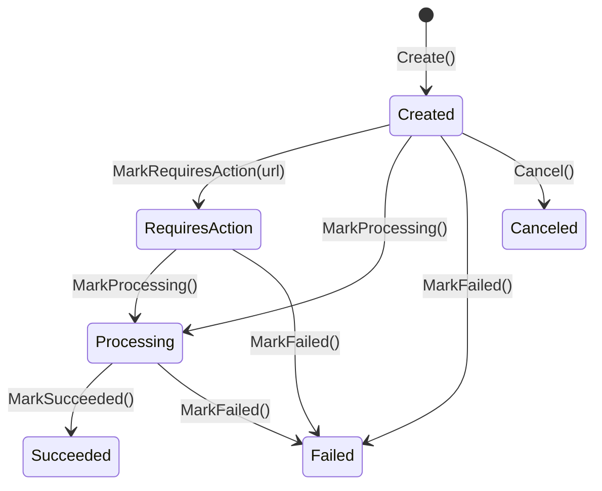

import { Tabs, TabItem, FileTree } from "@astrojs/starlight/components";

Granit.Payments provides provider-agnostic payment processing with a **multi-provider
per tenant** model. A single tenant can route Card payments to Stripe, iDEAL to Mollie,
and bank transfers to SEPA — all simultaneously. No card data ever touches Granit
(hosted payment pages only, PCI DSS compliant).

## Package structure

<FileTree>
- Granit.Payments/ Domain: PaymentTransaction, PaymentMethod, webhook dedup, provider interfaces
  - Granit.Payments.EntityFrameworkCore EF Core store, webhook dedup (insert-first)
  - Granit.Payments.Endpoints Checkout, payment methods, webhooks (AllowAnonymous + signature)
  - Granit.Payments.Wolverine InvoiceFinalizedHandler (auto-charge), webhook dispatch
  - Granit.Payments.Stripe Stripe provider (Phase 1 stub)
  - Granit.Payments.Mollie Mollie EU-sovereign provider (Phase 1 stub)
  - Granit.Payments.SepaTransfer Bank transfer + reconciliation (Phase 2)
  - Granit.Payments.SepaDirectDebit Mandate management + SDD collection (Phase 2)
</FileTree>

## Payment transaction FSM



- **Created**: payment recorded, awaiting provider
- **RequiresAction**: customer must act (3DS/SCA redirect, hosted page)
- **Processing**: async processing (SEPA, bank transfer)
- **Succeeded**: funds captured
- **Failed**: payment declined or error
- **Canceled**: cancelled by system or user

## Multi-provider resolution

```csharp
public interface IPaymentProviderResolver
{
    IPaymentProvider Resolve(Guid tenantId, PaymentMethodType methodType);
    IReadOnlyList<AvailablePaymentMethod> GetAvailableProviders(Guid tenantId);
}
```

Configuration per tenant:

```json
{
  "Payments": {
    "ProviderMappings": {
      "Card": "stripe",
      "SepaDebit": "sepa-direct-debit",
      "BankTransfer": "sepa-transfer",
      "Ideal": "mollie",
      "Bancontact": "mollie"
    }
  }
}
```

## Refund invariant

Refunds are **child entities** of `PaymentTransaction`. The aggregate enforces:

> `sum(refunds.Amount) + new.Amount <= transaction.Amount`

```csharp
var tx = PaymentTransaction.Create(..., amount: 100m, ...);
tx.MarkProcessing();
tx.MarkSucceeded("pi_123", succeededAt);

tx.RequestRefund(id, 30m, now, "Partial refund");   // OK: 30 <= 100
tx.RequestRefund(id, 60m, now, "Another refund");    // OK: 90 <= 100
tx.RequestRefund(id, 20m, now, "Too much");          // Throws: 110 > 100
```

## Dispute tracking

Disputes (chargebacks) are also child entities:

```csharp
tx.OpenDispute(id, "dp_123", "Fraudulent", 100m, now);
// Dispute status: Open → Won | Lost | Closed
```

## Webhook deduplication

Inbound webhooks use an **insert-first** dedup pattern — race-condition safe:

```text
POST /api/payments/webhooks/{provider}  [AllowAnonymous]
  1. Resolve IPaymentWebhookVerifier by {provider}
  2. VerifyAsync (signature + timestamp validation)
  3. TryRecordAsync → INSERT ProcessedWebhookEvent
     - Success: first time → dispatch command
     - DbUpdateException (unique constraint): duplicate → return 200 OK
  4. Dispatch ProcessWebhookCommand via Wolverine outbox
  5. Return 200 OK
```

`ProcessedWebhookEvent` has a unique constraint on `(ProviderName, ProviderEventId)`.

## Event choreography

```text
Invoicing ──InvoiceFinalizedEto──→ Payments (auto-charge if CollectionMethod == Auto)
Payments  ──PaymentSucceededEto──→ Invoicing (RecordPayment)
Payments  ──PaymentFailedEto────→ Invoicing (keeps Open)
```

:::caution[Payments has zero references to Subscriptions]
Payments never knows about subscriptions. It only communicates with Invoicing.
The cascade to Subscriptions goes through Invoicing (`InvoicePaidEto`).
:::

## Checkout flow

```csharp
// 1. Customer selects payment method type
var methods = providerResolver.GetAvailableProviders(tenantId);
// → [Card (Stripe), BankTransfer (SEPA), iDEAL (Mollie)]

// 2. Resolve provider for selected method
var provider = providerResolver.Resolve(tenantId, PaymentMethodType.Card);

// 3. Create checkout session (hosted page)
var session = await checkoutFactory.CreateAsync(
    invoiceId, amount, currency, returnUrl, ct);
// → { Url: "https://checkout.stripe.com/...", SessionId: "cs_xxx" }
```

## Admin API

| Method | Route | Permission |
|--------|-------|------------|
| GET | `/api/payments/transactions` | `Payments.Transactions.Read` |
| GET | `/api/payments/transactions/{id}` | `Payments.Transactions.Read` |
| POST | `/api/payments/charge` | `Payments.Charges.Execute` |
| POST | `/api/payments/refund` | `Payments.Refunds.Execute` |
| POST | `/api/payments/checkout` | `Payments.Charges.Execute` |
| GET | `/api/payments/methods` | `Payments.Methods.Read` |
| POST | `/api/payments/methods` | `Payments.Methods.Manage` |
| DELETE | `/api/payments/methods/{id}` | `Payments.Methods.Manage` |
| POST | `/api/payments/webhooks/{provider}` | `[AllowAnonymous]` |

Charge and checkout endpoints use `Granit.Http.Idempotency` (`[Idempotent]`)
to prevent double charges.

## See also

- [SaaS Overview](/dotnet/saas/) — ecosystem architecture and choreography
- [Invoicing](/dotnet/saas/invoicing/) — invoice lifecycle and partial payments
- [Subscriptions](/dotnet/saas/subscriptions/) — billing cycle orchestration
