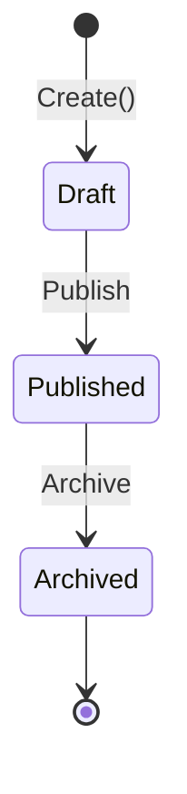
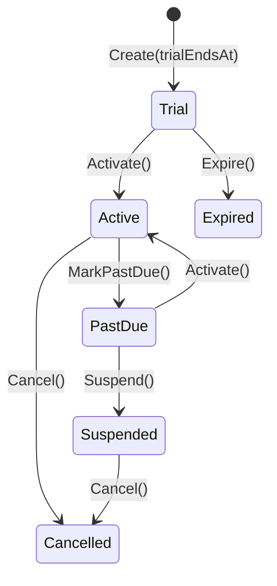
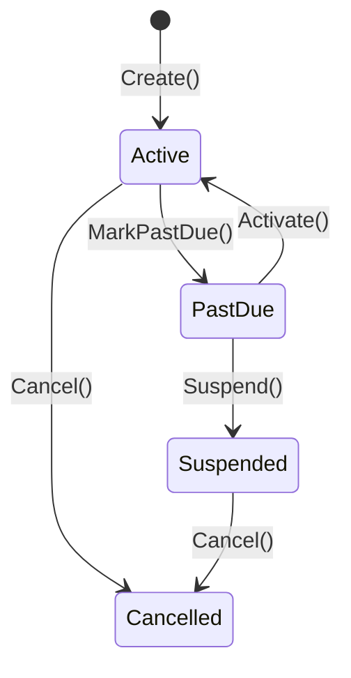

import { Tabs, TabItem, FileTree } from "@astrojs/starlight/components";

Granit.Subscriptions is the **billing cycle orchestrator** of the SaaS ecosystem.
It manages plan catalogs, subscription lifecycles, seat assignments, and coordinates
with [Invoicing](/dotnet/saas/invoicing/) and [Metering](/dotnet/saas/metering/) to
produce invoices at the right time with the right line items.

## Package structure

<FileTree>
- Granit.Subscriptions/ Domain: Plan, Subscription, seats, workflows, provider abstraction
  - Granit.Subscriptions.EntityFrameworkCore EF Core store (SQL Server / PostgreSQL)
  - Granit.Subscriptions.Endpoints Minimal API (plans, subscriptions, seats) with RBAC
  - Granit.Subscriptions.Wolverine Event handlers (provider sync, usage → invoice)
  - Granit.Subscriptions.BackgroundJobs Trial expiration, period end, cancel-at-period-end scans
  - Granit.Subscriptions.Features Bridge to Granit.Features (IPlanIdProvider + IPlanFeatureStore)
  - Granit.Subscriptions.Internal No-op provider for self-hosted mode (zero dependencies)
</FileTree>

## Plan lifecycle

Plans follow a `WorkflowLifecycleStatus` managed by `Granit.Workflow`:



- **Draft**: mutable — prices, features, metadata can be modified
- **Published**: available for purchase, immutable
- **Archived**: not purchasable, but existing subscribers keep their plan

```csharp
var plan = Plan.Create(
    Guid.NewGuid(), "Pro", "Professional plan",
    PricingModel.PerSeat, BillingInterval.Monthly,
    trialDays: 14, seatLimit: 50);

plan.AddPrice(PlanPrice.Create(Guid.NewGuid(), 29.99m, "EUR", BillingInterval.Monthly));
plan.AddPrice(PlanPrice.Create(Guid.NewGuid(), 299.99m, "EUR", BillingInterval.Yearly));
```

### Pricing models

| Model | Description |
|-------|-------------|
| `Flat` | Fixed price per interval |
| `PerSeat` | Price multiplied by seat count |
| `PerUnit` | Price per unit of consumption |
| `Tiered` | Volume-based pricing tiers |

## Subscription FSM

Two workflow definitions depending on whether the plan has a trial:

<Tabs>
<TabItem label="With trial">



</TabItem>
<TabItem label="Direct (no trial)">



</TabItem>
</Tabs>

All state transition methods are **idempotent** — they return `bool` (`true` if
state actually changed, `false` if already in target state). This prevents
webhook ping-pong between Granit and external providers.

## Hybrid provider model

Granit is the **source of truth** for subscription status. Providers are executors
with declared capabilities:

```csharp
public interface ISubscriptionProvider
{
    string Name { get; }
    SubscriptionProviderCapabilities Capabilities { get; }

    Task CreateExternalAsync(Subscription subscription, CancellationToken ct);
    Task CancelExternalAsync(SubscriptionExternalMapping mapping,
        bool atPeriodEnd, CancellationToken ct);
}

[Flags]
public enum SubscriptionProviderCapabilities
{
    None           = 0,
    Provisioning   = 1,
    Cancellation   = 2,
    PlanChange     = 4,
    TrialManagement = 8,
    SeatManagement = 16,
}
```

Built-in providers:

| Provider | Package | Capabilities |
|----------|---------|-------------|
| Internal | `Granit.Subscriptions.Internal` | None (no-op, zero dependency) |
| Stripe | `Granit.Subscriptions.Stripe` | All (Phase 2) |

## Billing cycle orchestration

Subscriptions acts as the **billing cycle orchestrator** (Stripe Billing model).
At period end, it combines fixed charges and usage charges into a single invoice:

```text
SaasMetering ──UsageSummaryReadyEto──→ Subscriptions
                                           │
                                           ├── fixed line items (plan price)
                                           ├── usage line items (from IUsageReader)
                                           │
                                           └──CreateInvoiceCommand──→ Invoicing
```

## Seat management

```csharp
// Assign a seat
subscription.AssignSeat(SubscriptionSeat.Create(Guid.NewGuid(), userId));

// Revoke a seat
subscription.RevokeSeat(userId);

// Seat limit enforced by Plan.SeatLimit
```

CQRS split: `ISeatReader` (query) / `ISeatWriter` (command).

## Background jobs

| Job | Cron | Description |
|-----|------|-------------|
| `TrialExpirationScanJob` | `0 */4 * * *` | Detects expiring/expired trials |
| `PeriodEndScanJob` | `0 */1 * * *` | Detects subscriptions at billing period end |
| `CancelAtPeriodEndScanJob` | `0 */2 * * *` | Processes cancel-at-period-end flag |

## Features bridge

`Granit.Subscriptions.Features` implements `IPlanIdProvider` and `IPlanFeatureStore`
from `Granit.Features`. This enables automatic feature resolution per plan — existing
feature flag cascade works without any additional configuration.

## Admin API

| Method | Route | Permission |
|--------|-------|------------|
| GET | `/api/granit/subscriptions/plans` | `Subscriptions.Plans.Read` |
| POST | `/api/granit/subscriptions/plans` | `Subscriptions.Plans.Manage` |
| GET | `/api/granit/subscriptions/subscriptions` | `Subscriptions.Subscriptions.Read` |
| POST | `/api/granit/subscriptions/subscriptions` | `Subscriptions.Subscriptions.Manage` |
| GET | `/api/granit/subscriptions/seats` | `Subscriptions.Seats.Read` |
| POST | `/api/granit/subscriptions/seats` | `Subscriptions.Seats.Manage` |

## Notifications

`Granit.Subscriptions.Notifications` defines 6 notification types:

| Type | Name | Severity | Opt-out |
|------|------|----------|---------|
| `TrialExpiringNotificationType` | `Subscriptions.TrialExpiring` | Warning | Yes |
| `TrialExpiredNotificationType` | `Subscriptions.TrialExpired` | Info | No |
| `PlanChangedNotificationType` | `Subscriptions.PlanChanged` | Info | Yes |
| `CancellationConfirmedNotificationType` | `Subscriptions.CancellationConfirmed` | Info | No |
| `SuspensionWarningNotificationType` | `Subscriptions.SuspensionWarning` | Error | No |
| `ScheduledChangeReminderNotificationType` | `Subscriptions.ScheduledChangeReminder` | Info | Yes |

Default channels: Email + InApp. Email templates are Phase 2 (requires `Granit.Templating`).

## See also

- [SaaS Overview](/dotnet/saas/) — ecosystem architecture and choreography
- [Invoicing](/dotnet/saas/invoicing/) — invoice creation and payment tracking
- [Payments](/dotnet/saas/payments/) — provider-agnostic payment processing
- [Metering](/dotnet/saas/metering/) — usage-based metering
- [Scheduling](/dotnet/infrastructure/scheduling/) — scheduled plan changes
- [Feature Flags](/dotnet/infrastructure/feature-flags/) — plan-driven cascade
