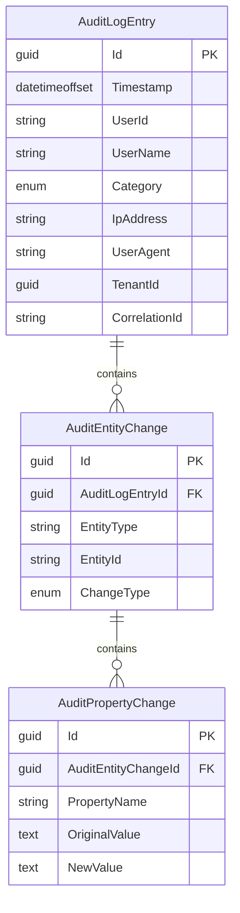

import { Tabs, TabItem, FileTree, Badge } from "@astrojs/starlight/components";

Granit.AuditLog provides a turnkey audit trail solution for ISO 27001 A.12.4 compliance.
It automatically captures entity changes from EF Core's ChangeTracker and persists them
in a hierarchical model: **AuditLogEntry → AuditEntityChange → AuditPropertyChange**.

## Package structure

<FileTree>
- Granit.AuditLog/ Abstractions, domain types, interfaces, options
  - Granit.AuditLog.EntityFrameworkCore/ Isolated DbContext, interceptor, persistence, cleanup
  - Granit.AuditLog.Endpoints/ Read-only Minimal API endpoints
</FileTree>

| Package | Role | Depends on |
| ------- | ---- | ---------- |
| `Granit.AuditLog` | Domain types, enums, `IAuditLogReader`, `IAuditLogWriter`, options | `Granit.Core`, `Granit.Querying` |
| `Granit.AuditLog.EntityFrameworkCore` | `AuditLogDbContext`, interceptor, Channel persistence, cleanup worker | `Granit.AuditLog`, `Granit.Persistence` |
| `Granit.AuditLog.Endpoints` | `GET /audit-log` endpoints (read-only, authorized) | `Granit.AuditLog`, `Granit.Http.ApiDocumentation` |

## Quick start

### 1. Install packages

```bash
dotnet add package Granit.AuditLog.EntityFrameworkCore
dotnet add package Granit.AuditLog.Endpoints   # optional — admin API
```

### 2. Register services

```csharp
// Program.cs
builder.AddGranitAuditLogEntityFrameworkCore(options =>
    options.UseNpgsql(builder.Configuration.GetConnectionString("AuditLog")));
```

### 3. Add the interceptor to your DbContext

```csharp
services.AddDbContextFactory<AppDbContext>((sp, options) =>
{
    options.UseNpgsql(connectionString);
    options.UseGranitInterceptors(sp);
    options.UseGranitAuditLogInterceptor(sp);  // AFTER UseGranitInterceptors
}, ServiceLifetime.Scoped);
```

### 4. Map endpoints (optional)

```csharp
app.MapAuditLogEndpoints();
```

That's it. Every `SaveChanges` on your `AppDbContext` now produces audit entries automatically.

## Domain model

The hierarchical model captures **who** did **what**, **when**, on **which entities**,
down to **individual property changes**.



## Audit log categories

Inspired by Google Cloud Audit Logs, entries are classified into categories
with different retention defaults:

| Category | Description | Default retention | Always logged? |
| -------- | ----------- | ----------------- | -------------- |
| `DataMutation` | Entity Create / Update / Delete / SoftDelete | 365 days | Yes |
| `ConfigurationChange` | Settings, feature flags | ~7 years | Yes |
| `DataAccess` | Read operations | 90 days | Opt-in |
| `AccessDenied` | Authorization failures | ~7 years | Opt-in |

## Persistence modes

<Tabs>
  <TabItem label="Async (default)">
    Entries are published to an in-memory `Channel<T>` and persisted by a background
    worker. **Zero latency impact** on `SaveChanges`, but entries may be lost on crash.

    ```json
    { "AuditLog": { "PersistenceMode": "Async" } }
    ```
  </TabItem>
  <TabItem label="Strict">
    Entries are persisted synchronously within the interceptor's `SavedChangesAsync`
    callback. **Guaranteed durability** at the cost of added latency.
    Required for ISO 27001 strict compliance (banking, HDS).

    ```json
    { "AuditLog": { "PersistenceMode": "Strict" } }
    ```
  </TabItem>
</Tabs>

## Controlling what gets audited

### Skip an entity or property

```csharp
[AuditIgnore]
public class CacheEntry : Entity { ... }

public class Patient : AuditedEntity
{
    public string Name { get; set; }

    [AuditIgnore]
    public byte[] ProfilePhoto { get; set; }  // Large binary, not audited
}
```

### Mask sensitive values

```csharp
public class Patient : AuditedEntity
{
    [AuditSensitive]
    public string NationalId { get; set; }  // Stored as "***" in audit trail
}
```

## Querying the audit trail

### Via `IAuditLogReader` (code)

```csharp
public class MyService(IAuditLogReader auditLogReader)
{
    public async Task<PagedResult<AuditLogEntry>> GetPatientHistoryAsync(
        string patientId, CancellationToken ct) =>
        await auditLogReader.GetByEntityAsync("Patient", patientId, cancellationToken: ct);
}
```

### Via admin endpoints

| Method | Route | Description |
| ------ | ----- | ----------- |
| `GET` | `/audit-log` | Paginated list with filters (category, date, user, entity) |
| `GET` | `/audit-log/{id}` | Single entry with full entity + property change hierarchy |
| `GET` | `/audit-log/entity/{type}/{id}` | Audit trail for a specific entity (GDPR SAR) |

All endpoints require the `AuditLog.Read` authorization policy (configurable).

## Retention and cleanup

The `AuditLogCleanupWorker` runs periodically and deletes expired entries
by category. Retention periods are configurable:

```json
{
  "AuditLog": {
    "ConfigurationChangeRetention": "2555.00:00:00",
    "DataMutationRetention": "365.00:00:00",
    "DataAccessRetention": "90.00:00:00",
    "AccessDeniedRetention": "2555.00:00:00",
    "CleanupInterval": "1.00:00:00",
    "CleanupBatchSize": 10000
  }
}
```

Deletes use `ExecuteDeleteAsync` in batches to avoid long-running transactions.
Cascade deletes automatically remove child `AuditEntityChange` and
`AuditPropertyChange` rows.

## Observability

| Signal | Name | Description |
| ------ | ---- | ----------- |
| Tracing | `Granit.AuditLog` | ActivitySource for capture, persist, cleanup spans |
| Metric | `granit.auditlog.entries.persisted` | Counter — entries successfully persisted |
| Metric | `granit.auditlog.entries.purged` | Counter — entries purged by cleanup (by category) |
| Metric | `granit.auditlog.capture.errors` | Counter — errors during change tracking capture |

## Configuration reference

| Key | Type | Default | Description |
| --- | ---- | ------- | ----------- |
| `PersistenceMode` | `Async` / `Strict` | `Async` | How entries are persisted |
| `EnablePropertyTracking` | `bool` | `true` | Capture property-level old/new values |
| `PersistenceBatchSize` | `int` | `50` | Entries per background worker batch (Async only) |
| `ConfigurationChangeRetention` | `TimeSpan` | `2555d` | Retention for config changes |
| `DataMutationRetention` | `TimeSpan` | `365d` | Retention for entity CRUD |
| `DataAccessRetention` | `TimeSpan` | `90d` | Retention for read operations |
| `AccessDeniedRetention` | `TimeSpan` | `2555d` | Retention for auth failures |
| `CleanupInterval` | `TimeSpan` | `24h` | Interval between cleanup runs |
| `CleanupBatchSize` | `int` | `10000` | Max entries deleted per batch |

## See also

- [Persistence](/dotnet/data/persistence/) — `AuditedEntityInterceptor` and entity base classes
- [Privacy](/dotnet/security/privacy/) — GDPR data subject access requests
- [Security](/dotnet/security/security-overview/) — `ICurrentUserService` and actor resolution
