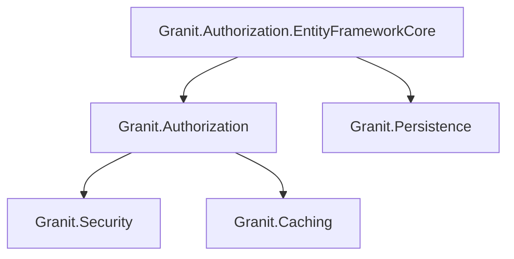
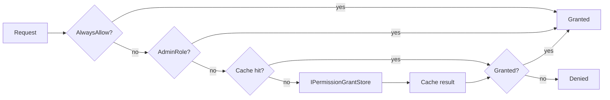

import { FileTree } from "@astrojs/starlight/components";

Dynamic RBAC permission system with module-scoped permission definitions, a policy
provider backed by distributed cache, and an EF Core grant store for persistent
role-permission assignments.

## Package structure

<FileTree>

- Granit.Authorization/ Dynamic RBAC, permission definitions, policy provider
  - Granit.Authorization.EntityFrameworkCore EF Core permission grant store
  - Granit.Authorization.Endpoints Permission management HTTP endpoints

</FileTree>

| Package | Role | Depends on |
|---------|------|------------|
| `Granit.Authorization` | RBAC permissions, dynamic policy provider | `Granit.Security`, `Granit.Caching` |
| `Granit.Authorization.EntityFrameworkCore` | EF Core permission grant store | `Granit.Authorization`, `Granit.Persistence` |

## Dependency graph



## Setup

```csharp
[DependsOn(typeof(GranitAuthorizationModule))]
public class AppModule : GranitModule { }
```

With EF Core persistence:

```csharp
[DependsOn(typeof(GranitAuthorizationEntityFrameworkCoreModule))]
public class AppModule : GranitModule
{
    public override void ConfigureServices(ServiceConfigurationContext context)
    {
        context.Services.AddGranitAuthorizationEntityFrameworkCore<AppDbContext>();
    }
}
```

## Permission definitions

Modules declare their permissions via `IPermissionDefinitionProvider`:

```csharp
public class InvoicePermissionDefinitionProvider : IPermissionDefinitionProvider
{
    public void DefinePermissions(IPermissionDefinitionContext context)
    {
        var group = context.AddGroup("Invoices", "Invoice management");
        group.AddPermission("Invoices.Invoices.Read", "View invoices");
        group.AddPermission("Invoices.Invoices.Create", "Create invoices");
        group.AddPermission("Invoices.Invoices.Update", "Edit invoices");
        group.AddPermission("Invoices.Invoices.Delete", "Delete invoices");
    }
}
```

**Naming convention:** `[Module].[Resource].[Action]`

Standard actions: `Read`, `Create`, `Update`, `Delete`, `Manage` (all CRUD), `Execute` (non-CRUD).

## Permission checking pipeline



The `PermissionChecker` evaluates in order:

1. `AlwaysAllow` option (development only)
2. Admin role bypass — users with any role in `AdminRoles` get all permissions
3. Per-role cache lookup (key: `perm:{tenantId}:{roleName}:{permissionName}`)
4. `IPermissionGrantStore` fallback (default: `NullPermissionGrantStore` — always denied)

## Using permissions

```csharp
// Option 1: Attribute on endpoint
app.MapGet("/invoices", [Permission("Invoices.Invoices.Read")] async (
    AppDbContext db,
    CancellationToken cancellationToken) =>
{
    return await db.Invoices
        .ToListAsync(cancellationToken)
        .ConfigureAwait(false);
});

// Option 2: Imperative check
public class InvoiceService(IPermissionChecker permissionChecker)
{
    public async Task DeleteAsync(Guid id, CancellationToken cancellationToken)
    {
        if (!await permissionChecker.IsGrantedAsync(
            "Invoices.Invoices.Delete", cancellationToken)
            .ConfigureAwait(false))
        {
            throw new ForbiddenException("Not authorized to delete invoices");
        }
        // ...
    }
}
```

## Configuration

```json
{
  "Authorization": {
    "AdminRoles": ["admin"],
    "CacheDuration": "00:05:00",
    "AlwaysAllow": false
  }
}
```

| Property | Default | Description |
|----------|---------|-------------|
| `AdminRoles` | `["admin"]` | Roles that bypass all permission checks |
| `CacheDuration` | `00:05:00` | Per-role permission cache TTL |
| `AlwaysAllow` | `false` | Skip all checks (development only) |

:::danger
Never set `AlwaysAllow: true` in production. This disables the entire authorization
pipeline. The option validator rejects it outside `Development` environment.
:::

## EF Core permission store

`Granit.Authorization.EntityFrameworkCore` replaces `NullPermissionGrantStore` with a
real store backed by EF Core.

**Entity:**

```csharp
public class PermissionGrant : AuditedEntity, IMultiTenant
{
    public string Name { get; set; } = string.Empty;     // Permission name
    public string RoleName { get; set; } = string.Empty;  // Role granted to
    public Guid? TenantId { get; set; }                   // Tenant scope (null = global)
}
// Unique index: (TenantId, Name, RoleName)
```

**DbContext integration:**

```csharp
public class AppDbContext : DbContext, IPermissionGrantDbContext
{
    public DbSet<PermissionGrant> PermissionGrants => Set<PermissionGrant>();
}
```

**Managing grants:**

```csharp
public class PermissionAdminService(
    IPermissionManagerWriter writer,
    IPermissionManagerReader reader)
{
    public async Task GrantAsync(
        string roleName, string permissionName, CancellationToken cancellationToken)
    {
        await writer.SetAsync(permissionName, roleName, tenantId: null,
            isGranted: true, cancellationToken)
            .ConfigureAwait(false);
    }

    public async Task<IReadOnlyList<string>> GetGrantedAsync(
        string roleName, CancellationToken cancellationToken)
    {
        return await reader.GetGrantedPermissionsAsync(roleName, tenantId: null,
            cancellationToken)
            .ConfigureAwait(false);
    }
}
```

All grant changes are audit-logged via `AuditedEntity` (ISO 27001 — 3-year retention).

## Public API summary

| Category | Key types | Package |
|----------|-----------|---------|
| Modules | `GranitAuthorizationModule`, `GranitAuthorizationEntityFrameworkCoreModule` | — |
| Abstractions | `IPermissionDefinitionProvider`, `IPermissionDefinitionManager`, `IPermissionChecker`, `IPermissionGrantStore`, `PermissionAttribute` | `Granit.Authorization` |
| Options | `GranitAuthorizationOptions` | — |
| EF Core | `PermissionGrant`, `IPermissionGrantDbContext`, `IPermissionManagerReader`, `IPermissionManagerWriter` | `Granit.Authorization.EntityFrameworkCore` |
| Extensions | `AddGranitAuthorization()`, `AddGranitAuthorizationEntityFrameworkCore<T>()` | — |

## See also

- [Authentication](/dotnet/security/authentication/) -- JWT Bearer, claims transformation
- [Security](/dotnet/security/security/) -- core abstractions (ICurrentUserService, ActorKind)
- [Persistence](/dotnet/data/persistence/) -- `AuditedEntity` base class, interceptors
