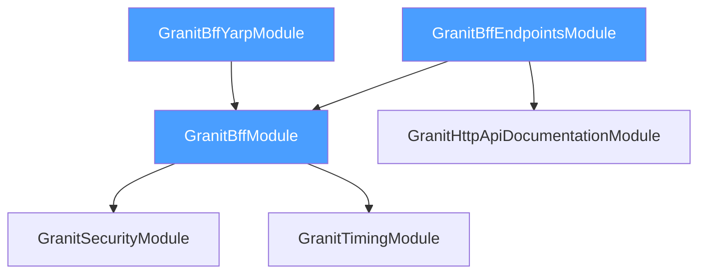

import { Tabs, TabItem, Badge, Aside } from "@astrojs/starlight/components";

## Full appsettings.json example

This is a complete configuration example covering all BFF, YARP, and Redis options:

```json
{
  "Bff": {
    "Authority": "https://auth.example.com",
    "ClientId": "my-bff",
    "ClientSecret": "bff-secret-from-vault",
    "Scopes": ["openid", "profile", "email", "roles", "offline_access"],
    "SessionCookieName": "__Host-granit-bff",
    "SessionDuration": "08:00:00",
    "RefreshGracePeriod": "00:01:00",
    "PostLoginRedirectPath": "/",
    "PostLogoutRedirectPath": "/"
  },

  "ReverseProxy": {
    "Routes": {
      "api-authenticated": {
        "ClusterId": "backend-api",
        "Match": {
          "Path": "/api/{**catch-all}"
        },
        "Metadata": {
          "Granit.Bff.RequireAuth": "true"
        }
      },
      "public-api": {
        "ClusterId": "backend-api",
        "Match": {
          "Path": "/public/{**catch-all}"
        }
      },
      "health": {
        "ClusterId": "backend-api",
        "Match": {
          "Path": "/health"
        }
      }
    },
    "Clusters": {
      "backend-api": {
        "Destinations": {
          "primary": {
            "Address": "https://api.example.com"
          }
        }
      }
    }
  },

  "ConnectionStrings": {
    "Redis": "redis.example.com:6380,ssl=true,password=secret,abortConnect=false"
  }
}
```

## GranitBffOptions

Bind from the `Bff` configuration section. Section name constant: `GranitBffOptions.SectionName`.

| Property | Type | Default | Description |
|----------|------|---------|-------------|
| `Authority` | `Uri` | *(required)* | OIDC authority URL. Must expose `/.well-known/openid-configuration`. |
| `ClientId` | `string` | `""` | Client ID for the BFF confidential client. |
| `ClientSecret` | `string` | `""` | Client secret. Use Vault in production. |
| `Scopes` | `string[]` | `["openid", "profile", "email", "roles", "offline_access"]` | Scopes requested during authorization. |
| `SessionCookieName` | `string` | `"__Host-granit-bff"` | Session cookie name. Must start with `__Host-` for security. |
| `SessionDuration` | `TimeSpan` | `08:00:00` (8 hours) | Absolute session lifetime. Controls both cookie `Max-Age` and cache TTL. |
| `RefreshGracePeriod` | `TimeSpan` | `00:01:00` (1 minute) | Access token is refreshed this long before expiry. |
| `PostLoginRedirectPath` | `string` | `"/"` | Path to redirect to after successful login. |
| `PostLogoutRedirectPath` | `string` | `"/"` | Path to redirect to after logout. |
| `UsePushedAuthorizationRequests` | `bool` | `false` | Use Pushed Authorization Requests (RFC 9126). When `true`, the BFF posts authorization parameters to `/connect/par` and redirects with only the `request_uri`. Requires the OIDC server to support PAR. |

### Configuration binding

`GranitBffOptions` is bound automatically by `AddGranitBffYarp()`:

```csharp
builder.Services.Configure<GranitBffOptions>(
    builder.Configuration.GetSection(GranitBffOptions.SectionName));
```

You can also configure it manually:

```csharp
builder.Services.Configure<GranitBffOptions>(options =>
{
    options.Authority = new Uri("https://auth.example.com");
    options.ClientId = "my-bff";
    options.SessionDuration = TimeSpan.FromHours(4);
});
```

## YARP configuration

### Routes

Each route maps a URL pattern to a backend cluster:

```json
{
  "Routes": {
    "{route-id}": {
      "ClusterId": "{cluster-id}",
      "Match": {
        "Path": "/api/{**catch-all}",
        "Hosts": ["app.example.com"],
        "Methods": ["GET", "POST"]
      },
      "Metadata": {
        "Granit.Bff.RequireAuth": "true"
      },
      "Transforms": [
        { "PathRemovePrefix": "/api/v2" },
        { "PathPrefix": "/api" }
      ]
    }
  }
}
```

| Field | Required | Description |
|-------|----------|-------------|
| `ClusterId` | Yes | Target cluster (backend service) |
| `Match.Path` | Yes | URL pattern. `{**catch-all}` captures all remaining segments. |
| `Match.Hosts` | No | Restrict route to specific host headers |
| `Match.Methods` | No | Restrict to specific HTTP methods |
| `Metadata` | No | Key-value pairs. Use `Granit.Bff.RequireAuth` for BFF auth. |
| `Transforms` | No | Path/header transformations before forwarding |

### Clusters

Each cluster defines one or more backend destinations:

```json
{
  "Clusters": {
    "{cluster-id}": {
      "LoadBalancingPolicy": "RoundRobin",
      "Destinations": {
        "{destination-id}": {
          "Address": "https://api.example.com"
        }
      },
      "HttpClient": {
        "MaxConnectionsPerServer": 100,
        "RequestHeaderEncoding": "utf-8"
      },
      "HealthCheck": {
        "Active": {
          "Enabled": true,
          "Interval": "00:00:30",
          "Timeout": "00:00:10",
          "Path": "/health"
        }
      }
    }
  }
}
```

| Field | Required | Description |
|-------|----------|-------------|
| `Destinations.{id}.Address` | Yes | Backend service URL |
| `LoadBalancingPolicy` | No | `FirstAlphabetical`, `RoundRobin`, `Random`, `LeastRequests`, `PowerOfTwoChoices` |
| `HttpClient.MaxConnectionsPerServer` | No | Connection pool limit (default: unlimited) |
| `HealthCheck.Active.Enabled` | No | Enable active health probing |
| `HealthCheck.Active.Path` | No | Health check endpoint path |
| `HealthCheck.Active.Interval` | No | Check interval |

### BFF-specific metadata keys

| Key | Values | Default | Description |
|-----|--------|---------|-------------|
| `Granit.Bff.RequireAuth` | `"true"` / `"false"` | Not set (= no auth) | Enables token injection + CSRF validation |

## Environment-specific overrides

<Tabs>
<TabItem label="Development">

```json
// appsettings.Development.json
{
  "Bff": {
    "Authority": "https://localhost:5002",
    "ClientId": "my-bff-dev",
    "ClientSecret": "dev-secret",
    "SessionDuration": "24:00:00"
  },
  "ReverseProxy": {
    "Clusters": {
      "backend-api": {
        "Destinations": {
          "primary": {
            "Address": "https://localhost:5001"
          }
        }
      }
    }
  },
  "ConnectionStrings": {
    "Redis": "localhost:6379"
  }
}
```

</TabItem>
<TabItem label="Staging">

```json
// appsettings.Staging.json
{
  "Bff": {
    "Authority": "https://auth.staging.example.com",
    "ClientId": "my-bff-staging",
    "SessionDuration": "08:00:00"
  },
  "ReverseProxy": {
    "Clusters": {
      "backend-api": {
        "Destinations": {
          "primary": {
            "Address": "https://api.staging.example.com"
          }
        }
      }
    }
  },
  "ConnectionStrings": {
    "Redis": "redis.staging.internal:6380,ssl=true"
  }
}
```

</TabItem>
<TabItem label="Production">

```json
// appsettings.Production.json
{
  "Bff": {
    "Authority": "https://auth.example.com",
    "ClientId": "my-bff",
    "SessionDuration": "08:00:00",
    "RefreshGracePeriod": "00:02:00"
  },
  "ReverseProxy": {
    "Clusters": {
      "backend-api": {
        "LoadBalancingPolicy": "RoundRobin",
        "Destinations": {
          "instance-1": {
            "Address": "https://api-1.internal:5001"
          },
          "instance-2": {
            "Address": "https://api-2.internal:5001"
          }
        },
        "HealthCheck": {
          "Active": {
            "Enabled": true,
            "Interval": "00:00:30",
            "Path": "/health"
          }
        }
      }
    }
  },
  "ConnectionStrings": {
    "Redis": "redis.prod.internal:6380,ssl=true"
  }
}
```

</TabItem>
</Tabs>

<Aside type="caution" title="Client secret in production">
Never store `ClientSecret` in `appsettings.Production.json`. Use
[Granit.Vault](/dotnet/security/vault-encryption/) or environment variables:

```bash
export Bff__ClientSecret="secret-from-vault"
```

The `__` separator maps to the JSON hierarchy: `Bff.ClientSecret`.
</Aside>

## Metrics reference

The `BffMetrics` class (meter name: `Granit.Bff`) exposes 6 counters.
All counters include the `tenant_id` tag (coalesced to `"global"` when null).

| Metric name | Type | Tags | Description |
|-------------|------|------|-------------|
| `granit.bff.logins` | Counter | `tenant_id` | Successful BFF logins (callback completed) |
| `granit.bff.logouts` | Counter | `tenant_id` | BFF logouts (session cleared) |
| `granit.bff.token.refreshes` | Counter | `tenant_id` | Silent token refreshes by the YARP proxy |
| `granit.bff.proxy.requests` | Counter | `tenant_id` | Total requests proxied through BFF |
| `granit.bff.proxy.errors` | Counter | `tenant_id`, `reason` | Proxy errors (see reason values below) |
| `granit.bff.csrf.rejections` | Counter | `tenant_id` | Requests rejected due to invalid CSRF token |

### Proxy error reasons

The `granit.bff.proxy.errors` counter includes a `reason` tag:

| Reason | Description |
|--------|-------------|
| `missing_session` | No session cookie in the request |
| `expired_session` | Session ID not found in Redis (expired or revoked) |
| `refresh_failed` | Token refresh request to the IdP failed |

### Grafana dashboard query examples

```promql
# Login rate per minute
rate(granit_bff_logins_total[5m])

# CSRF rejection rate (security alert if this spikes)
rate(granit_bff_csrf_rejections_total[5m])

# Token refresh success rate
rate(granit_bff_token_refreshes_total[5m])
  / (rate(granit_bff_token_refreshes_total[5m])
     + rate(granit_bff_proxy_errors_total{reason="refresh_failed"}[5m]))

# Proxy error breakdown by reason
sum by (reason) (rate(granit_bff_proxy_errors_total[5m]))
```

## ActivitySource operations

The `BffActivitySource` (name: `Granit.Bff`) provides distributed tracing spans
for all BFF operations. Registered automatically via `GranitActivitySourceRegistry`.

| Operation | Triggered by | Description |
|-----------|-------------|-------------|
| `bff.login` | `GET /bff/login` | OIDC authorization redirect |
| `bff.callback` | `GET /bff/callback` | Code exchange + session creation |
| `bff.logout` | `GET /bff/logout` | Session cleanup + IdP logout |
| `bff.user` | `GET /bff/user` | User claims extraction |
| `bff.token-refresh` | YARP token injection | Silent token refresh |
| `bff.proxy` | YARP token injection | Proxied API request |

### Trace example

A typical authenticated API call produces this trace:

```text
[bff.proxy] 2.3ms
  |-- Redis GET bff:session:abc123  0.4ms
  |-- [bff.token-refresh] 145ms    (only if token was refreshed)
  |     |-- HTTP POST /connect/token  142ms
  |     |-- Redis SET bff:session:abc123  0.3ms
  |-- HTTP GET https://api.internal/products  12ms
```

## Module dependencies



### DI registrations

| Service | Lifetime | Implementation | Package |
|---------|----------|----------------|---------|
| `IBffTokenStore` | Scoped | `DistributedCacheBffTokenStore` | `Granit.Bff` |
| `IBffCsrfTokenGenerator` | Singleton | `HmacBffCsrfTokenGenerator` | `Granit.Bff` |
| `BffMetrics` | Singleton | `BffMetrics` | `Granit.Bff` |
| `BffTokenInjectionTransform` | Scoped | `BffTokenInjectionTransform` | `Granit.Bff.Yarp` |
| `BffCsrfValidationTransform` | Scoped | `BffCsrfValidationTransform` | `Granit.Bff.Yarp` |

All registrations use `TryAdd*` — you can replace any service with a custom
implementation by registering your own before calling `AddGranit<AppModule>()`.

## HttpClient configuration

The BFF uses a named `HttpClient` (`"Granit.Bff"`) for token exchange and refresh
calls to the identity provider. Configure it to your needs:

```csharp
builder.Services.AddHttpClient("Granit.Bff", client =>
{
    client.Timeout = TimeSpan.FromSeconds(10);
    client.DefaultRequestHeaders.Add("Accept", "application/json");
})
.ConfigurePrimaryHttpMessageHandler(() => new SocketsHttpHandler
{
    // Connection pooling
    MaxConnectionsPerServer = 10,
    PooledConnectionLifetime = TimeSpan.FromMinutes(5),

    // TLS
    SslOptions = new System.Net.Security.SslClientAuthenticationOptions
    {
        // Custom certificate validation if needed
    },
});
```

<Aside type="caution" title="Timeout configuration">
Set a reasonable timeout (10-15 seconds) for the IdP HTTP client. A hung IdP
connection during token refresh will block the proxied request. The default
`HttpClient` timeout is 100 seconds, which is too long for a synchronous
refresh in the request path.
</Aside>

## Distributed cache configuration

The `IBffTokenStore` uses `IDistributedCache`. Any provider works, but Redis
is recommended for production:

<Tabs>
<TabItem label="Redis (production)">

```csharp
builder.Services.AddStackExchangeRedisCache(options =>
{
    options.Configuration = builder.Configuration.GetConnectionString("Redis");
    options.InstanceName = "bff:";
});
```

</TabItem>
<TabItem label="Memory (development)">

```csharp
builder.Services.AddDistributedMemoryCache();
```

<Aside type="caution" title="Not for production">
The in-memory distributed cache is not shared across instances. It is suitable for
development and testing only. In production with multiple BFF instances behind a
load balancer, each instance would have its own isolated cache, causing session
lookups to fail.
</Aside>

</TabItem>
<TabItem label="SQL Server">

```csharp
builder.Services.AddDistributedSqlServerCache(options =>
{
    options.ConnectionString = builder.Configuration.GetConnectionString("SqlServer");
    options.SchemaName = "bff";
    options.TableName = "Sessions";
});
```

</TabItem>
</Tabs>

## See also

- **[Overview](/dotnet/security/bff/)** — why BFF and what problems it solves
- **[Architecture](/dotnet/security/bff/architecture/)** — component diagram and flow sequences
- **[Getting Started](/dotnet/security/bff/getting-started/)** — step-by-step setup
- **[Security](/dotnet/security/bff/security/)** — cookie, CSRF, and session hardening
- **[YARP Proxy](/dotnet/security/bff/yarp-proxy/)** — routing and transform pipeline
- **[Authentication](/dotnet/security/authentication/)** — JWT Bearer authentication (API-to-API)
- **[OpenIddict](/dotnet/security/openiddict/)** — self-hosted identity provider
