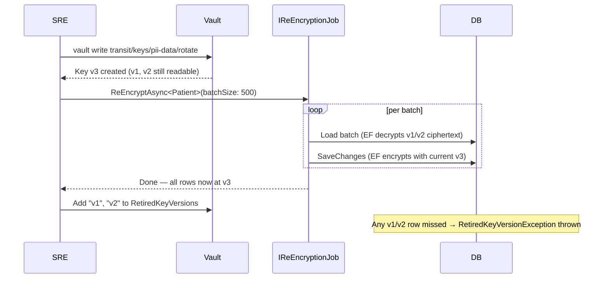

import { Tabs, TabItem, FileTree, Steps, Badge } from "@astrojs/starlight/components";

`Granit.Encryption.EntityFrameworkCore` adds a single attribute — `[Encrypted]` — that
you place on any `string` property of an EF Core entity. At `OnModelCreating` time,
`ApplyEncryptionConventions` wires up an `EncryptedStringConverter` backed by
`IStringEncryptionService`. From that point on, encryption and decryption happen
transparently on every read and write — no manual calls, no extra service layer.

`Granit.Encryption.ReEncryption` pairs with the EF Core package to provide `IReEncryptionJob`:
a batch-safe job that re-encrypts all `[Encrypted]` fields with the current key version
after a key rotation.

## Package structure

<FileTree>

- Granit.Encryption/ IStringEncryptionService, AES-256-CBC default
  - Granit.Encryption.EntityFrameworkCore/ [Encrypted] attribute, EncryptedStringConverter, ApplyEncryptionConventions
  - Granit.Encryption.ReEncryption/ IReEncryptionJob, DefaultReEncryptionJob

</FileTree>

| Package | Role | Depends on |
|---------|------|------------|
| `Granit.Encryption.EntityFrameworkCore` | `[Encrypted]` attribute, `EncryptedStringConverter`, `ApplyEncryptionConventions` extension | `Granit.Encryption`, `Granit.Persistence` |
| `Granit.Encryption.ReEncryption` | `IReEncryptionJob`, `DefaultReEncryptionJob<TContext>`, `AddGranitEncryptionReEncryption<TContext>()` | `Granit.Encryption.EntityFrameworkCore` |

## Setup

<Steps>

1. **Add the NuGet package**

   ```bash
   dotnet add package Granit.Encryption.EntityFrameworkCore
   ```

   If you also need the re-encryption job:

   ```bash
   dotnet add package Granit.Encryption.ReEncryption
   ```

2. **Register the module**

   ```csharp
   [DependsOn(
       typeof(GranitEncryptionEntityFrameworkCoreModule),
       typeof(GranitVaultHashiCorpModule))] // or GranitEncryptionModule for AES
   public sealed class AppModule : GranitModule { }
   ```

3. **Configure encryption**

   ```json
   {
     "Encryption": {
       "ProviderName": "Vault",
       "VaultKeyName": "pii-data"
     }
   }
   ```

   See [Vault & Encryption](/dotnet/security/vault-encryption/) for full provider configuration.

</Steps>

## Marking properties for encryption

Add `[Encrypted]` to any `string` property on an EF Core entity:

```csharp
using Granit.Encryption.EntityFrameworkCore;

namespace MyApp.Domain;

public sealed class Patient
{
    public Guid Id { get; set; }
    public string LastName { get; set; } = string.Empty;

    [Encrypted]
    public string NationalId { get; set; } = string.Empty;  // stored as ciphertext

    [Encrypted]
    public string MedicalRecordNumber { get; set; } = string.Empty;  // stored as ciphertext
}
```

`LastName` is stored in plaintext. `NationalId` and `MedicalRecordNumber` are
encrypted at write and decrypted at read — transparently.

## Wiring up the converter

Call `ApplyEncryptionConventions` at the **end** of `OnModelCreating`, after
`ApplyGranitConventions`:

```csharp
using Granit.Encryption.EntityFrameworkCore.Extensions;
using Granit.Persistence;

namespace MyApp.Infrastructure;

public sealed class AppDbContext(
    DbContextOptions<AppDbContext> options,
    ICurrentTenant? currentTenant,
    IDataFilter? dataFilter,
    IStringEncryptionService encryptionService) : DbContext(options)
{
    public DbSet<Patient> Patients => Set<Patient>();

    protected override void OnModelCreating(ModelBuilder modelBuilder)
    {
        base.OnModelCreating(modelBuilder);
        modelBuilder.ApplyGranitConventions(currentTenant, dataFilter);
        modelBuilder.ApplyEncryptionConventions(encryptionService); // must be last
    }
}
```

`ApplyEncryptionConventions` scans every entity type registered in the model,
finds `string` properties annotated with `[Encrypted]`, and attaches a single
shared `EncryptedStringConverter` instance to each one.

:::note
The EF Core **InMemory** provider does not apply value converters. Use the **SQLite**
or **SQL Server** provider in integration tests that verify encryption behaviour.
:::

## Reading and writing encrypted fields

No code changes are required in services. Entity properties contain plaintext values
in memory at all times. The conversion to and from ciphertext happens automatically
at the EF Core boundary.

```csharp
public sealed class PatientService(AppDbContext db)
{
    public async Task CreateAsync(
        string lastName,
        string nationalId,
        CancellationToken cancellationToken)
    {
        db.Patients.Add(new Patient
        {
            LastName = lastName,
            NationalId = nationalId,         // plaintext in code, ciphertext in DB
            MedicalRecordNumber = "MRN-001"  // same
        });

        await db.SaveChangesAsync(cancellationToken).ConfigureAwait(false);
    }

    public async Task<Patient?> FindByIdAsync(Guid id, CancellationToken cancellationToken)
    {
        // NationalId and MedicalRecordNumber are decrypted automatically on load
        return await db.Patients
            .FindAsync([id], cancellationToken)
            .ConfigureAwait(false);
    }
}
```

:::caution
EF Core **cannot filter or sort** on encrypted columns — the database stores ciphertext,
not plaintext. Design queries accordingly: load by primary key or unencrypted index
columns, then verify sensitive fields in application code.
:::

## Key rotation and re-encryption

When using Vault Transit, key rotation happens in Vault automatically. Old ciphertexts
remain readable (the key version is embedded in the `vault:vN:` prefix). To retire an
old key version, re-encrypt all rows first.

### Running the re-encryption job

Register the job alongside `IDbContextFactory`:

```csharp
builder.Services.AddDbContextFactory<AppDbContext>(...);
builder.Services.AddGranitEncryptionReEncryption<AppDbContext>();
```

Inject `IReEncryptionJob` and run it — for example from a Wolverine scheduled job, a
hosted service, or a CLI command:

```csharp
public sealed class KeyRotationJob(IReEncryptionJob reEncryption)
{
    public async Task RunAsync(CancellationToken cancellationToken)
    {
        // Re-encrypt all Patient rows in batches of 500
        await reEncryption
            .ReEncryptAsync<Patient>(batchSize: 500, cancellationToken)
            .ConfigureAwait(false);

        // Repeat for every entity type with [Encrypted] properties
        await reEncryption
            .ReEncryptAsync<LegalAgreement>(batchSize: 500, cancellationToken)
            .ConfigureAwait(false);
    }
}
```

`DefaultReEncryptionJob` loads entities in batches, marks every `[Encrypted]` property
as modified, and saves. EF Core runs `IStringEncryptionService.Encrypt` on save —
producing a new ciphertext encrypted with the current key version. The job is
**idempotent**: running it multiple times is safe.

:::tip
Use the `RewrapAsync` method on `ITransitEncryptionService` when you need
**server-side** re-encryption (Vault Transit rewraps without the plaintext
ever leaving Vault). See [Vault key rotation](/dotnet/security/vault-encryption/#key-rotation).
:::

### Blocking retired key versions

Once all rows are re-encrypted, guard against accidental decryption with the old key
by listing retired versions in configuration:

```json
{
  "ReEncryption": {
    "RetiredKeyVersions": ["v1", "v2"],
    "BatchSize": 500
  }
}
```

Register `ReEncryptionOptions` via the standard options pattern:

```csharp
builder.Services.Configure<ReEncryptionOptions>(
    builder.Configuration.GetSection(ReEncryptionOptions.SectionName));
```

When `HashiCorpVaultStringEncryptionProvider` encounters a ciphertext prefixed with a
retired version (e.g., `vault:v1:...`), it throws `RetiredKeyVersionException` before
delegating to Vault — catching any row that was missed during re-encryption loudly and
early:

```csharp
catch (RetiredKeyVersionException ex)
{
    logger.LogError(
        "Ciphertext encrypted with retired key version {Version} — re-encrypt before retiring",
        ex.KeyVersion);
    throw;
}
```

## Full key rotation workflow



## API reference

### `[Encrypted]`

```csharp
[AttributeUsage(AttributeTargets.Property)]
public sealed class EncryptedAttribute : Attribute;
```

Marks a `string` EF Core property for transparent encryption at rest.
`ApplyEncryptionConventions` looks for this attribute at model-building time.

### `EncryptedStringConverter`

```csharp
public sealed class EncryptedStringConverter(IStringEncryptionService encryptionService)
    : ValueConverter<string, string>;
```

The EF Core value converter. `ConvertToProvider` calls `Encrypt(plainText)`.
`ConvertFromProvider` calls `Decrypt(cipherText) ?? string.Empty`.

### `ModelBuilder.ApplyEncryptionConventions`

```csharp
public static ModelBuilder ApplyEncryptionConventions(
    this ModelBuilder modelBuilder,
    IStringEncryptionService encryptionService);
```

Scans all entity types registered in the model and applies `EncryptedStringConverter`
to every `string` property decorated with `[Encrypted]`.

### `IReEncryptionJob`

```csharp
public interface IReEncryptionJob
{
    Task ReEncryptAsync<TEntity>(
        int batchSize = 500,
        CancellationToken cancellationToken = default)
        where TEntity : class;
}
```

### `AddGranitEncryptionReEncryption<TContext>`

```csharp
public static IServiceCollection AddGranitEncryptionReEncryption<TContext>(
    this IServiceCollection services)
    where TContext : DbContext;
```

Registers `IReEncryptionJob` → `DefaultReEncryptionJob<TContext>` (scoped).
Requires `IDbContextFactory<TContext>` to be already registered.

## Compliance

| Regulation | Requirement | Coverage |
|------------|-------------|---------|
| GDPR Art. 5 | Data integrity and confidentiality | Ciphertext stored, plaintext never persisted |
| GDPR Art. 25 | Data protection by design | Encryption enforced at model level, not call site |
| ISO 27001 A.10.1 | Cryptographic key management | Key rotation via Vault, key retirement via `RetiredKeyVersions` |

## See also

- [Vault & Encryption](/dotnet/security/vault-encryption/) — provider configuration, key rotation, `ITransitEncryptionService`
- [Privacy module](/dotnet/security/privacy/) — GDPR erasure patterns
- [Persistence module](/dotnet/data/persistence/) — isolated `DbContext`, `ApplyGranitConventions`
- [Encrypt sensitive data guide](/dotnet/guides/encrypt-sensitive-data/) — end-to-end walkthrough
