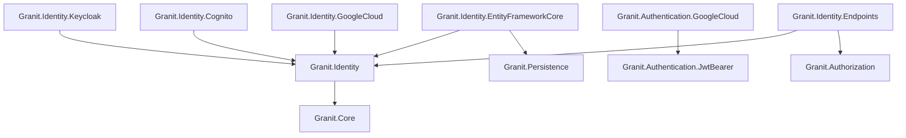
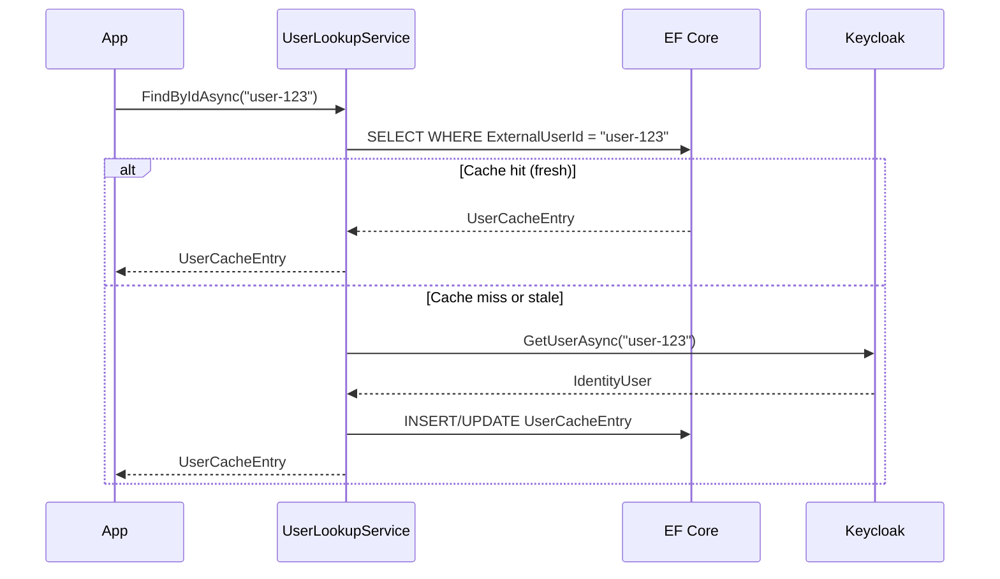

import { Tabs, TabItem, FileTree, Badge } from "@astrojs/starlight/components";

Granit.Identity provides a provider-agnostic identity management layer. Keycloak, Cognito,
Google Cloud Identity Platform (Firebase Auth), or any OIDC provider handles authentication
— Granit.Identity handles everything else: user
lookup, role management, session control, password operations, and a local user cache
with GDPR erasure and pseudonymization built in.

## Package structure

<FileTree>
- Granit.Identity/ Abstractions (7 interfaces), null defaults
  - Granit.Identity.Keycloak Keycloak Admin API implementation
  - Granit.Identity.Cognito AWS Cognito User Pool API implementation
  - Granit.Identity.GoogleCloud Google Cloud Identity Platform (Firebase Auth) implementation
  - Granit.Identity.EntityFrameworkCore User cache (cache-aside, login-time sync)
  - Granit.Identity.Endpoints Minimal API endpoints (CRUD, sync, GDPR, webhook)
</FileTree>

| Package | Role | Depends on |
|---------|------|------------|
| `Granit.Identity` | Abstractions, null defaults | — |
| `Granit.Identity.Keycloak` | Keycloak Admin API implementation | `Granit.Identity` |
| `Granit.Identity.Cognito` | AWS Cognito User Pool API implementation | `Granit.Identity` |
| `Granit.Identity.GoogleCloud` | Firebase Auth implementation (Firebase Admin SDK) | `Granit.Identity` |
| `Granit.Authentication.GoogleCloud` | JWT Bearer for Firebase Auth + claims transformation | `Granit.Authentication.JwtBearer` |
| `Granit.Identity.EntityFrameworkCore` | EF Core user cache | `Granit.Identity`, `Granit.Persistence` |
| `Granit.Identity.Endpoints` | REST endpoints for user cache | `Granit.Identity`, `Granit.Authorization` |

## Dependency graph



## Setup

<Tabs>
<TabItem label="Keycloak + User cache">

```csharp
[DependsOn(typeof(GranitIdentityKeycloakModule))]
[DependsOn(typeof(GranitIdentityEntityFrameworkCoreModule))]
[DependsOn(typeof(GranitIdentityEndpointsModule))]
public class AppModule : GranitModule
{
    public override void ConfigureServices(ServiceConfigurationContext context)
    {
        context.Services.AddGranitIdentityEntityFrameworkCore<AppDbContext>();
        context.Services.AddGranitIdentityEndpoints();
    }

    public override void OnApplicationInitialization(ApplicationInitializationContext context)
    {
        context.App.MapIdentityUserCacheEndpoints();
    }
}
```

</TabItem>
<TabItem label="Cognito + User cache">

```csharp
[DependsOn(typeof(GranitIdentityCognitoModule))]
[DependsOn(typeof(GranitIdentityEntityFrameworkCoreModule))]
[DependsOn(typeof(GranitIdentityEndpointsModule))]
public class AppModule : GranitModule
{
    public override void ConfigureServices(ServiceConfigurationContext context)
    {
        context.Services.AddGranitIdentityEntityFrameworkCore<AppDbContext>();
        context.Services.AddGranitIdentityEndpoints();
    }

    public override void OnApplicationInitialization(ApplicationInitializationContext context)
    {
        context.App.MapIdentityUserCacheEndpoints();
    }
}
```

</TabItem>
<TabItem label="Google Cloud (Firebase Auth)">

```csharp
[DependsOn(typeof(GranitIdentityGoogleCloudModule))]
[DependsOn(typeof(GranitAuthenticationGoogleCloudModule))]
[DependsOn(typeof(GranitIdentityEntityFrameworkCoreModule))]
[DependsOn(typeof(GranitIdentityEndpointsModule))]
public class AppModule : GranitModule
{
    public override void ConfigureServices(ServiceConfigurationContext context)
    {
        context.Services.AddGranitIdentityEntityFrameworkCore<AppDbContext>();
        context.Services.AddGranitIdentityEndpoints();
    }

    public override void OnApplicationInitialization(ApplicationInitializationContext context)
    {
        context.App.MapIdentityUserCacheEndpoints();
    }
}
```

</TabItem>
<TabItem label="Abstractions only">

```csharp
[DependsOn(typeof(GranitIdentityModule))]
public class AppModule : GranitModule { }
```

Registers `NullIdentityProvider` and `NullUserLookupService` — useful for development
or modules that only need the interfaces.

</TabItem>
<TabItem label="Custom provider">

```csharp
context.Services.AddIdentityProvider<MyCustomIdentityProvider>();
```

</TabItem>
</Tabs>

## Interface Segregation

`IIdentityProvider` is a composite interface built from 7 fine-grained interfaces
following ISP (Interface Segregation Principle). Inject only what you need:

| Interface | Methods | Purpose |
|-----------|---------|---------|
| `IIdentityUserReader` | `GetUsersAsync`, `GetUserAsync` | Read user profiles |
| `IIdentityUserWriter` | `CreateUserAsync`, `UpdateUserAsync`, `SetUserEnabledAsync` | Mutate user profiles |
| `IIdentityRoleManager` | `GetRolesAsync`, `GetUserRolesAsync`, `AssignRoleAsync`, `RemoveRoleAsync`, `GetRoleMembersAsync` | Role assignments |
| `IIdentityGroupManager` | `GetGroupsAsync`, `GetUserGroupsAsync`, `AddUserToGroupAsync`, `RemoveUserFromGroupAsync` | Group membership |
| `IIdentitySessionManager` | `GetUserSessionsAsync`, `GetUserDeviceActivityAsync`, `TerminateSessionAsync`, `TerminateAllSessionsAsync` | Active session control |
| `IIdentityPasswordManager` | `GetPasswordChangedAtAsync`, `SendPasswordResetEmailAsync`, `SetTemporaryPasswordAsync` | Password operations |
| `IIdentityCredentialVerifier` | `VerifyUserCredentialsAsync` | Credential validation |

```csharp
// Inject only what you need — not the full IIdentityProvider
public class UserProfileService(IIdentityUserReader userReader)
{
    public async Task<IdentityUser?> GetProfileAsync(
        string userId, CancellationToken cancellationToken)
    {
        return await userReader.GetUserAsync(userId, cancellationToken)
            .ConfigureAwait(false);
    }
}
```

### Provider capabilities

Not all providers support every operation. Query capabilities at runtime:

```csharp
public class SessionService(
    IIdentitySessionManager sessions,
    IIdentityProviderCapabilities capabilities)
{
    public async Task TerminateSessionAsync(
        string userId, string sessionId, CancellationToken cancellationToken)
    {
        if (!capabilities.SupportsIndividualSessionTermination)
        {
            throw new BusinessException(
                "Identity:UnsupportedOperation",
                "Provider does not support individual session termination");
        }

        await sessions.TerminateSessionAsync(userId, sessionId, cancellationToken)
            .ConfigureAwait(false);
    }
}
```

## User cache (cache-aside)

`Granit.Identity.EntityFrameworkCore` maintains a local cache of user data from the
identity provider. This avoids hitting Keycloak on every "who is this user?" query.

### IUserLookupService

```csharp
public interface IUserLookupService
{
    Task<UserCacheEntry?> FindByIdAsync(string userId, CancellationToken cancellationToken);
    Task<IReadOnlyList<UserCacheEntry>> FindByIdsAsync(
        IReadOnlyCollection<string> userIds, CancellationToken cancellationToken);
    Task<PagedResult<UserCacheEntry>> SearchAsync(
        string searchTerm, int page, int pageSize, CancellationToken cancellationToken);
    Task RefreshByIdAsync(string userId, CancellationToken cancellationToken);
    Task RefreshAllAsync(CancellationToken cancellationToken);
    Task RefreshStaleAsync(CancellationToken cancellationToken);
    Task DeleteByIdAsync(string userId, CancellationToken cancellationToken);
    Task PseudonymizeByIdAsync(string userId, CancellationToken cancellationToken);
}
```

### Cache-aside strategy



### Entity

```csharp
public class UserCacheEntry : AuditedEntity, IMultiTenant
{
    public string ExternalUserId { get; set; } = string.Empty;
    public string? Username { get; set; }
    public string? Email { get; set; }
    public string? FirstName { get; set; }
    public string? LastName { get; set; }
    public bool Enabled { get; set; }
    public DateTimeOffset? LastSyncedAt { get; set; }
    public Guid? TenantId { get; set; }
}
```

:::note
`UserCacheEntry` is **hard-deleted** on GDPR erasure — not soft-deleted. This is
intentional: the right to erasure (Art. 17) requires actual data removal, not just
a flag.
:::

### Login-time sync

`UserCacheSyncMiddleware` automatically refreshes the cache entry when a user
authenticates. This ensures the cache stays fresh without polling.

### Configuration

```json
{
  "IdentityUserCache": {
    "StalenessThreshold": "1.00:00:00",
    "EnableLoginTimeSync": true,
    "IncrementalSyncBatchSize": 50
  }
}
```

| Property | Default | Description |
|----------|---------|-------------|
| `StalenessThreshold` | `24:00:00` | Age after which a cache entry is considered stale |
| `EnableLoginTimeSync` | `true` | Refresh cache on login |
| `IncrementalSyncBatchSize` | `50` | Batch size for `RefreshStaleAsync` |

## Keycloak provider

`Granit.Identity.Keycloak` implements the full `IIdentityProvider` against the
Keycloak Admin REST API.

### Configuration

```json
{
  "KeycloakAdmin": {
    "BaseUrl": "https://keycloak.example.com",
    "Realm": "my-realm",
    "ClientId": "admin-cli",
    "ClientSecret": "secret",
    "TimeoutSeconds": 30,
    "UseTokenExchangeForDeviceActivity": false,
    "DirectAccessClientId": "direct-access-client"
  }
}
```

**Required Keycloak service account roles:**
- `realm-management:view-users`
- `realm-management:manage-users`

### Health check

```csharp
builder.Services.AddHealthChecks()
    .AddGranitKeycloakHealthCheck();
```

Verifies Keycloak connectivity by requesting a `client_credentials` token. Tagged
`["readiness", "startup"]`. Returns Unhealthy on 401/403, Degraded on 5xx.

### OpenTelemetry

All Keycloak Admin API calls are traced via `IdentityKeycloakActivitySource`.
Activity names follow the pattern `Granit.Identity.Keycloak.{Operation}`.

## Cognito provider

`Granit.Identity.Cognito` implements the full `IIdentityProvider` against the
AWS Cognito User Pool API via `AWSSDK.CognitoIdentityProvider`.

### Configuration

```json
{
  "CognitoAdmin": {
    "UserPoolId": "eu-west-1_XXXXXXXXX",
    "Region": "eu-west-1",
    "AccessKeyId": "",
    "SecretAccessKey": "",
    "TimeoutSeconds": 30
  }
}
```

`AccessKeyId` and `SecretAccessKey` are optional — when omitted, the SDK uses the
default credential chain (IAM role, environment variables, `~/.aws/credentials`).

### Cognito-specific behavior

- **Groups as roles** — Cognito has no native "roles" concept. Groups serve as both
  roles and groups. `GetRolesAsync` and `GetGroupsAsync` return the same data.
- **No individual session termination** — Cognito supports `AdminUserGlobalSignOut`
  (terminate all sessions) but not individual session termination.
  `IIdentityProviderCapabilities.SupportsIndividualSessionTermination` returns `false`.
- **No device activity** — `GetUserDeviceActivityAsync` returns an empty list.

### OpenTelemetry

All Cognito User Pool API calls are traced via `IdentityCognitoActivitySource`.
Activity names follow the pattern `cognito.{operation}`.

## Google Cloud Identity Platform provider

`Granit.Identity.GoogleCloud` implements the full `IIdentityProvider` against the
Firebase Auth API via Firebase Admin SDK v3.

### Configuration

```json
{
  "Identity": {
    "GoogleCloud": {
      "ProjectId": "my-firebase-project",
      "RolesClaimKey": "roles",
      "TimeoutSeconds": 30
    }
  }
}
```

For Workload Identity (recommended in GKE), omit `CredentialFilePath` —
Application Default Credentials are used automatically.

### Google Cloud-specific behavior

- **Roles via custom claims** — Firebase Auth has no native roles. User roles are
  stored as a JSON array in custom claims (configurable key, default `"roles"`).
  `GetRolesAsync` returns an empty list; `GetUserRolesAsync` extracts from claims.
- **Groups not supported** — Firebase Auth does not support groups.
  `AddUserToGroupAsync` and `RemoveUserFromGroupAsync` throw `NotSupportedException`.
- **No individual session termination** — Firebase supports
  `RevokeRefreshTokens` (terminate all sessions) but not individual session
  termination. `IIdentityProviderCapabilities.SupportsIndividualSessionTermination`
  returns `false`.
- **Credential verification** — `VerifyUserCredentialsAsync` validates email/password
  via the Firebase Auth REST API.

### Health check

```csharp
builder.Services.AddHealthChecks()
    .AddGranitGoogleCloudIdentityHealthCheck();
```

Verifies that `ProjectId` is configured. Tagged `["readiness"]`.

### OpenTelemetry

All Firebase Auth API calls are traced via `IdentityGoogleCloudActivitySource`.
Activity names follow the pattern `firebase.{operation}`.

## Google Cloud Authentication

`Granit.Authentication.GoogleCloud` configures JWT Bearer authentication for
Firebase Auth tokens and transforms custom claims into standard `ClaimTypes.Role`.

### Configuration

```json
{
  "GoogleCloudAuth": {
    "ProjectId": "my-firebase-project",
    "RequireHttpsMetadata": true,
    "AdminRole": "admin",
    "RolesClaimKey": "roles"
  }
}
```

| Property | Default | Description |
|----------|---------|-------------|
| `ProjectId` | — | GCP project ID (derives OIDC authority) |
| `RequireHttpsMetadata` | `true` | Require HTTPS for OIDC metadata discovery |
| `AdminRole` | `"admin"` | Role name for the "Admin" authorization policy |
| `RolesClaimKey` | `"roles"` | Custom claims key containing roles |

The module derives the OIDC authority as `https://securetoken.google.com/{ProjectId}`
and configures JWT Bearer validation with `Audience = ProjectId`,
`NameClaimType = "email"`.

### Claims transformation

`GoogleCloudClaimsTransformation` maps Firebase custom claims to
`ClaimTypes.Role`. Supports JSON array format (`["admin","editor"]`) and
single string values. Existing `ClaimTypes.Role` claims are preserved without
duplication.

## Endpoints

`Granit.Identity.Endpoints` exposes user cache management as Minimal API endpoints.

| Method | Route | Permission | Description |
|--------|-------|------------|-------------|
| GET | `/identity/users/search` | `Identity.UserCache.Read` | Search cached users |
| GET | `/identity/users/{id}` | `Identity.UserCache.Read` | Get by external ID |
| POST | `/identity/users/batch` | `Identity.UserCache.Read` | Batch resolve by IDs |
| POST | `/identity/users/sync` | `Identity.UserCache.Sync` | Sync specific user |
| POST | `/identity/users/sync-all` | `Identity.UserCache.Sync` | Full sync from provider |
| DELETE | `/identity/users/{id}` | `Identity.UserCache.Delete` | GDPR erase |
| PATCH | `/identity/users/{id}/pseudonymize` | `Identity.UserCache.Delete` | GDPR pseudonymize |
| GET | `/identity/users/stats` | `Identity.UserCache.Read` | Cache statistics |
| GET | `/identity/users/capabilities` | `Identity.UserCache.Read` | Provider capabilities |
| POST | `/identity-webhook` | *(anonymous, signature-validated)* | IdP webhook receiver |

### Webhook

The webhook endpoint receives events from the identity provider (user created, updated,
deleted) and updates the local cache accordingly. Payload authenticity is verified
via HMAC signature validation.

## GDPR operations

Two operations support data subject rights:

```csharp
// Right to erasure (Art. 17) — hard delete
await userLookupService.DeleteByIdAsync("user-123", cancellationToken)
    .ConfigureAwait(false);

// Right to restriction (Art. 18) — pseudonymize
await userLookupService.PseudonymizeByIdAsync("user-123", cancellationToken)
    .ConfigureAwait(false);
```

- **Delete** removes the `UserCacheEntry` entirely (physical delete, not soft delete)
- **Pseudonymize** replaces PII fields with anonymized values while preserving the record

Both operations emit Wolverine domain events (`IdentityUserDeletedEvent`,
`IdentityUserUpdatedEvent`) for downstream modules to react.

## Public API summary

| Category | Key types | Package |
|----------|-----------|---------|
| Module | `GranitIdentityModule`, `GranitIdentityKeycloakModule`, `GranitIdentityCognitoModule`, `GranitIdentityGoogleCloudModule`, `GranitAuthenticationGoogleCloudModule`, `GranitIdentityEntityFrameworkCoreModule`, `GranitIdentityEndpointsModule` | — |
| Abstractions | `IIdentityProvider`, `IIdentityUserReader`, `IIdentityUserWriter`, `IIdentityRoleManager`, `IIdentityGroupManager`, `IIdentitySessionManager`, `IIdentityPasswordManager`, `IIdentityCredentialVerifier` | `Granit.Identity` |
| Lookup | `IUserLookupService`, `IUserCacheStats`, `IIdentityProviderCapabilities` | `Granit.Identity` |
| Models | `IdentityUser`, `IdentityUserCreate`, `IdentityUserUpdate`, `IdentityRole`, `IdentityGroup`, `IdentitySession`, `IdentityDeviceActivity` | `Granit.Identity` |
| Keycloak | `KeycloakIdentityProvider`, `KeycloakAdminOptions` | `Granit.Identity.Keycloak` |
| Cognito | `CognitoIdentityProvider`, `CognitoAdminOptions` | `Granit.Identity.Cognito` |
| Google Cloud | `GoogleCloudIdentityProvider`, `GoogleCloudIdentityOptions` | `Granit.Identity.GoogleCloud` |
| Google Cloud Auth | `GoogleCloudClaimsTransformation`, `GoogleCloudAuthenticationOptions` | `Granit.Authentication.GoogleCloud` |
| EF Core | `UserCacheEntry`, `IUserCacheDbContext`, `UserCacheOptions` | `Granit.Identity.EntityFrameworkCore` |
| Endpoints | `IdentityEndpointsOptions`, `IdentityWebhookOptions` | `Granit.Identity.Endpoints` |
| Extensions | `AddGranitIdentity()`, `AddIdentityProvider<T>()`, `AddGranitIdentityKeycloak()`, `AddGranitIdentityCognito()`, `AddGranitIdentityGoogleCloud()`, `AddGranitGoogleCloudAuthentication()`, `AddGranitIdentityEntityFrameworkCore<T>()`, `AddGranitIdentityEndpoints()`, `MapIdentityUserCacheEndpoints()` | — |

## See also

- [Security module](./security/) — Authentication, authorization, RBAC permissions
- [Privacy module](./privacy/) — GDPR data export/deletion, cookie consent
- [Persistence module](./persistence/) — `AuditedEntity`, interceptors
- [API Reference](/api/Granit.Identity.html) (auto-generated from XML docs)
