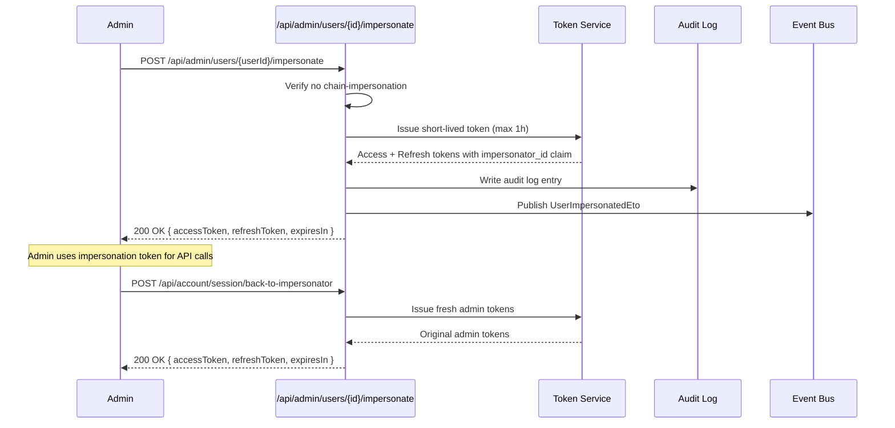
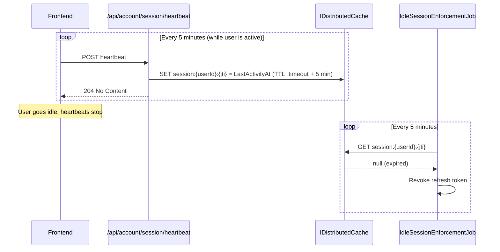

import { Tabs, TabItem, Badge } from "@astrojs/starlight/components";

## Multi-tenancy

All OpenIddict entities implement `IMultiTenant` with `Guid? TenantId`:

| Entity | Table | Tenant-scoped |
|--------|-------|---------------|
| `GranitUser` | `oidc_users` | Yes |
| `GranitUserGroup` | `oidc_user_groups` | Yes |
| `GranitUserGroupMember` | `oidc_user_group_members` | Yes |
| `GranitOpenIddictApplication` | `oidc_applications` | Yes |
| `GranitOpenIddictAuthorization` | `oidc_authorizations` | Yes |
| `GranitOpenIddictScope` | `oidc_scopes` | Yes |
| `GranitOpenIddictToken` | `oidc_tokens` | Yes |
| `GranitRole` | `oidc_roles` | **No (global)** |

Tenant filters are applied automatically by `ApplyGranitConventions()` in the
`OpenIddictDbContext`. Applications and scopes with `TenantId = null` are **global**
and visible to all tenants.

`GranitOpenIddictEntityFrameworkCoreModule` declares `[DependsOn(typeof(GranitMultiTenancyModule))]`
for GDPR-strict tenant isolation in OpenIddict stores.

### Entity caching caveat

OpenIddict's built-in entity cache uses `ClientId` as the sole cache key. In
multi-tenant setups, two tenants with the same `ClientId` would share cached data --
a cross-tenant pollution risk.

Entity caching is **disabled by default** (`EnableEntityCaching = false`). Enable
only for single-tenant deployments where cache performance is critical:

```json
{
  "OpenIddict": {
    "EnableEntityCaching": true
  }
}
```

### Per-tenant settings

Token lifetimes and security policies are configurable per-tenant at runtime via
`Granit.Settings`. No redeployment needed.

| Setting | Default | Description |
|---------|---------|-------------|
| `OpenIddict.AccessTokenLifetime` | `01:00:00` | Access token lifetime |
| `OpenIddict.RefreshTokenLifetime` | `14.00:00:00` | Refresh token lifetime |
| `OpenIddict.AuthCodeLifetime` | `00:05:00` | Authorization code lifetime |
| `OpenIddict.MaxLoginAttempts` | `5` | Lockout threshold |
| `OpenIddict.IdleSessionTimeout` | `0` | Idle timeout in minutes (0 = off) |

### Per-tenant feature flags

Feature flags are configurable per-tenant via `Granit.Features`. Resolution order:
Tenant > Plan > Default.

| Feature | Default | Description |
|---------|---------|-------------|
| `OpenIddict.TwoFactor` | `true` | TOTP-based two-factor authentication |
| `OpenIddict.DeviceFlow` | `false` | OAuth 2.0 Device Authorization Grant (RFC 8628) |
| `OpenIddict.ExternalLogins` | `true` | External login providers (Google, Microsoft, GitHub) |
| `OpenIddict.PkceRequired` | `true` | PKCE requirement for authorization code flows |
| `OpenIddict.Passkeys` | `false` | WebAuthn/FIDO2 passkey authentication |

## Impersonation

Administrators can act as another user without knowing their password. This is
essential for support scenarios, debugging user-specific issues, and testing
tenant-scoped configurations.

### Flow



### Security constraints

| Constraint | Detail |
|-----------|--------|
| No chaining | An impersonated token cannot impersonate another user (guards on `impersonator_id` claim) |
| Max duration | 1 hour, hardcoded, non-configurable |
| Permission | Requires `OpenIddict.Users.Impersonate` permission |
| Audit trail | Mandatory `IAuditLogWriter` entry on every impersonation |
| Transparency | `UserImpersonatedEto` published via `IDistributedEventBus` -- consumed by `Granit.Notifications` to notify the impersonated user (GDPR / SOC2) |

### Impersonation claims

The impersonation token includes two additional claims:

| Claim | Type | Description |
|-------|------|-------------|
| `impersonator_id` | `string` | Original administrator's user ID |
| `impersonator_name` | `string` | Original administrator's display name |

### Detecting impersonation in code

```csharp
using Granit.OpenIddict.Extensions;

// On ClaimsPrincipal
if (httpContext.User.IsImpersonated())
{
    string? adminId = httpContext.User.FindImpersonatorUserId();
    string? adminName = httpContext.User.FindImpersonatorName();
}

// On HttpContext (convenience)
if (httpContext.IsImpersonated())
{
    // ...
}
```

These extension methods are defined in `ClaimsPrincipalExtensions` in the
`Granit.OpenIddict` package (no dependency on Endpoints or EF Core).

## Idle session timeout

Automatically revokes refresh tokens when a user session has been inactive longer
than a configurable timeout. **Disabled by default** (`IdleSessionTimeout = 0`).

### Architecture



### How it works

1. **Frontend** calls `POST /api/account/session/heartbeat` periodically (recommended:
   every 5 minutes) while the user is active
2. **Heartbeat endpoint** writes a `UserSessionActivity` record to `IDistributedCache`
   with key `session:{userId}:{jti}` and TTL = `IdleSessionTimeout + 5 min` buffer
3. **Background job** (`openiddict-idle-session-enforcement`, runs every 5 minutes)
   scans active refresh tokens and checks if the corresponding cache entry still exists
4. **Missing cache entry** means the session is idle -- the refresh token is revoked

### Exclusions

Sessions with `remember_me = true` claim are excluded from idle timeout. The
heartbeat endpoint is a no-op for these sessions.

### Configuration

Set the idle timeout in minutes per-tenant via `Granit.Settings`:

| Setting key | Default | Range |
|-------------|---------|-------|
| `OpenIddict.IdleSessionTimeout` | `0` (disabled) | `0` = off, `1`+ = minutes |

```json
{
  "OpenIddict": {
    "IdleSessionTimeout": "30"
  }
}
```

## Passkeys (WebAuthn / FIDO2)

Passkey support is gated behind the `OpenIddict.Passkeys` feature flag (default:
`false`). Uses ASP.NET Core Identity's built-in .NET 10 WebAuthn support:
`UserManager.CreatePasskeyAsync()` and `UserManager.VerifyPasskeyAsync()`.

### Service interface

The `IPasskeyService` abstraction provides:

| Method | Description |
|--------|-------------|
| `GetPasskeysAsync()` | List registered passkeys for a user |
| `BeginRegistrationAsync()` | Return `PublicKeyCredentialCreationOptions` JSON |
| `CompleteRegistrationAsync()` | Validate attestation and store credential |
| `BeginAssertionAsync()` | Return `PublicKeyCredentialRequestOptions` JSON |
| `RenameAsync()` | Update the friendly name |
| `DeleteAsync()` | Remove a passkey (guards against last-credential lockout) |

### Conditional UI

Both registration and assertion endpoints return options with `mediation: "conditional"`
for browser-native passkey autofill. The frontend should use the WebAuthn API's
conditional mediation to enable autofill suggestions.

### Configuration

```json
{
  "OpenIddict": {
    "Passkeys": {
      "ServerDomain": "example.com",
      "AuthenticatorTimeout": "00:05:00",
      "ChallengeSize": 32
    }
  }
}
```

`ServerDomain` is the WebAuthn Relying Party ID and is required when passkeys are
enabled. It must match the domain where the application is hosted.

## Background jobs

Two recurring background jobs are provided by `Granit.OpenIddict.BackgroundJobs`:

| Job name | Cron | Description |
|----------|------|-------------|
| `openiddict-token-cleanup` | `0 * * * *` (hourly) | Prunes expired tokens and orphaned authorizations via `IOpenIddictTokenManager.PruneAsync()` and `IOpenIddictAuthorizationManager.PruneAsync()` |
| `openiddict-idle-session-enforcement` | `*/5 * * * *` (every 5 min) | Revokes refresh tokens for idle sessions (only active when `IdleSessionTimeout > 0`) |

Both jobs implement `IBackgroundJob` with `[RecurringJob]` attribute and are
concurrency-safe via Wolverine Outbox.

### Customizing schedules

Override cron expressions via configuration:

```json
{
  "BackgroundJobs": {
    "Jobs": {
      "openiddict-token-cleanup": "0 */2 * * *",
      "openiddict-idle-session-enforcement": "*/10 * * * *"
    }
  }
}
```

### Token cleanup details

`OpenIddictTokenCleanupHandler` calls:

```csharp
await tokenManager.PruneAsync(now, cancellationToken);
await authorizationManager.PruneAsync(now, cancellationToken);
```

Without this job, expired tokens accumulate in the database. This is acceptable in
development but not in production.

### Idle session enforcement details

`OpenIddictIdleSessionEnforcementHandler`:

1. Reads `OpenIddict.IdleSessionTimeout` from `ISettingProvider`
2. If `0`, exits immediately (feature disabled)
3. Iterates all active refresh tokens via `IOpenIddictTokenManager.ListAsync()`
4. For each token, checks if `session:{subject}:{tokenId}` exists in `IDistributedCache`
5. Missing cache entry = idle session = refresh token revoked via `TryRevokeAsync()`

## Declarative seeding

OIDC applications and scopes can be seeded at startup via configuration. The
`OpenIddictSeedContributor` implements `IDataSeedContributor` and performs
**idempotent upserts** based on `ClientId` / `Name`.

<Tabs>
<TabItem label="SPA (Public Client)">

```json
{
  "OpenIddict": {
    "Seeding": {
      "Applications": [
        {
          "ClientId": "my-spa",
          "ClientSecret": null,
          "DisplayName": "My SPA (PKCE)",
          "Permissions": [
            "ept:authorization", "ept:token", "ept:logout",
            "gt:authorization_code", "gt:refresh_token",
            "scp:openid", "scp:profile", "scp:email", "scp:offline_access"
          ],
          "RedirectUris": ["https://app.example.com/callback"],
          "PostLogoutRedirectUris": ["https://app.example.com"]
        }
      ]
    }
  }
}
```

</TabItem>
<TabItem label="M2M (Confidential Client)">

```json
{
  "OpenIddict": {
    "Seeding": {
      "Applications": [
        {
          "ClientId": "my-api",
          "ClientSecret": "super-secret-should-come-from-vault",
          "DisplayName": "My API (Client Credentials)",
          "Permissions": [
            "ept:token", "gt:client_credentials", "scp:api"
          ],
          "RedirectUris": [],
          "PostLogoutRedirectUris": []
        }
      ]
    }
  }
}
```

</TabItem>
<TabItem label="Custom Scope">

```json
{
  "OpenIddict": {
    "Seeding": {
      "Scopes": [
        {
          "Name": "api",
          "DisplayName": "API Access",
          "Resources": ["my-api"]
        }
      ]
    }
  }
}
```

</TabItem>
</Tabs>

:::caution
Client secrets in `appsettings.json` are for development only. In production,
use `Granit.Vault` secret injection or environment variables. **Never commit
secrets to source control.**
:::

Running the application multiple times produces no duplicates. Existing applications
are updated (permissions, redirect URIs, display name) but secrets are not overwritten
on update.

## Integration events

Three integration events are published via `IDistributedEventBus` (Wolverine outbox,
at-least-once delivery):

### UserRegisteredEto

Published when a new user registers (self-service or external login).

```csharp
public sealed record UserRegisteredEto(
    Guid UserId,
    string Email,
    Guid? TenantId) : IIntegrationEvent;
```

### AccountDeletedEto

Published when a user deletes their account (GDPR Article 17).

```csharp
public sealed record AccountDeletedEto(
    Guid UserId,
    Guid? TenantId) : IIntegrationEvent;
```

Subscribe to this event in other modules to clean up user-specific data (blob storage,
audit logs, notification preferences, etc.).

### UserImpersonatedEto

Published when an administrator impersonates a user.

```csharp
public sealed record UserImpersonatedEto(
    Guid TargetUserId,
    Guid ImpersonatorId,
    Guid? TenantId,
    DateTimeOffset OccurredAt) : IIntegrationEvent;
```

Consumed by `Granit.Notifications` to send a transparency notification to the
impersonated user (GDPR / SOC2 compliance requirement).

## Related pages

- [Overview](./index/)
- [OIDC server configuration](./oidc-server/)
- [Account API](./account-api/)
- [Configuration reference](./configuration/)
