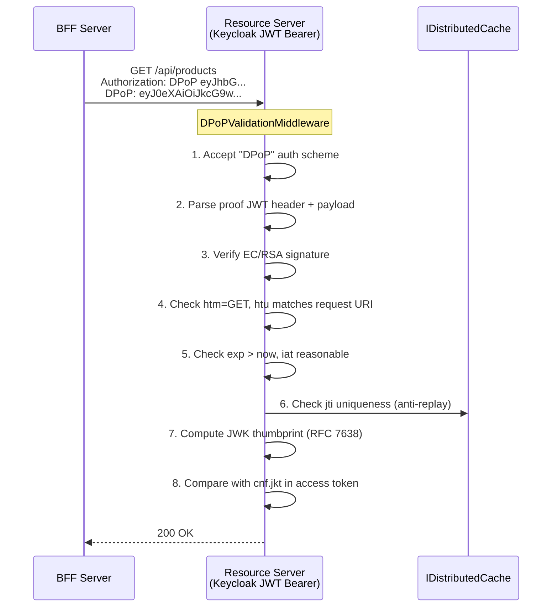

import { Tabs, TabItem, Aside, Steps, FileTree } from "@astrojs/starlight/components";

The [DPoP page](/dotnet/security/openiddict/advanced/proof-of-possession-dpop/) explains how the BFF
generates DPoP proofs and how the OpenIddict server binds tokens to cryptographic keys.
**This page covers the other side**: how a resource server validates those proofs, regardless
of which identity provider issued the token.

## The problem

OpenIddict's built-in `ValidateProofOfPossession` handler validates DPoP proofs automatically —
but only when the resource server uses `AddGranitOpenIddictAuthentication()`. In microservice
architectures where the identity provider is **Keycloak, Entra ID, Auth0, or Cognito**, the
resource server uses standard JWT Bearer authentication and has no way to validate DPoP proofs.

Without server-side validation, DPoP is only half-implemented: the token is bound to a key,
but nothing prevents an attacker from stripping the `DPoP` header and presenting the token
as a plain `Bearer` token.

## How it works

`Granit.Authentication.DPoP` provides **IdP-agnostic** DPoP proof validation:



<Steps>

1. **Scheme acceptance** — `JwtBearerEvents.OnMessageReceived` extracts the token from
   `Authorization: DPoP <token>` (standard JWT Bearer only accepts `Bearer`).

2. **Proof validation** — `IDPoPProofValidator` verifies the DPoP proof JWT: signature
   (ES256, PS256, EdDSA), HTTP method (`htm`), request URI (`htu`), expiration, issued-at.

3. **Anti-replay** — The `jti` claim is checked against `IDistributedCache` to prevent
   proof replay within the validity window. Essential for FAPI 2.0 financial-grade security.

4. **Token binding** — `JwkThumbprintCalculator` computes the SHA-256 thumbprint of the
   proof's public key (RFC 7638) and compares it with the `cnf.jkt` claim in the access token.
   If they don't match, the request is rejected with `401 Unauthorized`.

</Steps>

## Package structure

<FileTree>

- Granit.Authentication.DPoP/
  - Validation/
    - IDPoPProofValidator.cs Interface
    - Internal/
      - DPoPProofValidator.cs Signature, claims, binding
      - JwkThumbprintCalculator.cs RFC 7638 thumbprint
  - Middleware/
    - DPoPValidationMiddleware.cs After-auth enforcement
  - Extensions/
    - DPoPJwtBearerExtensions.cs One-line setup
  - Options/
    - DPoPValidationOptions.cs Configuration
  - Diagnostics/
    - DPoPValidationMetrics.cs OpenTelemetry counters
    - DPoPValidationActivitySource.cs Tracing spans

</FileTree>

## Setup

### One-line integration

```csharp
[DependsOn(
    typeof(GranitJwtBearerKeycloakModule),
    typeof(GranitAuthenticationDPoPModule))]  // ← add this
public class CatalogServiceModule : GranitModule { }
```

In `OnApplicationInitialization`:

```csharp
app.UseAuthentication();
app.UseGranitDPoPValidation();  // ← after UseAuthentication
app.UseAuthorization();
```

### Configuration

```json
{
  "Authentication": {
    "Authority": "https://keycloak.example.com/realms/my-realm",
    "Audience": "catalog-service",
    "DPoP": {
      "RequireDPoP": true,
      "AllowedAlgorithms": ["ES256", "PS256"],
      "ProofMaxAge": "00:00:30",
      "NonceLifetime": "00:05:00",
      "EnableAntiReplay": true
    }
  }
}
```

| Property | Type | Default | Description |
|----------|------|---------|-------------|
| `RequireDPoP` | `bool` | `false` | Reject requests without valid DPoP proof. When `false`, DPoP is validated if present but not required. |
| `AllowedAlgorithms` | `string[]` | `["ES256", "PS256"]` | Allowed signing algorithms for DPoP proofs. |
| `ProofMaxAge` | `TimeSpan` | `00:00:30` | Maximum age of a DPoP proof JWT. |
| `NonceLifetime` | `TimeSpan` | `00:05:00` | TTL for anti-replay `jti` entries in distributed cache. |
| `EnableAntiReplay` | `bool` | `true` | Check `jti` uniqueness in `IDistributedCache`. |

<Aside type="caution" title="Gradual rollout">
Set `RequireDPoP: false` initially to validate DPoP proofs when present without
breaking clients that still use plain `Bearer` tokens. Once all clients send DPoP
proofs, switch to `RequireDPoP: true` to enforce.
</Aside>

## JWK Thumbprint calculation (RFC 7638)

The core of DPoP binding is the JWK thumbprint — a deterministic hash of the client's
public key. `JwkThumbprintCalculator` produces the exact same thumbprint that the
authorization server embedded in the token's `cnf.jkt` claim.

**Algorithm:**

1. Extract the public key from the DPoP proof's `jwk` header
2. Build canonical JSON (alphabetical keys, required members only):
   - EC: `{"crv":"P-256","kty":"EC","x":"...","y":"..."}`
   - RSA: `{"e":"...","kty":"RSA","n":"..."}`
3. SHA-256 hash → base64url encode

The result matches [RFC 7638 §3.1](https://www.rfc-editor.org/rfc/rfc7638#section-3.1)
test vectors.

## IdP compatibility

| Identity provider | DPoP support | `cnf.jkt` in tokens | Works with this package |
|-------------------|-------------|--------------------|-----------------------|
| **Keycloak 25+** | Native | Yes | Yes |
| **Duende IdentityServer 7+** | Native | Yes | Yes |
| **OpenIddict 7+** | Native | Yes | Yes (also works via built-in validation) |
| **Entra ID** | Preview | Partial | Yes (when `cnf` claim is present) |
| **Auth0** | Not yet | No | Not applicable — no `cnf` claim issued |
| **AWS Cognito** | No | No | Not applicable |

<Aside type="note" title="IdP prerequisite">
The identity provider must embed the `cnf.jkt` claim in access tokens when the client
presents a DPoP proof. If the access token has no `cnf` claim and `RequireDPoP` is `true`,
the request is rejected.
</Aside>

## Comparison: OpenIddict vs JWT Bearer DPoP

<Tabs>
<TabItem label="OpenIddict resource server">

```csharp
// Built-in: ValidateProofOfPossession handler
// No extra package needed
builder.AddGranitOpenIddictAuthentication(options =>
{
    options.RequireDPoP = true;
});
```

Uses OpenIddict's native DPoP validation pipeline. Only works when the
resource server validates tokens against an OpenIddict server.

</TabItem>
<TabItem label="JWT Bearer resource server (Keycloak, Entra ID)">

```csharp
// Granit.Authentication.DPoP package
[DependsOn(
    typeof(GranitJwtBearerKeycloakModule),
    typeof(GranitAuthenticationDPoPModule))]

// In middleware:
app.UseAuthentication();
app.UseGranitDPoPValidation();
app.UseAuthorization();
```

IdP-agnostic: validates DPoP proofs using standard cryptography.
Works with any provider that issues `cnf.jkt`-bound tokens.

</TabItem>
</Tabs>

## Observability

`Granit.Authentication.DPoP` emits OpenTelemetry metrics and traces:

**Metrics** (meter: `Granit.Authentication.DPoP`):

| Metric | Type | Tags | Description |
|--------|------|------|-------------|
| `granit.authentication.dpop.validation.total` | Counter | `tenant_id`, `result` | Total proof validations (success/failure) |
| `granit.authentication.dpop.replay.rejected` | Counter | `tenant_id` | Replay attempts blocked by `jti` check |

**Activity source** (`Granit.Authentication.DPoP`):

| Span | Description |
|------|-------------|
| `DPoP.ValidateProof` | Proof JWT validation (signature + claims + binding) |

## Security considerations

| Threat | Mitigation |
|--------|-----------|
| Stolen token + no DPoP proof | `RequireDPoP: true` rejects `Bearer` scheme |
| Stolen token + replayed proof | `jti` anti-replay via `IDistributedCache` |
| Proof for wrong endpoint | `htm` + `htu` validation (method + URI bound) |
| Expired proof | `exp` + `ProofMaxAge` enforcement |
| Weak algorithm | `AllowedAlgorithms` whitelist (default: ES256, PS256) |
| Key confusion (wrong key) | `cnf.jkt` thumbprint comparison |

## See also

- [DPoP — Proof-of-Possession](/dotnet/security/openiddict/advanced/proof-of-possession-dpop/) — BFF-side key generation and proof creation
- [Private Key JWT Authentication](/dotnet/security/openiddict/advanced/private-key-jwt-authentication/) — eliminate shared secrets
- [PAR (Pushed Authorization Requests)](/dotnet/security/openiddict/advanced/pushed-authorization-requests/) — move parameters to back-channel
- [FAPI 2.0 Security Profile](/dotnet/security/openiddict/advanced/fapi-2-security-profile/) — full conformance checklist
- [OIDC Client Primitives](/dotnet/security/authentication-oidc/) — `IDPoPProofService`, typed requests
- [Token Management](/dotnet/security/token-management/) — automatic token lifecycle for service-to-service
- [Authentication](/dotnet/security/authentication/) — JWT Bearer, Keycloak, Entra ID setup
- [BFF Token Security](/dotnet/security/bff/token-security/) — server-side token storage
