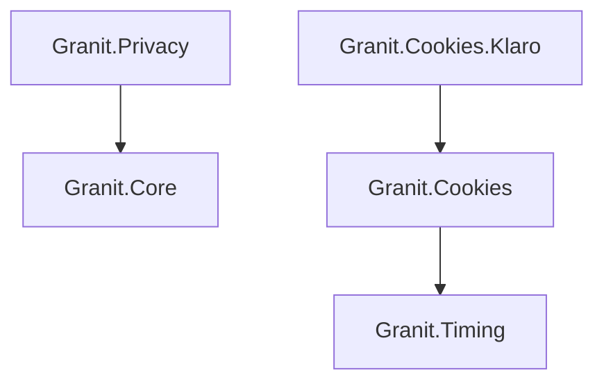
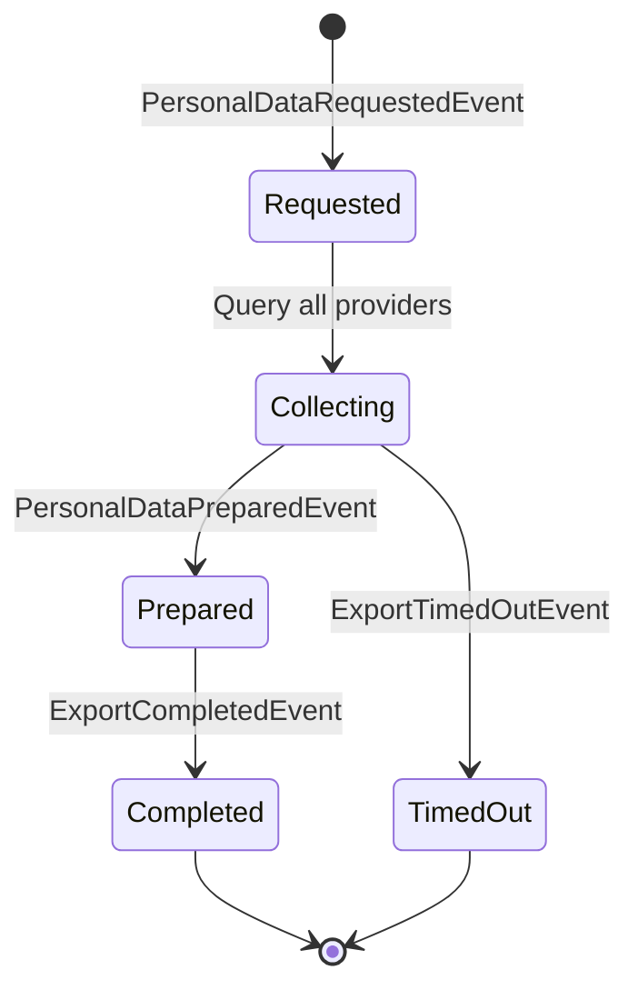
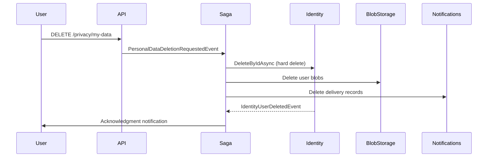

import { Tabs, TabItem, FileTree, Badge } from "@astrojs/starlight/components";

Granit.Privacy implements GDPR data subject rights (Art. 15–18) and cookie consent
management. Data export orchestration via saga, right to erasure with cascading
notifications, legal agreement tracking, and a strict cookie registry with CMP integration.

## Package structure

<FileTree>
- Granit.Privacy GDPR data export saga, legal agreements, data provider registry
- Granit.Cookies/ Strict cookie registry, consent resolver, managed cookie operations
  - Granit.Cookies.Klaro Klaro CMP integration (EU-sovereign consent manager)
</FileTree>

| Package | Role | Depends on |
|---------|------|------------|
| `Granit.Privacy` | GDPR data export/deletion orchestration, legal agreements | `Granit.Core` |
| `Granit.Cookies` | Cookie registry, consent enforcement | `Granit.Timing` |
| `Granit.Cookies.Klaro` | Klaro CMP consent resolver | `Granit.Cookies` |

## Dependency graph



## Privacy module

### Setup

```csharp
[DependsOn(typeof(GranitPrivacyModule))]
public class AppModule : GranitModule
{
    public override void ConfigureServices(ServiceConfigurationContext context)
    {
        context.Services.AddGranitPrivacy(privacy =>
        {
            privacy.RegisterDataProvider("PatientModule");
            privacy.RegisterDataProvider("BlobStorageModule");
            privacy.RegisterDocument(
                "privacy-policy", "2.1", "Privacy Policy");
            privacy.RegisterDocument(
                "terms-of-service", "1.0", "Terms of Service");
        });
    }
}
```

### Data provider registry

Modules register themselves as data providers to participate in GDPR data export
and deletion workflows:

```csharp
privacy.RegisterDataProvider("PatientModule");
```

When a data subject requests export or deletion, the saga queries all registered
providers and waits for each to complete.

### GDPR data export saga



The export saga orchestrates data collection across all registered data providers.
Each provider prepares its data independently, and the saga assembles the final
export package.

### Configuration

```json
{
  "Privacy": {
    "ExportTimeoutMinutes": 5,
    "ExportMaxSizeMb": 100
  }
}
```

### GDPR deletion



### Legal agreements

Track consent to legal documents (privacy policy, terms of service):

```csharp
privacy.RegisterDocument("privacy-policy", "2.1", "Privacy Policy");
```

Provide a store implementation to persist agreement records:

```csharp
privacy.UseLegalAgreementStore<EfCoreLegalAgreementStore>();
```

`ILegalAgreementChecker` verifies if a user has signed the current version of a
document — useful for middleware that blocks access until consent is renewed after
a policy update.

## Cookie consent

### Strict registry pattern

Every cookie must be declared at startup. Writing an undeclared cookie throws
`UnregisteredCookieException` (when `ThrowOnUnregistered` is enabled).

```csharp
[DependsOn(typeof(GranitCookiesModule))]
public class AppModule : GranitModule
{
    public override void ConfigureServices(ServiceConfigurationContext context)
    {
        context.Services.AddGranitCookies(cookies =>
        {
            cookies.RegisterCookie(new CookieDefinition(
                Name: "session_id",
                Category: CookieCategory.StrictlyNecessary,
                RetentionDays: 1,
                IsHttpOnly: true,
                Purpose: "Session identification"));

            cookies.RegisterCookie(new CookieDefinition(
                Name: "analytics_consent",
                Category: CookieCategory.Analytics,
                RetentionDays: 365,
                IsHttpOnly: false,
                Purpose: "Analytics tracking preference"));

            cookies.UseConsentResolver<KlaroConsentResolver>();
        });
    }
}
```

### Cookie categories (GDPR)

| Category | Consent required | Description |
|----------|-----------------|-------------|
| `StrictlyNecessary` | No | Session, CSRF, authentication |
| `Functionality` | Yes | Preferences, language |
| `Analytics` | Yes | Usage tracking |
| `Marketing` | Yes | Advertising, retargeting |
| `Other` | Yes | Uncategorized |

### Managed cookie operations

Always use `IGranitCookieManager` instead of `IResponseCookies`:

```csharp
public class SessionService(IGranitCookieManager cookieManager)
{
    public async Task SetSessionCookieAsync(
        HttpContext httpContext, string sessionId)
    {
        // Checks registry, verifies consent, applies security defaults
        await cookieManager.SetCookieAsync(
            httpContext, "session_id", sessionId)
            .ConfigureAwait(false);
    }

    public async Task RevokeAnalyticsAsync(HttpContext httpContext)
    {
        // Deletes all cookies in the Analytics category
        await cookieManager.RevokeCategoryAsync(
            httpContext, CookieCategory.Analytics)
            .ConfigureAwait(false);
    }
}
```

**Security defaults applied automatically:**
- `Secure = true` (HTTPS only)
- `SameSite = Lax` (CSRF protection)
- `Expires` calculated via `IClock.Now + RetentionDays`
- `HttpOnly` per cookie definition

### IConsentResolver

The consent resolver determines if a user has consented to a cookie category:

```csharp
public interface IConsentResolver
{
    Task<bool> ResolveAsync(HttpContext httpContext, CookieCategory category);
}
```

`StrictlyNecessary` cookies always return `true` — no consent check needed.

### Klaro CMP

[Klaro](https://klaro.org/) is a self-hosted, EU-sovereign consent management platform.

```csharp
[DependsOn(typeof(GranitCookiesKlaroModule))]
public class AppModule : GranitModule { }
```

```json
{
  "Klaro": {
    "CookieName": "klaro"
  }
}
```

`KlaroConsentResolver` reads the Klaro consent cookie and maps service consent
to Granit cookie categories.

### Configuration

```json
{
  "Cookies": {
    "ThrowOnUnregistered": true,
    "DefaultRetentionDays": 365,
    "ThirdPartyServices": [
      {
        "Name": "Google Analytics",
        "Category": "Analytics",
        "CookiePatterns": ["_ga*", "_gid"]
      }
    ]
  }
}
```

| Property | Default | Description |
|----------|---------|-------------|
| `ThrowOnUnregistered` | `true` | Throw when writing an undeclared cookie |
| `DefaultRetentionDays` | `365` | Default cookie lifetime |
| `ThirdPartyServices` | `[]` | Third-party service declarations |

:::caution
Setting `ThrowOnUnregistered: false` in production weakens GDPR compliance.
Undeclared cookies bypass consent checks and category enforcement.
:::

## Public API summary

| Category | Key types | Package |
|----------|-----------|---------|
| Module | `GranitPrivacyModule`, `GranitCookiesModule`, `GranitCookiesKlaroModule` | — |
| Privacy | `IDataProviderRegistry`, `ILegalDocumentRegistry`, `ILegalAgreementChecker`, `GranitPrivacyBuilder`, `GranitPrivacyOptions` | `Granit.Privacy` |
| Privacy events | `PersonalDataRequestedEvent`, `PersonalDataDeletionRequestedEvent`, `ExportCompletedEvent`, `ExportTimedOutEvent` | `Granit.Privacy` |
| Cookies | `ICookieRegistry`, `IGranitCookieManager`, `IConsentResolver`, `CookieDefinition`, `CookieCategory`, `GranitCookiesBuilder` | `Granit.Cookies` |
| Klaro | `KlaroConsentResolver`, `KlaroOptions` | `Granit.Cookies.Klaro` |
| Extensions | `AddGranitPrivacy()`, `AddGranitCookies()`, `AddGranitCookiesKlaro()` | — |

## See also

- [Security module](./authentication/) — Authentication, authorization
- [Identity module](./identity/) — GDPR erasure and pseudonymization on user cache
- [Core module](../core/module-system/) — `ISoftDeletable`, data filter interfaces
- [API Reference](/api/Granit.Privacy.html) (auto-generated from XML docs)
