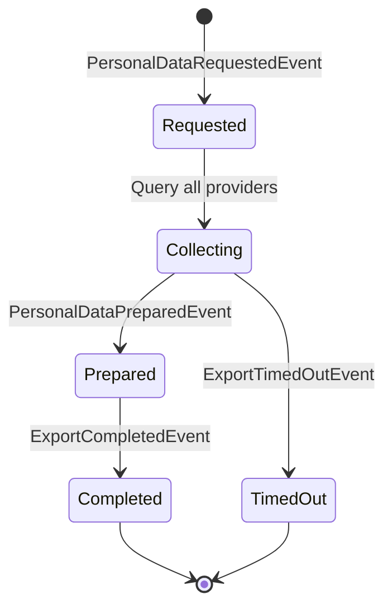
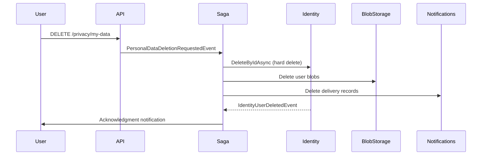

import { FileTree } from "@astrojs/starlight/components";

## Why a privacy module?

GDPR gives every user the right to request a full export of their personal data
(Art. 15) and the right to be forgotten (Art. 17). In a modular application, personal
data is scattered across multiple modules — patient records, uploaded documents,
notification logs, audit trails. Implementing these rights manually means every module
needs custom export/deletion logic, and missing one module means a compliance violation
with fines up to 4% of annual turnover.

Granit.Privacy turns this into a framework concern: modules register as data providers,
and a saga orchestrates collection or deletion across all of them. The saga handles
timeouts, partial failures, and cascading notifications automatically. Legal agreement
tracking (privacy policy versions, consent records) is built in, so you can prove
compliance during an audit without building a custom consent system.

## Package structure

<FileTree>
- Granit.Privacy GDPR data export saga, legal agreements, data provider registry
</FileTree>

| Package | Role | Depends on |
| ------- | ---- | ---------- |
| `Granit.Privacy` | GDPR data export/deletion orchestration, legal agreements | `Granit.Core` |

## Setup

```csharp
[DependsOn(typeof(GranitPrivacyModule))]
public class AppModule : GranitModule
{
    public override void ConfigureServices(ServiceConfigurationContext context)
    {
        context.Services.AddGranitPrivacy(privacy =>
        {
            privacy.RegisterDataProvider("PatientModule");
            privacy.RegisterDataProvider("BlobStorageModule");
            privacy.RegisterDocument(
                "privacy-policy", "2.1", "Privacy Policy");
            privacy.RegisterDocument(
                "terms-of-service", "1.0", "Terms of Service");
        });
    }
}
```

## Data provider registry

Modules register themselves as data providers to participate in GDPR data export
and deletion workflows:

```csharp
privacy.RegisterDataProvider("PatientModule");
```

When a data subject requests export or deletion, the saga queries all registered
providers and waits for each to complete.

## GDPR data export saga



The export saga orchestrates data collection across all registered data providers.
Each provider prepares its data independently, and the saga assembles the final
export package.

## GDPR deletion



## Legal agreements

Track consent to legal documents (privacy policy, terms of service):

```csharp
privacy.RegisterDocument("privacy-policy", "2.1", "Privacy Policy");
```

Provide a store implementation to persist agreement records:

```csharp
privacy.UseLegalAgreementStore<EfCoreLegalAgreementStore>();
```

`ILegalAgreementChecker` verifies if a user has signed the current version of a
document — useful for middleware that blocks access until consent is renewed after
a policy update.

## Configuration reference

```json
{
  "Privacy": {
    "ExportTimeoutMinutes": 5,
    "ExportMaxSizeMb": 100
  }
}
```

## Public API summary

| Category | Key types | Package |
| -------- | --------- | ------- |
| Module | `GranitPrivacyModule` | -- |
| Registry | `IDataProviderRegistry`, `ILegalDocumentRegistry`, `ILegalAgreementChecker` | `Granit.Privacy` |
| Builder | `GranitPrivacyBuilder`, `GranitPrivacyOptions` | `Granit.Privacy` |
| Events | `PersonalDataRequestedEvent`, `PersonalDataDeletionRequestedEvent`, `ExportCompletedEvent`, `ExportTimedOutEvent` | `Granit.Privacy` |
| Extensions | `AddGranitPrivacy()` | `Granit.Privacy` |

## See also

- [Cookies module](/dotnet/security/cookies/) -- GDPR cookie categories, consent management, Klaro CMP
- [Authentication module](/dotnet/security/authentication/) -- Authentication, authorization
- [Identity module](/dotnet/security/identity/) -- GDPR erasure and pseudonymization on user cache
- [Core module](/dotnet/core/module-system/) -- `ISoftDeletable`, data filter interfaces
