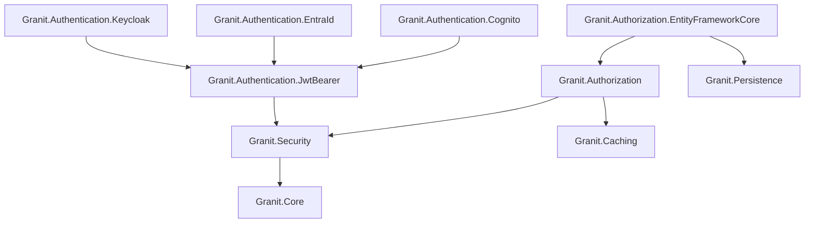
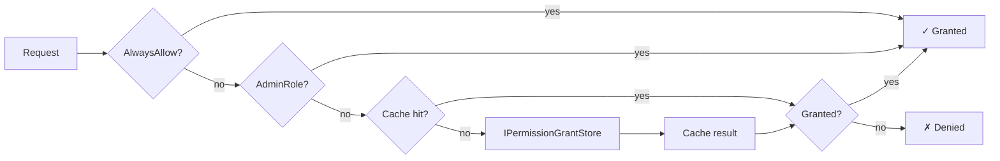

import { Tabs, TabItem, FileTree, Badge } from "@astrojs/starlight/components";

Granit.Security provides the authentication and authorization stack for the framework.
JWT Bearer validation, claims transformation for Keycloak, Entra ID, and AWS Cognito,
dynamic RBAC permissions with per-role caching, back-channel logout — all wired through
the module system.

## Package structure

<FileTree>
- Granit.Security/ Base abstractions (ICurrentUserService, ActorKind)
  - Granit.Authentication.JwtBearer/ Generic JWT Bearer, back-channel logout
    - Granit.Authentication.Keycloak Keycloak claims transformation
    - Granit.Authentication.EntraId Entra ID roles parsing
    - Granit.Authentication.Cognito Cognito groups → roles
  - Granit.Authorization/ Dynamic RBAC, permission definitions, policy provider
    - Granit.Authorization.EntityFrameworkCore EF Core permission grant store
</FileTree>

| Package | Role | Depends on |
|---------|------|------------|
| `Granit.Security` | `ICurrentUserService`, `ActorKind` | `Granit.Core` |
| `Granit.Authentication.JwtBearer` | JWT Bearer middleware, back-channel logout | `Granit.Security` |
| `Granit.Authentication.Keycloak` | Keycloak claims transformation | `Granit.Authentication.JwtBearer` |
| `Granit.Authentication.EntraId` | Entra ID roles parsing | `Granit.Authentication.JwtBearer` |
| `Granit.Authentication.Cognito` | Cognito groups → roles | `Granit.Authentication.JwtBearer` |
| `Granit.Authorization` | RBAC permissions, dynamic policy provider | `Granit.Security`, `Granit.Caching` |
| `Granit.Authorization.EntityFrameworkCore` | EF Core permission grant store | `Granit.Authorization`, `Granit.Persistence` |

## Dependency graph



## Setup

<Tabs>
<TabItem label="Keycloak (recommended)">

```csharp
[DependsOn(typeof(GranitAuthenticationKeycloakModule))]
[DependsOn(typeof(GranitAuthorizationModule))]
public class AppModule : GranitModule { }
```

```json
{
  "Authentication": {
    "Authority": "https://keycloak.example.com/realms/my-realm",
    "Audience": "my-client"
  },
  "Keycloak": {
    "ClientId": "my-client",
    "AdminRole": "admin",
    "RoleClaimsSource": "realm_access"
  }
}
```

</TabItem>
<TabItem label="Entra ID">

```csharp
[DependsOn(typeof(GranitAuthenticationEntraIdModule))]
[DependsOn(typeof(GranitAuthorizationModule))]
public class AppModule : GranitModule { }
```

```json
{
  "Authentication": {
    "Authority": "https://login.microsoftonline.com/{tenant-id}/v2.0",
    "Audience": "api://{client-id}"
  }
}
```

</TabItem>
<TabItem label="AWS Cognito">

```csharp
[DependsOn(typeof(GranitAuthenticationCognitoModule))]
[DependsOn(typeof(GranitAuthorizationModule))]
public class AppModule : GranitModule { }
```

```json
{
  "Authentication": {
    "Authority": "https://cognito-idp.{region}.amazonaws.com/{userPoolId}",
    "Audience": "{clientId}"
  },
  "Cognito": {
    "UserPoolId": "eu-west-1_XXXXXXXXX",
    "ClientId": "my-client-id",
    "Region": "eu-west-1"
  }
}
```

</TabItem>
<TabItem label="Generic JWT Bearer">

```csharp
[DependsOn(typeof(GranitJwtBearerModule))]
[DependsOn(typeof(GranitAuthorizationModule))]
public class AppModule : GranitModule { }
```

```json
{
  "Authentication": {
    "Authority": "https://idp.example.com",
    "Audience": "my-api",
    "RequireHttpsMetadata": true,
    "NameClaimType": "sub"
  }
}
```

</TabItem>
<TabItem label="With EF Core permissions">

```csharp
[DependsOn(typeof(GranitAuthenticationKeycloakModule))]
[DependsOn(typeof(GranitAuthorizationEntityFrameworkCoreModule))]
public class AppModule : GranitModule
{
    public override void ConfigureServices(ServiceConfigurationContext context)
    {
        context.Services.AddGranitAuthorizationEntityFrameworkCore<AppDbContext>();
    }
}
```

</TabItem>
</Tabs>

## ICurrentUserService

The core abstraction for accessing the authenticated actor. Injected everywhere
audit fields, tenant resolution, or authorization checks need to know "who is calling."

```csharp
public interface ICurrentUserService
{
    string? UserId { get; }
    string? UserName { get; }
    string? Email { get; }
    string? FirstName { get; }
    string? LastName { get; }
    bool IsAuthenticated { get; }
    ActorKind ActorKind { get; }
    bool IsMachine { get; }
    string? ApiKeyId { get; }
    IReadOnlyList<string> GetRoles();
    bool IsInRole(string role);
}
```

`ActorKind` distinguishes between `User` (human), `ExternalSystem` (API key / service account),
and `System` (background jobs, scheduled tasks).

:::tip
`AuditedEntityInterceptor` uses `ICurrentUserService.UserId` for `CreatedBy` / `ModifiedBy`.
When no user is authenticated, it falls back to `"system"`.
:::

## Authentication

### JWT Bearer

`GranitJwtBearerModule` registers:
- ASP.NET Core JWT Bearer authentication
- `CurrentUserService` — `ICurrentUserService` implementation extracting claims from `HttpContext`
- `IRevokedSessionStore` — distributed cache-backed session revocation

#### Configuration

```json
{
  "Authentication": {
    "Authority": "https://idp.example.com/realms/my-realm",
    "Audience": "my-client",
    "RequireHttpsMetadata": true,
    "NameClaimType": "sub",
    "BackChannelLogout": {
      "Enabled": true,
      "EndpointPath": "/auth/back-channel-logout",
      "SessionRevocationTtl": "01:00:00"
    }
  }
}
```

| Property | Default | Description |
|----------|---------|-------------|
| `Authority` | — | OIDC issuer URL (required) |
| `Audience` | — | Expected `aud` claim (required) |
| `RequireHttpsMetadata` | `true` | Enforce HTTPS for metadata endpoint |
| `NameClaimType` | `"sub"` | Claim used as user identifier |
| `BackChannelLogout.Enabled` | `false` | Enable OIDC back-channel logout |
| `BackChannelLogout.EndpointPath` | `"/auth/back-channel-logout"` | Endpoint path |
| `BackChannelLogout.SessionRevocationTtl` | `"01:00:00"` | How long revoked sessions are remembered |

### Back-channel logout

Provider-agnostic implementation of the [OIDC Back-Channel Logout](https://openid.net/specs/openid-connect-backchannel-1_0.html)
specification. When the IdP sends a logout token, the session is revoked in distributed cache.

```csharp
// In OnApplicationInitialization
app.MapBackChannelLogout(); // POST /auth/back-channel-logout (anonymous)
```

The endpoint validates the logout token signature against the IdP's JWKS, extracts the `sid`
claim, and stores it in `IDistributedCache` with key `granit:revoked-session:{sid}`.

Subsequent requests with a revoked `sid` are rejected by the JWT Bearer events handler.

:::caution
The back-channel logout endpoint must be **anonymous** (no auth required) — the IdP
calls it directly. It is excluded from OpenAPI documentation by default.
:::

### Keycloak claims transformation

`GranitAuthenticationKeycloakModule` post-configures JWT Bearer with Keycloak-specific behavior:

- Extracts roles from `realm_access.roles` or `resource_access.{clientId}.roles`
- Maps them to standard `ClaimTypes.Role` claims
- Registers an `"Admin"` authorization policy

```csharp
// Keycloak JWT payload (simplified)
{
  "realm_access": {
    "roles": ["admin", "doctor"]
  },
  "resource_access": {
    "my-client": {
      "roles": ["manage-patients"]
    }
  }
}
// After transformation → ClaimTypes.Role: "admin", "doctor", "manage-patients"
```

### Entra ID claims transformation

`GranitAuthenticationEntraIdModule` post-configures JWT Bearer with Entra ID-specific behavior:

- Extracts roles from the v1.0 `roles` claim and the v2.0 `wids` claim
- Maps them to standard `ClaimTypes.Role` claims

### Cognito claims transformation

`GranitAuthenticationCognitoModule` post-configures JWT Bearer with Cognito-specific behavior:

- Extracts groups from the `cognito:groups` claim (multiple claims with same type)
- Maps them to standard `ClaimTypes.Role` claims

```csharp
// Cognito JWT payload — groups appear as repeated claims
// "cognito:groups": "admin"
// "cognito:groups": "doctors"
// After transformation → ClaimTypes.Role: "admin", "doctors"
```

:::note
Cognito has no native "roles" concept. **Groups serve as roles** — a user's group memberships
become their role claims after transformation.
:::

## Authorization

### Permission definitions

Modules declare their permissions via `IPermissionDefinitionProvider`:

```csharp
public class InvoicePermissionDefinitionProvider : IPermissionDefinitionProvider
{
    public void DefinePermissions(IPermissionDefinitionContext context)
    {
        var group = context.AddGroup("Invoices", "Invoice management");
        group.AddPermission("Invoices.Invoices.Read", "View invoices");
        group.AddPermission("Invoices.Invoices.Create", "Create invoices");
        group.AddPermission("Invoices.Invoices.Update", "Edit invoices");
        group.AddPermission("Invoices.Invoices.Delete", "Delete invoices");
    }
}
```

**Naming convention:** `[Module].[Resource].[Action]`

Standard actions: `Read`, `Create`, `Update`, `Delete`, `Manage` (all CRUD), `Execute` (non-CRUD).

### Permission checking pipeline



The `PermissionChecker` evaluates in order:
1. `AlwaysAllow` option (development only)
2. Admin role bypass — users with any role in `AdminRoles` get all permissions
3. Per-role cache lookup (key: `perm:{tenantId}:{roleName}:{permissionName}`)
4. `IPermissionGrantStore` fallback (default: `NullPermissionGrantStore` → always denied)

### Using permissions

```csharp
// Option 1: Attribute on endpoint
app.MapGet("/invoices", [Permission("Invoices.Invoices.Read")] async (
    AppDbContext db,
    CancellationToken cancellationToken) =>
{
    return await db.Invoices
        .ToListAsync(cancellationToken)
        .ConfigureAwait(false);
});

// Option 2: Imperative check
public class InvoiceService(IPermissionChecker permissionChecker)
{
    public async Task DeleteAsync(Guid id, CancellationToken cancellationToken)
    {
        if (!await permissionChecker.IsGrantedAsync(
            "Invoices.Invoices.Delete", cancellationToken)
            .ConfigureAwait(false))
        {
            throw new ForbiddenException("Not authorized to delete invoices");
        }
        // ...
    }
}
```

### Configuration

```json
{
  "Authorization": {
    "AdminRoles": ["admin"],
    "CacheDuration": "00:05:00",
    "AlwaysAllow": false
  }
}
```

| Property | Default | Description |
|----------|---------|-------------|
| `AdminRoles` | `["admin"]` | Roles that bypass all permission checks |
| `CacheDuration` | `00:05:00` | Per-role permission cache TTL |
| `AlwaysAllow` | `false` | Skip all checks (development only) |

:::danger
Never set `AlwaysAllow: true` in production. This disables the entire authorization
pipeline. The option validator rejects it outside `Development` environment.
:::

### EF Core permission store

`Granit.Authorization.EntityFrameworkCore` replaces `NullPermissionGrantStore` with a
real store backed by EF Core.

**Entity:**

```csharp
public class PermissionGrant : AuditedEntity, IMultiTenant
{
    public string Name { get; set; } = string.Empty;     // Permission name
    public string RoleName { get; set; } = string.Empty;  // Role granted to
    public Guid? TenantId { get; set; }                   // Tenant scope (null = global)
}
// Unique index: (TenantId, Name, RoleName)
```

**DbContext integration:**

```csharp
public class AppDbContext : DbContext, IPermissionGrantDbContext
{
    public DbSet<PermissionGrant> PermissionGrants => Set<PermissionGrant>();
}
```

**Managing grants:**

```csharp
public class PermissionAdminService(
    IPermissionManagerWriter writer,
    IPermissionManagerReader reader)
{
    public async Task GrantAsync(
        string roleName, string permissionName, CancellationToken cancellationToken)
    {
        await writer.SetAsync(permissionName, roleName, tenantId: null,
            isGranted: true, cancellationToken)
            .ConfigureAwait(false);
    }

    public async Task<IReadOnlyList<string>> GetGrantedAsync(
        string roleName, CancellationToken cancellationToken)
    {
        return await reader.GetGrantedPermissionsAsync(roleName, tenantId: null,
            cancellationToken)
            .ConfigureAwait(false);
    }
}
```

All grant changes are audit-logged via `AuditedEntity` (ISO 27001 — 3-year retention).

## Public API summary

| Category | Key types | Package |
|----------|-----------|---------|
| Module | `GranitSecurityModule`, `GranitJwtBearerModule`, `GranitAuthenticationKeycloakModule`, `GranitAuthenticationEntraIdModule`, `GranitAuthenticationCognitoModule`, `GranitAuthorizationModule`, `GranitAuthorizationEntityFrameworkCoreModule` | — |
| Abstractions | `ICurrentUserService`, `ActorKind` | `Granit.Security` |
| Authentication | `CurrentUserService`, `IRevokedSessionStore`, `BackChannelLogoutTokenValidator` | `Granit.Authentication.JwtBearer` |
| Claims | `KeycloakClaimsTransformation` | `Granit.Authentication.Keycloak` |
| Claims | `EntraIdClaimsTransformation` | `Granit.Authentication.EntraId` |
| Claims | `CognitoClaimsTransformation` | `Granit.Authentication.Cognito` |
| Authorization | `IPermissionDefinitionProvider`, `IPermissionDefinitionManager`, `IPermissionChecker`, `IPermissionGrantStore`, `PermissionAttribute` | `Granit.Authorization` |
| Authorization options | `GranitAuthorizationOptions`, `JwtBearerAuthOptions`, `KeycloakOptions`, `CognitoOptions` | — |
| EF Core | `PermissionGrant`, `IPermissionGrantDbContext`, `IPermissionManagerReader`, `IPermissionManagerWriter` | `Granit.Authorization.EntityFrameworkCore` |
| Extensions | `AddGranitJwtBearer()`, `AddGranitKeycloak()`, `AddGranitCognito()`, `AddGranitAuthorization()`, `AddGranitAuthorizationEntityFrameworkCore<T>()`, `MapBackChannelLogout()` | — |

## See also

- [Identity module](./identity/) — User management, Keycloak Admin API, user cache
- [Privacy module](./privacy/) — GDPR compliance, cookies, CORS
- [Core module](./core/) — `ICurrentTenant`, exception hierarchy
- [Persistence module](./persistence/) — `AuditedEntity` base class, interceptors
- [API Reference](/api/Granit.Security.html) (auto-generated from XML docs)
