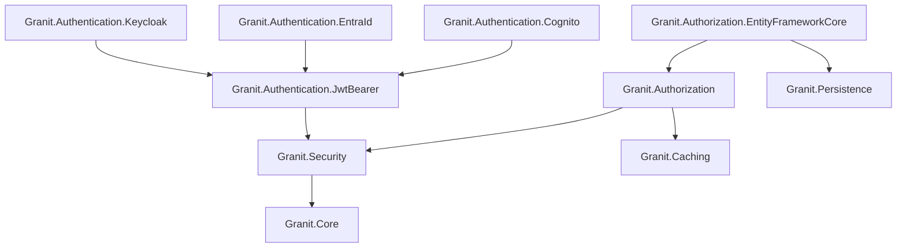

import { FileTree } from "@astrojs/starlight/components";

The base security package providing the `ICurrentUserService` abstraction and `ActorKind`
enum. Used by every module that needs to know "who is calling" — audit trails, tenant
resolution, authorization checks.

## Package structure

<FileTree>

- Granit.Security/ Base abstractions (ICurrentUserService, ActorKind)

</FileTree>

| Package | Role | Depends on |
|---------|------|------------|
| `Granit.Security` | `ICurrentUserService`, `ActorKind` | `Granit.Core` |

## ICurrentUserService

The core abstraction for accessing the authenticated actor. Injected everywhere
audit fields, tenant resolution, or authorization checks need to know "who is calling."

```csharp
public interface ICurrentUserService
{
    string? UserId { get; }
    string? UserName { get; }
    string? Email { get; }
    string? FirstName { get; }
    string? LastName { get; }
    bool IsAuthenticated { get; }
    ActorKind ActorKind { get; }
    bool IsMachine { get; }
    string? ApiKeyId { get; }
    IReadOnlyList<string> GetRoles();
    bool IsInRole(string role);
}
```

`ActorKind` distinguishes between `User` (human), `ExternalSystem` (API key / service account),
and `System` (background jobs, scheduled tasks).

:::tip
`AuditedEntityInterceptor` uses `ICurrentUserService.UserId` for `CreatedBy` / `ModifiedBy`.
When no user is authenticated, it falls back to `"system"`.
:::

## Full security stack

The complete authentication and authorization stack is documented in dedicated pages:



## See also

- [Authentication](/dotnet/security/authentication/) -- JWT Bearer, Keycloak, Entra ID, Cognito
- [Authorization](/dotnet/security/authorization/) -- RBAC permissions, dynamic policy provider
- [Identity](/dotnet/security/identity/) -- user management, Keycloak Admin API, user cache
- [Privacy](/dotnet/security/privacy/) -- GDPR compliance, right to erasure
- [Core](/dotnet/core/module-system/) -- `ICurrentTenant`, exception hierarchy
- [Persistence](/dotnet/data/persistence/) -- `AuditedEntity` base class, interceptors
