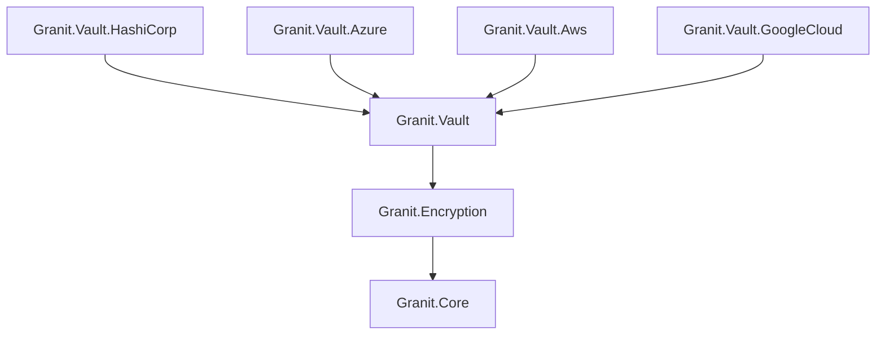

import { Tabs, TabItem, FileTree, Badge } from "@astrojs/starlight/components";

Granit.Encryption provides a pluggable string encryption service with AES-256-CBC as the
default provider. Granit.Vault is the abstraction layer defining `ITransitEncryptionService`
and `IDatabaseCredentialProvider`. Provider packages implement those interfaces:
Granit.Vault.HashiCorp wraps VaultSharp for HashiCorp Vault Transit encryption and dynamic
database credentials, Granit.Vault.Azure uses Azure Key Vault for RSA-OAEP-256 encryption
and dynamic credentials via Key Vault Secrets, Granit.Vault.Aws targets AWS KMS and
Secrets Manager, and Granit.Vault.GoogleCloud uses Google Cloud KMS for symmetric encryption and Secret Manager for dynamic database credentials. All provider modules are automatically disabled in Development environments
so no external vault server is required locally.

## Package structure

<FileTree>
- Granit.Encryption/ AES-256-CBC default, IStringEncryptionService
  - Granit.Vault/ Abstraction layer — ITransitEncryptionService, IDatabaseCredentialProvider, localization
    - Granit.Vault.HashiCorp HashiCorp Vault provider — VaultSharp client, Transit encryption, dynamic database credentials
    - Granit.Vault.Azure Azure Key Vault provider (RSA-OAEP-256), dynamic credentials
    - Granit.Vault.Aws AWS KMS + Secrets Manager provider
    - Granit.Vault.GoogleCloud Google Cloud KMS encryption, Secret Manager credentials
</FileTree>

| Package | Role | Depends on |
|---------|------|------------|
| `Granit.Encryption` | `IStringEncryptionService`, AES-256-CBC provider | `Granit.Core` |
| `Granit.Vault` | Abstraction layer — `ITransitEncryptionService`, `IDatabaseCredentialProvider`, localization | `Granit.Encryption` |
| `Granit.Vault.HashiCorp` | HashiCorp Vault provider — VaultSharp client, Transit encryption, dynamic database credentials | `Granit.Vault` |
| `Granit.Vault.Azure` | Azure Key Vault encryption (RSA-OAEP-256), dynamic credentials from Key Vault Secrets | `Granit.Vault` |
| `Granit.Vault.Aws` | AWS KMS encryption, dynamic credentials from Secrets Manager | `Granit.Vault` |
| `Granit.Vault.GoogleCloud` | Google Cloud KMS symmetric encryption, dynamic credentials from Secret Manager | `Granit.Vault` |

## Dependency graph



## Granit.Encryption

### Setup

```csharp
[DependsOn(typeof(GranitEncryptionModule))]
public class AppModule : GranitModule { }
```

Registers `IStringEncryptionService` with the AES provider by default. No external
dependencies required.

### IStringEncryptionService

The main abstraction for encrypting and decrypting strings:

```csharp
public interface IStringEncryptionService
{
    string Encrypt(string plainText);
    string? Decrypt(string cipherText);
}
```

`Encrypt` returns a Base64-encoded ciphertext. `Decrypt` returns the original string,
or `null` if decryption fails (wrong key, corrupted data).

### Usage

```csharp
public class PatientNoteService(IStringEncryptionService encryption)
{
    public string ProtectNote(string note) =>
        encryption.Encrypt(note);

    public string? RevealNote(string encryptedNote) =>
        encryption.Decrypt(encryptedNote);
}
```

### AES-256-CBC provider

The default provider derives the encryption key from a passphrase using PBKDF2 and
encrypts with AES-256-CBC. Each encryption operation generates a random 16-byte IV.

```json
{
  "Encryption": {
    "PassPhrase": "<from-vault-config-provider>",
    "KeySize": 256,
    "ProviderName": "Aes"
  }
}
```

:::caution
The `PassPhrase` must be supplied via Vault configuration provider or a secrets manager.
Never hardcode or commit passphrases.
:::

### Provider switching

The `ProviderName` option selects the active encryption provider at runtime:

| Provider | Value | Backend |
|----------|-------|---------|
| AES (default) | `"Aes"` | Local AES-256-CBC with PBKDF2 key derivation |
| Vault Transit | `"Vault"` | HashiCorp Vault Transit engine (requires `Granit.Vault.HashiCorp`) |
| Azure Key Vault | `"AzureKeyVault"` | Azure Key Vault RSA-OAEP-256 (requires `Granit.Vault.Azure`) |

When `ProviderName` is `"Vault"`, `IStringEncryptionService` delegates to
`VaultStringEncryptionProvider`, which calls Vault Transit under the hood.

---

## Granit.Vault

`Granit.Vault` is the abstraction package. It defines `ITransitEncryptionService` and
`IDatabaseCredentialProvider` — provider packages (`Granit.Vault.HashiCorp`,
`Granit.Vault.Azure`, `Granit.Vault.Aws`) supply the implementations.

### ITransitEncryptionService

The transit encryption abstraction for encrypt/decrypt operations:

```csharp
public interface ITransitEncryptionService
{
    Task<string> EncryptAsync(
        string keyName, string plaintext,
        CancellationToken cancellationToken = default);

    Task<string> DecryptAsync(
        string keyName, string ciphertext,
        CancellationToken cancellationToken = default);
}
```

Ciphertext follows the Vault format: `vault:v1:base64encodeddata...`

### Usage

```csharp
public class SensitiveDataService(ITransitEncryptionService transit)
{
    public async Task<string> ProtectSsnAsync(
        string ssn, CancellationToken cancellationToken)
    {
        return await transit.EncryptAsync(
            "pii-data", ssn, cancellationToken).ConfigureAwait(false);
        // Returns: "vault:v1:AbCdEf..."
    }

    public async Task<string> RevealSsnAsync(
        string encryptedSsn, CancellationToken cancellationToken)
    {
        return await transit.DecryptAsync(
            "pii-data", encryptedSsn, cancellationToken).ConfigureAwait(false);
    }
}
```

---

## Granit.Vault.HashiCorp

### Setup

```csharp
[DependsOn(typeof(GranitVaultHashiCorpModule))]
public class AppModule : GranitModule { }
```

:::note
`GranitVaultHashiCorpModule` is **automatically disabled** in `Development` environments
(`IHostEnvironment.IsDevelopment()`). Applications fall back to the local AES provider
when Vault is not available — no configuration needed for local development.
:::

### Dynamic database credentials

`VaultCredentialLeaseManager` obtains short-lived database credentials from the Vault
Database engine and handles automatic lease renewal at a configurable threshold
(default: 75% of TTL). The connection string is updated transparently — no application
restart required.

### Authentication

<Tabs>
<TabItem label="Kubernetes (production)">

```json
{
  "Vault": {
    "Address": "https://vault.example.com",
    "AuthMethod": "Kubernetes",
    "KubernetesRole": "my-backend"
  }
}
```

Uses the Kubernetes service account token mounted at
`/var/run/secrets/kubernetes.io/serviceaccount/token`.

</TabItem>
<TabItem label="Token (development)">

```json
{
  "Vault": {
    "Address": "http://localhost:8200",
    "AuthMethod": "Token",
    "Token": "hvs.dev-only-token"
  }
}
```

Token auth is intended for local Vault dev servers only.

</TabItem>
</Tabs>

### Configuration reference

```json
{
  "Vault": {
    "Address": "https://vault.example.com",
    "AuthMethod": "Kubernetes",
    "KubernetesRole": "my-backend",
    "KubernetesTokenPath": "/var/run/secrets/kubernetes.io/serviceaccount/token",
    "DatabaseMountPoint": "database",
    "DatabaseRoleName": "readwrite",
    "TransitMountPoint": "transit",
    "LeaseRenewalThreshold": 0.75
  },
  "Encryption": {
    "PassPhrase": "<from-vault>",
    "KeySize": 256,
    "ProviderName": "Aes",
    "VaultKeyName": "string-encryption"
  }
}
```

| Property | Default | Description |
|----------|---------|-------------|
| `Vault.Address` | — | Vault server URL |
| `Vault.AuthMethod` | `"Kubernetes"` | `"Kubernetes"` or `"Token"` |
| `Vault.KubernetesRole` | `"my-backend"` | Vault Kubernetes auth role |
| `Vault.DatabaseMountPoint` | `"database"` | Database secrets engine mount point |
| `Vault.DatabaseRoleName` | `"readwrite"` | Database role for dynamic credentials |
| `Vault.TransitMountPoint` | `"transit"` | Transit secrets engine mount point |
| `Vault.LeaseRenewalThreshold` | `0.75` | Renew lease at this fraction of TTL |
| `Encryption.PassPhrase` | — | AES passphrase (via secrets manager) |
| `Encryption.KeySize` | `256` | AES key size in bits |
| `Encryption.ProviderName` | `"Aes"` | Active provider: `"Aes"` or `"Vault"` |
| `Encryption.VaultKeyName` | `"string-encryption"` | Transit key name for `IStringEncryptionService` |

### Health check

`AddGranitVaultHashiCorpHealthCheck` registers a Vault health check that verifies
connectivity and authentication status, tagged `["readiness"]` for Kubernetes probe
integration.

---

## Granit.Vault.Azure

### Setup

```csharp
[DependsOn(typeof(GranitVaultAzureModule))]
public class AppModule : GranitModule { }
```

:::note
`GranitVaultAzureModule` is **automatically disabled** in `Development` environments.
Applications fall back to the local AES provider when Azure Key Vault is not
available — no configuration needed for local development.
:::

### Azure Key Vault encryption

Uses Azure Key Vault's `CryptographyClient` for RSA-OAEP-256 encrypt/decrypt
operations. Registered as an `IStringEncryptionProvider` with key `"AzureKeyVault"`.

### Dynamic database credentials

`AzureSecretsCredentialProvider` reads database credentials from a Key Vault secret
(JSON: `{"username": "...", "password": "..."}`) and polls for version changes at a
configurable interval. Credential rotation is detected automatically.

### Authentication

<Tabs>
<TabItem label="Managed Identity (production)">

```json
{
  "Vault": {
    "Azure": {
      "VaultUri": "https://my-vault.vault.azure.net/"
    }
  }
}
```

Uses `DefaultAzureCredential` — Managed Identity in Kubernetes, `az login` locally.

</TabItem>
<TabItem label="Configuration reference">

```json
{
  "Vault": {
    "Azure": {
      "VaultUri": "https://my-vault.vault.azure.net/",
      "EncryptionKeyName": "string-encryption",
      "EncryptionAlgorithm": "RSA-OAEP-256",
      "DatabaseSecretName": "db-credentials",
      "RotationCheckIntervalMinutes": 5,
      "TimeoutSeconds": 30
    }
  }
}
```

</TabItem>
</Tabs>

| Property | Default | Description |
|----------|---------|-------------|
| `Vault:Azure:VaultUri` | — | Azure Key Vault URI |
| `Vault:Azure:EncryptionKeyName` | `"string-encryption"` | Key name for encrypt/decrypt |
| `Vault:Azure:EncryptionAlgorithm` | `"RSA-OAEP-256"` | Algorithm (`RSA-OAEP-256`, `RSA-OAEP`, `RSA1_5`) |
| `Vault:Azure:DatabaseSecretName` | `null` | Secret name for DB credentials (omit to disable) |
| `Vault:Azure:RotationCheckIntervalMinutes` | `5` | Secret rotation polling interval |
| `Vault:Azure:TimeoutSeconds` | `30` | Azure SDK operation timeout |

### Health check

Granit.Vault.Azure registers a health check that retrieves the configured key to
verify connectivity and key availability, tagged `["readiness"]`.

---

## Granit.Vault.GoogleCloud

### Setup

```csharp
[DependsOn(typeof(GranitVaultGoogleCloudModule))]
public class AppModule : GranitModule { }
```

:::note
`GranitVaultGoogleCloudModule` is **automatically disabled** in `Development` environments.
Applications fall back to the local AES provider when Cloud KMS is not
available — no configuration needed for local development.
:::

### Google Cloud KMS encryption

Uses Cloud KMS `CryptoKeyVersion` for symmetric AES-256-GCM encrypt/decrypt operations.
Registered as an `IStringEncryptionProvider` with key `"CloudKms"`.

### Dynamic database credentials

`SecretManagerCredentialProvider` reads database credentials from a Secret Manager
secret (JSON: `{"username": "...", "password": "..."}`) and polls for version
changes at a configurable interval. Credential rotation is detected automatically.

### Authentication

<Tabs>
<TabItem label="Workload Identity (production)">

```json
{
  "Vault": {
    "GoogleCloud": {
      "ProjectId": "my-project",
      "Location": "europe-west1",
      "KeyRing": "my-keyring",
      "CryptoKey": "string-encryption"
    }
  }
}
```

Uses Application Default Credentials — Workload Identity in GKE, `gcloud auth` locally.

</TabItem>
<TabItem label="Configuration reference">

```json
{
  "Vault": {
    "GoogleCloud": {
      "ProjectId": "my-project",
      "Location": "europe-west1",
      "KeyRing": "my-keyring",
      "CryptoKey": "string-encryption",
      "DatabaseSecretName": "db-credentials",
      "RotationCheckIntervalMinutes": 5,
      "CredentialFilePath": null,
      "TimeoutSeconds": 30
    }
  }
}
```

</TabItem>
</Tabs>

| Property | Default | Description |
|----------|---------|-------------|
| `Vault:GoogleCloud:ProjectId` | — | GCP project ID (required) |
| `Vault:GoogleCloud:Location` | — | Cloud KMS location, e.g. `"europe-west1"` (required) |
| `Vault:GoogleCloud:KeyRing` | — | Cloud KMS key ring name (required) |
| `Vault:GoogleCloud:CryptoKey` | — | Cloud KMS crypto key for transit encryption (required) |
| `Vault:GoogleCloud:DatabaseSecretName` | `null` | Secret Manager secret name for DB credentials (omit to disable) |
| `Vault:GoogleCloud:RotationCheckIntervalMinutes` | `5` | Secret rotation polling interval |
| `Vault:GoogleCloud:CredentialFilePath` | `null` | Service account key JSON; ADC when null |
| `Vault:GoogleCloud:TimeoutSeconds` | `30` | API call timeout |

### Health check

`AddGranitCloudKmsHealthCheck` registers a health check that verifies KMS key
accessibility, tagged `["readiness"]`.

## Public API summary

| Category | Key types | Package |
|----------|-----------|---------|
| Modules | `GranitEncryptionModule`, `GranitVaultHashiCorpModule`, `GranitVaultAzureModule`, `GranitVaultAwsModule`, `GranitVaultGoogleCloudModule` | — |
| Encryption | `IStringEncryptionService` (`Encrypt` / `Decrypt`) | `Granit.Encryption` |
| Provider | `IStringEncryptionProvider`, `AesStringEncryptionProvider` | `Granit.Encryption` |
| Transit | `ITransitEncryptionService` (`EncryptAsync` / `DecryptAsync`) | `Granit.Vault` |
| Credentials | `IDatabaseCredentialProvider` | `Granit.Vault` |
| HashiCorp Provider | `VaultStringEncryptionProvider`, `VaultCredentialLeaseManager` | `Granit.Vault.HashiCorp` |
| HashiCorp Options | `HashiCorpVaultOptions` | `Granit.Vault.HashiCorp` |
| Options | `StringEncryptionOptions` | `Granit.Encryption` |
| Azure Provider | `AzureKeyVaultStringEncryptionProvider`, `IAzureKeyVaultTransitEncryptionService`, `IAzureDatabaseCredentialProvider` | `Granit.Vault.Azure` |
| Azure Options | `AzureKeyVaultOptions` | `Granit.Vault.Azure` |
| Google Cloud Provider | `CloudKmsTransitEncryptionService`, `CloudKmsStringEncryptionProvider`, `SecretManagerCredentialProvider` | `Granit.Vault.GoogleCloud` |
| Google Cloud Options | `GoogleCloudVaultOptions` | `Granit.Vault.GoogleCloud` |
| Extensions | `AddGranitEncryption()`, `AddGranitVaultHashiCorp()`, `AddGranitVaultAzure()`, `AddGranitVaultAws()`, `AddGranitVaultGoogleCloud()` | — |

## See also

- [Caching module](./caching/) — AES-256 encryption for cached GDPR-sensitive data
- [Security module](./authentication/) — Authorization and current user abstractions
- [Persistence module](./persistence/) — EF Core interceptors, dynamic credentials integration
